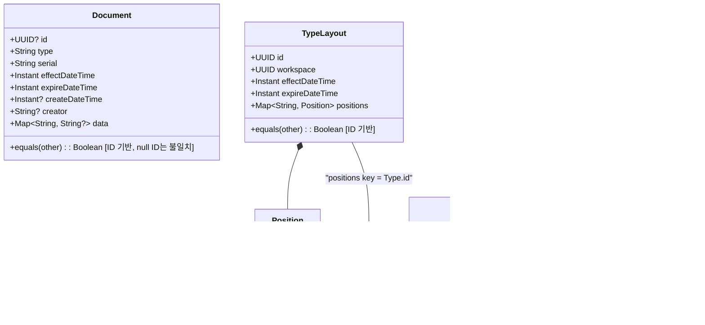

# Document 클래스 다이어그램

```mermaid
classDiagram
    class Document {
        +UUID? id
        +String type
        +String serial
        +Instant effectDateTime
        +Instant expireDateTime
        +Instant? createDateTime
        +String? creator
        +Map~String, String?~ data
        +equals(other): Boolean [ID 기반, null ID는 불일치]
    }

    class TypeLayout {
        +UUID id
        +UUID workspace
        +Instant effectDateTime
        +Instant expireDateTime
        +Map~String, Position~ positions
        +equals(other): Boolean [ID 기반]
    }

    class Position {
        +Int x
        +Int y
        +Int width
        +Int height
    }
    TypeLayout *-- Position
    TypeLayout --> Type : "positions key = Type.id"

    class Compliance {
        +UUID documentId
        +String typeId
        +String typeVersion
        +Boolean compatible
        +Map~String, String~ violations
        +Instant verifiedAt
    }

    class ValidationTask {
        +UUID id
        +UUID workspace
        +UUID documentId
        +String typeId
        +String typeVersion
        +Status status
        +Instant createdAt
        +Instant? completedAt
        +equals(other): Boolean [ID 기반]
    }

    class Status {
        <<enum>>
        NEW
        PROCESSING
        DONE
        FAILED
        +isTerminal(): Boolean
    }
    ValidationTask --> Status
    ValidationTask ..> Compliance : produces
```
