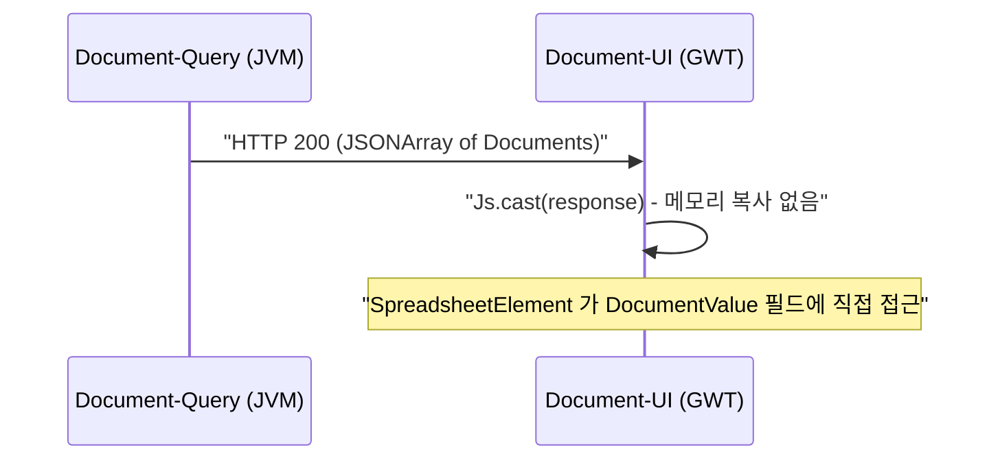

# Document 유스케이스

## UC-D1: 문서 만료 자동 판정

브라우저 런타임 및 서버에서 동일한 도메인 로직을 사용하여 문서의 만료 여부를 판정한다.

| 단계 | 동작 | 비고 |
|------|------|------|
| 1 | `DocumentValue` 객체 생성/로드 | — |
| 2 | `doc.isExpired(System.currentTimeMillis())` 호출 | `@JsOverlay` 로직 실행 |
| 3 | `expireDateTime` 기준 현재 시간 초과 여부 반환 | 양방향 동일 결과 보장 |

## UC-D2: 문서 데이터 제로 카피 렌더링

스프레드시트 UI에서 대량의 문서를 로드할 때 변환 오버헤드 없이 즉시 렌더링한다.

## 트레이서빌리티 매트릭스

| 유스케이스 | 목적 | 관련 클래스 | 테스트 케이스 |
|------------|------|-------------|--------------|
| UC-D1 | 정합성 유지 | `DocumentValue` | `DocumentDomainTest`: isExpired 검증 |
| UC-D2 | 성능 최적화 | `DocumentValue` | `DocumentDomainTest`: 데이터 할당 로그 확인 |
