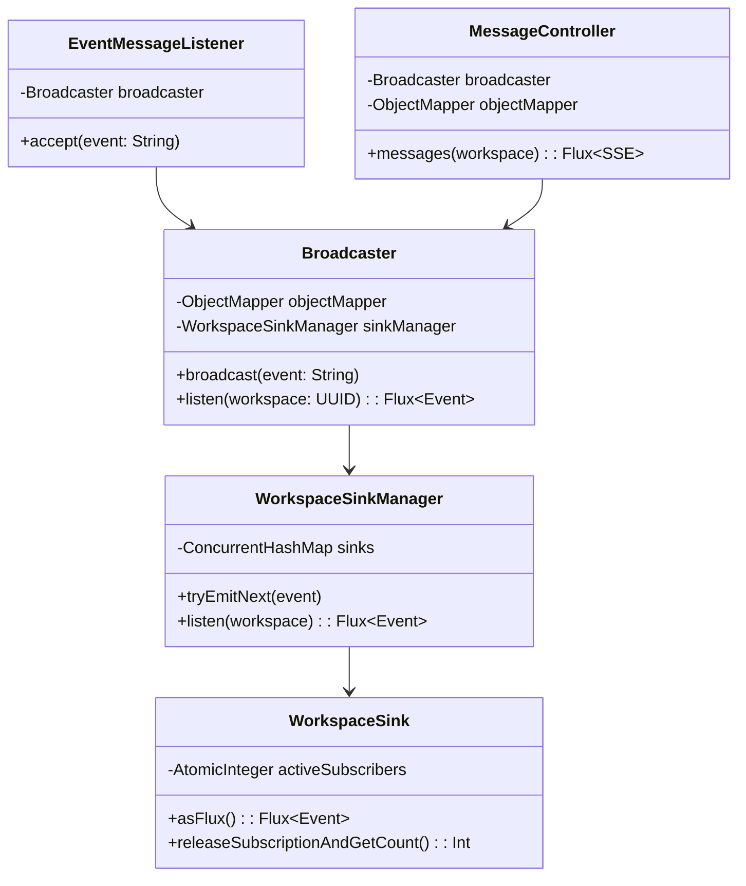
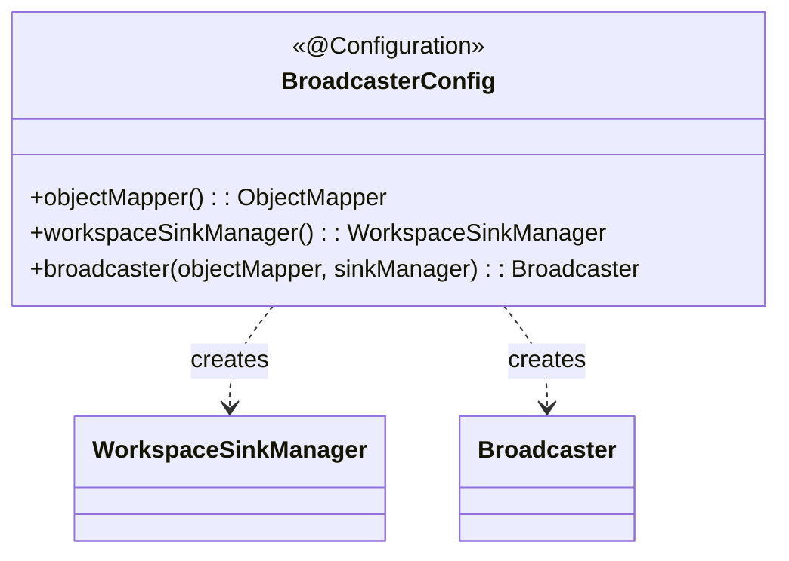

# Event-Broadcaster 클래스 다이어그램

## Configuration

## 설계 패턴

| 패턴 | 적용 위치 | 설명 |
|------|----------|------|
| **Pub/Sub** | Broadcaster, WorkspaceSinkManager | Kafka 이벤트를 워크스페이스별 SSE 스트림으로 팬아웃 |
| **Sink per Workspace** | WorkspaceSinkManager, WorkspaceSink | 워크스페이스별 Sinks.Many를 관리하여 격리된 이벤트 전달 |
| **SSE (Server-Sent Events)** | MessageController | 클라이언트에 실시간 이벤트 스트림 제공 |
