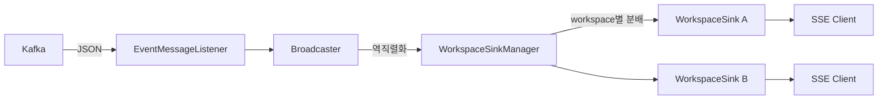

# Event Broadcaster 모듈

도메인 이벤트를 수신하여 워크스페이스별로 실시간 브로드캐스트하는 서비스.
Kafka에서 이벤트를 소비하고, SSE(Server-Sent Events)를 통해 클라이언트에 전달한다.

**실시간 협업의 중심 허브:** 같은 워크스페이스의 모든 참여자(사용자 + AI 에이전트)가 동일한 SSE 스트림(`/workspace/{id}/messages`)을 구독한다. 사용자의 데이터 변경(DOCUMENT_CREATED, TYPE_CREATED 등)과 에이전트 커맨드(AGENT_COMMAND)가 모두 같은 Kafka 토픽("handbook-events")을 통해 동일한 SSE 스트림으로 전달되므로, 다른 사용자나 에이전트의 변경사항이 즉시 반영된다.

## 아키텍처

```
usecase/                         # 유스케이스 (프레임워크 의존성 없음)
├── Broadcaster                 # 이벤트 역직렬화 + 워크스페이스별 분배
├── WorkspaceSinkManager        # 워크스페이스별 Sink 생성/제거 관리
└── WorkspaceSink               # 구독자 수 추적 + 자동 정리

interfaces/                      # 인프라 어댑터 (Spring 의존)
├── api/
│   └── MessageController       # SSE 엔드포인트 (/workspace/{ws}/messages)
├── event/
│   └── EventMessageListener    # Kafka Consumer → Broadcaster 위임
└── config/
    └── BroadcasterConfig       # ObjectMapper, Bean 등록 (Spring 설정)
```

## 이벤트 흐름



## API

| Method | Path | 설명 |
|--------|------|------|
| GET | `/workspace/{workspace}/messages` | SSE 실시간 이벤트 스트림 |

- Content-Type: `text/event-stream`
- 10초 간격 ping으로 HTTP/1.1 연결 유지
- 각 이벤트: `id` (이벤트 UUID), `event` (이벤트 타입), `data` (JSON 페이로드)

## 지원하는 이벤트 타입

| 이벤트 | 설명 |
|--------|------|
| `DOCUMENT_CREATED` | 문서 생성 (새 버전 포함) |
| `DOCUMENT_DELETED` | 문서 삭제 |
| `TYPE_CREATED` | 타입 생성 (새 버전 포함) |
| `TYPE_DELETED` | 타입 삭제 |
| `VALIDATION_REQUESTED` | 검증 요청 |
| `AGENT_COMMAND` | AI 에이전트 커맨드 (navigate, highlight, mutate 등) |

> 사용자의 데이터 변경 이벤트와 에이전트 커맨드가 모두 같은 스트림으로 전달된다. 프론트엔드는 이벤트 타입에 따라 UI 갱신(도메인 이벤트) 또는 시각적 실행(AGENT_COMMAND)으로 분기한다.

## 구독 관리

- 워크스페이스별로 Sink를 lazy 생성하여 리소스를 절약한다.
- 구독자 수를 `AtomicInteger`로 추적한다.
- 모든 구독자가 연결을 해제하면 Sink를 완료(complete)하고 맵에서 제거한다.
- `ConcurrentHashMap.compute`로 구독자 등록/해제와 Sink 생성/제거를 원자적으로 처리하여 경합 조건을 방지한다.
- `Flux.defer`로 실제 구독 시점에 Sink를 획득하여, 완료된 Sink를 참조하는 문제를 방지한다.

## 테스트

```bash
./gradlew :event-broadcaster:test
./gradlew :event-broadcaster:koverVerify  # 커버리지 80% 이상 필수
```
