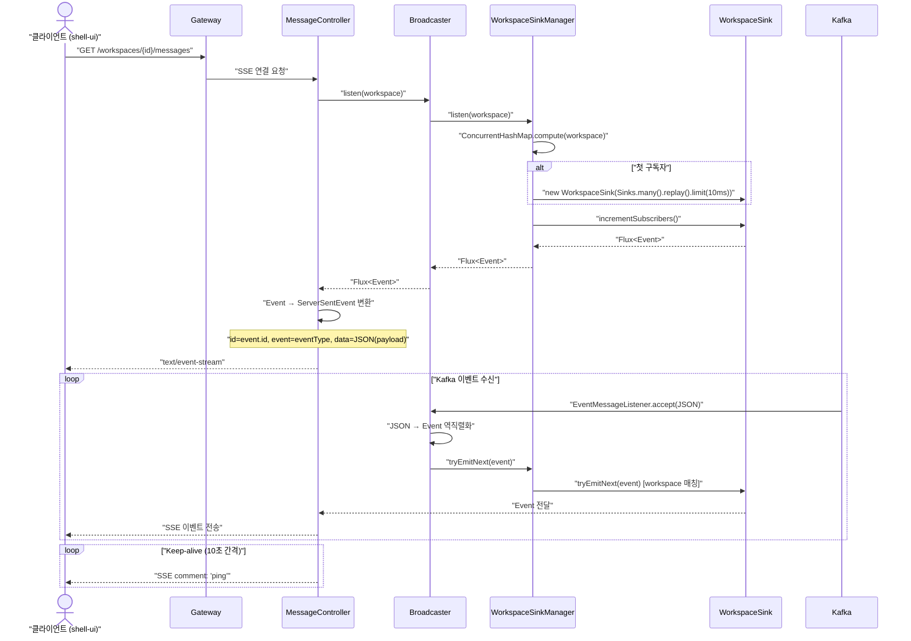
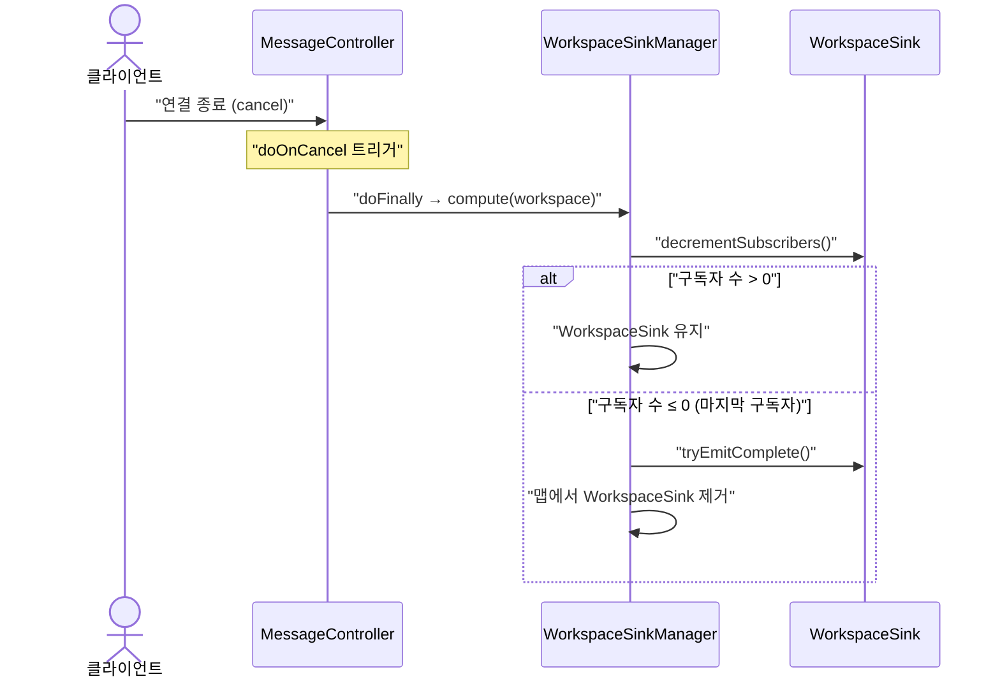
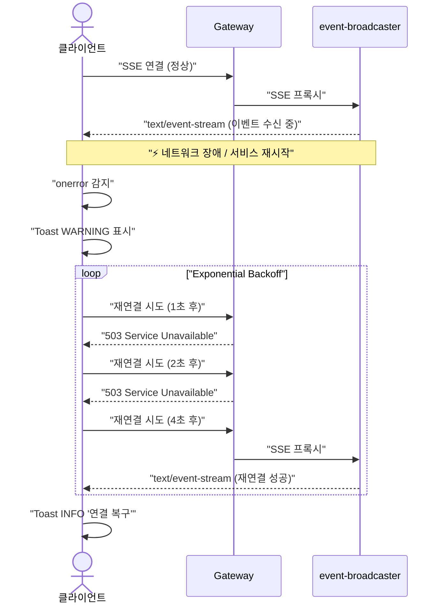
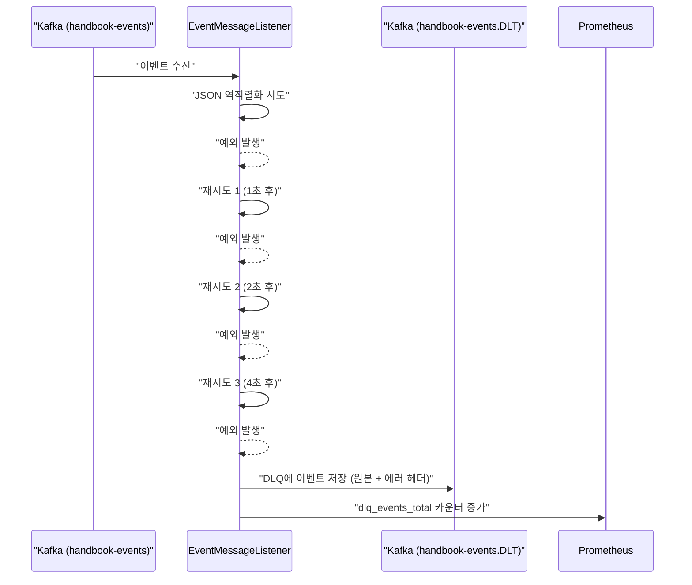
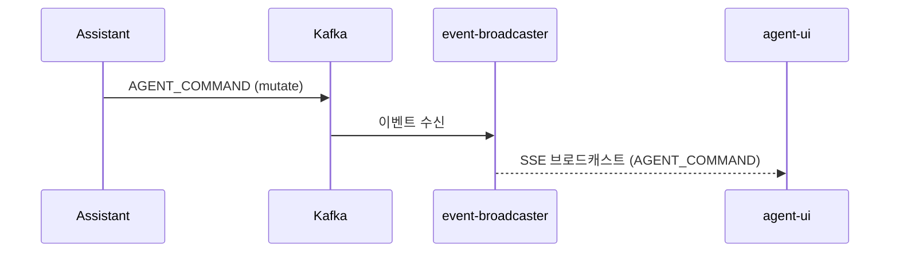

# Event-Broadcaster 유스케이스

## SSE 연결 및 이벤트 브로드캐스트 시퀀스

## 연결 정리 시퀀스

---

## UC-EB1: SSE 연결 수립

| 항목 | 내용 |
|------|------|
| **액터** | 클라이언트 (shell-ui 경유) |
| **선행조건** | 워크스페이스에 참여 중 |
| **정상 흐름** | 1. 클라이언트가 `GET /workspaces/{id}/messages`로 SSE 연결을 요청한다. 2. `MessageController`가 `Broadcaster.listen(workspace)`를 호출한다. 3. `WorkspaceSinkManager`가 `ConcurrentHashMap.compute()`로 원자적으로 처리한다. 4. 해당 워크스페이스에 기존 Sink가 없으면 새로 생성한다 (lazy 생성). 5. 구독자 카운트를 증가시키고 `Flux<Event>`를 반환한다. 6. `MessageController`가 이벤트를 `ServerSentEvent`로 변환하여 `text/event-stream`으로 응답한다. |
| **결과** | SSE 연결 수립, 워크스페이스별 이벤트 수신 시작 |

## UC-EB2: Kafka → SSE 변환

| 항목 | 내용 |
|------|------|
| **액터** | 시스템 (Kafka Consumer) |
| **선행조건** | SSE 구독자가 존재하는 워크스페이스에 이벤트 발생 |
| **정상 흐름** | 1. `EventMessageListener`가 Kafka에서 JSON 문자열 이벤트를 수신한다 (Spring Cloud Stream Consumer 바인딩). 2. `Broadcaster.broadcast()`가 JSON을 `Event<Serializable>`로 역직렬화한다. 3. 내부 Sink(`replay().limit(10ms)`)에 이벤트를 발행한다. 4. `WorkspaceSinkManager.tryEmitNext()`가 이벤트의 workspace UUID로 해당 Sink를 찾아 전달한다. 5. 구독자가 없는 워크스페이스의 이벤트는 무시된다. 6. 각 SSE 클라이언트에 `ServerSentEvent`(id, event, data)로 전달된다. |
| **결과** | Kafka 이벤트가 해당 워크스페이스의 모든 SSE 클라이언트에 브로드캐스트됨 |

## UC-EB3: Keep-alive

| 항목 | 내용 |
|------|------|
| **액터** | 시스템 (MessageController) |
| **선행조건** | SSE 연결이 수립된 상태 |
| **정상 흐름** | 1. `MessageController`가 `Flux.interval(Duration.ofSeconds(10))`으로 10초 간격 타이머를 생성한다. 2. 각 interval마다 `ServerSentEvent.builder().comment("ping").build()`를 생성한다. 3. `Flux.merge()`로 이벤트 스트림과 ping 스트림을 병합하여 클라이언트에 전송한다. 4. HTTP/1.1 연결이 타임아웃되지 않도록 유지한다. |
| **결과** | SSE 연결이 10초 간격 ping으로 유지됨 |

## UC-EB4: 연결 정리

| 항목 | 내용 |
|------|------|
| **액터** | 시스템 (클라이언트 연결 종료 시) |
| **선행조건** | SSE 연결이 수립된 상태 |
| **정상 흐름** | 1. 클라이언트가 연결을 종료하면 `doFinally` 콜백이 트리거된다. 2. `WorkspaceSinkManager.compute(workspace)`로 원자적으로 처리한다. 3. `WorkspaceSink.decrementSubscribers()`로 구독자 카운트를 감소시킨다. 4. 구독자 수가 0 이하이면 (마지막 구독자 해제) `tryEmitComplete()`로 Sink를 완료하고 맵에서 제거한다. 5. 구독자가 남아 있으면 Sink를 유지한다. |
| **결과** | 비활성 연결 정리, 마지막 구독자 해제 시 워크스페이스 Sink 자동 제거 |

## UC-EB5: 다중 구독자 브로드캐스트

| 항목 | 내용 |
|------|------|
| **액터** | 시스템 (Kafka Consumer) |
| **선행조건** | 동일 워크스페이스에 2명 이상의 SSE 구독자가 연결된 상태 |
| **정상 흐름** | 1. Kafka에서 이벤트가 수신되면 `Broadcaster.broadcast()`가 호출된다. 2. `WorkspaceSinkManager`가 해당 워크스페이스의 `WorkspaceSink`를 찾는다. 3. `WorkspaceSink`의 `Sinks.many().replay()` 기반 Sink에 이벤트를 발행한다. 4. 동일 워크스페이스를 구독 중인 모든 SSE 연결에 동시에 이벤트가 전달된다. 5. 각 구독자는 독립적으로 `ServerSentEvent`를 수신한다. |
| **결과** | 동일 워크스페이스의 모든 SSE 클라이언트가 동일한 이벤트를 수신함 |

---

## UC-EB6: SSE 재연결 지원

| 항목 | 내용 |
|------|------|
| **액터** | 클라이언트 (shell-ui) |
| **선행조건** | SSE 연결이 수립된 상태에서 네트워크 장애 또는 서비스 재시작 발생 |
| **정상 흐름** | 1. `MessageController`가 각 SSE 이벤트에 `retry(Duration.ofSeconds(5))` 힌트를 포함하여 전송한다. 2. SSE 연결이 끊어지면 브라우저의 EventSource가 5초 후 자동 재연결을 시도한다. 3. 재연결 성공 시 새로운 SSE 스트림이 수립된다. |
| **요구사항** | 7.3 회복성 강화 — SSE 재연결 |
| **상태** | ✅ 구현 완료 (서버 측 retry 힌트) |
| **구현 클래스** | `MessageController` (ServerSentEvent.builder().retry()) |
| **비고** | 클라이언트 측 exponential backoff 및 Toast 알림은 향후 프론트엔드에서 보강 예정 |

## UC-EB7: Kafka DLQ 처리

| 항목 | 내용 |
|------|------|
| **액터** | 시스템 (Kafka Consumer) |
| **선행조건** | Kafka 이벤트 처리 중 예외 발생 |
| **정상 흐름** | 1. `EventMessageListener`가 이벤트 처리 중 예외를 발생시킨다 (역직렬화 실패, 런타임 에러 등). 2. Spring Cloud Stream이 최대 3회 재시도를 수행한다 (`consumer.max-attempts: 3`). 3. 3회 모두 실패하면 이벤트를 `handbook-events-dlq` 토픽에 저장한다 (`enableDlq: true`, `dlqName: handbook-events-dlq`). 4. DLQ 이벤트에 원본 토픽, 에러 정보를 포함한다. |
| **요구사항** | 7.3 회복성 강화 — Kafka DLQ |
| **상태** | ✅ 구현 완료 |
| **구현** | `application.yml` (Spring Cloud Stream Kafka Binder DLQ 설정) |

## 에이전트 연동 시나리오

Assistant가 발행한 커맨드를 실시간으로 전달하는 흐름을 담당한다.

---

## 트레이서빌리티 매트릭스

| UC | 요구사항 | 시퀀스 다이어그램 | 주요 클래스 | 테스트 |
|----|---------|---|---|---|
| UC-EB1 (SSE 연결) | 3.9 (SSE 실시간 알림) | SSE 연결 및 이벤트 브로드캐스트 | MessageController, Broadcaster, WorkspaceSinkManager, WorkspaceSink | - |
| UC-EB2 (Kafka→SSE) | 3.9 (Kafka 이벤트 스트리밍) | SSE 연결 및 이벤트 브로드캐스트 | EventMessageListener, Broadcaster, WorkspaceSinkManager, WorkspaceSink | - |
| UC-EB3 (Keep-alive) | 3.9 (Keep-alive ping) | SSE 연결 및 이벤트 브로드캐스트 (loop) | MessageController | - |
| UC-EB4 (연결 정리) | 3.9 (Sink lazy 생성/자동 정리) | 연결 정리 | WorkspaceSinkManager, WorkspaceSink | - |
| UC-EB5 (다중 구독자) | 3.1 (실시간 협업), 3.9 (SSE) | SSE 연결 및 이벤트 브로드캐스트 | Broadcaster, WorkspaceSinkManager, WorkspaceSink | BroadcasterTest: 다중 구독자 동시 수신 검증, WorkspaceSinkManagerTest: 여러 구독자 동시 구독 검증 |
| UC-EB6 (SSE 재연결) | 7.3 (SSE 재연결) | SSE 재연결 | MessageController (retry 힌트) | MessageControllerTest |
| UC-EB7 (Kafka DLQ) | 7.3 (Kafka DLQ) | Kafka DLQ 처리 | application.yml (enableDlq, dlqName) | - |
