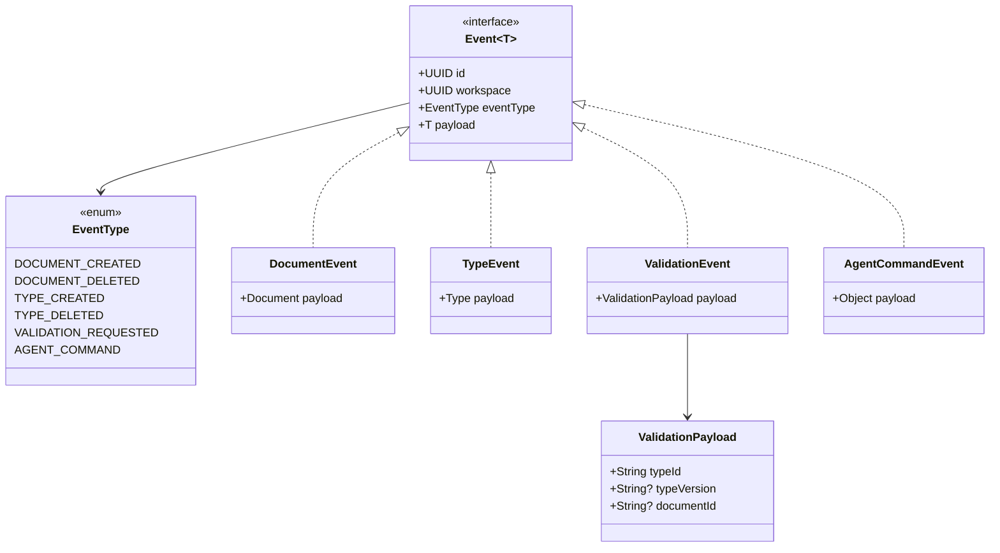

# Event 클래스 다이어그램

```mermaid
classDiagram
    class Event~T~ {
        <<interface>>
        +UUID id
        +UUID workspace
        +EventType eventType
        +T payload
    }

    class EventType {
        <<enum>>
        DOCUMENT_CREATED
        DOCUMENT_DELETED
        TYPE_CREATED
        TYPE_DELETED
        VALIDATION_REQUESTED
        AGENT_COMMAND
    }

    class DocumentEvent {
        +Document payload
    }

    class TypeEvent {
        +Type payload
    }

    class ValidationEvent {
        +ValidationPayload payload
    }

    class ValidationPayload {
        +String typeId
        +String? typeVersion
        +String? documentId
    }

    class AgentCommandEvent {
        +Object payload
    }

    Event <|.. DocumentEvent
    Event <|.. TypeEvent
    Event <|.. ValidationEvent
    Event <|.. AgentCommandEvent
    Event --> EventType
    ValidationEvent --> ValidationPayload
```
