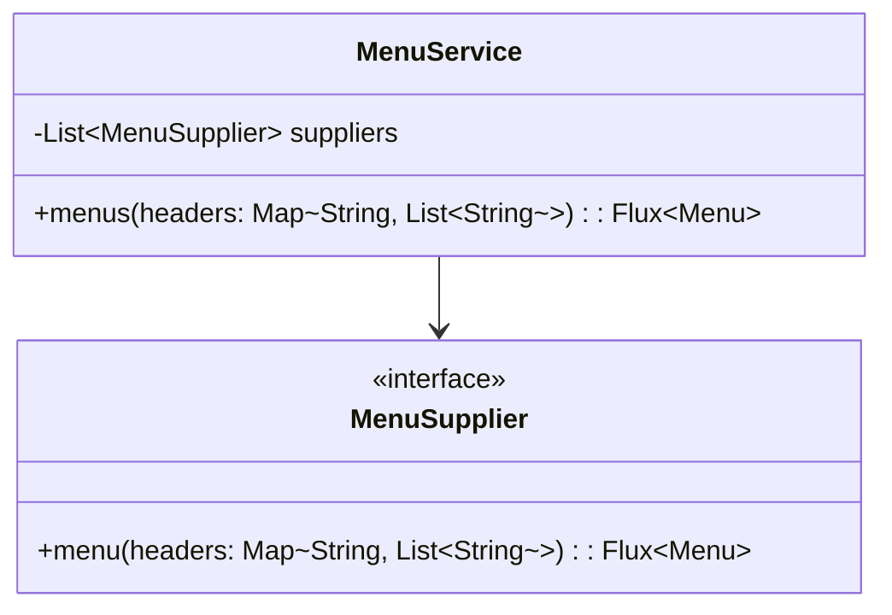
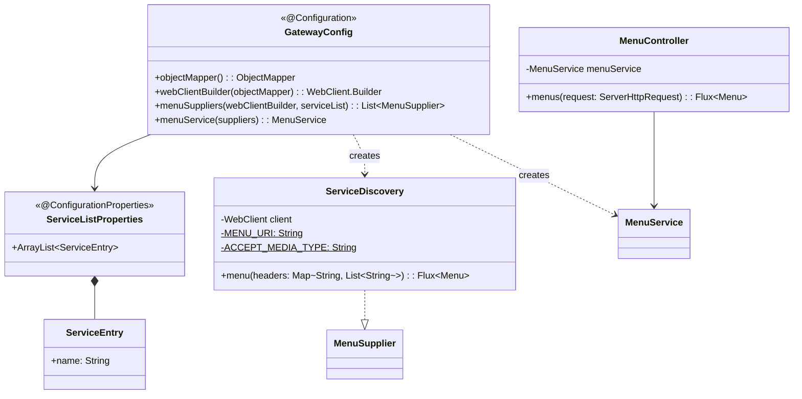

# Gateway 클래스 다이어그램

## Usecase 계층

## Interfaces 계층

## 설계 패턴

| 패턴 | 적용 위치 | 설명 |
|------|----------|------|
| **Aggregator** | MenuService | 여러 서비스의 메뉴를 병렬로 수집하여 정렬 반환 |
| **Port & Adapter** | MenuSupplier | usecase의 포트를 ServiceDiscovery가 구현 |
| **Graceful Degradation** | MenuService | 개별 서비스 실패 시 해당 서비스의 결과만 무시하고 나머지 반환 |
| **Configuration Properties** | ServiceListProperties | 서비스 목록을 YAML에서 바인딩 |
