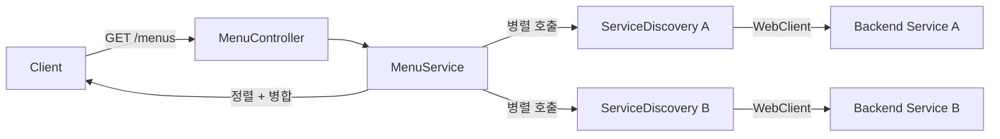

# Gateway 모듈

API Gateway 서비스. 여러 백엔드 서비스로부터 메뉴를 병렬로 수집하여
클라이언트에 통합된 메뉴 목록을 제공한다.

## 아키텍처

```
usecase/                             # 유스케이스 (프레임워크 의존성 없음)
├── MenuService                     # 메뉴 병렬 수집 + 정렬 + graceful degradation
└── MenuSupplier                    # 메뉴 공급자 포트 (인터페이스)

interfaces/                          # 인프라 어댑터 (Spring 의존)
├── api/
│   ├── MenuController              # GET /menus 엔드포인트
│   └── FallbackController          # CircuitBreaker 폴백 (빈 응답 반환)
├── filter/
│   ├── RateLimitFilter             # /auth/** IP 기반 Rate Limiting (20회/분)
│   └── CorrelationIdFilter         # X-Correlation-Id 생성/전파/MDC 등록
├── discovery/
│   ├── ServiceDiscovery            # WebClient 기반 메뉴 조회 어댑터
│   └── ServiceListProperties       # 서비스 목록 프로퍼티 바인딩
└── config/
    └── GatewayConfig               # ObjectMapper, WebClient, CORS, Bean 등록
```

## 메뉴 집계 흐름



## API

| Method | Path | 설명 |
|--------|------|------|
| GET | `/menus` | 전체 메뉴 목록 조회 (서비스 집계) |

- Content-Type: `application/vnd.sayaya.handbook.v1+json`
- 개별 서비스 실패 시 해당 서비스 메뉴만 제외하고 나머지 반환 (graceful degradation)
- 메뉴는 `order` 기준 정렬, null order는 마지막

## 설계 결정

| 결정 | 이유 |
|------|------|
| MenuSupplier를 usecase의 포트(인터페이스)로 정의 | 서비스 디스커버리 방식 교체 가능 (K8s, 직접 등록 등) |
| MenuService에 Spring 어노테이션 없음 | usecase 계층의 프레임워크 독립성 (클린 아키텍처) |
| 병렬 호출 + `onErrorResume` | 개별 서비스 실패 시 graceful degradation |
| headers를 `Map<String, List<String>>`으로 전달 | usecase가 `HttpHeaders`(Spring)에 의존하지 않도록 |
| ServiceDiscovery에 1200ms 타임아웃 | 느린 서비스가 전체 응답을 차단하지 않도록 |
| GatewayConfig에서 모든 Bean 등록 | usecase 계층에 `@Service`/`@Component` 없이 DI 구성 |

## 라우트 설정

API Gateway 라우트는 `application.yml`에 Spring Cloud Gateway Server WebFlux 설정으로 정의된다.
각 백엔드 서비스에 대해 경로 패턴과 HTTP 메서드를 기반으로 라우팅한다.

> **주의:** Spring Cloud Gateway 5.0부터 프로퍼티 경로가 `spring.cloud.gateway.server.webflux.routes`로 변경되었다. 구 경로(`spring.cloud.gateway.routes`)를 사용하면 라우트가 0개로 로딩된다.

```yaml
spring:
  cloud:
    gateway.server.webflux:
      routes:
        - id: login
          uri: ${gateway.routes.login:http://localhost:8081}
          predicates:
            - Path=/auth/**,/oauth2/**,/login/**,/user
        - id: event-broadcaster
          uri: ${gateway.routes.event-broadcaster:http://localhost:8088}
          predicates:
            - Path=/workspace/*/messages
            - Method=GET
          filters:
            - name: CircuitBreaker
              args:
                name: eventBroadcasterCB
                fallbackUri: forward:/fallback/empty
        - id: search-type
          uri: ${gateway.routes.search-type:http://localhost:8082}
          predicates:
            - Path=/workspace/*/types/**,/workspace/*/layouts/**
            - Method=GET
        - id: persist-type
          uri: ${gateway.routes.persist-type:http://localhost:8083}
          predicates:
            - Path=/workspace/*/types/**,/workspace/*/layouts/**
            - Method=PUT,DELETE
        - id: search-document
          uri: ${gateway.routes.search-document:http://localhost:8084}
          predicates:
            - Path=/workspace/*/documents/**,/workspace/*/*/*,/workspace/*/stats,/workspace/*/stats/**,/workspace/*/quality-issues,/workspace/*/agent-activity
            - Method=GET
        - id: persist-document
          uri: ${gateway.routes.persist-document:http://localhost:8085}
          predicates:
            - Path=/workspace/*/documents/**
            - Method=PUT,DELETE
        - id: persist-workspace
          uri: ${gateway.routes.persist-workspace:http://localhost:8086}
          predicates:
            - Path=/workspace,/workspace/**
            - Method=POST,PUT,DELETE
        - id: assistant
          uri: ${gateway.routes.assistant:http://localhost:8087}
          predicates:
            - Path=/assistant/**
          filters:
            - name: CircuitBreaker
              args:
                name: assistantCB
                fallbackUri: forward:/fallback/empty
        - id: static
          uri: ${gateway.routes.static:http://localhost:8080}
          predicates:
            - Path=/js/**,/css/**,/icons/**
```

## 메뉴 수집 설정

```yaml
services:
  - name: service-login:8080
  - name: service-search-type:8080
  - name: service-search-document:8080
  - name: service-persist-workspace:8080
```

## 인프라 기능

| 기능 | 구현 | 설명 |
|------|------|------|
| CORS | `GatewayConfig.corsWebFilter()` | 허용 도메인/메서드/헤더 명시, `cors.allowed-origins` 프로퍼티로 설정 |
| CSP | 각 백엔드 서비스 (authentication 모듈) | `Content-Security-Policy` 헤더 자동 적용 (gateway는 순수 프록시로 인증 미포함) |
| Rate Limiting | `RateLimitFilter` | `/auth/**` 경로 IP당 20회/분 제한 (인메모리 슬라이딩 윈도우) |
| Correlation ID | `CorrelationIdFilter` | X-Correlation-Id UUID 생성/전파 + MDC 로깅 |
| Circuit Breaker | `application.yml` + `FallbackController` | assistant, event-broadcaster 장애 시 빈 응답 반환 |
| Prometheus | `application.yml` | `/actuator/prometheus` 메트릭 노출 |
| 구조화 로깅 | `application.yml` | 로그 패턴에 correlationId 포함 |

## 의존성

- activity (Menu 도메인, gwt-servlet-jakarta 제외)
- Spring Cloud Gateway Server WebFlux (`spring-cloud-starter-gateway-server-webflux`)
- Spring Cloud CircuitBreaker (Resilience4j)
- SpringDoc OpenAPI (WebFlux)
- Log4j2

> **참고:** gateway는 순수 프록시(pure proxy)로서 authentication 모듈에 의존하지 않는다. JWT 검증·CSP 등 보안 처리는 각 백엔드 서비스가 authentication 모듈을 통해 자체 수행한다. activity 의존 시 `gwt-servlet-jakarta`를 exclude하여 servlet classpath 오염을 방지한다 (오염 시 reactive auto-config가 실패하여 라우트가 0개로 로딩됨).

## 테스트

```bash
./gradlew :gateway:test
./gradlew :gateway:koverVerify  # 커버리지 80% 이상 필수
```
