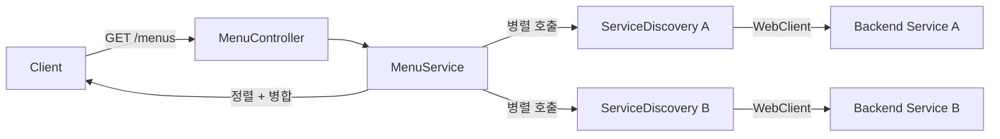

# Gateway 모듈

API Gateway 서비스. 여러 백엔드 서비스로부터 메뉴를 병렬로 수집하여
클라이언트에 통합된 메뉴 목록을 제공한다.

## 아키텍처

```
usecase/                             # 유스케이스 (프레임워크 의존성 없음)
├── MenuService                     # 메뉴 병렬 수집 + 정렬 + graceful degradation
└── MenuSupplier                    # 메뉴 공급자 포트 (인터페이스)

interfaces/                          # 인프라 어댑터 (Spring 의존)
├── api/
│   ├── MenuController              # GET /menus 엔드포인트
│   └── FallbackController          # CircuitBreaker 폴백 (빈 응답 반환)
├── filter/
│   ├── RateLimitFilter             # /auth/** IP 기반 Rate Limiting (20회/분)
│   └── CorrelationIdFilter         # X-Correlation-Id 생성/전파/MDC 등록
├── discovery/
│   ├── ServiceDiscovery            # WebClient 기반 메뉴 조회 어댑터
│   └── ServiceListProperties       # 서비스 목록 프로퍼티 바인딩
└── config/
    └── GatewayConfig               # ObjectMapper, WebClient, CORS, Bean 등록
```

## 메뉴 집계 흐름



## API

| Method | Path | 설명 |
|--------|------|------|
| GET | `/menus` | 전체 메뉴 목록 조회 (서비스 집계) |

- Content-Type: `application/vnd.sayaya.handbook.v1+json`
- 개별 서비스 실패 시 해당 서비스 메뉴만 제외하고 나머지 반환 (graceful degradation)
- 메뉴는 `order` 기준 정렬, null order는 마지막

## 설계 결정

| 결정 | 이유 |
|------|------|
| MenuSupplier를 usecase의 포트(인터페이스)로 정의 | 서비스 디스커버리 방식 교체 가능 (K8s, 직접 등록 등) |
| MenuService에 Spring 어노테이션 없음 | usecase 계층의 프레임워크 독립성 (클린 아키텍처) |
| 병렬 호출 + `onErrorResume` | 개별 서비스 실패 시 graceful degradation |
| headers를 `Map<String, List<String>>`으로 전달 | usecase가 `HttpHeaders`(Spring)에 의존하지 않도록 |
| ServiceDiscovery에 1200ms 타임아웃 | 느린 서비스가 전체 응답을 차단하지 않도록 |
| GatewayConfig에서 모든 Bean 등록 | usecase 계층에 `@Service`/`@Component` 없이 DI 구성 |

## 라우트 설정

API Gateway 라우트는 `application.yml`에 Spring Cloud Gateway Server WebFlux 설정으로 정의된다.
각 백엔드 서비스에 대해 경로 패턴과 HTTP 메서드를 기반으로 라우팅한다.

> **주의:** Spring Cloud Gateway 5.0부터 프로퍼티 경로가 `spring.cloud.gateway.server.webflux.routes`로 변경되었다. 구 경로(`spring.cloud.gateway.routes`)를 사용하면 라우트가 0개로 로딩된다.

```yaml
spring:
  cloud:
    gateway.server.webflux:
      routes:
        - id: login
          uri: ${gateway.routes.login:http://localhost:8081}
          predicates:
            - Path=/auth/**,/oauth2/**,/login/**,/user
        - id: event-broadcaster
          uri: ${gateway.routes.event-broadcaster:http://localhost:8088}
          predicates:
            - Path=/workspaces/*/messages
            - Method=GET
          filters:
            - name: CircuitBreaker
              args:
                name: eventBroadcasterCB
                fallbackUri: forward:/fallback/empty
        - id: type-query
          uri: ${gateway.routes.type-query:http://localhost:8082}
          predicates:
            - Path=/workspaces/*/types/**,/workspaces/*/layouts/**
            - Method=GET
        - id: type-command
          uri: ${gateway.routes.type-command:http://localhost:8083}
          predicates:
            - Path=/workspaces/*/types/**,/workspaces/*/layouts/**
            - Method=PUT,DELETE
        - id: document-query
          uri: ${gateway.routes.document-query:http://localhost:8084}
          predicates:
            - Path=/workspaces/*/documents/**,/workspaces/*/*/*,/workspaces/*/stats,/workspaces/*/stats/**,/workspaces/*/quality-issues,/workspaces/*/agent-activity
            - Method=GET
        - id: document-command
          uri: ${gateway.routes.document-command:http://localhost:8085}
          predicates:
            - Path=/workspaces/*/documents/**
            - Method=PUT,DELETE
        - id: workspace-command
          uri: ${gateway.routes.workspace-command:http://localhost:8086}
          predicates:
            - Path=/workspace,/workspaces/**
            - Method=POST,PUT,DELETE
        - id: assistant
          uri: ${gateway.routes.assistant:http://localhost:8087}
          predicates:
            - Path=/assistant/**
          filters:
            - name: CircuitBreaker
              args:
                name: assistantCB
                fallbackUri: forward:/fallback/empty
        - id: static
          uri: ${gateway.routes.static:http://localhost:8080}
          predicates:
            - Path=/js/**,/css/**,/icons/**

### SPA 클린 URL 지원 (Fallback)
`shell-ui`의 클린 URL 내비게이션 지원을 위해, API 경로가 아닌 UI 경로 요청(예: `/workspaces/123/types`) 시 SPA 진입점인 `app.html`을 반환하도록 설정해야 한다.
- **방법**: Ingress/Gateway API 레벨에서 UI 경로 패턴을 `app.html`로 rewrite 하거나, Gateway 내부에 API 이외의 모든 HTML 요청을 `app.html`로 연결하는 Fallback 필터를 적용한다. 상세 설계는 `docs/architecture.md` 참조.

```

## 에이전트 연동

### 내부 assistant
- 호출 경로: `/assistant/**` 경로 라우팅
- 시나리오: 사용자의 자연어 요청을 Assistant 서비스로 전달하고, Assistant의 실행 계획 생성 및 실행 요청을 중계함

### 외부 AI (Tool Use)
- 노출 엔드포인트: `/openapi.json`, `/assistant/request`, `/assistant/execute` 등
- OpenAPI `summary` / `description` 기입 위치: 각 백엔드 서비스의 Controller (SpringDoc 스캔)
- 감사 경로: `CorrelationIdFilter`에서 `X-Correlation-Id` 생성 및 전파

### (후속) MCP
- 관련 Tool 매니페스트: 미정

### Agent Command 타겟
- navigate: 해당 없음 (인프라 계층)
- highlight/mutate selector 패턴: 해당 없음

## 메뉴 엔트리 확장 가이드 (서버 주도 온보딩 포함)

새로운 서비스를 `/menus` 집계에 추가하거나 온보딩과 같은 서버 주도 라우팅 메뉴를 추가하려면 다음 단계를 수행합니다:

1. 서비스 내에 `MenuSupplier` 구현체(예: `MenuController`)를 작성합니다.
2. `allowedSessionStates`를 명시적으로 선언하여 보안을 확보합니다.
3. 서비스가 실행 중이고 `/menus` 엔드포인트가 `/menus` GET 요청에 응답하도록 설정합니다.
4. 온보딩 메뉴처럼 조건부로 메뉴를 공급하려면, 서비스 컨트롤러에서 워크스페이스 조회 로직을 연동하여 조건부로 응답합니다.
5. `charts/handbook/gateway/templates/configmap.yaml`의 `gateway.routes`와 `services` 목록에 새 서비스의 이름을 등록합니다. (운영 환경 적용 시)

## 메뉴 수집 설정

```yaml
services:
  - name: service-login:8080
  - name: service-type-query:8080
  - name: service-document-query:8080
  - name: service-workspace-command:8080
```

## 인프라 기능

| 기능 | 구현 | 설명 |
|------|------|------|
| CORS | `GatewayConfig.corsWebFilter()` | 허용 도메인/메서드/헤더 명시, `cors.allowed-origins` 프로퍼티로 설정 |
| CSP | 각 백엔드 서비스 (authentication 모듈) | `Content-Security-Policy` 헤더 자동 적용 (gateway는 순수 프록시로 인증 미포함) |
| Rate Limiting | `RateLimitFilter` | `/auth/**` 경로 IP당 20회/분 제한 (인메모리 슬라이딩 윈도우) |
| Correlation ID | `CorrelationIdFilter` | X-Correlation-Id UUID 생성/전파 + MDC 로깅 |
| Circuit Breaker | `application.yml` + `FallbackController` | assistant, event-broadcaster 장애 시 빈 응답 반환 |
| Prometheus | `application.yml` | `/actuator/prometheus` 메트릭 노출 |
| 구조화 로깅 | `application.yml` | 로그 패턴에 correlationId 포함 |

## 의존성

- activity (Menu 도메인, gwt-servlet-jakarta 제외)
- Spring Cloud Gateway Server WebFlux (`spring-cloud-starter-gateway-server-webflux`)
- Spring Cloud CircuitBreaker (Resilience4j)
- SpringDoc OpenAPI (WebFlux)
- Log4j2

> **참고:** gateway는 순수 프록시(pure proxy)로서 authentication 모듈에 의존하지 않는다. JWT 검증·CSP 등 보안 처리는 각 백엔드 서비스가 authentication 모듈을 통해 자체 수행한다. activity 의존 시 `gwt-servlet-jakarta`를 exclude하여 servlet classpath 오염을 방지한다 (오염 시 reactive auto-config가 실패하여 라우트가 0개로 로딩됨).

## 테스트

```bash
./gradlew :gateway:test
./gradlew :gateway:koverVerify  # 커버리지 80% 이상 필수
```
