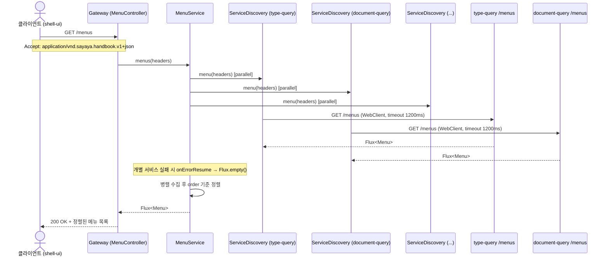
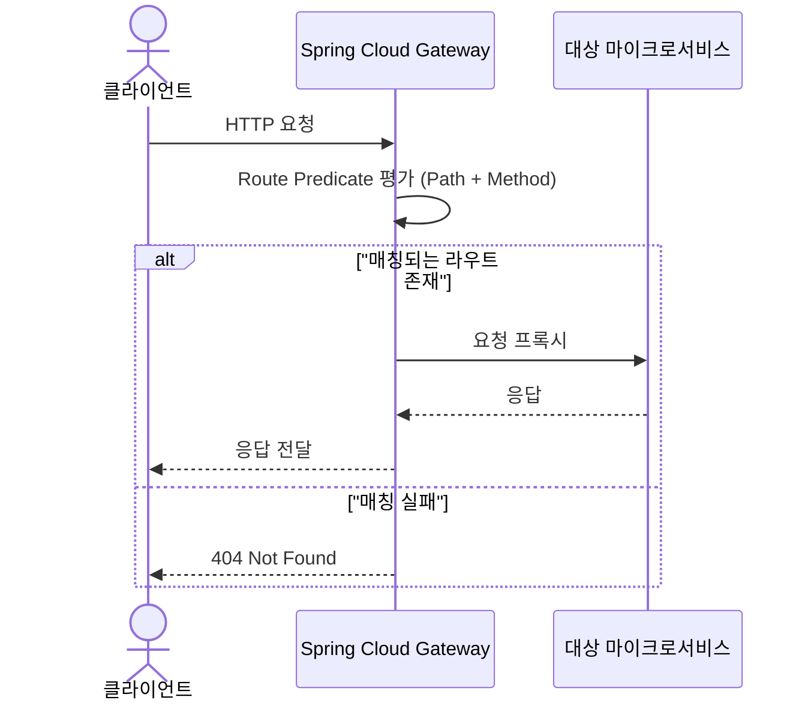
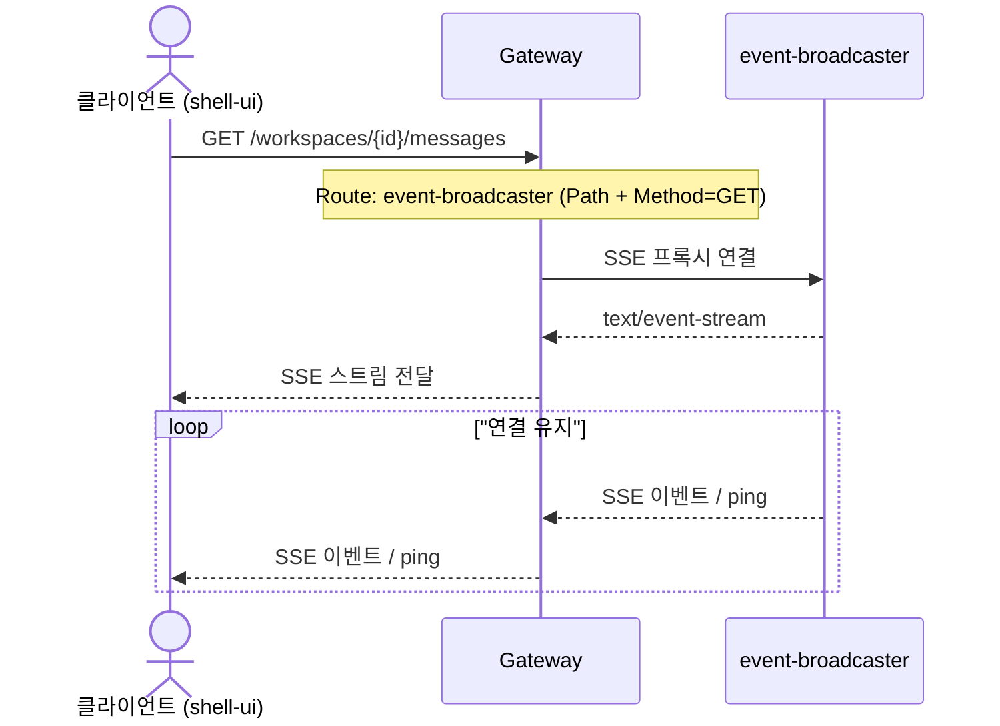
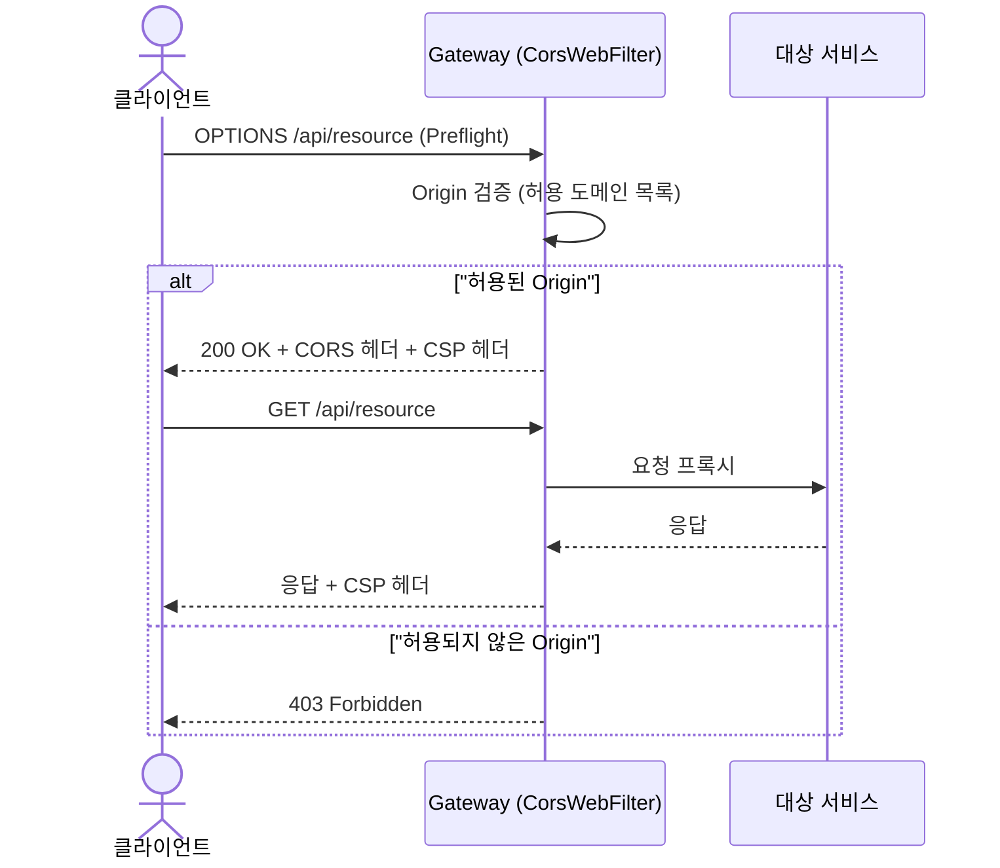
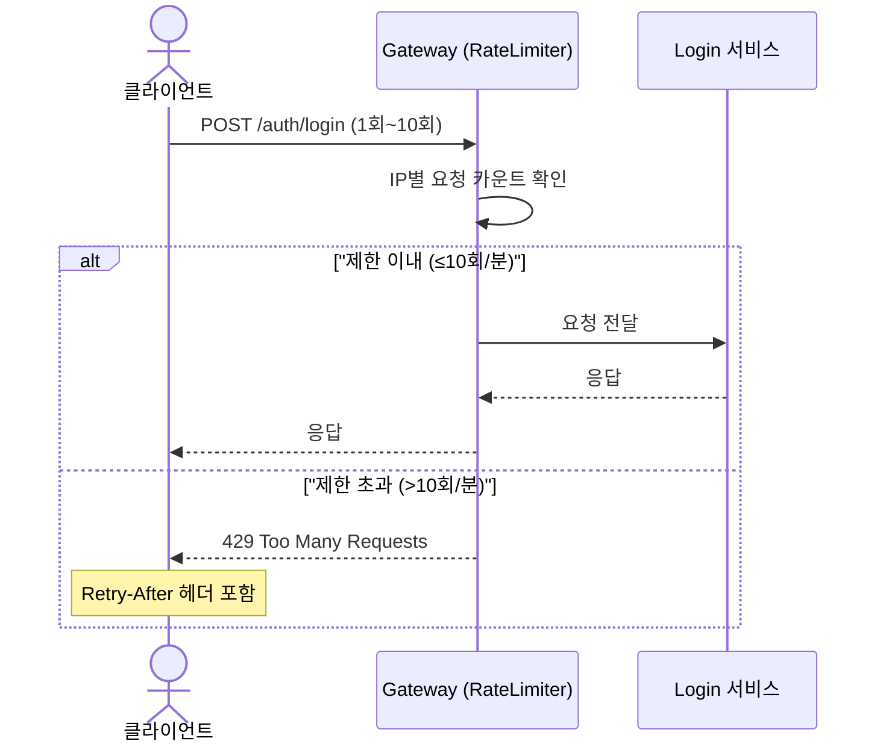
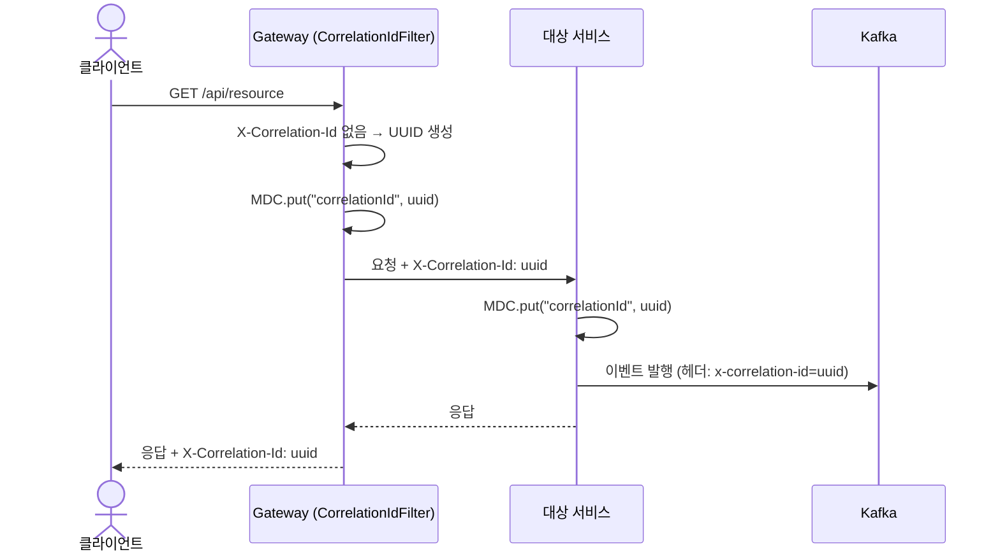

# Gateway 유스케이스

## 메뉴 집계 시퀀스

## API 라우팅 시퀀스

## event-broadcaster 프록시 시퀀스

---

## UC-GW1: API 라우팅

| 항목 | 내용 |
|------|------|
| **액터** | 클라이언트 (브라우저, 외부 시스템) |
| **선행조건** | Gateway 서버 구동 및 라우트 설정 완료 |
| **정상 흐름** | 1. 클라이언트가 HTTP 요청을 Gateway로 전송한다. 2. Spring Cloud Gateway가 `application.yml`에 정의된 라우트 목록에서 Path/Method Predicate를 평가한다. 3. 매칭된 라우트의 대상 URI로 요청을 프록시한다. 4. 대상 서비스의 응답을 클라이언트에 전달한다. |
| **라우트 목록** | `login` (/auth/**, /user), `event-broadcaster` (/workspaces/*/messages GET), `type-query` (/workspaces/*/types/**, /workspaces/*/layouts/** GET), `type-command` (PUT,DELETE), `document-query` (/workspaces/*/documents/**, /workspaces/*/*/*  GET), `document-command` (PUT,DELETE), `workspace-command` (POST,PUT,DELETE), `assistant` (/assistant/**), `static` (/js/**, /css/**, /icons/**) |
| **결과** | 클라이언트 요청이 적절한 마이크로서비스로 라우팅되어 응답을 수신 |

## UC-GW2: 메뉴 집계

| 항목 | 내용 |
|------|------|
| **액터** | 클라이언트 (shell-ui 경유) |
| **선행조건** | `ServiceListProperties`에 메뉴 제공 서비스 목록이 등록되어 있음 |
| **정상 흐름** | 1. 클라이언트가 `GET /menus`를 요청한다. 2. `MenuController`가 요청 헤더를 추출하여 `MenuService.menus(headers)`를 호출한다. 3. `MenuService`가 등록된 모든 `MenuSupplier`에 병렬로 `/menus`를 요청한다. 4. 각 `ServiceDiscovery`가 WebClient로 대상 서비스의 `/menus`를 호출한다 (타임아웃 1200ms). 5. 개별 서비스 실패 시 `onErrorResume`으로 빈 결과를 반환하여 graceful degradation한다. 6. 수집된 메뉴를 `order` 기준으로 정렬하여 반환한다. |
| **결과** | 200 OK + 전체 서비스의 메뉴를 통합·정렬한 목록 |

## UC-GW3: 인증 필터

| 항목 | 내용 |
|------|------|
| **액터** | 클라이언트 (인증된 사용자) |
| **선행조건** | 클라이언트가 유효한 JWT 토큰을 보유 (쿠키) |
| **정상 흐름** | 1. 클라이언트가 API 요청 시 쿠키에 JWT 토큰을 포함하여 전송한다. 2. Gateway가 요청 헤더를 그대로 하위 서비스로 전달한다. 3. 각 하위 서비스는 `authentication` 모듈을 통해 JWT를 검증한다. 4. 인증 정보(Principal)가 컨트롤러에서 사용 가능해진다. |
| **비고** | Gateway 자체는 별도의 인증 필터를 구현하지 않으며, 요청 헤더(쿠키 포함)를 하위 서비스에 전파하여 각 서비스가 `authentication` 라이브러리로 JWT를 검증한다. 메뉴 집계 시에도 헤더를 전달하여 인증 컨텍스트를 유지한다. |
| **결과** | 인증 정보가 하위 서비스로 전파됨 |

## UC-GW4: event-broadcaster 프록시

| 항목 | 내용 |
|------|------|
| **액터** | 클라이언트 (shell-ui 경유) |
| **선행조건** | event-broadcaster 서비스 구동 중 |
| **정상 흐름** | 1. 클라이언트가 `GET /workspaces/{id}/messages`를 요청한다. 2. Gateway의 라우트 설정에서 `event-broadcaster` 라우트가 매칭된다 (Path: `/workspaces/*/messages`, Method: GET). 3. Gateway가 SSE 연결을 event-broadcaster로 프록시한다. 4. event-broadcaster의 `text/event-stream` 응답이 클라이언트에 그대로 전달된다. 5. SSE 스트림이 종료될 때까지 연결이 유지된다. |
| **비고** | SSE 라우트는 `document-query` 라우트보다 먼저 정의되어 우선 매칭된다 |
| **결과** | 클라이언트가 워크스페이스별 실시간 이벤트 스트림을 수신 |

---

## UC-GW5: CORS / CSP 설정

| 항목 | 내용 |
|------|------|
| **액터** | 시스템 (Gateway WebFilter) |
| **선행조건** | Gateway 서버 구동 |
| **정상 흐름** | 1. `GatewayConfig.corsWebFilter()`가 `CorsWebFilter`를 등록하여 허용 도메인(`cors.allowed-origins` 프로퍼티), 메서드(GET/POST/PUT/PATCH/DELETE/OPTIONS), 헤더(Authorization, Content-Type, X-Correlation-Id)를 명시적으로 설정한다. 2. `allowCredentials=true`, `maxAge=3600`으로 프리플라이트 캐싱을 적용한다. 3. `AuthenticationAutoConfig`가 `Content-Security-Policy` 응답 헤더를 추가한다 (`default-src 'self'; script-src 'self' 'unsafe-eval'; style-src 'self' 'unsafe-inline'`). |
| **요구사항** | 7.1 보안 강화 — CORS 설정, CSP 헤더 |
| **상태** | ✅ 구현 완료 |
| **구현 클래스** | `GatewayConfig.corsWebFilter()`, `AuthenticationAutoConfig.contentSecurityPolicy` |

## UC-GW6: Rate Limiting 필터

| 항목 | 내용 |
|------|------|
| **액터** | 클라이언트 |
| **선행조건** | Gateway 서버 구동 |
| **정상 흐름** | 1. 클라이언트가 `/auth/**` 경로에 요청을 전송한다. 2. `RateLimitFilter`(WebFilter)가 IP 기반 인메모리 슬라이딩 윈도우(1분)로 요청 속도를 검사한다. 3. 제한(20회/분) 이내이면 요청을 통과시킨다. 4. 제한 초과 시 429 Too Many Requests를 반환한다. |
| **요구사항** | 7.1 보안 강화 — 인증 Rate Limiting |
| **상태** | ✅ 구현 완료 |
| **구현 클래스** | `RateLimitFilter` |
| **비고** | 단일 인스턴스 환경에 적합한 인메모리 구현. 분산 환경에서는 Redis 기반으로 교체 필요 |

## UC-GW7: 요청 추적 ID 생성

| 항목 | 내용 |
|------|------|
| **액터** | 시스템 (Gateway WebFilter) |
| **선행조건** | Gateway 서버 구동 |
| **정상 흐름** | 1. `CorrelationIdFilter`(Ordered.HIGHEST_PRECEDENCE)가 수신 요청의 `X-Correlation-Id` 헤더를 확인한다. 2. 헤더가 없으면 UUID를 생성한다. 3. `exchange.mutate()`로 요청 헤더에 `X-Correlation-Id`를 추가하여 하위 서비스로 전파한다. 4. 응답 헤더에도 `X-Correlation-Id`를 설정한다. 5. Reactor Context와 MDC에 `correlationId`를 등록하여 로그에 자동 포함한다. 6. 필터 종료 시 `doFinally`로 MDC를 정리한다. |
| **요구사항** | 7.4 관측성 — 요청 추적 ID |
| **상태** | ✅ 구현 완료 |
| **구현 클래스** | `CorrelationIdFilter` |

---

## 트레이서빌리티 매트릭스

| UC | 요구사항 | 시퀀스 다이어그램 | 주요 클래스 | 테스트 |
|----|---------|---|---|---|
| UC-GW1 (API 라우팅) | 3.9, 아키텍처 | API 라우팅 | application.yml (Spring Cloud Gateway Routes) | - |
| UC-GW2 (메뉴 집계) | 3.11 (Shell - Menu Rail) | 메뉴 집계 | MenuController, MenuService, MenuSupplier, ServiceDiscovery, ServiceListProperties, GatewayConfig | - |
| UC-GW3 (인증 필터) | 3.8 | — (헤더 전파) | application.yml (라우트), authentication 모듈 | - |
| UC-GW4 (SSE 프록시) | 3.9 (SSE 실시간 알림) | event-broadcaster 프록시 | application.yml (event-broadcaster 라우트) | - |
| UC-GW5 (CORS/CSP 설정) | 7.1 (보안 강화) | CORS/CSP 설정 | GatewayConfig.corsWebFilter(), AuthenticationAutoConfig.contentSecurityPolicy | GatewayConfigTest |
| UC-GW6 (Rate Limiting) | 7.1 (인증 Rate Limiting) | Rate Limiting 필터 | RateLimitFilter | RateLimitFilterTest |
| UC-GW7 (Correlation ID) | 7.4 (요청 추적 ID) | 요청 추적 ID 생성 | CorrelationIdFilter | CorrelationIdFilterTest |
| UC-GW8 (Circuit Breaker) | 7.3 (graceful degradation) | — | FallbackController, application.yml (CircuitBreaker 필터) | - |
