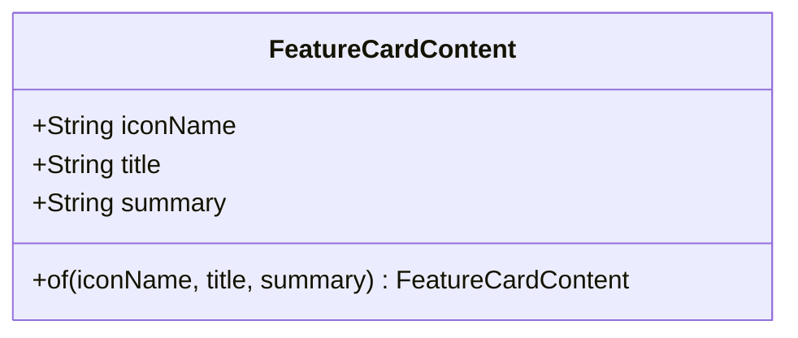
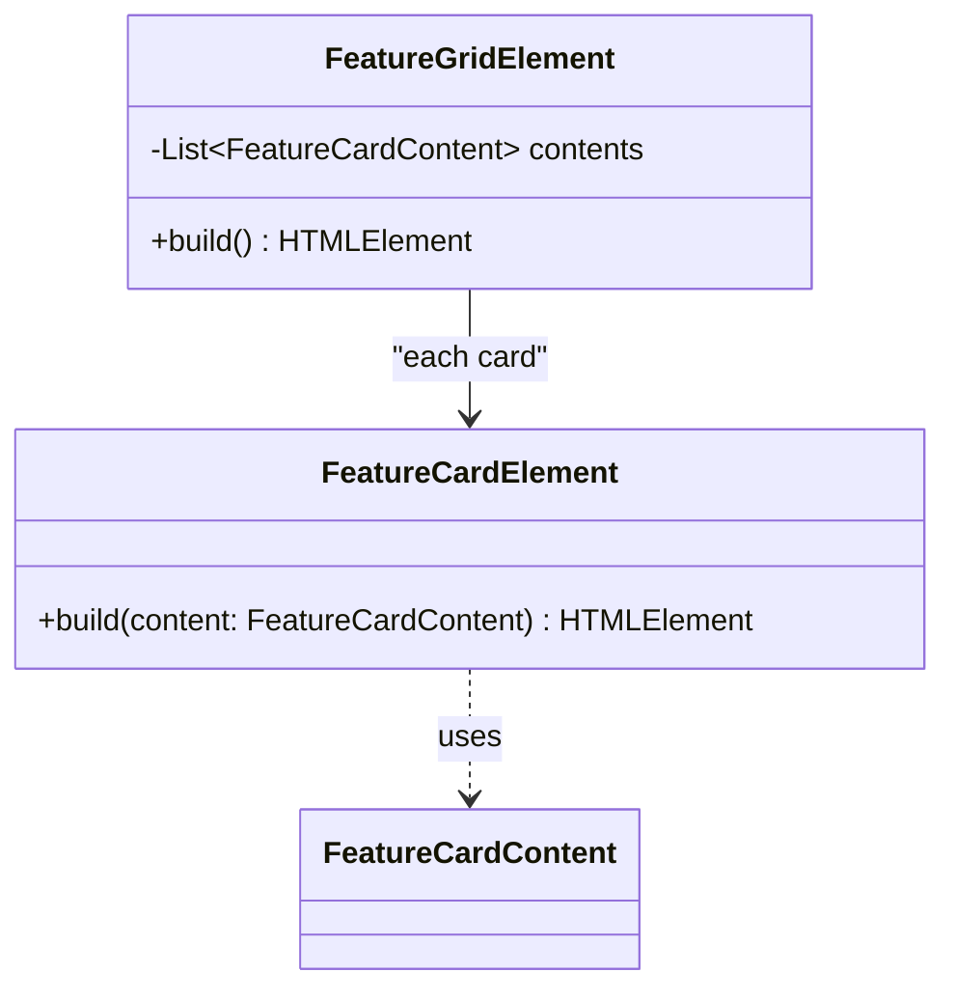
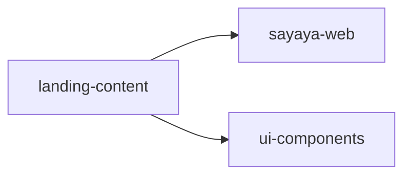

# Landing-Content 클래스 다이어그램

## Domain 계층

- i18n 리소스에서 매핑된 VO. Handbook 핵심 기능(운영 중 스키마 변경, 이력 관리, AI 에이전트, 실시간 협업 등) 각각에 대해 하나씩 생성.
- Java record 사용 가능 (GWT 2.13+). 단 다중 생성자 금지 → `of()` 팩토리 유지.

---

## UI 계층

---

## 의존 관계

외부 서비스 의존성 없음. 순수 렌더링 라이브러리.
