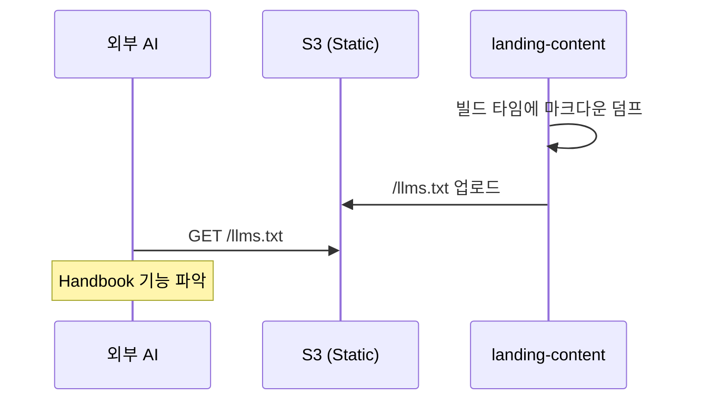
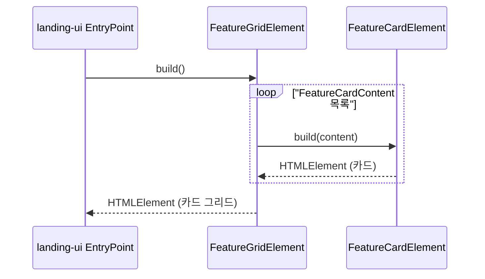
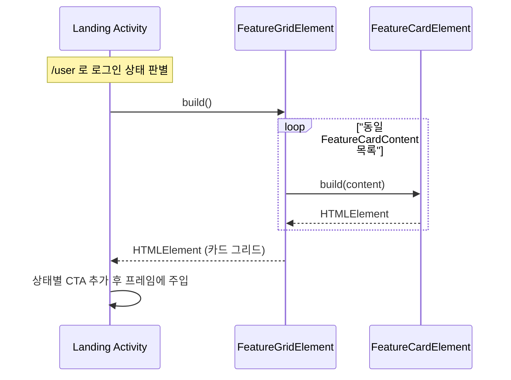

# Landing-Content 유스케이스

`landing-content` 는 순수 DOM 라이브러리이므로 독립 유스케이스는 없다.
소비자(`landing-ui`, 앱 내부 랜딩 activity) 의 유스케이스 안에서 기능 설명 카드 DOM 을 제공하는 하위 책임만 수행한다.

## 에이전트 연동 시나리오

외부 AI 에이전트가 사이트의 기능을 파악할 수 있도록 텍스트 정보를 제공한다.

## 트레이서빌리티 매트릭스

| 상위 UC | 참조 요구사항 | Landing-Content 의 역할 |
|---------|--------------|-------------------------|
| UC-07 SEO 랜딩 방문 | §3.22.1, §3.22.2 | `FeatureGridElement.build()` 가 프리렌더 캡처 전에 카드 DOM 을 생성 |
| UC-09 앱 내부 랜딩 방문 | §3.22.1, §3.22.3 | 런타임에 Landing Activity 가 동일 팩토리로 카드 DOM 생성 |

## 카드 렌더 시퀀스 (SEO 랜딩 경로)

## 카드 렌더 시퀀스 (앱 내부 랜딩 경로)

## 테스트 전략

- GWT 컴파일 + Playwright 로 실제 DOM 이 생성되는지 확인.
- 카드 개수·텍스트가 i18n 입력에 따라 변경되는지 검증.
- `build()` 는 idempotent — 같은 입력 같은 DOM 구조 보장 (프리렌더 결정성 전제).
