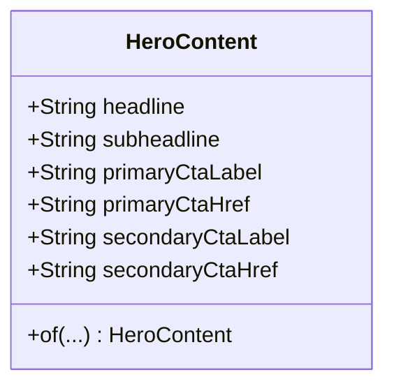
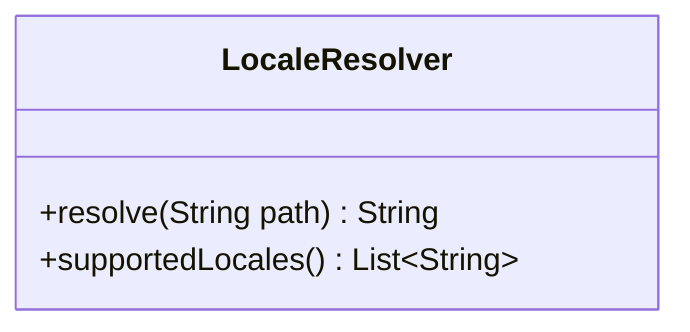
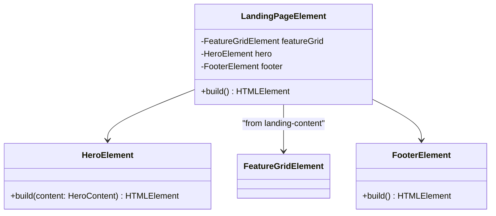
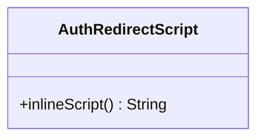
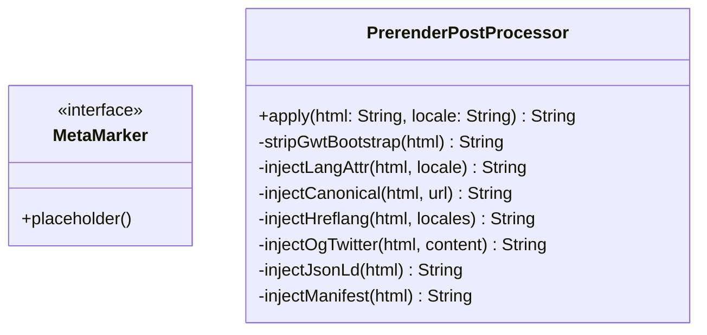
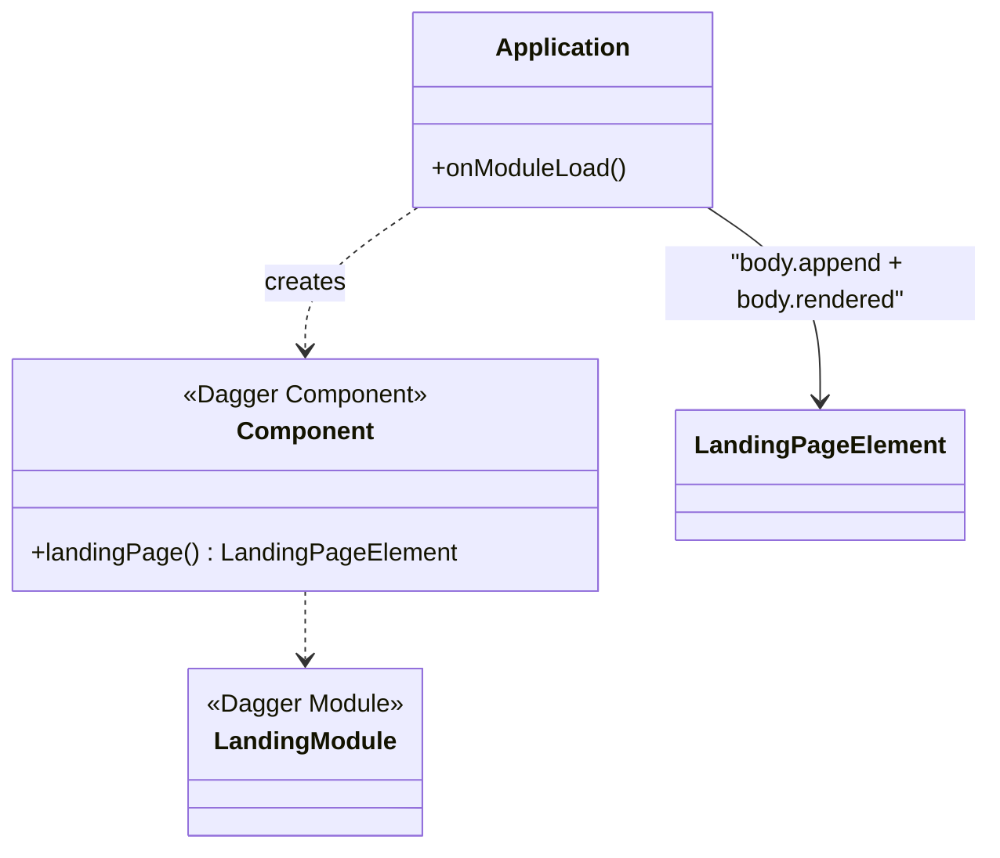
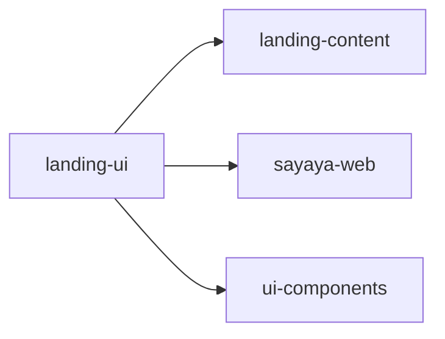

# Landing-UI 클래스 다이어그램

## Domain 계층

- i18n 리소스에서 매핑. `primaryCtaHref` 는 `/app.html`, `secondaryCtaHref` 는 `/auth/login` 등 실제 앵커.

---

## Usecase 계층

빌드 타임에만 사용 — Playwright 로 접속할 경로를 로케일별로 결정.

---

## UI 계층

---

## Redirect 계층

정적 문자열로 JWT 쿠키 감지 스크립트를 반환. `<head>` 에 `defer` 스크립트로 삽입.

---

## SEO 후처리

`MetaMarker` 는 GWT 렌더 결과에 후처리 위치를 표시하기 위한 마커(예: `<!--prerender:canonical-->`). `PrerenderPostProcessor` 가 덤프된 HTML 에서 이들을 찾아 실제 태그로 교체.

---

## EntryPoint

---

## 의존 관계

activity 는 의존하지 않는다 — SEO 랜딩은 `/menus`·FetchApi 를 호출하지 않는다.
