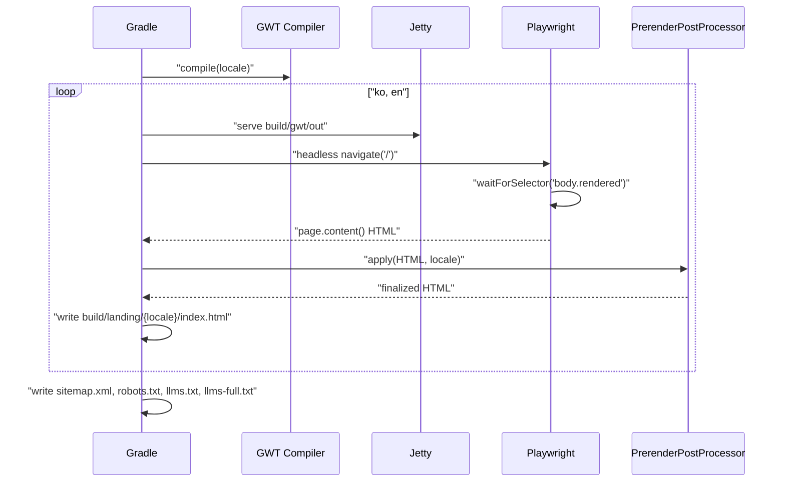

# Landing-UI 유스케이스

SEO 랜딩 페이지와 관련된 유스케이스. 글로벌 유스케이스는 `docs/usecases.md` 의 UC-07, UC-08 참조.

## 트레이서빌리티 매트릭스

| 글로벌 UC | 요구사항 | Landing-UI 의 역할 |
|-----------|----------|-------------------|
| UC-07 SEO 랜딩 방문 | §3.22.2 | 프리렌더된 정적 HTML 제공. JWT 쿠키 없으면 그대로 노출 |
| UC-08 로그인 사용자 자동 리다이렉트 | §3.22.2 | 인라인 `defer` 스크립트로 쿠키 감지 시 `/app.html` 로 이동 |

---

## UC-LU1: 빌드 타임 프리렌더 실행

| 항목 | 내용 |
|------|------|
| **액터** | 빌드 파이프라인 (CI / 개발자 로컬) |
| **선행조건** | `landing-ui` / `landing-content` 의 GWT 컴파일 가능 상태 |
| **정상 흐름** | 1. `./gradlew :landing-ui:prerender` 실행 2. 로케일별 GWT 컴파일 3. Jetty 로컬 서빙 4. Playwright 헤드리스 접속 → `body.rendered` 대기 5. HTML 덤프 6. PrerenderPostProcessor 적용 (스크립트 제거, 메타·hreflang·JSON-LD 주입) 7. `build/landing/{locale}/index.html` 저장 8. sitemap.xml, robots.txt, llms.txt, llms-full.txt 생성 |
| **결과** | 배포 가능한 정적 HTML + 사이드카 파일들 |
| **결정성** | 동일 커밋은 동일 바이트 생산 (타입스탬프·난수 없음) |

---

## UC-LU2: 크롤러가 SEO 랜딩 인덱싱

| 항목 | 내용 |
...
| i18n | Playwright + 텍스트 검증 | `/` 에 한국어, `/en/` 에 영어 텍스트 존재 |
| 링크 무결성 | HTML 파서 | 모든 `<a href>` 가 유효 내부 경로 |
| 사이드카 | 파일 존재 + 파싱 | sitemap.xml 유효 XML, robots.txt 형식 준수 |
