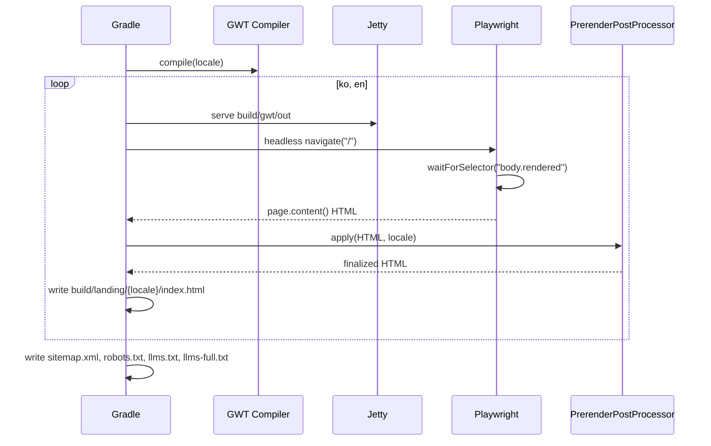

# Landing-UI 유스케이스

SEO 랜딩 페이지와 관련된 유스케이스. 글로벌 유스케이스는 `docs/usecases.md` 의 UC-07, UC-08 참조.

## 트레이서빌리티 매트릭스

| 글로벌 UC | 요구사항 | Landing-UI 의 역할 |
|-----------|----------|-------------------|
| UC-07 SEO 랜딩 방문 | §3.22.2 | 프리렌더된 정적 HTML 제공. JWT 쿠키 없으면 그대로 노출 |
| UC-08 로그인 사용자 자동 리다이렉트 | §3.22.2 | 인라인 `defer` 스크립트로 쿠키 감지 시 `/app.html` 로 이동 |

---

## UC-LU1: 빌드 타임 프리렌더 실행

| 항목 | 내용 |
|------|------|
| **액터** | 빌드 파이프라인 (CI / 개발자 로컬) |
| **선행조건** | `landing-ui` / `landing-content` 의 GWT 컴파일 가능 상태 |
| **정상 흐름** | 1. `./gradlew :landing-ui:prerender` 실행 2. 로케일별 GWT 컴파일 3. Jetty 로컬 서빙 4. Playwright 헤드리스 접속 → `body.rendered` 대기 5. HTML 덤프 6. PrerenderPostProcessor 적용 (스크립트 제거, 메타·hreflang·JSON-LD 주입) 7. `build/landing/{locale}/index.html` 저장 8. sitemap.xml, robots.txt, llms.txt, llms-full.txt 생성 |
| **결과** | 배포 가능한 정적 HTML + 사이드카 파일들 |
| **결정성** | 동일 커밋은 동일 바이트 생산 (타임스탬프·난수 없음) |

---

## UC-LU2: 크롤러가 SEO 랜딩 인덱싱

| 항목 | 내용 |
|------|------|
| **액터** | 검색엔진 크롤러 (Googlebot 등) |
| **선행조건** | 랜딩이 S3 에 배포되어 있고 HTTPRoute 가 활성화됨 |
| **정상 흐름** | 1. 크롤러가 `/` 요청 2. S3 에서 `static/landing/ko/index.html` 반환 3. 크롤러가 HTML 파싱 (`<title>`, meta, JSON-LD, body 콘텐츠) 4. 크롤러가 JS 실행 (WRS) 5. 인라인 스크립트가 쿠키 검사 → 크롤러는 쿠키 없음 → 리다이렉트 미발생 6. 크롤러가 `<link rel="alternate" hreflang>` 를 따라 `/en/` 도 개별 인덱싱 7. `/sitemap.xml` 로부터 추가 URL 확인 |
| **결과** | SERP 에 ko/en 랜딩이 각각 언어별로 노출 |
| **주의** | `/app.html` 은 `noindex, follow` 메타로 색인에서 제외 |

---

## UC-LU3: 비로그인 사용자가 SEO 랜딩 방문

| 항목 | 내용 |
|------|------|
| **액터** | 비로그인 방문자 |
| **선행조건** | JWT 쿠키 없음 |
| **정상 흐름** | 1. 방문자가 `/` 접속 (SERP 클릭, 직접 입력 등) 2. 정적 HTML 로딩 3. 인라인 스크립트 쿠키 검사 → 쿠키 없음 → 랜딩 유지 4. 방문자가 FeatureGrid + CTA 확인 5. CTA `<a href="/app.html">` 클릭 → 앱으로 이동 → 로그인 요구 |

---

## UC-LU4: 로그인 사용자가 랜딩으로 진입

| 항목 | 내용 |
|------|------|
| **액터** | 로그인 상태 사용자 |
| **선행조건** | JWT 쿠키 유효 |
| **정상 흐름** | 1. 사용자가 `/` 접속 2. 정적 HTML 로딩 3. 인라인 스크립트 쿠키 감지 → `location.replace('/app.html')` 4. 브라우저가 `/app.html` 로 이동 5. 앱 셸 정상 부팅 |
| **대안** | 쿠키가 만료되었거나 무효하면 UC-LU3 로 폴백 |
| **주의** | `location.replace` 는 뒤로가기 히스토리에 남지 않음 — 사용자가 "뒤로" 눌러도 앱 내부에서만 이동 |

---

## 테스트 전략

| 대상 | 도구 | 검증 |
|------|------|------|
| 결정성 | Gradle + diff | 두 번 빌드 결과 바이트 동일 |
| 메타 태그 | HTML 파서 | canonical, hreflang, JSON-LD, og 주입 확인 |
| 리다이렉트 | Playwright | 쿠키 없음 → 리다이렉트 안 됨, 쿠키 있음 → `/app.html` 이동 |
| i18n | Playwright + 텍스트 검증 | `/` 에 한국어, `/en/` 에 영어 텍스트 존재 |
| 링크 무결성 | HTML 파서 | 모든 `<a href>` 가 유효 내부 경로 |
| 사이드카 | 파일 존재 + 파싱 | sitemap.xml 유효 XML, robots.txt 형식 준수 |
