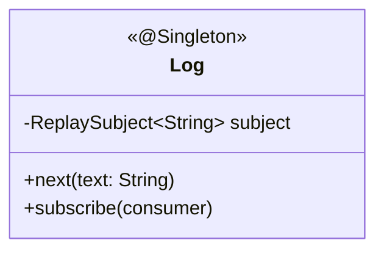
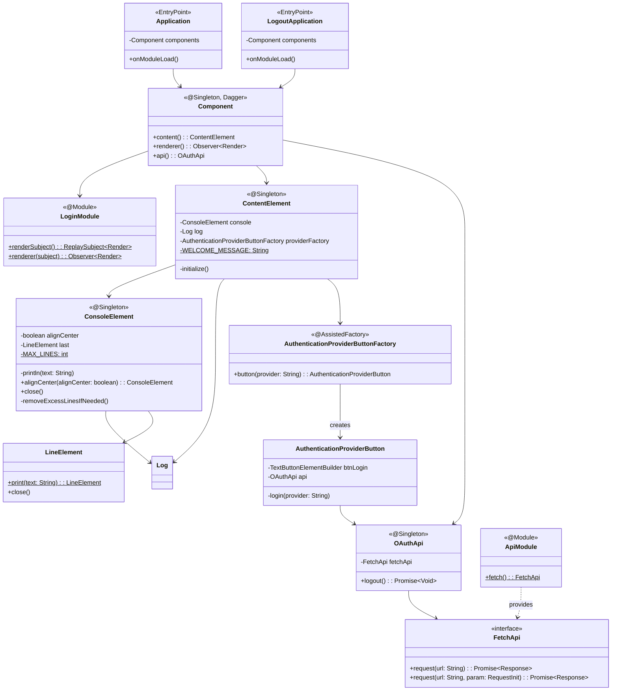

# Login-UI 클래스 다이어그램

## 도메인 / Usecase

## Interfaces 계층

## 설계 패턴

| 패턴 | 적용 위치 | 설명 |
|------|----------|------|
| **Dependency Injection (Dagger)** | Component, ApiModule | GWT 환경에서 Dagger2 컴파일 타임 DI로 의존성 관리 |
| **Observer (Rx)** | Log (ReplaySubject) | 로그 메시지를 발행/구독 패턴으로 ConsoleElement에 전파 |
| **Assisted Inject** | AuthenticationProviderButtonFactory | 프로바이더 이름을 런타임 파라미터로 받아 버튼 인스턴스 생성 |
| **Module Script** | Application, Logout | 별도의 GWT 모듈(Login.gwt.xml, Logout.gwt.xml)로 로그인/로그아웃 분리 |
| **Terminal UI** | ContentElement, ConsoleElement, LineElement | 터미널 스타일 UI로 로그인 경험을 차별화 (ASCII 아트 + 타이핑 효과) |
