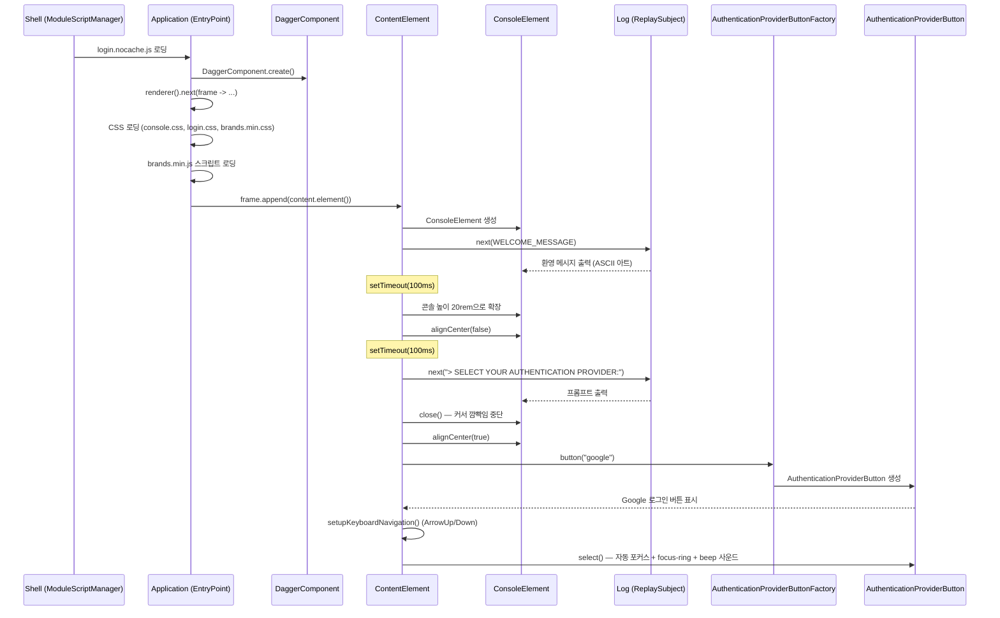
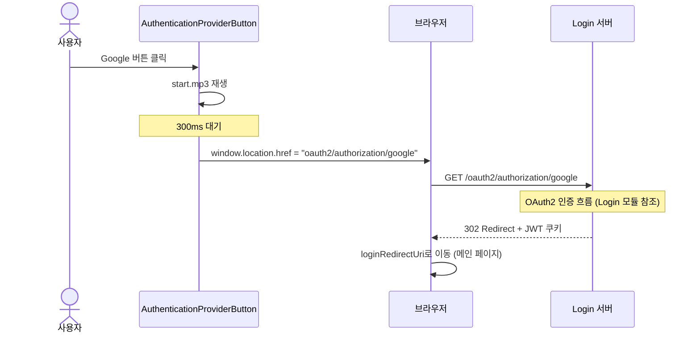
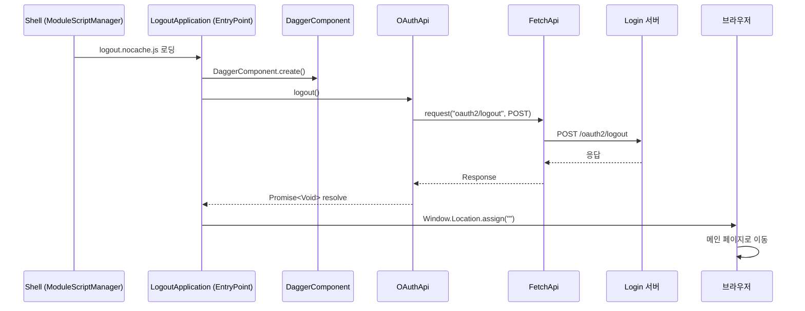
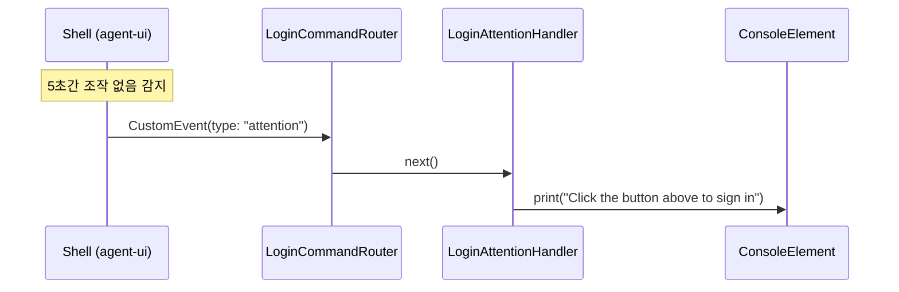

# Login-UI 유스케이스

## 로그인 화면 로딩 시퀀스

## OAuth2 로그인 시퀀스

## 로그아웃 시퀀스

---

## UC-LUI1: 로그인 화면 표시

| 항목 | 내용 |
|------|------|
| **액터** | 미인증 사용자 |
| **선행조건** | Shell이 login-ui 모듈을 로딩 (미인증 상태에서 SIGN_IN 메뉴 선택) |
| **정상 흐름** | 1. Shell이 `login/login.nocache.js`를 동적 로딩한다. 2. `Application.onModuleLoad()`가 `DaggerComponent`를 생성한다. 3. CSS (console.css, login.css, brands.min.css)와 brands.min.js 스크립트를 프레임에 추가한다. 4. `ContentElement`가 터미널 스타일 콘솔(높이 0, 중앙 정렬)을 생성한다. 5. ASCII 아트 환영 메시지("Handbook Project v1.0.0")가 출력된다. 6. 100ms 후 콘솔 높이가 20rem으로 트랜지션 확장된다. 7. 100ms 후 "SELECT YOUR AUTHENTICATION PROVIDER:" 프롬프트가 출력되고 커서 깜빡임이 중단된다. 8. `AuthenticationProviderButtonFactory`가 Google 로그인 버튼(FontAwesome brands 아이콘 포함)을 생성하여 표시한다. 9. ArrowUp/Down 키보드 내비게이션이 설정된다. 10. 첫 번째 버튼에 자동 포커스 + MD3 focus-ring 표시 + beep 사운드 재생. |
| **결과** | 터미널 스타일 로그인 화면에 OAuth2 프로바이더 버튼이 표시되고, 첫 버튼이 포커스된 상태이다. |

## UC-LUI2: OAuth2 로그인 실행

| 항목 | 내용 |
|------|------|
| **액터** | 미인증 사용자 |
| **선행조건** | 로그인 화면 표시 완료 |
| **정상 흐름** | 1. 사용자가 프로바이더 버튼(예: Google)을 클릭한다 (또는 ArrowUp/Down으로 이동 후 Enter). 2. `start.mp3` 사운드가 재생된다. 3. 300ms 대기 후 `AuthenticationProviderButton`이 `window.location.href`를 `oauth2/authorization/{provider}`로 변경한다. 4. 브라우저가 OAuth2 인가 흐름을 시작한다 (Login 서버로 리다이렉트). 5. 인증 성공 시 JWT 쿠키가 설정되고 메인 페이지로 리다이렉트된다. |
| **결과** | 사용자 인증 완료, JWT 쿠키 설정, 메인 페이지 이동 |

## UC-LUI3: 로그아웃 실행

| 항목 | 내용 |
|------|------|
| **액터** | 인증된 사용자 |
| **선행조건** | Shell이 logout-ui 모듈을 로딩 (SIGN_OUT 메뉴 선택) |
| **정상 흐름** | 1. Shell이 `logout/logout.nocache.js`를 동적 로딩한다. 2. `LogoutApplication.onModuleLoad()`가 `OAuthApi.logout()`을 호출한다. 3. `FetchApi`가 `POST /oauth2/logout` 요청을 전송한다. 4. 서버가 JWT 쿠키를 삭제한다. 5. 응답 후 `Window.Location.assign("")`으로 메인 페이지로 이동한다. |
| **결과** | 세션 종료, JWT 쿠키 삭제, 메인 페이지 이동 |

---

## UC-LUI4: 커맨드 핸들러 처리

| 항목 | 내용 |
|------|------|
| **액터** | ContentElement (내부 트리거), Shell (외부 커맨드) |
| **선행조건** | 로그인 화면 표시 완료 (LoginCommandRouter가 `handbook-login-command` 이벤트 구독 중) |
| **정상 흐름** | 1. ContentElement 또는 외부에서 `LoginCommandRouter.dispatch(detail)`로 CustomEvent를 발행한다. 2. `LoginCommandRouter`가 `type` 필드를 읽어 해당 BehaviorSubject에 커맨드를 라우팅한다. 3-a. `notify` → `LoginNotifyHandler`가 level에 따라 콘솔에 메시지 출력. 3-b. `attention` → `LoginAttentionHandler`가 안내 메시지 출력. 3-c. `highlight` → `LoginHighlightHandler`가 target 요소에 강조 클래스 토글. 3-d. `progress` → `LoginProgressHandler`가 OAuth 버튼 비활성화 + 진행 메시지 출력. |
| **결과** | 커맨드 타입에 따라 콘솔 출력, 요소 강조, 버튼 상태 변경이 수행된다. |

## 에이전트 연동 시나리오

로그인 화면의 콘솔 출력 및 안내를 에이전트가 제어한다.

---

## 트레이서빌리티 매트릭스

| UC | 시퀀스 다이어그램 | 주요 클래스 | 테스트 |
|----|---|---|---|
| UC-LUI1 (로그인 화면) | 로그인 화면 로딩 | Application, DaggerComponent, ContentElement, ConsoleElement, LineElement, Log, AuthenticationProviderButtonFactory, AuthenticationProviderButton | LoginTest |
| UC-LUI2 (로그인 실행) | OAuth2 로그인 | AuthenticationProviderButton, OAuthApi | LoginTest |
| UC-LUI3 (로그아웃) | 로그아웃 | LogoutApplication, OAuthApi, FetchApi | LogTest |
| UC-LUI4 (커맨드 핸들러) | — | LoginCommandRouter, LoginCommandDispatcher, LoginNotifyHandler, LoginAttentionHandler, LoginHighlightHandler, LoginProgressHandler | LoginTest |
