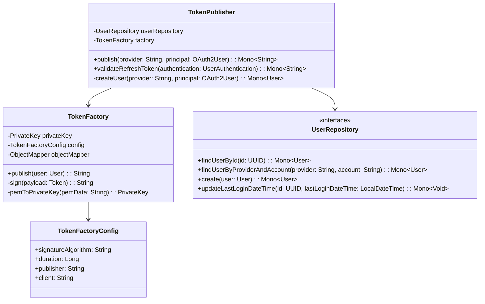
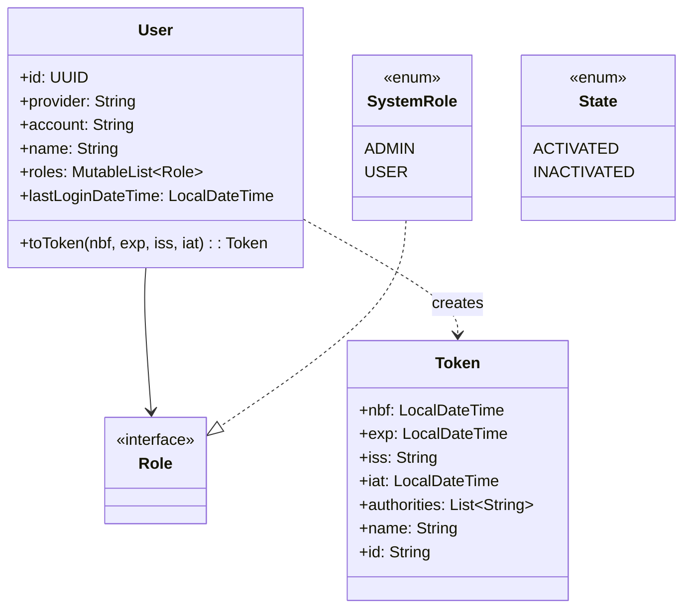
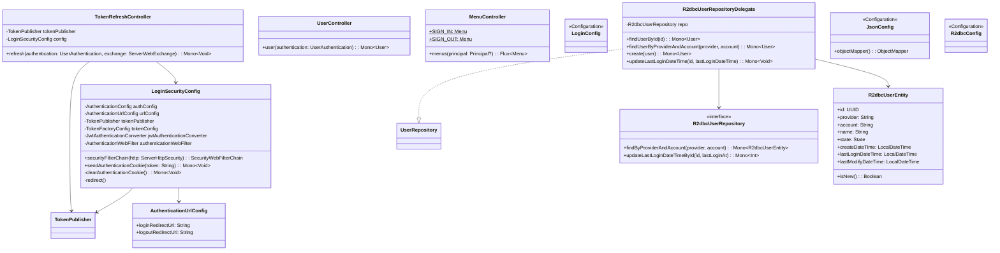

# Login 클래스 다이어그램

## Usecase 계층

## Domain 계층

## Interfaces 계층

## 설계 패턴

| 패턴 | 적용 위치 | 설명 |
|------|----------|------|
| **Port & Adapter (Hexagonal)** | UserRepository | usecase의 포트 인터페이스를 R2dbcUserRepositoryDelegate가 구현 |
| **Factory** | TokenFactory | RSA 개인키와 설정으로 JWT 토큰 생성을 캡슐화 |
| **Cookie-based Authentication** | SecurityConfig | Stateless JWT를 HttpOnly 쿠키로 전달하여 CSRF/XSS 방어 |
| **Auto-Registration** | TokenPublisher.createUser() | OAuth2 최초 로그인 시 자동으로 사용자 생성 (USER 역할 부여) |
| **Delegate** | R2dbcUserRepositoryDelegate | Spring Data R2dbcRepository를 감싸서 도메인 변환 담당 |
