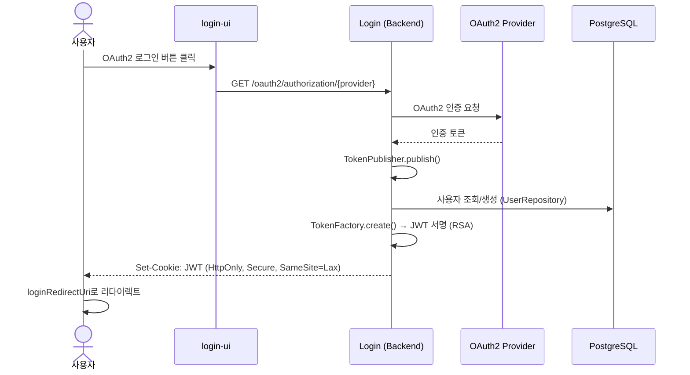

# Login 모듈

OAuth2 인증 백엔드 서비스 (Spring Boot). 사용자 로그인/로그아웃, JWT 토큰 발급/갱신, 사용자 자동 등록을 처리한다.

---

## 인증 흐름



## API 엔드포인트

| Method | Path | 설명 |
|--------|------|------|
| GET | `/oauth2/authorization/{provider}` | OAuth2 인증 리다이렉트 |
| POST | `/oauth2/logout` | 로그아웃 (JWT 쿠키 삭제) |
| GET | `/auth/refresh` | JWT 토큰 갱신 |
| GET | `/menus` | 인증 상태 기반 메뉴 (SIGN_IN / SIGN_OUT) |
| GET | `/user` | 현재 사용자 정보 |

## 보안

- JWT는 `HttpOnly`, `Secure`, `SameSite=Lax` 쿠키로 저장 (XSS/CSRF 방지)
- RSA 개인키(PEM)로 서명, 공개키로 검증 (`authentication` 모듈)
- 만료 토큰 자동 삭제 (`ExpiredTokenExceptionHandler`)
- 최초 OAuth2 로그인 시 USER 역할로 자동 등록

## 사용자 식별 플로우 (Phase 1a — 2026-04-18)

OAuth provider 가 주는 `sub`(외부 ID) 와 `iss`(provider) 조합으로 내부 `users` 테이블을 lookup-or-create → 내부 `user.id`(UUID) 를 확보 → 이 UUID 를 JWT `sub` 클레임에 심어 발행한다. `jti` 는 매 토큰 발행마다 `UUID.randomUUID()` 로 새로 생성된다 (토큰 고유 ID).

```
OAuth provider sub  ─┐
                     ├─ UserRepository.findByProviderAndAccount → 없으면 create
OAuth provider iss  ─┘                                             │
                                                          user.id (UUID) ─┐
                                                                          ├─ JWT sub
                                                          UUID.randomUUID()─ JWT jti
```

소비자(persist-workspace, search-workspace, shell-ui 등) 는 JWT 의 `sub` 클레임(= `UserAuthentication.sub`) 을 사용자 식별자로 사용한다. `jti`는 토큰 감사용이며 사용자 ID 로 사용 금지.

### `users` 테이블 스키마

| 컬럼 | 타입 | 의미 |
|------|------|------|
| `id` | UUID PK | 내부 영구 사용자 식별자 (JWT `sub`) |
| `provider` | TEXT | OAuth provider 식별자 (예: `google`) — 개념적으로 `external_issuer` |
| `account` | TEXT | Provider 내 고유 계정 ID — 개념적으로 `external_sub` |
| `name` | TEXT | 표시명 (provider 가 준 값, 수정 가능) |
| `state` | TEXT | 상태 (`ACTIVATED` 등) |
| `created_at` / `last_login_at` / `last_modified_at` | TIMESTAMP | 감사 시각 |

`(provider, account)` 는 사실상 유니크(`findByProviderAndAccount`). 인프라 DDL 은 `charts/handbook/infrastructure/sql/003_login.sql`.

## 에이전트 연동

1. **내부 assistant 연동** — 직접 REST 호출 없음. 사용자가 assistant 를 호출하기 전에 먼저 OAuth 로그인으로 세션 쿠키를 발급받는다.
2. **외부 AI Tool Use** — `/user`, `/auth/refresh` 는 `/openapi.json` 에 노출. `/oauth2/*`, `/login/oauth2/*` 는 브라우저 플로우 전용이라 비공개.
3. **OpenAPI 어노테이션** — `/user`, `/auth/refresh` 컨트롤러에 springdoc `@Operation` 기입 예정 (TODO).
4. **감사 경로** — 로그인/로그아웃/refresh 시 `AuditEntry` 발행 (`caller_type=USER` 또는 `EXTERNAL_AGENT`). 상세 이벤트 스키마는 [audit.md](../docs/contracts/audit.md).
5. **Agent Command 타겟** — login 모듈은 UI 가 아니므로 navigate/highlight/mutate 타겟 아님.

> 오류 처리는 [error-handling.md](../docs/error-handling.md) 참조.
