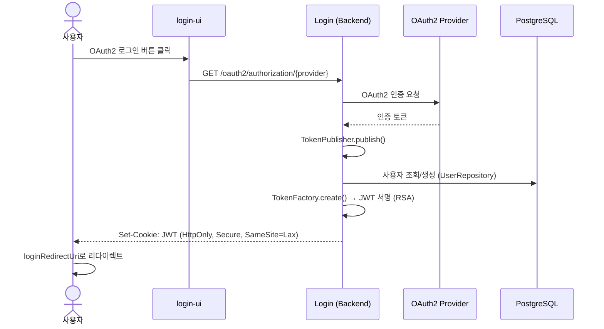

# Login 모듈

OAuth2 인증 백엔드 서비스 (Spring Boot). 사용자 로그인/로그아웃, JWT 토큰 발급/갱신, 사용자 자동 등록을 처리한다.

---

## 인증 흐름

## API 엔드포인트

| Method | Path | 설명 |
|--------|------|------|
| GET | `/oauth2/authorization/{provider}` | OAuth2 인증 리다이렉트 |
| POST | `/oauth2/logout` | 로그아웃 (JWT 쿠키 삭제) |
| GET | `/auth/refresh` | JWT 토큰 갱신 |
| GET | `/menus` | 인증 상태 기반 메뉴 (SIGN_IN / SIGN_OUT) |
| GET | `/user` | 현재 사용자 정보 |

## 보안

- JWT는 `HttpOnly`, `Secure`, `SameSite=Lax` 쿠키로 저장 (XSS/CSRF 방지)
- RSA 개인키(PEM)로 서명, 공개키로 검증 (`authentication` 모듈)
- 만료 토큰 자동 삭제 (`ExpiredTokenExceptionHandler`)
- 최초 OAuth2 로그인 시 USER 역할로 자동 등록

> 오류 처리는 [error-handling.md](../docs/error-handling.md) 참조.
