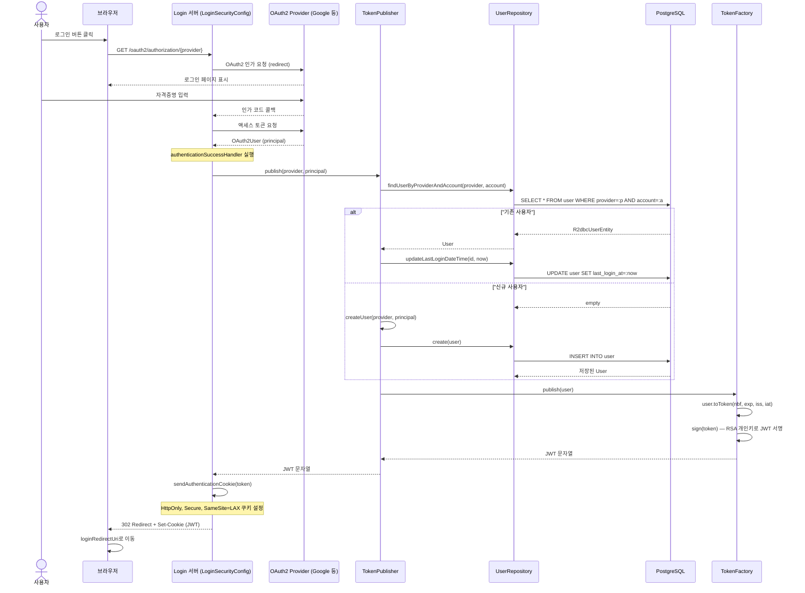
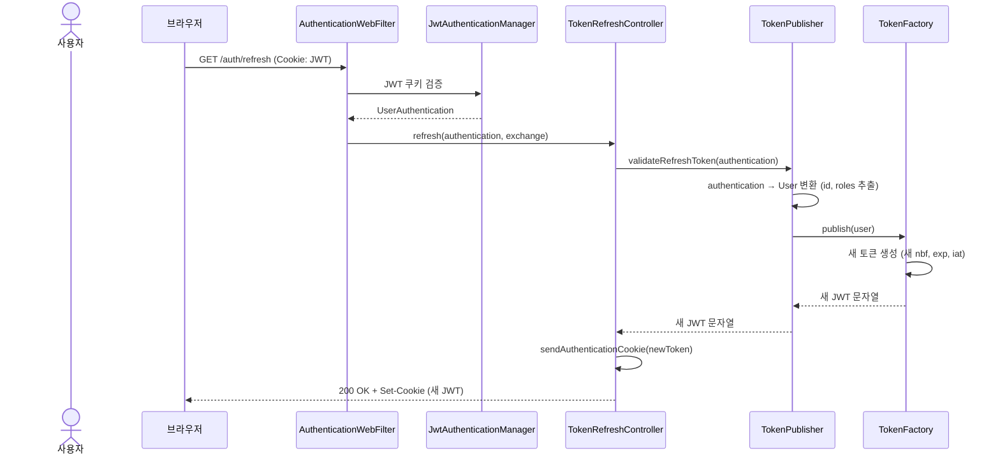
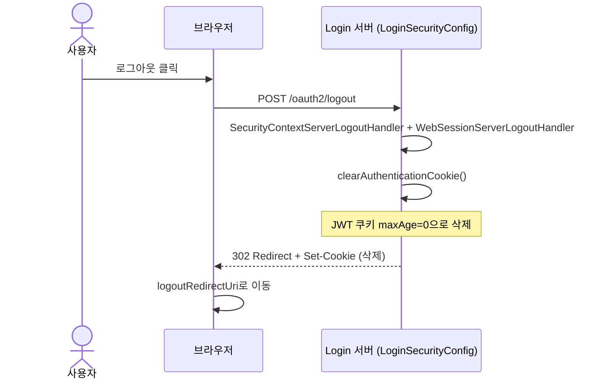
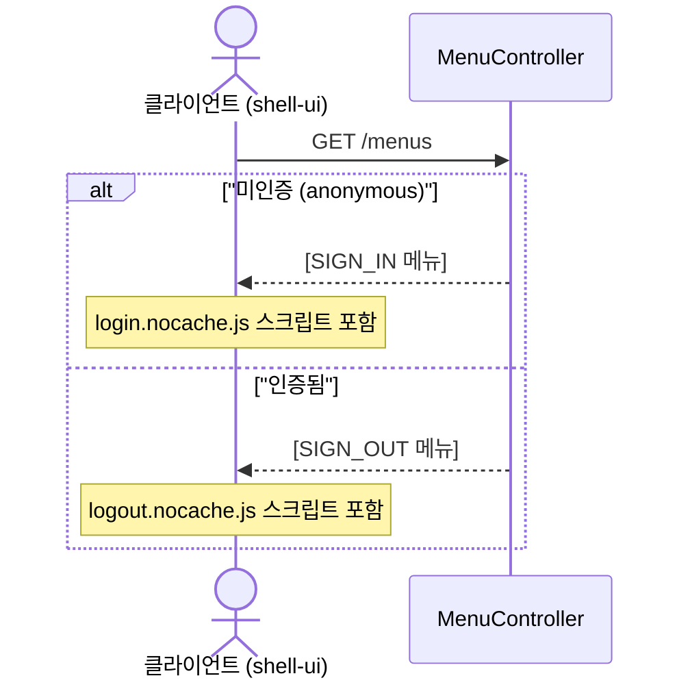

# Login 유스케이스

## OAuth2 로그인 → JWT 발행 시퀀스

## 토큰 갱신 시퀀스

## 로그아웃 시퀀스

## 메뉴 조회 시퀀스

---

## UC-L1: OAuth2 로그인 및 JWT 발행

| 항목 | 내용 |
|------|------|
| **액터** | 사용자 |
| **선행조건** | OAuth2 프로바이더(Google 등) 설정 완료 |
| **정상 흐름** | 1. 사용자가 로그인 버튼을 클릭하여 `/oauth2/authorization/{provider}`로 이동한다. 2. OAuth2 프로바이더에서 인증 후 콜백으로 `OAuth2User`가 반환된다. 3. `LoginSecurityConfig`의 `authenticationSuccessHandler`가 `TokenPublisher.publish()`를 호출한다. 4. `UserRepository`에서 provider+account로 사용자를 조회한다. 5. 기존 사용자면 `lastLoginDateTime`을 갱신하고, 신규면 `USER` 역할로 생성한다. 6. `TokenFactory`가 RSA 개인키로 JWT를 서명하여 발행한다. 7. JWT를 HttpOnly/Secure 쿠키로 설정하고 `loginRedirectUri`로 리다이렉트한다. |
| **결과** | 302 Redirect + JWT 쿠키 설정 |

## UC-L2: 토큰 갱신

| 항목 | 내용 |
|------|------|
| **액터** | 인증된 사용자 |
| **선행조건** | 유효한 JWT 쿠키 보유 |
| **정상 흐름** | 1. 클라이언트가 `GET /auth/refresh`를 요청한다. 2. `AuthenticationWebFilter`가 쿠키의 JWT를 검증하여 `UserAuthentication`을 생성한다. 3. `TokenRefreshController`가 `TokenPublisher.validateRefreshToken()`을 호출한다. 4. 기존 인증 정보(id, roles)에서 새 만료 시간으로 JWT를 재발행한다. 5. 새 JWT를 쿠키로 설정하여 응답한다. |
| **결과** | 200 OK + 갱신된 JWT 쿠키 |

## UC-L3: 로그아웃

| 항목 | 내용 |
|------|------|
| **액터** | 인증된 사용자 |
| **선행조건** | 로그인 상태 |
| **정상 흐름** | 1. 클라이언트가 `POST /oauth2/logout`을 요청한다. 2. `DelegatingServerLogoutHandler`가 SecurityContext와 WebSession을 정리한다. 3. JWT 쿠키를 `maxAge=0`으로 삭제한다. 4. `logoutRedirectUri`로 리다이렉트한다. |
| **결과** | 302 Redirect + JWT 쿠키 삭제 |

## UC-L4: 메뉴 제공

| 항목 | 내용 |
|------|------|
| **액터** | shell-ui |
| **선행조건** | 없음 |
| **정상 흐름** | 1. 클라이언트가 `GET /menus`를 요청한다. 2. 인증 여부에 따라 SIGN_IN 또는 SIGN_OUT 메뉴를 반환한다. 3. 각 메뉴에는 title, icon, script 경로, tools 정보가 포함된다. |
| **결과** | 200 OK + 메뉴 목록 |

---

## 트레이서빌리티 매트릭스

| UC | 시퀀스 다이어그램 | 주요 클래스 | 테스트 |
|----|---|---|---|
| UC-L1 (로그인) | OAuth2 로그인 → JWT 발행 | LoginSecurityConfig, TokenPublisher, TokenFactory, UserRepository, R2dbcUserRepositoryDelegate, R2dbcUserEntity, Token, User | LoginSecurityConfigTest, TokenFactoryTest, TokenPublisherTest, UserRepositoryTest |
| UC-L2 (토큰 갱신) | 토큰 갱신 | TokenRefreshController, LoginSecurityConfig, TokenPublisher, TokenFactory, AuthenticationWebFilter, JwtAuthenticationManager | LoginSecurityConfigTest |
| UC-L3 (로그아웃) | 로그아웃 | LoginSecurityConfig (logout 설정) | LoginSecurityConfigTest |
| UC-L4 (메뉴) | 메뉴 조회 | MenuController, Menu, Tool | MenuControllerTest |
