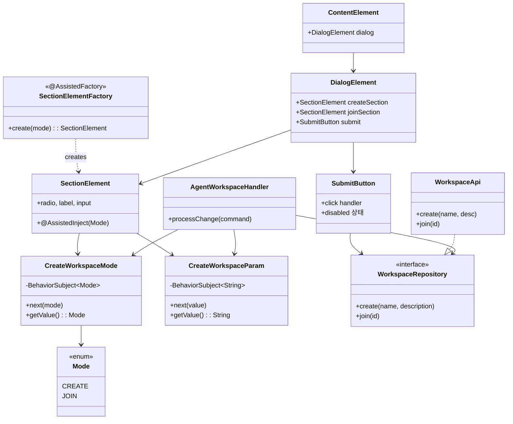
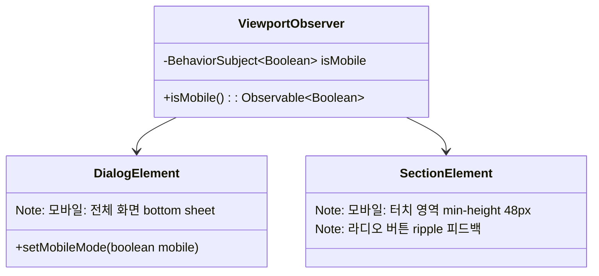

# Onboarding-UI 클래스 다이어그램

## 디자인 패턴

| 패턴 | 적용 클래스 | 설명 |
|------|------------|------|
| **Observer** | `CreateWorkspaceMode`, `CreateWorkspaceParam` | BehaviorSubject로 모드/입력값 변경을 라디오 버튼, 입력 필드, Submit 버튼에 자동 전파. |
| **Factory** | `SectionElementFactory` (@AssistedFactory) | 같은 SectionElement 컴포넌트를 CREATE/JOIN 모드 파라미터만 바꿔 생성. UI 재사용. |
| **Command** | `AgentWorkspaceHandler` | 문자열 명령(WS_MODE, WS_INPUT, WS_SUBMIT, WS_CREATE)을 파싱하여 상태 변경 작업으로 변환. 에이전트의 지시를 UI 조작으로 분리. |
| **Adapter** | `WorkspaceApi` → `WorkspaceRepository` | HTTP 호출(POST)을 Repository 인터페이스로 래핑. FetchApi를 통해 통신 세부사항을 숨김. |

## 모바일 지원

| 클래스 | 모바일 동작 |
|--------|-----------|
| `ViewportObserver` | matchMedia('max-width: 768px') 감지 → 모바일 모드 전달 |
| `DialogElement` | 모바일: 전체 화면 bottom sheet. 키보드 올라올 때 스크롤 조정 |
| `SectionElement` | 라디오 버튼 터치 영역 48px+ 확보. 입력 필드 전체 너비 확장 |
| `SubmitButton` | 모바일: 전체 너비 버튼 |
