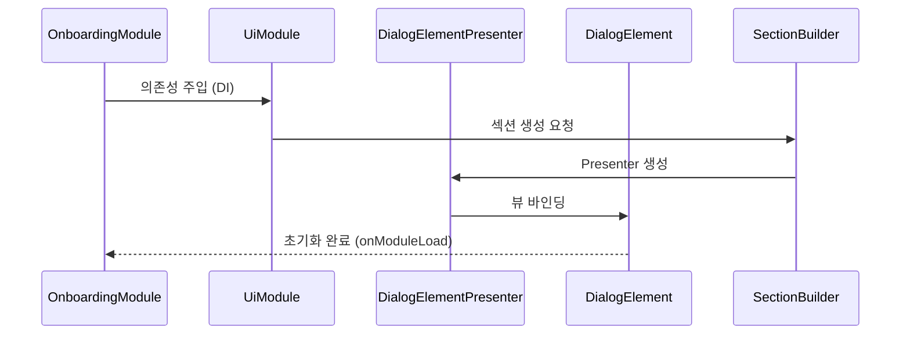
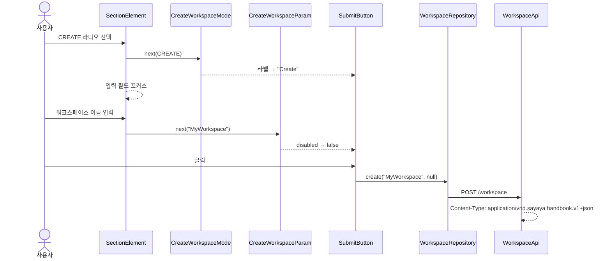
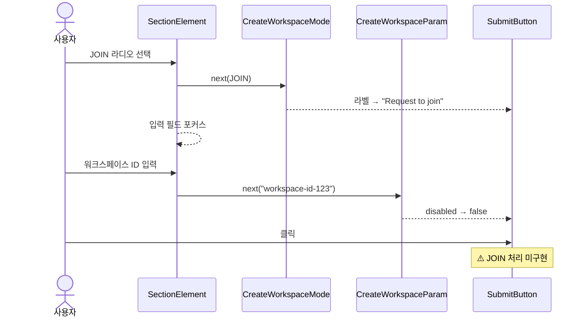
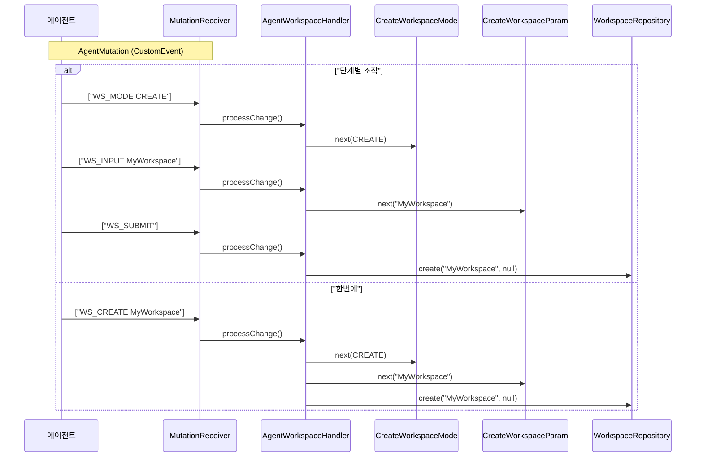
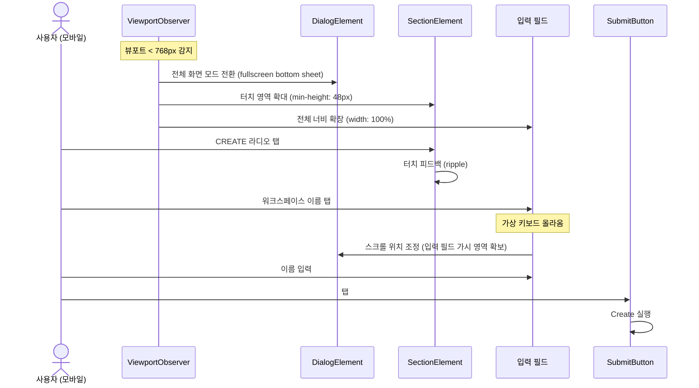

# Onboarding-UI 유스케이스

## 설계 결정 및 패턴

- **Presenter 패턴**: `SectionElement`와 `DialogElement`에 Presenter를 도입하여 View와 로직을 분리.
- **테스트 전략**: 
  - **JVM Unit Test (Kotest)**: 비즈니스 로직 및 Presenter 검증.
  - **GWT Integration Test**: UI 통합 및 컴포넌트 렌더링 검증.

## 모듈 초기화 흐름

## 워크스페이스 생성 시퀀스

## 워크스페이스 참여 요청 시퀀스

## 에이전트 워크스페이스 생성 시퀀스

## UC-W1: 워크스페이스 생성

| 항목 | 내용 |
|------|------|
| **액터** | 사용자 |
| **선행조건** | onboarding-ui 모듈 로딩 완료 |
| **정상 흐름** | 1. CREATE 라디오 버튼을 선택한다. (`CreateWorkspaceMode` → CREATE) 2. 워크스페이스 이름을 입력한다. (`CreateWorkspaceParam` 업데이트) 3. 입력값이 있으면 Submit 버튼이 활성화된다. 4. Submit 클릭 → `WorkspaceRepository.create(name, null)` 호출. 5. `WorkspaceApi`가 `POST /workspace`로 요청을 전송한다. 6. 성공 콜백을 받으면 `WindowUriBridge.navigate("/workspace/{id}/dashboard")`를 호출하여 페이지 새로고침 없이 대시보드로 심리스(Seamless) 전환이 일어난다. |
| **대안 흐름** | 라디오 선택 시 입력 필드에 포커스가 자동 이동. 입력 필드 포커스 시 해당 모드로 자동 전환. |
| **입력 검증** | 워크스페이스 이름: 영숫자+한글+공백+하이픈+언더스코어, 최대 255자. 클라이언트 사이드 검증 + 서버 사이드 검증 이중화. (요구사항 6.5) |

## UC-W2: 워크스페이스 참여 요청

| 항목 | 내용 |
|------|------|
| **액터** | 사용자 |
| **선행조건** | onboarding-ui 모듈 로딩 완료 |
| **정상 흐름** | 1. JOIN 라디오 버튼을 선택한다. (`CreateWorkspaceMode` → JOIN) 2. 워크스페이스 ID를 입력한다. 3. Submit 버튼 라벨이 "Request to join"으로 변경된다. 4. Submit 클릭. |
| **미구현** | ⚠️ JOIN 모드의 `SubmitButton`은 현재 CREATE 모드만 처리하고, JOIN 요청 API(`POST /workspace/{id}/join`)는 미구현. |
| **요구사항** | 6.1 워크스페이스 참여 (JOIN) — POST /workspace/{id}/join 엔드포인트 구현 필요 |

## UC-W3: 에이전트에 의한 워크스페이스 생성

| 항목 | 내용 |
|------|------|
| **액터** | AI 에이전트 |
| **선행조건** | onboarding-ui 모듈 로딩 완료, MutationReceiver 연결 |
| **정상 흐름 (단계별)** | 1. 에이전트가 `WS_MODE CREATE` → `CreateWorkspaceMode`가 CREATE로 전환. 2. `WS_INPUT MyWorkspace` → `CreateWorkspaceParam`에 "MyWorkspace" 설정. 3. `WS_SUBMIT` → CREATE 모드이고 입력값이 있으면 `WorkspaceRepository.create()` 호출. |
| **정상 흐름 (한번에)** | 에이전트가 `WS_CREATE MyWorkspace` → 모드 전환 + 입력 + 생성을 한번에 실행. |
| **브릿지** | `agent-bridge` 모듈의 `AgentMutation`가 CustomEvent로 연결. |

## UC-W4: 에이전트 단계별 UI 조작

| 항목 | 내용 |
|------|------|
| **액터** | AI 에이전트 |
| **지원 명령** | |

| 명령어 | 동작 |
|--------|------|
| `WS_MODE CREATE` | CREATE 모드로 전환 |
| `WS_MODE JOIN` | JOIN 모드로 전환 |
| `WS_INPUT <value>` | 입력 필드에 값 설정 |
| `WS_SUBMIT` | 제출 (CREATE 모드일 때만) |
| `WS_CREATE <name>` | 모드 전환 + 입력 + 생성을 한번에 |

## 모바일 다이얼로그 전환 시퀀스

## UC-W5: 모바일 반응형 레이아웃

| 항목 | 내용 |
|------|------|
| **액터** | 사용자 (모바일/태블릿 디바이스) |
| **선행조건** | 뷰포트 너비 < 768px |
| **정상 흐름** | 1. `ViewportObserver`가 모바일 뷰포트를 감지한다. 2. `DialogElement`가 전체 화면 bottom sheet로 전환된다. 3. 라디오 버튼(CREATE/JOIN)의 터치 영역이 48px 이상으로 확보된다. 4. 입력 필드가 전체 너비로 확장된다. 5. 가상 키보드가 올라올 때 다이얼로그가 스크롤되어 입력 필드가 가려지지 않는다. |

---

## 트레이서빌리티 매트릭스

| UC | 시퀀스 다이어그램 | 클래스 다이어그램 | 주요 클래스 | 테스트 |
|----|---|---|---|---|
| UC-W1 (생성) | 워크스페이스 생성 | 전체 | SectionElement, CreateWorkspaceMode, CreateWorkspaceParam, SubmitButton, WorkspaceRepository, WorkspaceApi | WorkspaceCreateTest: 다이얼로그/섹션 2개/라디오 2개(같은 name)/입력 필드 2개/Submit 존재 + 초기 비활성, CREATE 라디오 + 이름 입력 → Submit 활성화 + 입력값 반영 |
| UC-W2 (참여) | 워크스페이스 참여 요청 | 전체 | SectionElement, CreateWorkspaceMode(JOIN), CreateWorkspaceParam, SubmitButton | WorkspaceJoinTest: JOIN 섹션/라디오/입력 필드 존재, JOIN 선택 → checked + CREATE 해제 + Submit 비활성, 코드 입력 → Submit 활성화, JOIN→CREATE 전환 → Submit 비활성 |
| UC-W3 (에이전트) | 에이전트 워크스페이스 생성 | 전체 | AgentWorkspaceHandler, MutationReceiver, CreateWorkspaceMode, CreateWorkspaceParam, WorkspaceRepository | WorkspaceCreateTest: WS_MODE CREATE 이벤트 → 다이얼로그/섹션 유지 |
| UC-W4 (단계별) | 에이전트 워크스페이스 생성 (alt) | 전체 | AgentWorkspaceHandler(WS_MODE/WS_INPUT/WS_SUBMIT/WS_CREATE) | WorkspaceCreateTest: WS_INPUT 이벤트 → 다이얼로그/Submit 유지 |
| UC-W5 (모바일) | 모바일 다이얼로그 전환 | 전체 | ViewportObserver, DialogElement(fullscreen bottom sheet), SectionElement(touch area 48px+), input(full-width) | WorkspaceCreateTest: 뷰포트 375x667 → 다이얼로그 표시(display!=none), Submit 존재, 입력 필드 2개 유지 |
| UC-W6 (빈 상태 UI) | — | 전체 | EmptyStateElement, SectionElement | ❌ 미구현 (계획) |
| UC-W7 (삭제 확인) | — | 전체 | ConfirmDialog | ❌ 미구현 (계획) |
| UC-W8 (성공 피드백) | — | 전체 | ToastContainer, SubmitButton | ❌ 미구현 (계획) |
EmptyStateElement, SectionElement | ❌ 미구현 (계획) |
| UC-W7 (삭제 확인) | — | 전체 | ConfirmDialog | ❌ 미구현 (계획) |
| UC-W8 (성공 피드백) | — | 전체 | ToastContainer, SubmitButton | ❌ 미구현 (계획) |
