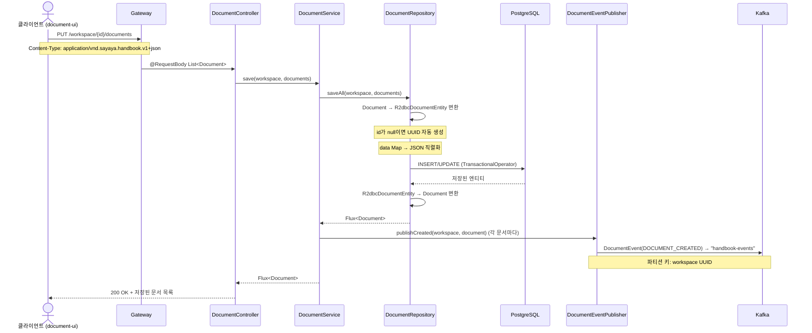
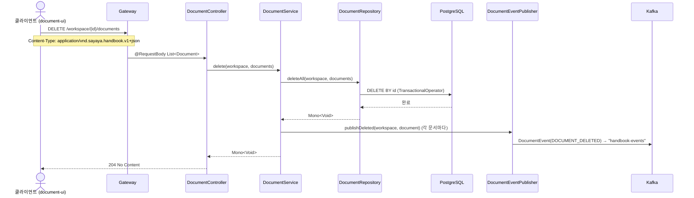
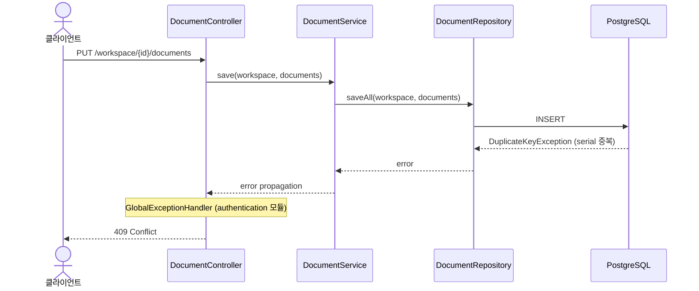

# Persist-Document 유스케이스

## 문서 저장 시퀀스

## 문서 삭제 시퀀스

## 중복 키 에러 시퀀스

---

## UC-PD1: 문서 저장

| 항목 | 내용 |
|------|------|
| **액터** | 사용자 (document-ui 경유) |
| **선행조건** | 워크스페이스 접근 권한 보유 |
| **정상 흐름** | 1. 클라이언트가 `PUT /workspace/{id}/documents`로 문서 목록을 전송한다. 2. `DocumentService.save()`가 `DocumentRepository.saveAll()`을 호출한다. 3. id가 null인 문서는 새 UUID가 할당된다. 4. `data` 필드(Map<String,String?>)는 JSON 문자열로 직렬화되어 저장된다. 5. 저장 후 각 문서에 대해 `DOCUMENT_CREATED` 이벤트가 Kafka로 발행된다. 6. 저장된 문서 목록(id, createDateTime, creator 포함)이 응답으로 반환된다. |
| **대안 흐름** | serial 중복 시 `DuplicateKeyException` → `GlobalExceptionHandler` (authentication 모듈의 `@RestControllerAdvice`)가 409 Conflict 반환. |

## UC-PD2: 문서 삭제

| 항목 | 내용 |
|------|------|
| **액터** | 사용자 (document-ui 경유) |
| **선행조건** | 삭제 대상 문서가 존재 |
| **정상 흐름** | 1. 클라이언트가 `DELETE /workspace/{id}/documents`로 삭제 대상 문서 목록을 전송한다. 2. `DocumentService.delete()`가 `DocumentRepository.deleteAll()`을 호출한다. 3. 트랜잭션 내에서 문서가 삭제된다. 4. 삭제 후 각 문서에 대해 `DOCUMENT_DELETED` 이벤트가 Kafka로 발행된다. 5. 204 No Content가 반환된다. |

## UC-PD3: 이벤트 발행

| 항목 | 내용 |
|------|------|
| **액터** | 시스템 (DocumentService 내부) |
| **선행조건** | 문서 저장 또는 삭제 완료 |
| **정상 흐름** | 1. `KafkaDocumentEventPublisher`가 `DocumentEvent`를 생성한다. 2. `"handbook-events"` 토픽에 workspace UUID를 파티션 키로 발행한다. 3. `event-broadcaster`가 이벤트를 수신하여 SSE로 UI에 전파한다. |

## UC-PD4: 문서 가져오기 (계획)

| 항목 | 내용 |
|------|------|
| **액터** | 사용자 (document-ui 또는 외부 시스템 경유) |
| **선행조건** | 워크스페이스 접근 권한 보유, 대상 타입이 정의됨 |
| **정상 흐름** | 1. 클라이언트가 `POST /workspace/{id}/documents/import`로 CSV 또는 JSON 형식의 파일을 업로드한다. 2. 시스템이 파일을 파싱하고, 대상 타입의 스키마에 맞게 컬럼/필드를 자동 매핑한다. 3. 매핑 성공 항목은 `DocumentService.save()`를 통해 일괄 저장한다. 4. 저장된 각 문서에 대해 `DOCUMENT_CREATED` 이벤트가 Kafka로 발행된다. 5. 처리 결과(성공 건수, 실패 건수, 매핑 실패 상세)가 응답으로 반환된다. |
| **대안 흐름** | 매핑 실패 항목은 사용자에게 확인을 요청하거나, 오류 목록으로 반환한다. 지원하지 않는 형식 요청 시 400 Bad Request. |
| **요구사항** | 3.12 API 접근성 — CSV/JSON 파일을 통한 문서 일괄 임포트 |

---

## 트레이서빌리티 매트릭스

| UC | 시퀀스 다이어그램 | 주요 클래스 | 테스트 |
|----|---|---|---|
| UC-PD1 (저장) | 문서 저장 | DocumentController, DocumentService, DocumentRepository, R2dbcDocumentEntity, R2dbcDocumentRepositoryAdapter, KafkaDocumentEventPublisher | DocumentServiceTest, DocumentControllerTest |
| UC-PD2 (삭제) | 문서 삭제 | DocumentController, DocumentService, DocumentRepository, R2dbcDocumentRepositoryAdapter, KafkaDocumentEventPublisher | DocumentServiceTest, DocumentControllerTest |
| UC-PD3 (이벤트) | 문서 저장/삭제 (후반) | KafkaDocumentEventPublisher, DocumentEvent | DocumentServiceTest |
| UC-PD4 (가져오기) | — | ImportController (계획), DocumentService, CsvParser/JsonParser (계획) | ❌ 미구현 (계획) |
