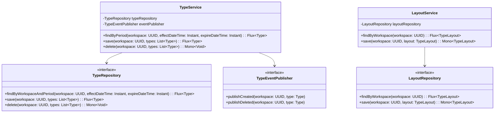

# Persist-Type 클래스 다이어그램

## Usecase 계층

## Interfaces 계층

```mermaid
classDiagram
    class TypeController {
        -TypeService typeService
        +findByPeriod(workspace: UUID, effectDateTime: Instant, expireDateTime: Instant): Flux~Type~
        +save(workspace: UUID, types: List~Type~): Flux~Type~
        +delete(workspace: UUID, types: List~Type~): Mono~Void~
    }

    class LayoutController {
        -LayoutService layoutService
        +findByWorkspace(workspace: UUID): Flux~TypeLayout~
        +save(workspace: UUID, layout: TypeLayout): Mono~TypeLayout~
    }

    class R2dbcTypeEntity {
        +id: String
        +version: String
        +workspace: UUID
        +effectDateTime: Instant
        +expireDateTime: Instant
        +description: String?
        +primitive: Boolean
        +parent: String?
        +rev: Long? «@Version»
        +toDomain(attributes): Type
        +fromDomain(workspace, type)$ R2dbcTypeEntity
    }

    class R2dbcAttributeEntity {
        +id: UUID?
        +typeId: String
        +typeVersion: String
        +workspace: UUID
        +name: String
        +order: Short
        +description: String?
        +attributeType: String «JSONB»
        +nullable: Boolean
        +inherited: Boolean
    }

    class R2dbcTypeEntityRepository {
        <<interface>>
        +findByWorkspaceAndPeriod(workspace, effectDateTime, expireDateTime): Flux~R2dbcTypeEntity~
    }

    class R2dbcAttributeEntityRepository {
        <<interface>>
        +findByTypeIdAndTypeVersion(typeId, typeVersion): Flux~R2dbcAttributeEntity~
        +findByWorkspaceAndTypeIdIn(workspace, typeIds): Flux~R2dbcAttributeEntity~
        +deleteByTypeIdAndTypeVersion(typeId, typeVersion): Mono~Void~
    }

    class R2dbcTypeRepositoryAdapter {
        -R2dbcTypeEntityRepository typeRepo
        -R2dbcAttributeEntityRepository attrRepo
        -ObjectMapper objectMapper
        -TransactionalOperator tx
        +findByWorkspaceAndPeriod(workspace, effectDateTime, expireDateTime): Flux~Type~
        +save(workspace, types): Flux~Type~
        +delete(workspace, types): Mono~Void~
        -saveOne(workspace, type): Mono~Type~
    }

    class R2dbcLayoutEntity {
        +id: UUID
        +workspace: UUID
        +effectDateTime: Instant
        +expireDateTime: Instant
        +positions: String? «JSONB»
        +toDomain(positionsMap): TypeLayout
        +fromDomain(layout, positionsJson)$ R2dbcLayoutEntity
    }

    class R2dbcLayoutEntityRepository {
        <<interface>>
        +findByWorkspace(workspace: UUID): Flux~R2dbcLayoutEntity~
    }

    class R2dbcLayoutRepositoryAdapter {
        -R2dbcLayoutEntityRepository repository
        -ObjectMapper objectMapper
        +findByWorkspace(workspace): Flux~TypeLayout~
        +save(workspace, layout): Mono~TypeLayout~
    }

    class KafkaTypeEventPublisher {
        -KafkaTemplate kafkaTemplate
        -ObjectMapper objectMapper
        -String topic
        +publishCreated(workspace, type)
        +publishDeleted(workspace, type)
    }

    class TypeConfig {
        <<Configuration>>
        +objectMapper(): ObjectMapper
        +typeRepositoryAdapter(): R2dbcTypeRepositoryAdapter
        +layoutRepositoryAdapter(): R2dbcLayoutRepositoryAdapter
        +typeEventPublisher(): TypeEventPublisher
        +typeService(): TypeService
        +layoutService(): LayoutService
    }

    TypeController --> TypeService
    LayoutController --> LayoutService
    R2dbcTypeRepositoryAdapter ..|> TypeRepository
    R2dbcTypeRepositoryAdapter --> R2dbcTypeEntityRepository
    R2dbcTypeRepositoryAdapter --> R2dbcAttributeEntityRepository
    R2dbcTypeRepositoryAdapter --> R2dbcTypeEntity
    R2dbcTypeRepositoryAdapter --> R2dbcAttributeEntity
    R2dbcLayoutRepositoryAdapter ..|> LayoutRepository
    R2dbcLayoutRepositoryAdapter --> R2dbcLayoutEntityRepository
    R2dbcLayoutRepositoryAdapter --> R2dbcLayoutEntity
    KafkaTypeEventPublisher ..|> TypeEventPublisher
    TypeConfig ..> R2dbcTypeRepositoryAdapter : creates
    TypeConfig ..> R2dbcLayoutRepositoryAdapter : creates
    TypeConfig ..> KafkaTypeEventPublisher : creates
    TypeConfig ..> TypeService : creates
    TypeConfig ..> LayoutService : creates
```

## 설계 패턴

| 패턴 | 적용 위치 | 설명 |
|------|----------|------|
| **Port & Adapter (Hexagonal)** | TypeRepository, LayoutRepository, TypeEventPublisher | usecase의 포트 인터페이스를 interfaces에서 구현 |
| **Transaction Script** | TypeService, LayoutService | 비즈니스 로직을 순수 클래스로 구현, Spring 어노테이션 없음 |
| **Domain Event** | KafkaTypeEventPublisher | 저장/삭제 후 Kafka 이벤트 발행으로 시스템 간 느슨한 결합 |
| **Optimistic Locking** | R2dbcTypeEntity (@Version) | 동시 편집 충돌 방지 |
| **Replace-and-Insert** | R2dbcTypeRepositoryAdapter.saveOne() | 속성 저장 시 기존 속성 전체 삭제 후 재삽입하여 일관성 보장 |
