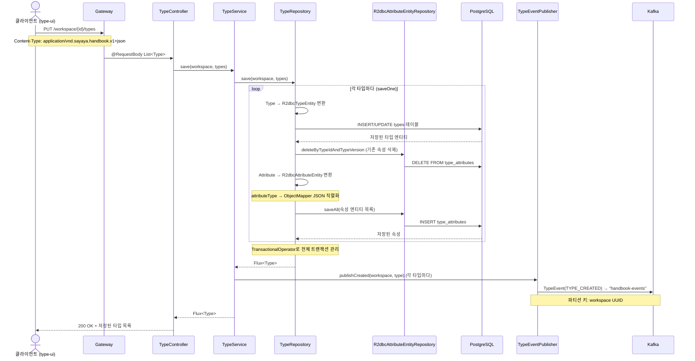
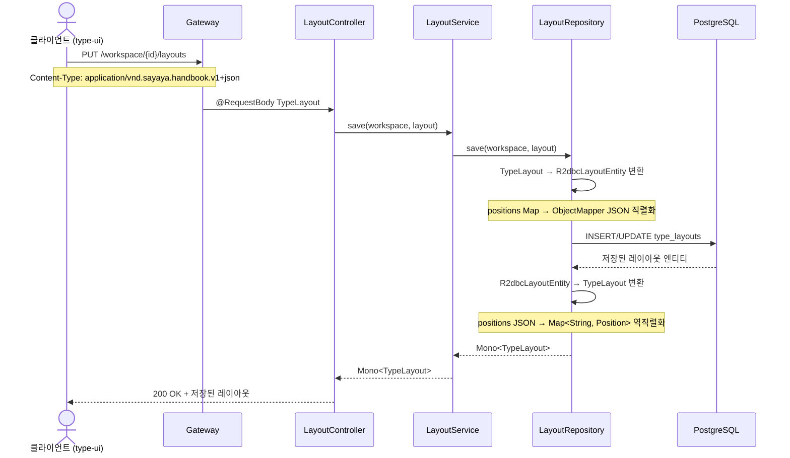
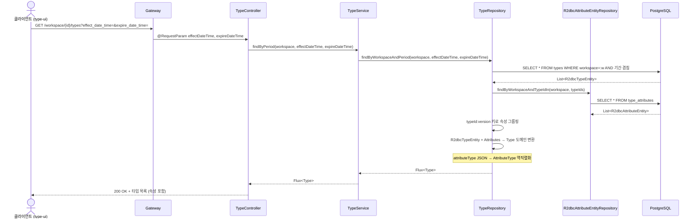

# Persist-Type 유스케이스

## 타입 저장 시퀀스

## 타입 삭제 시퀀스

## 레이아웃 저장 시퀀스

## 타입 조회 시퀀스

---

## UC-PT1: 타입 조회 (기간별)

| 항목 | 내용 |
|------|------|
| **액터** | 사용자 (type-ui 경유) |
| **선행조건** | 워크스페이스 접근 권한 보유 |
| **정상 흐름** | 1. 클라이언트가 `GET /workspace/{id}/types?effect_date_time=&expire_date_time=`로 기간을 전달한다. 2. `TypeService.findByPeriod()`가 `TypeRepository.findByWorkspaceAndPeriod()`를 호출한다. 3. 타입 테이블에서 기간이 겹치는 타입을 조회하고, 해당 타입의 속성을 일괄 조회한다. 4. `attributeType` JSONB를 `AttributeType`으로 역직렬화하여 도메인 객체로 변환한다. 5. 속성이 포함된 타입 목록이 응답으로 반환된다. |
| **결과** | 200 OK + 기간에 해당하는 타입 목록 (속성 포함) |

## UC-PT2: 타입 저장

| 항목 | 내용 |
|------|------|
| **액터** | 사용자 (type-ui 경유) |
| **선행조건** | 워크스페이스 접근 권한 보유 |
| **정상 흐름** | 1. 클라이언트가 `PUT /workspace/{id}/types`로 타입 목록을 전송한다. 2. `TypeService.save()`가 `TypeRepository.save()`를 호출한다. 3. 각 타입마다 `R2dbcTypeEntity`로 변환하여 types 테이블에 upsert한다. 4. 기존 속성을 삭제하고(`deleteByTypeIdAndTypeVersion`) 새 속성을 일괄 삽입한다. 5. `attributeType`은 `ObjectMapper`로 JSON 직렬화하여 JSONB 컬럼에 저장된다. 6. 전체 과정이 `TransactionalOperator`로 트랜잭션 관리된다. 7. 저장 후 각 타입에 대해 `TYPE_CREATED` 이벤트가 Kafka로 발행된다. 8. 저장된 타입 목록이 응답으로 반환된다. |
| **결과** | 200 OK + 저장된 타입 목록 |

## UC-PT3: 타입 삭제

| 항목 | 내용 |
|------|------|
| **액터** | 사용자 (type-ui 경유) |
| **선행조건** | 삭제 대상 타입이 존재 |
| **정상 흐름** | 1. 클라이언트가 `DELETE /workspace/{id}/types`로 삭제 대상 타입 목록을 전송한다. 2. `TypeService.delete()`가 `TypeRepository.delete()`를 호출한다. 3. 각 타입마다 속성을 먼저 삭제하고(`deleteByTypeIdAndTypeVersion`), 타입을 삭제한다. 4. 전체 과정이 `TransactionalOperator`로 트랜잭션 관리된다. 5. 삭제 후 각 타입에 대해 `TYPE_DELETED` 이벤트가 Kafka로 발행된다. 6. 204 No Content가 반환된다. |
| **결과** | 204 No Content |

## UC-PT4: 레이아웃 기간 목록 조회

| 항목 | 내용 |
|------|------|
| **액터** | 사용자 (type-ui 경유) |
| **선행조건** | 워크스페이스 접근 권한 보유 |
| **정상 흐름** | 1. 클라이언트가 `GET /workspace/{id}/layouts`로 요청한다. 2. `LayoutService.findByWorkspace()`가 `LayoutRepository.findByWorkspace()`를 호출한다. 3. type_layouts 테이블에서 워크스페이스의 모든 레이아웃을 조회한다. 4. `positions` JSONB를 `Map<String, Position>`으로 역직렬화한다. 5. `TypeLayout` 목록이 응답으로 반환된다. |
| **결과** | 200 OK + 레이아웃 기간 목록 |

## UC-PT5: 레이아웃 저장

| 항목 | 내용 |
|------|------|
| **액터** | 사용자 (type-ui 경유) |
| **선행조건** | 워크스페이스 접근 권한 보유 |
| **정상 흐름** | 1. 클라이언트가 `PUT /workspace/{id}/layouts`로 레이아웃을 전송한다. 2. `LayoutService.save()`가 `LayoutRepository.save()`를 호출한다. 3. `positions` Map을 `ObjectMapper`로 JSON 직렬화하여 JSONB 컬럼에 저장한다. 4. 저장된 레이아웃이 응답으로 반환된다. |
| **결과** | 200 OK + 저장된 레이아웃 |

## UC-PT6: 타입 이벤트 발행

| 항목 | 내용 |
|------|------|
| **액터** | 시스템 (TypeService 내부) |
| **선행조건** | 타입 저장 또는 삭제 완료 |
| **정상 흐름** | 1. `KafkaTypeEventPublisher`가 `TypeEvent`를 생성한다. 2. `"handbook-events"` 토픽에 workspace UUID를 파티션 키로 발행한다. 3. `event-broadcaster`가 이벤트를 수신하여 SSE로 UI에 전파한다. |

---

## 트레이서빌리티 매트릭스

| UC | 시퀀스 다이어그램 | 주요 클래스 | 테스트 |
|----|---|---|---|
| UC-PT1 (조회) | 타입 조회 | TypeController, TypeService, TypeRepository, R2dbcTypeRepositoryAdapter, R2dbcAttributeEntityRepository | - |
| UC-PT2 (저장) | 타입 저장 | TypeController, TypeService, TypeRepository, R2dbcTypeRepositoryAdapter, R2dbcTypeEntity, R2dbcAttributeEntity, R2dbcAttributeEntityRepository, KafkaTypeEventPublisher | - |
| UC-PT3 (삭제) | 타입 삭제 | TypeController, TypeService, TypeRepository, R2dbcTypeRepositoryAdapter, R2dbcAttributeEntityRepository, KafkaTypeEventPublisher | - |
| UC-PT4 (레이아웃 조회) | — (단순) | LayoutController, LayoutService, LayoutRepository, R2dbcLayoutRepositoryAdapter, R2dbcLayoutEntity | - |
| UC-PT5 (레이아웃 저장) | 레이아웃 저장 | LayoutController, LayoutService, LayoutRepository, R2dbcLayoutRepositoryAdapter, R2dbcLayoutEntity | - |
| UC-PT6 (이벤트) | 타입 저장/삭제 (후반) | KafkaTypeEventPublisher, TypeEvent | - |
