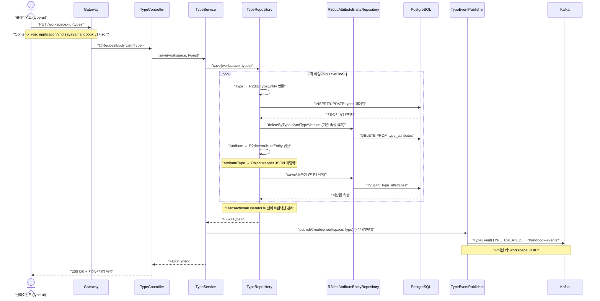
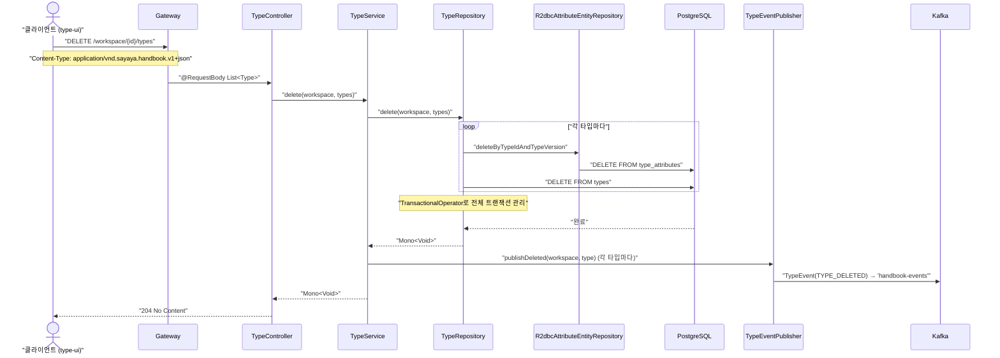
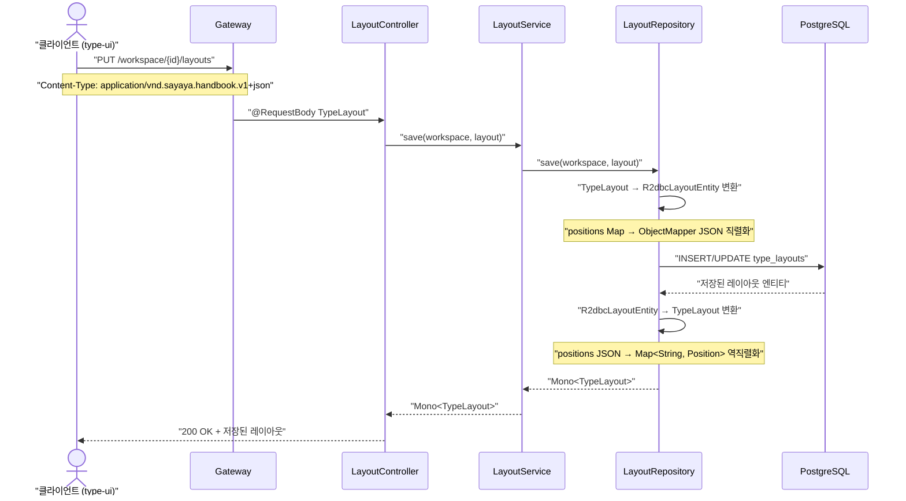
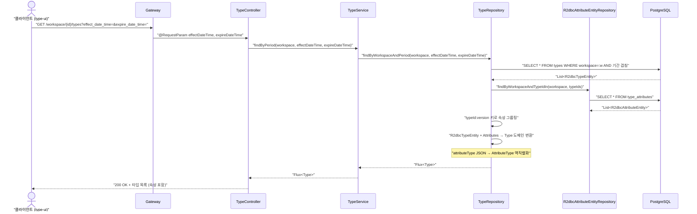

# Persist-Type 유스케이스

## 타입 저장 시퀀스

## 타입 삭제 시퀀스

## 레이아웃 저장 시퀀스

## 타입 조회 시퀀스

---

...
| UC-PT5 (레이아웃 저장) | 레이아웃 저장 | LayoutController, LayoutService, LayoutRepository, R2dbcLayoutRepositoryAdapter, R2dbcLayoutEntity | - |
| UC-PT6 (이벤트) | 타입 저장/삭제 (후반) | KafkaTypeEventPublisher, TypeEvent | - |
