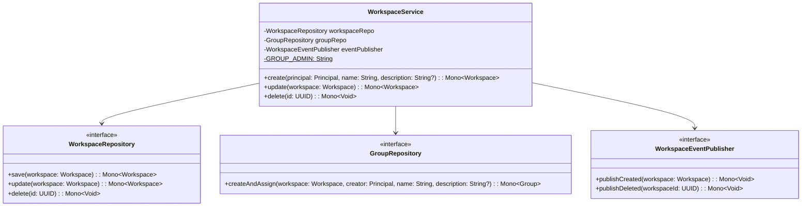

# Persist-Workspace 클래스 다이어그램

## Usecase 계층

## Interfaces 계층

```mermaid
classDiagram
    class WorkspaceController {
        -WorkspaceService svc
        +create(principal: Principal, param: CreateWorkspaceRequest): Mono~Workspace~
        +update(id: UUID, param: UpdateWorkspaceRequest): Mono~Workspace~
        +delete(id: UUID): Mono~Void~
    }

    class MenuController {
        +MENU: Menu$
        +menus(): Flux~Menu~
    }

    class R2dbcWorkspaceEntity {
        +id: UUID
        +name: String
        +description: String?
        +version: Long? «@Version»
        +createdAt: Instant «@CreatedDate»
        +createdBy: UUID «@CreatedBy»
        +lastModifiedAt: Instant «@LastModifiedDate»
        +lastModifiedBy: UUID «@LastModifiedBy»
    }

    class R2dbcWorkspaceRepositoryAdapter {
        -R2dbcEntityTemplate template
        +save(workspace): Mono~Workspace~
        +update(workspace): Mono~Workspace~
        +delete(id): Mono~Void~
    }

    class R2dbcGroupEntity {
        +workspace: UUID
        +name: String
        +createdAt: Instant «@CreatedDate»
        +createdBy: UUID «@CreatedBy»
    }

    class R2dbcGroupMemberEntity {
        +workspace: UUID
        +group: String
        +member: UUID
    }

    class R2dbcGroupRepositoryAdapter {
        -R2dbcEntityTemplate template
        +createAndAssign(workspace, creator, name, description): Mono~Group~
    }

    class KafkaWorkspaceEventPublisher {
        -StreamBridge streamBridge
        +publishCreated(workspace): Mono~Void~
        +publishDeleted(workspaceId): Mono~Void~
    }

    class WorkspaceConfig {
        <<@Configuration>>
        +workspaceService(workspaceRepo, groupRepo, eventPublisher): WorkspaceService
    }

    WorkspaceController --> WorkspaceService
    R2dbcWorkspaceRepositoryAdapter ..|> WorkspaceRepository
    R2dbcWorkspaceRepositoryAdapter --> R2dbcWorkspaceEntity
    R2dbcGroupRepositoryAdapter ..|> GroupRepository
    R2dbcGroupRepositoryAdapter --> R2dbcGroupEntity
    R2dbcGroupRepositoryAdapter --> R2dbcGroupMemberEntity
    KafkaWorkspaceEventPublisher ..|> WorkspaceEventPublisher
    WorkspaceConfig ..> WorkspaceService : creates
```

## 설계 패턴

| 패턴 | 적용 위치 | 설명 |
|------|----------|------|
| **Port & Adapter (Hexagonal)** | WorkspaceRepository, GroupRepository, WorkspaceEventPublisher | usecase의 포트 인터페이스를 interfaces에서 구현 |
| **Transaction Script** | WorkspaceService | 비즈니스 로직을 순수 클래스로 구현, Spring 어노테이션 없음 |
| **Domain Event** | KafkaWorkspaceEventPublisher | StreamBridge를 통해 워크스페이스 생성/삭제 이벤트 발행 |
| **Optimistic Locking** | R2dbcWorkspaceEntity (@Version) | 동시 편집 충돌 방지 |
| **Auditing** | R2dbcWorkspaceEntity (@CreatedDate, @CreatedBy) | Spring Data R2DBC 감사 기능으로 생성/수정 이력 자동 기록 |
| **Menu Provider** | MenuController | Gateway가 수집하는 메뉴 정보 제공 |
