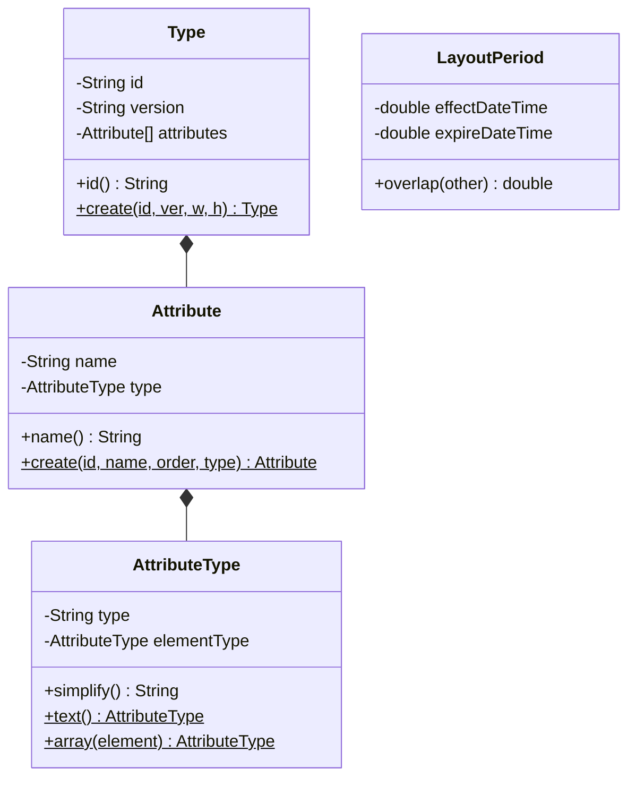

# Schema 클래스 다이어그램

## 도메인 모델 (Shared)

```mermaid
classDiagram
    class Type {
        -String id
        -String version
        -Attribute[] attributes
        +id() String
        +create(id, ver, w, h)$ Type
    }
    class Attribute {
        -String name
        -AttributeType type
        +name() String
        +create(id, name, order, type)$ Attribute
    }
    class AttributeType {
        -String type
        -AttributeType elementType
        +simplify() String
        +text()$ AttributeType
        +array(element)$ AttributeType
    }
    class LayoutPeriod {
        -double effectDateTime
        -double expireDateTime
        +overlap(other) double
    }

    Type *-- Attribute
    Attribute *-- AttributeType
```
