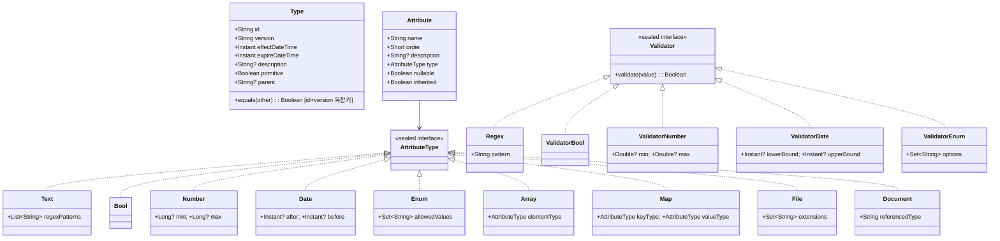

# Schema 클래스 다이어그램

```mermaid
classDiagram
    class Type {
        +String id
        +String version
        +Instant effectDateTime
        +Instant expireDateTime
        +String? description
        +Boolean primitive
        +String? parent
        +equals(other): Boolean [id+version 복합키]
    }

    class Attribute {
        +String name
        +Short order
        +String? description
        +AttributeType type
        +Boolean nullable
        +Boolean inherited
    }

    class AttributeType {
        <<sealed interface>>
    }
    class Text { +List~String~ regexPatterns }
    class Bool
    class Number { +Long? min; +Long? max }
    class Date { +Instant? after; +Instant? before }
    class Enum { +Set~String~ allowedValues }
    class Array { +AttributeType elementType }
    class Map { +AttributeType keyType; +AttributeType valueType }
    class File { +Set~String~ extensions }
    class Document { +String referencedType }

    AttributeType <|.. Text
    AttributeType <|.. Bool
    AttributeType <|.. Number
    AttributeType <|.. Date
    AttributeType <|.. Enum
    AttributeType <|.. Array
    AttributeType <|.. Map
    AttributeType <|.. File
    AttributeType <|.. Document

    Attribute --> AttributeType

    class Validator {
        <<sealed interface>>
        +validate(value): Boolean
    }
    class Regex { +String pattern }
    class ValidatorBool
    class ValidatorNumber { +Double? min; +Double? max }
    class ValidatorDate { +Instant? lowerBound; +Instant? upperBound }
    class ValidatorEnum { +Set~String~ options }

    Validator <|.. Regex
    Validator <|.. ValidatorBool
    Validator <|.. ValidatorNumber
    Validator <|.. ValidatorDate
    Validator <|.. ValidatorEnum
```
