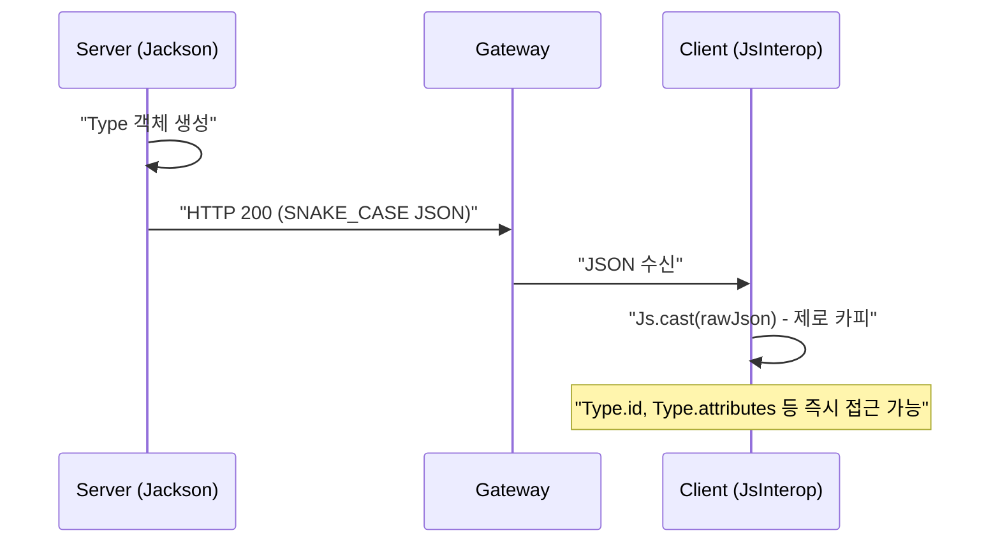

# Schema 유스케이스

## UC-S1: 타입 스키마 제로 카피 로드

백엔드에서 발행된 타입 스키마 정보를 프론트엔드에서 변환 없이 즉시 사용한다.

## UC-S2: 레이아웃 기간 중첩 계산

새로운 레이아웃을 생성하거나 수정할 때, 기존 레이아웃과의 유효 기간 중첩을 계산하여 유효성을 검증한다.

| 단계 | 동작 | 비고 |
|------|------|------|
| 1 | `LayoutPeriod.of(start, end)` 객체 생성 | — |
| 2 | `p1.overlap(p2)` 호출 | 도메인 로직 실행 |
| 3 | `Math.max(0, end - start)` 결과 반환 | 0보다 크면 중첩 발생 |

## 트레이서빌리티 매트릭스

| 유스케이스 | 목적 | 관련 클래스 | 테스트 케이스 |
|------------|------|-------------|--------------|
| UC-S1 | 성능 및 정합성 보장 | `Type`, `Attribute` | `SchemaDomainTest`: Type 데이터 할당 확인 |
| UC-S2 | 데이터 무결성 보호 | `LayoutPeriod` | `SchemaDomainTest`: overlap 계산 로그 확인 |
| UC-S3 | 타입 명칭 표준화 | `AttributeType` | `SchemaDomainTest`: simplify 결과 로그 확인 |
