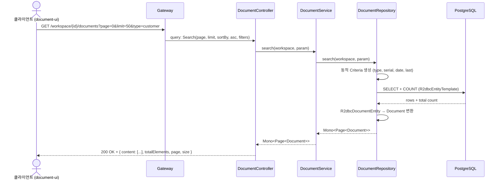
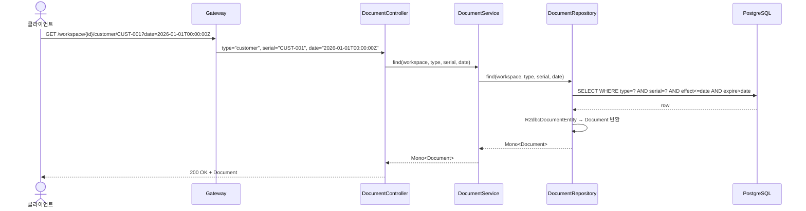
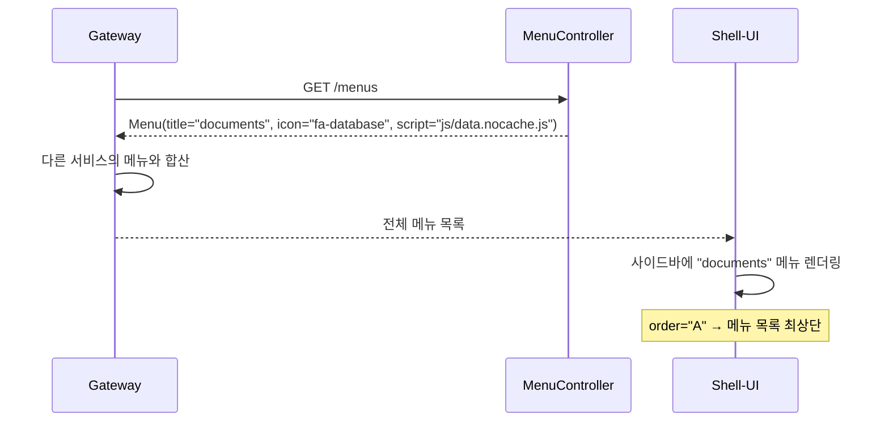

# Search-Document 유스케이스

## 문서 검색 시퀀스

## 문서 단건 조회 시퀀스

## 메뉴 제공 시퀀스

---

## UC-SD1: 문서 검색

| 항목 | 내용 |
|------|------|
| **액터** | 사용자 (document-ui 경유) |
| **선행조건** | 워크스페이스 접근 권한 보유, 문서 타입 선택 |
| **정상 흐름** | 1. 클라이언트가 `GET /workspace/{id}/documents`에 검색 파라미터를 전송한다. 2. `DocumentService.search()`가 `DocumentRepository.search()`를 호출한다. 3. 동적 Criteria로 필터링 (type, serial, date, last)하고 페이지네이션한다. 4. `Page<Document>`가 반환된다 (content, totalElements, page, size). |
| **대안 흐름** | 필터 없이 호출 시 전체 문서 목록 반환. 잘못된 파라미터 시 400 Bad Request. |

## UC-SD2: 문서 단건 조회

| 항목 | 내용 |
|------|------|
| **액터** | 사용자 또는 시스템 |
| **선행조건** | 타입과 serial을 알고 있음 |
| **정상 흐름** | 1. `GET /workspace/{id}/{type}/{serial}`로 요청한다. 2. date 파라미터가 있으면 해당 시점의 문서를, 없으면 현재 시점의 문서를 반환한다. 3. 문서의 `data` 필드(속성 맵)가 포함된 응답이 반환된다. |
| **대안 흐름** | 문서를 찾을 수 없으면 404 Not Found. |

## UC-SD3: 메뉴 제공

| 항목 | 내용 |
|------|------|
| **액터** | Gateway (시스템) |
| **선행조건** | search-document 서비스 실행 중 |
| **정상 흐름** | 1. Gateway가 `GET /menus`를 호출한다. 2. `MenuController`가 documents 메뉴 정보를 반환한다. 3. title="documents", icon="fa-database", order="A", script="js/data.nocache.js". 4. Gateway가 다른 서비스의 메뉴와 합산하여 Shell에 전달한다. |

---

## 트레이서빌리티 매트릭스

| UC | 시퀀스 다이어그램 | 주요 클래스 | 테스트 |
|----|---|---|---|
| UC-SD1 (검색) | 문서 검색 | DocumentController, DocumentService, DocumentRepository, R2dbcDocumentRepository, Search | DocumentServiceTest, DocumentControllerTest |
| UC-SD2 (단건) | 문서 단건 조회 | DocumentController, DocumentService, DocumentRepository | DocumentControllerTest |
| UC-SD3 (메뉴) | 메뉴 제공 | MenuController, Menu, Tool | MenuControllerTest |
