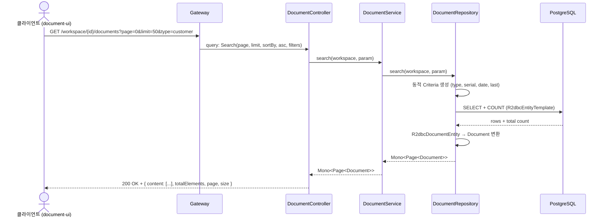
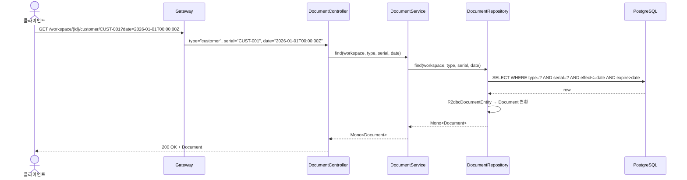
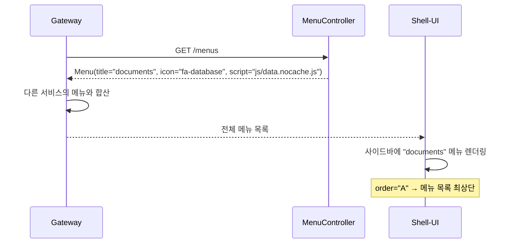

# Search-Document 유스케이스

## 문서 검색 시퀀스

## 문서 단건 조회 시퀀스

## 메뉴 제공 시퀀스

---

## UC-SD1: 문서 검색

| 항목 | 내용 |
|------|------|
| **액터** | 사용자 (document-ui 경유) |
| **선행조건** | 워크스페이스 접근 권한 보유, 문서 타입 선택 |
| **정상 흐름** | 1. 클라이언트가 `GET /workspace/{id}/documents`에 검색 파라미터를 전송한다. 2. `DocumentService.search()`가 `DocumentRepository.search()`를 호출한다. 3. 동적 Criteria로 필터링 (type, serial, date, last)하고 페이지네이션한다. 4. `Page<Document>`가 반환된다 (content, totalElements, page, size). |
| **대안 흐름** | 필터 없이 호출 시 전체 문서 목록 반환. 잘못된 파라미터 시 400 Bad Request. |

## UC-SD2: 문서 단건 조회

| 항목 | 내용 |
|------|------|
| **액터** | 사용자 또는 시스템 |
| **선행조건** | 타입과 serial을 알고 있음 |
| **정상 흐름** | 1. `GET /workspace/{id}/{type}/{serial}`로 요청한다. 2. date 파라미터가 있으면 해당 시점의 문서를, 없으면 현재 시점의 문서를 반환한다. 3. 문서의 `data` 필드(속성 맵)가 포함된 응답이 반환된다. |
| **대안 흐름** | 문서를 찾을 수 없으면 404 Not Found. |

## UC-SD3: 메뉴 제공

| 항목 | 내용 |
|------|------|
| **액터** | Gateway (시스템) |
| **선행조건** | search-document 서비스 실행 중 |
| **정상 흐름** | 1. Gateway가 `GET /menus`를 호출한다. 2. `MenuController`가 documents 메뉴 정보를 반환한다. 3. title="documents", icon="fa-database", order="A", script="js/data.nocache.js". 4. Gateway가 다른 서비스의 메뉴와 합산하여 Shell에 전달한다. |

## UC-SD4: 전문 검색 (계획)

| 항목 | 내용 |
|------|------|
| **액터** | 사용자 (document-ui 경유) |
| **선행조건** | 워크스페이스 접근 권한 보유, 문서 타입 선택 |
| **정상 흐름** | 1. 클라이언트가 `GET /workspace/{id}/documents`에 텍스트 검색 파라미터를 전송한다. 2. `DocumentService.search()`가 문서의 `data` 필드(속성 맵) 내 값을 대상으로 텍스트 매칭을 수행한다. 3. JSON 데이터 필드 내 문자열 값에 대해 부분 일치(LIKE) 또는 전문 검색(full-text search)을 지원한다. 4. 기존 필터(type, serial, date, last)와 조합하여 사용할 수 있다. 5. 검색 결과가 `Page<Document>` 형태로 반환된다. |
| **대안 흐름** | 검색어가 비어있으면 기존 UC-SD1과 동일하게 필터 기반 목록을 반환한다. |
| **요구사항** | 3.13 사용성 — 문서 및 타입에 대한 전문 검색(full-text search) 지원 |

## UC-SD5: 문서 내보내기 (계획)

| 항목 | 내용 |
|------|------|
| **액터** | 사용자 (document-ui 경유) |
| **선행조건** | 워크스페이스 접근 권한 보유, 문서 타입 선택 |
| **정상 흐름** | 1. 클라이언트가 `GET /workspace/{id}/documents/export`에 형식(format=csv 또는 json)과 필터 파라미터를 전송한다. 2. `DocumentService`가 필터 조건에 맞는 문서를 조회한다. 3. 지정된 형식(CSV 또는 JSON)으로 직렬화하여 응답 스트림으로 반환한다. 4. `Content-Disposition: attachment` 헤더로 파일 다운로드를 트리거한다. |
| **대안 흐름** | 지원하지 않는 형식 요청 시 400 Bad Request. 문서가 없으면 빈 파일 반환. |
| **요구사항** | 3.12 API 접근성 — 문서를 CSV/JSON 형식으로 일괄 익스포트 |

---

## 트레이서빌리티 매트릭스

| UC | 시퀀스 다이어그램 | 주요 클래스 | 테스트 |
|----|---|---|---|
| UC-SD1 (검색) | 문서 검색 | DocumentController, DocumentService, DocumentRepository, R2dbcDocumentRepository, Search | DocumentServiceTest, DocumentControllerTest |
| UC-SD2 (단건) | 문서 단건 조회 | DocumentController, DocumentService, DocumentRepository | DocumentControllerTest |
| UC-SD3 (메뉴) | 메뉴 제공 | MenuController, Menu, Tool | MenuControllerTest |
| UC-SD4 (전문검색) | — | DocumentController, DocumentService, DocumentRepository (계획) | ❌ 미구현 (계획) |
| UC-SD5 (내보내기) | — | ExportController (계획), DocumentService, CsvSerializer/JsonSerializer (계획) | ❌ 미구현 (계획) |
