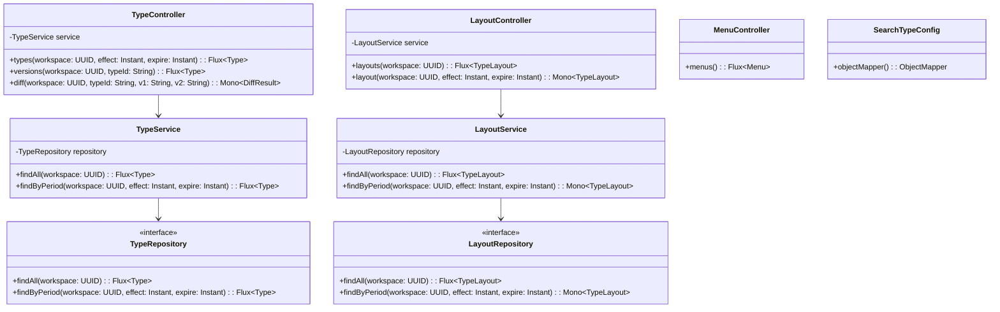

# Search-Type 클래스 다이어그램

```mermaid
classDiagram
    class TypeService {
        -TypeRepository repository
        +findAll(workspace: UUID): Flux~Type~
        +findByPeriod(workspace: UUID, effect: Instant, expire: Instant): Flux~Type~
    }

    class LayoutService {
        -LayoutRepository repository
        +findAll(workspace: UUID): Flux~TypeLayout~
        +findByPeriod(workspace: UUID, effect: Instant, expire: Instant): Mono~TypeLayout~
    }

    class TypeRepository {
        <<interface>>
        +findAll(workspace: UUID): Flux~Type~
        +findByPeriod(workspace: UUID, effect: Instant, expire: Instant): Flux~Type~
    }

    class LayoutRepository {
        <<interface>>
        +findAll(workspace: UUID): Flux~TypeLayout~
        +findByPeriod(workspace: UUID, effect: Instant, expire: Instant): Mono~TypeLayout~
    }

    class TypeController {
        -TypeService service
        +types(workspace: UUID, effect: Instant, expire: Instant): Flux~Type~
        +versions(workspace: UUID, typeId: String): Flux~Type~
        +diff(workspace: UUID, typeId: String, v1: String, v2: String): Mono~DiffResult~
    }

    class LayoutController {
        -LayoutService service
        +layouts(workspace: UUID): Flux~TypeLayout~
        +layout(workspace: UUID, effect: Instant, expire: Instant): Mono~TypeLayout~
    }

    class MenuController {
        +menus(): Flux~Menu~
    }

    class SearchTypeConfig {
        +objectMapper(): ObjectMapper
    }

    TypeService --> TypeRepository
    LayoutService --> LayoutRepository
    TypeController --> TypeService
    LayoutController --> LayoutService
```
