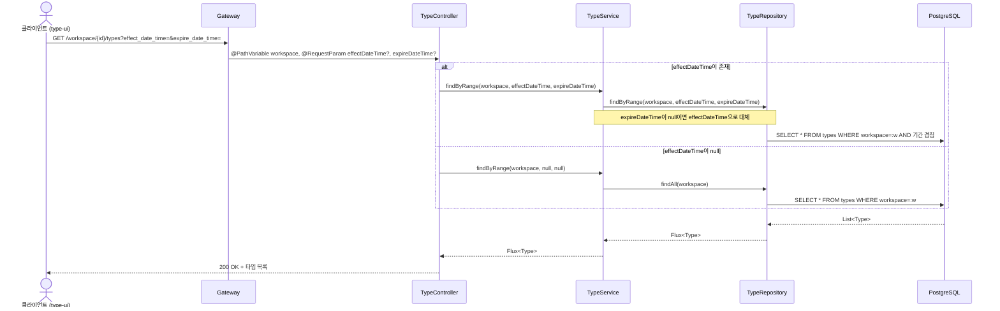
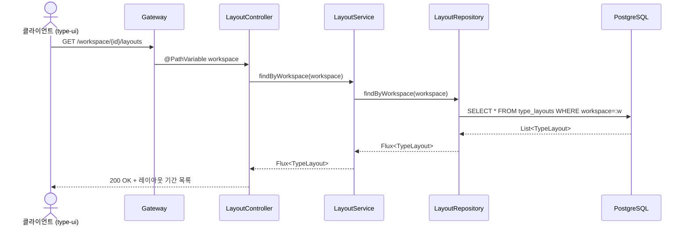
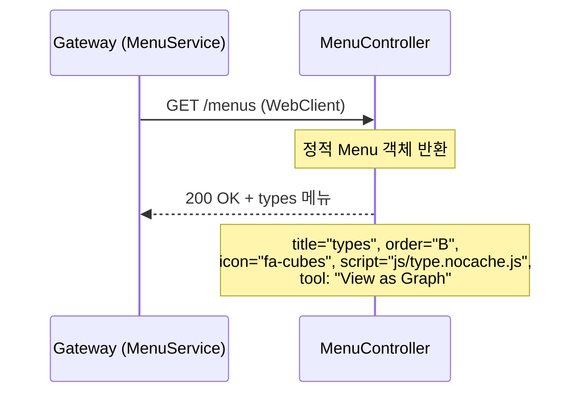

# Search-Type 유스케이스

## 타입 목록 조회 시퀀스

## 레이아웃 기간 목록 조회 시퀀스

## 메뉴 제공 시퀀스

---

## UC-ST1: 타입 목록 조회

| 항목 | 내용 |
|------|------|
| **액터** | 사용자 (type-ui 경유) |
| **선행조건** | 워크스페이스 접근 권한 보유 |
| **정상 흐름** | 1. 클라이언트가 `GET /workspace/{id}/types`를 요청한다. 선택적으로 `effect_date_time`, `expire_date_time` 파라미터를 전달한다. 2. `TypeController`가 `TypeService.findByRange()`를 호출한다. 3. `effectDateTime`이 존재하면 `TypeRepository.findByRange()`로 기간이 겹치는 타입을 조회한다. `expireDateTime`이 null이면 `effectDateTime`으로 대체한다. 4. `effectDateTime`이 null이면 `TypeRepository.findAll()`로 워크스페이스의 전체 타입을 조회한다. 5. 조회된 타입 목록이 응답으로 반환된다. |
| **결과** | 200 OK + 타입 목록 |

## UC-ST2: 레이아웃 기간 목록 조회

| 항목 | 내용 |
|------|------|
| **액터** | 사용자 (type-ui 경유) |
| **선행조건** | 워크스페이스 접근 권한 보유 |
| **정상 흐름** | 1. 클라이언트가 `GET /workspace/{id}/layouts`를 요청한다. 2. `LayoutController`가 `LayoutService.findByWorkspace()`를 호출한다. 3. `LayoutRepository.findByWorkspace()`로 해당 워크스페이스의 모든 레이아웃을 조회한다. 4. `TypeLayout` 목록이 응답으로 반환된다. |
| **결과** | 200 OK + 레이아웃 기간 목록 |

## UC-ST3: 메뉴 제공

| 항목 | 내용 |
|------|------|
| **액터** | Gateway (MenuService) |
| **선행조건** | search-type 서비스 구동 중 |
| **정상 흐름** | 1. Gateway의 `MenuService`가 `GET /menus`를 호출한다. 2. `MenuController`가 정적으로 정의된 `types` 메뉴를 반환한다. 3. 메뉴에는 title("types"), order("B"), icon("fa-cubes"), script("js/type.nocache.js"), tool("View as Graph"), URL 패턴("^types")이 포함된다. |
| **결과** | 200 OK + types 메뉴 (Gateway에서 다른 서비스 메뉴와 병합) |

---

## 트레이서빌리티 매트릭스

| UC | 요구사항 | 시퀀스 다이어그램 | 주요 클래스 | 테스트 |
|----|---------|---|---|---|
| UC-ST1 (타입 목록 조회) | 3.4, 3.7 | 타입 목록 조회 | TypeController, TypeService, TypeRepository | - |
| UC-ST2 (레이아웃 조회) | 3.5 | 레이아웃 기간 목록 조회 | LayoutController, LayoutService, LayoutRepository | - |
| UC-ST3 (메뉴 제공) | 3.11 (Shell - Menu Rail) | 메뉴 제공 | MenuController | - |
