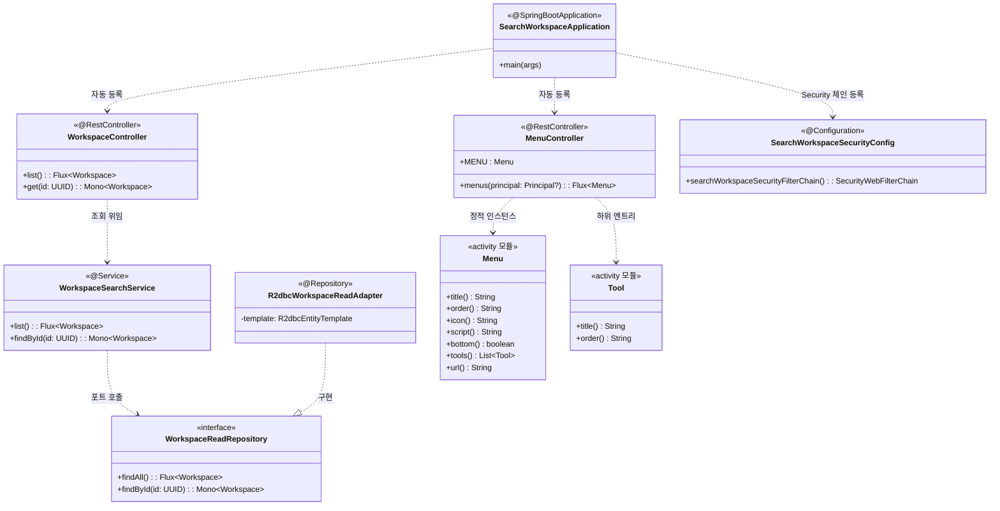

# search-workspace CLASS DIAGRAM

## 의존관계 요약

- **내부**: MenuController (정적), WorkspaceSearchService → WorkspaceReadRepository → R2dbcWorkspaceReadAdapter
- **외부(project)**: `:workspace`, `:activity`(Menu/Tool), `:authentication`
- **라이브러리**: spring-webflux, spring-security, r2dbc-postgres, kotlin-reactor, kotlin-jackson, springdoc-webflux

## DB 연결 (읽기 전용)

`spring.r2dbc.url` 은 PostgreSQL 세션을 `default_transaction_read_only=on` 으로
강제하는 옵션 파라미터를 포함한다 — 이 모듈이 실수로 write 를 수행하지
못하도록 하는 안전장치. 실제 write 는 persist-workspace 가 담당한다.

## 확장 지점

| 확장 | 추가 클래스 | 비고 |
|------|-------------|------|
| 워크스페이스 목록 조회 | `WorkspaceController` + `WorkspaceRepository` (read-only adapter) | `persist-workspace` 의 R2DBC 레포지토리를 read-only 로 재사용 검토 |
| 그룹 조회 | `GroupController` | `workspace` 도메인 유스케이스 재사용 |
| 권한 매트릭스 | `PermissionController` | auth-expert 와 조율 — RBAC 계약 매트릭스 변경 시 병행 검토 |
