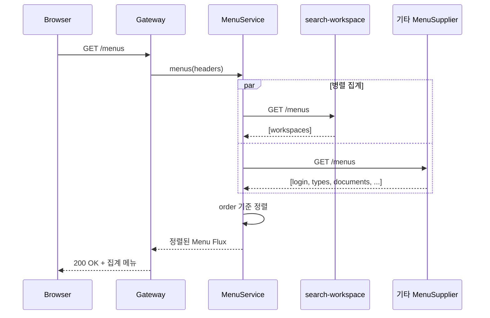
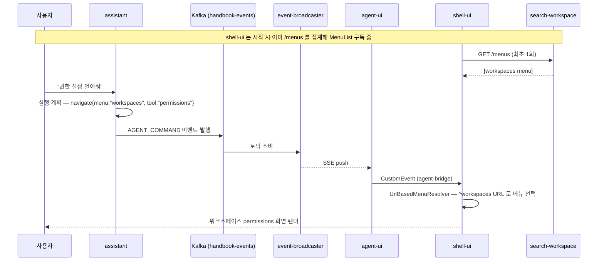
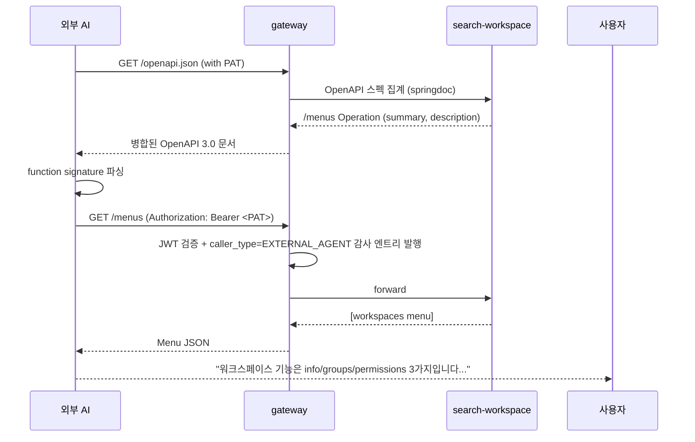

# search-workspace USECASE

이 모듈이 참여하는 유스케이스와 트레이서빌리티.

## 트레이서빌리티 매트릭스

| UC | 제목 | 구현체 | 상태 |
|----|------|--------|------|
| UC-04 | 워크스페이스 홈 화면 진입 (메뉴 렌더링) | `MenuController.menus(Principal?)` | 구현 (비인증 빈 목록) |
| UC-05 | 워크스페이스 전환 | 간접 (메뉴 재렌더링 + `/workspaces` 조회) | 구현 |
| UC-06 | 워크스페이스 참여 | — (persist-workspace 담당) | 해당 없음 |
| UC-10 | 워크스페이스 생성 | — (persist-workspace) | 해당 없음 |
| UC-11 | 워크스페이스 삭제 | — (persist-workspace) | 해당 없음 |
| UC-85 | 외부 AI Tool Use (`list_workspace_menu`, `list_workspaces`) | `MenuController` + `WorkspaceController` + OpenAPI `/v3/api-docs` | 구현 |

## UC-04 시퀀스 — 메뉴 공급

## 테스트 매핑

| UC | 테스트 | 위치 |
|----|--------|------|
| UC-04 (메뉴 공급) | `MenuControllerTest` | `src/test/kotlin/.../MenuControllerTest.kt` |
| UC-81 / UC-85 (에이전트 연동) | `MenuControllerTest` (OpenAPI 어노테이션 존재 검증은 `/v3/api-docs` 통합 테스트 후속) | 동일 파일 |

## 에이전트 연동 시나리오

### 시나리오 1 — 내부 assistant 의 navigate (UC-81 연계)

사용자가 assistant 에게 **"권한 설정 화면 열어줘"** 요청 → assistant 가 실행
계획을 세우고 `AGENT_COMMAND` navigate 를 발행.

### 시나리오 2 — 외부 AI 의 Tool Use (UC-85 연계)

외부 AI 가 `/openapi.json` 을 읽고 function calling 으로 `/menus` 를 조회하여
워크스페이스 기능을 사용자에게 요약 설명.

## 후속 확장 (미구현)

- 사용자가 속한 워크스페이스만 필터링 (현재 `findAll` — 권한 필터링은 auth-expert 와 조율 후 추가)
- `GET /workspaces/{id}/groups` — 그룹 목록 (현재 persist-workspace 에서만 조회)
- `GET /workspaces/{id}/permissions` — 권한 매트릭스 조회
- `operationId` 스네이크_케이스 통일 (현재 `list`/`get` → `list_workspaces`/`get_workspace`)

gateway 라우트 `search-workspace` (Path=`/workspaces,/workspaces/**`, Method=GET) 는 이미 등록되어 있다.
