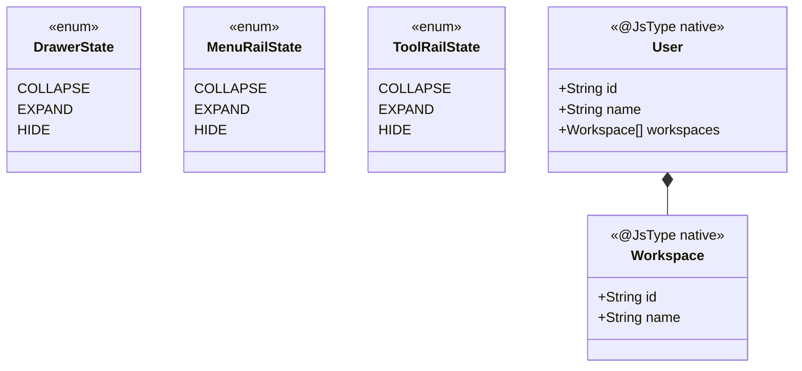
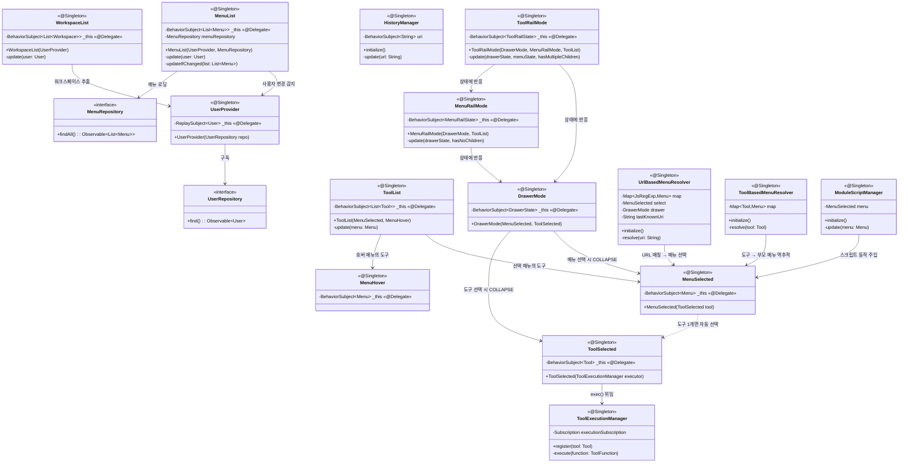
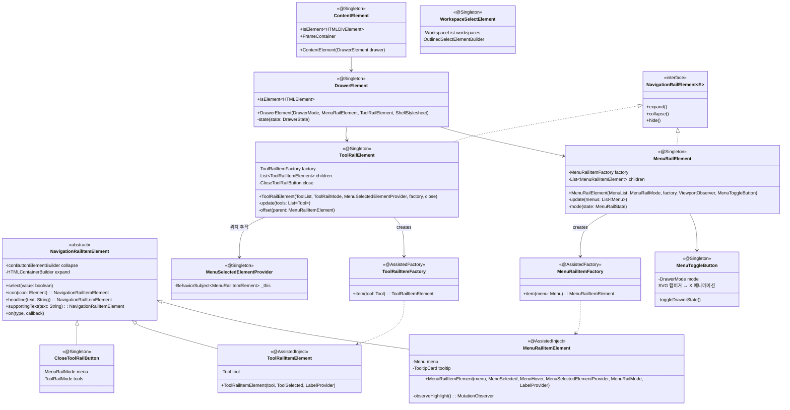
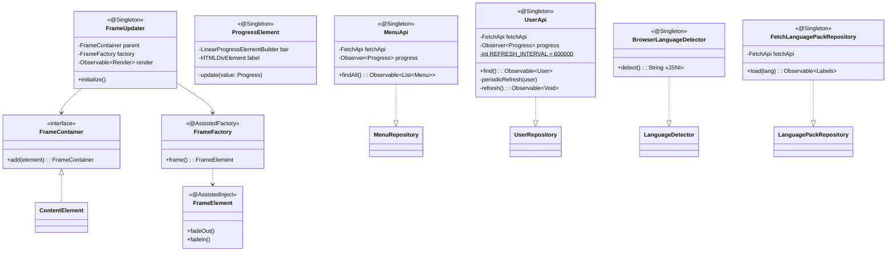
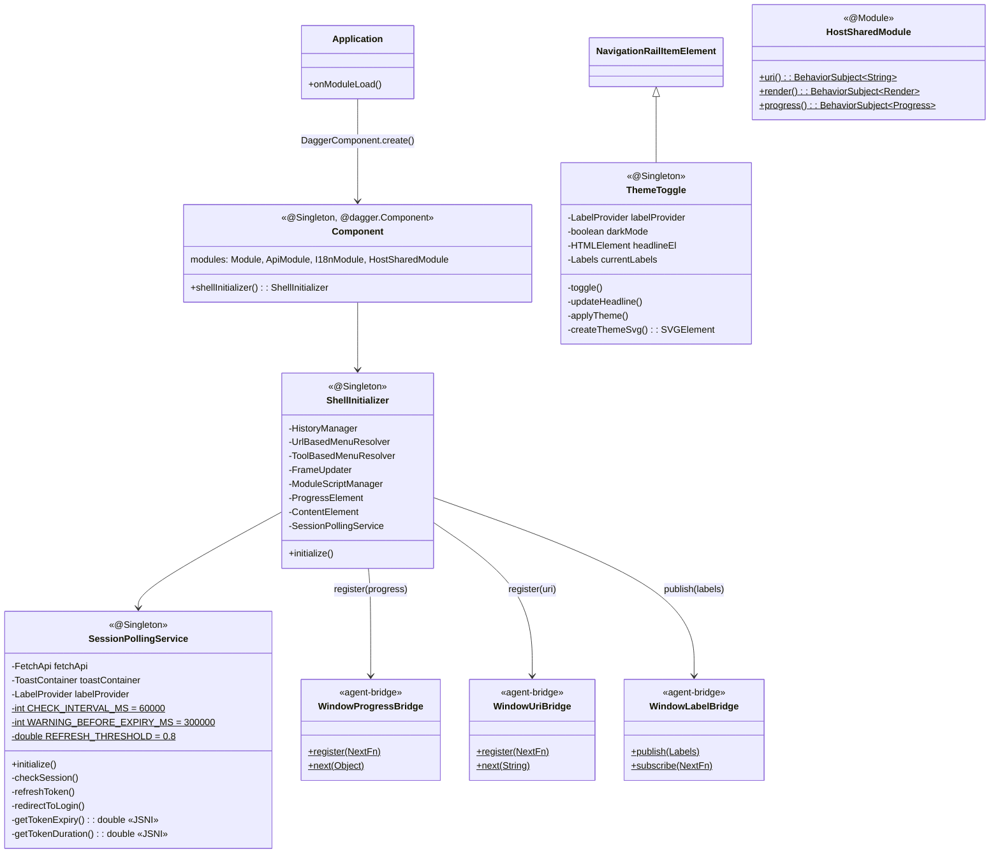
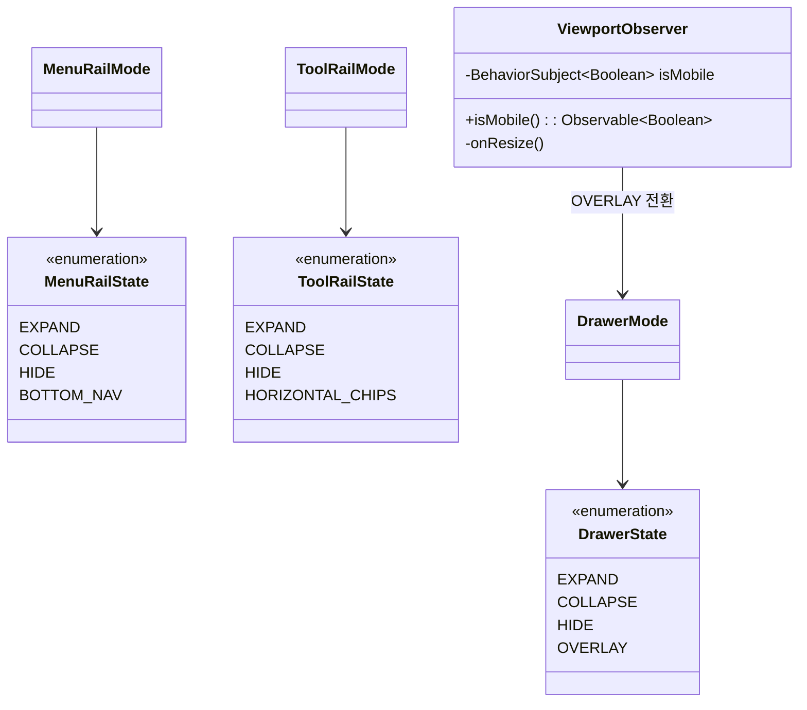

# Shell-UI 클래스 다이어그램

## 도메인

## 유스케이스 (상태 관리)

## Drawer UI 컴포넌트

## Frame + API

## 조합 (DI)

## 디자인 패턴

| 패턴 | 적용 클래스 | 설명 |
|------|------------|------|
| **Observer** | `DrawerMode`, `MenuSelected`, `ToolSelected`, `MenuRailMode`, `ToolRailMode` | BehaviorSubject 기반 반응형 상태 관리. 메뉴 선택 → 도구 목록 갱신 → Drawer 축소 → Rail 상태 전환이 연쇄적으로 전파. |
| **State** | `DrawerMode`(EXPAND/COLLAPSE/HIDE), `MenuRailMode`, `ToolRailMode` | 3단 상태(EXPAND/COLLAPSE/HIDE) 전환을 관리하며, 입력(메뉴 선택, 도구 개수, 사용자 상태)에 따라 자동 전이. |
| **Factory** | `MenuRailItemFactory`, `ToolRailItemFactory` (@AssistedFactory) | Dagger Assisted Injection으로 Menu/Tool 도메인 객체를 받아 NavigationRailItemElement 서브클래스를 생성. |
| **Template Method** | `NavigationRailElement` (인터페이스) | expand/collapse/hide 동작을 정의하여 `MenuRailElement`, `ToolRailElement`가 공통 행위를 상속. |
| **Strategy** | `UrlBasedMenuResolver`, `ToolBasedMenuResolver` | 메뉴 자동 선택 전략 2가지: URL 정규식 매칭 vs 도구→부모 메뉴 역추적. 각각 독립적으로 구독하여 동작. |
| **Adapter** | `MenuApi` → `MenuRepository`, `UserApi` → `UserRepository` | API 호출을 Repository 인터페이스로 래핑. FetchApi를 통해 HTTP 세부사항을 숨김. |
| **Mediator** | `ToolExecutionManager` | 도구 선택 이벤트를 받아 ToolFunction 실행을 중재. DOM 준비 상태 확인 후 100ms 재시도 로직 포함. |

## 모바일 지원

| 클래스 | 모바일 동작 |
|--------|-----------|
| `ViewportObserver` | `window.matchMedia('(max-width: 768px)')` 감지 → isMobile BehaviorSubject 발행 |
| `DrawerMode` | 모바일: OVERLAY 상태 추가 (배경 딤 + position: fixed + 메뉴 선택 시 자동 HIDE) |
| `MenuRailMode` | 모바일: BOTTOM_NAV 상태 추가 (하단 네비게이션 바, 최대 5개 메뉴) |
| `ToolRailMode` | 모바일: HORIZONTAL_CHIPS 상태 추가 (수평 스크롤 칩 바) |
| `DrawerElement` | 모바일: 스와이프 열기/닫기 (touchstart → touchmove → touchend) |
