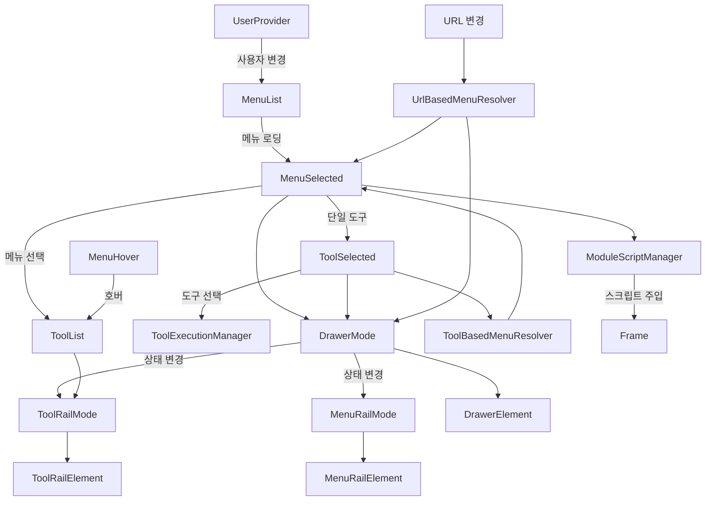
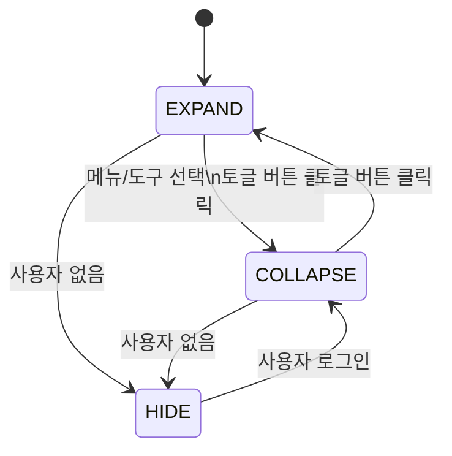
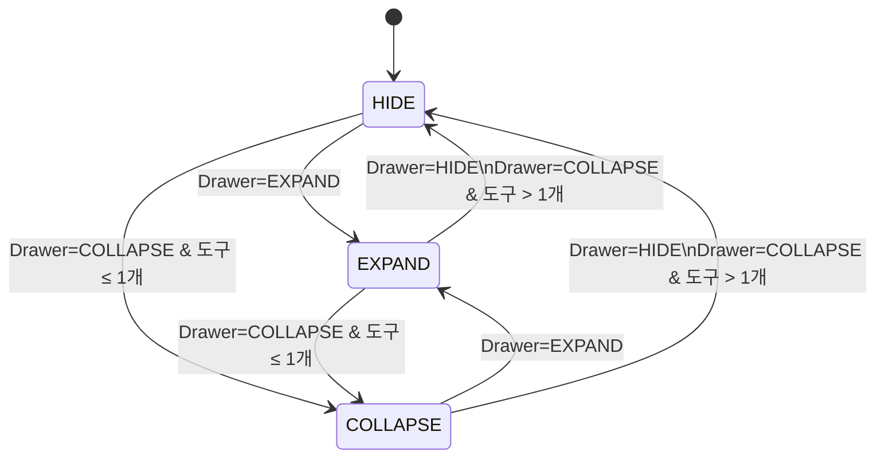
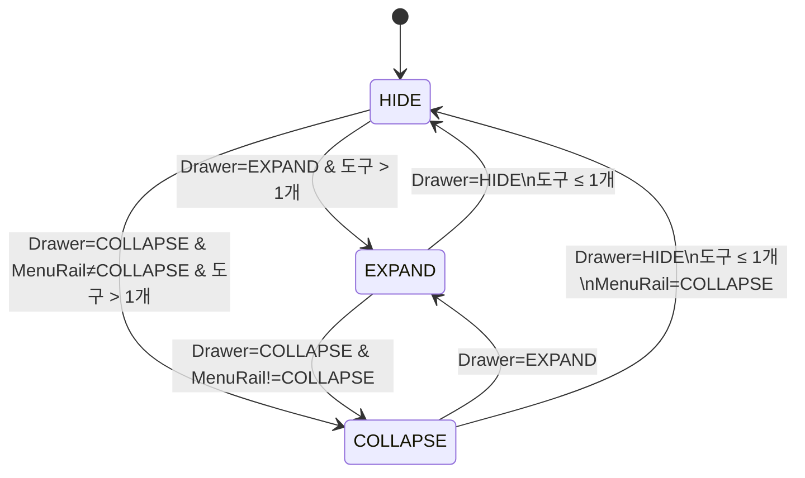
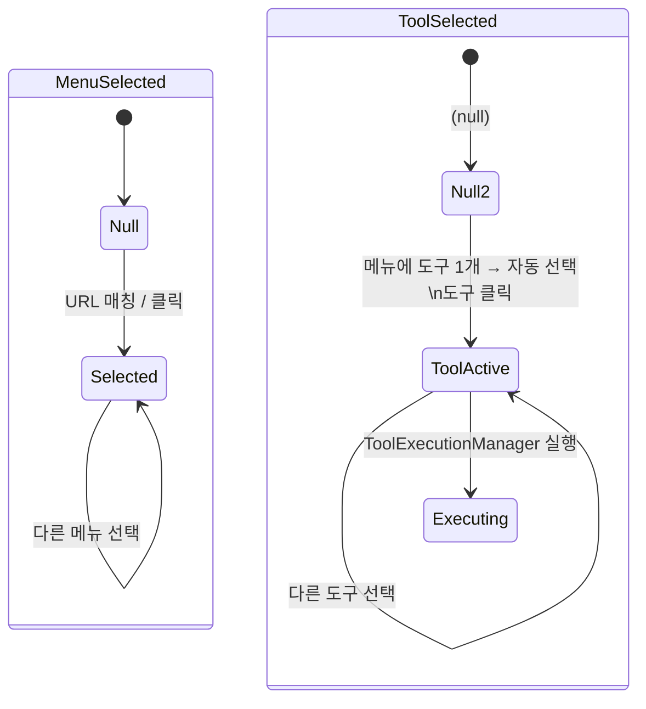

# Shell UI 모듈

GWT 기반 웹 애플리케이션 프레임. Navigation Drawer, Menu Rail, Tool Rail로 구성된
SPA(Single Page Application) 쉘을 제공한다.

## 아키텍처

```
client/
├── domain/                              # 도메인 (프레임워크 무관)
│   ├── User                            # 사용자 (id, name, workspaces)
│   ├── Workspace                       # 워크스페이스 (id, name)
│   ├── DrawerState                     # Drawer 상태 (COLLAPSE, EXPAND, HIDE)
│   ├── MenuRailState                   # Menu Rail 상태
│   └── ToolRailState                   # Tool Rail 상태
│
├── usecase/                             # 유스케이스 (상태 관리)
│   ├── UserProvider                    # 사용자 정보 구독 (ReplaySubject)
│   ├── UserRepository                  # 사용자 조회 포트 (인터페이스)
│   ├── MenuList                        # 메뉴 목록 관리 (사용자 변경 시 재로딩)
│   ├── MenuRepository                  # 메뉴 조회 포트 (인터페이스)
│   ├── MenuSelected                    # 현재 선택 메뉴 (단일 도구 시 자동 선택)
│   ├── MenuHover                       # 호버 중인 메뉴
│   ├── ToolList                        # 선택/호버 메뉴의 도구 목록
│   ├── ToolSelected                    # 현재 선택 도구
│   ├── ToolExecutionManager            # 도구 함수 실행 관리 (타이머 기반 재시도)
│   ├── DrawerMode                      # Drawer 상태 관리 (메뉴/도구 변경 시 자동 축소)
│   ├── MenuRailMode                    # Menu Rail 상태 (Drawer 상태에 반응)
│   ├── ToolRailMode                    # Tool Rail 상태 (Drawer + 도구 개수에 반응)
│   ├── HistoryManager                  # 브라우저 History API 관리
│   ├── UrlBasedMenuResolver            # URL 정규식 매칭 → 메뉴 자동 선택
│   ├── ToolBasedMenuResolver           # 도구 선택 → 부모 메뉴 역추적
│   ├── WorkspaceList                   # 사용자의 워크스페이스 목록
│   └── ModuleScriptManager             # 메뉴 선택 시 모듈 스크립트 동적 주입
│
├── interfaces/                          # 인터페이스 (UI 어댑터)
│   ├── ContentElement                  # 루트 컨테이너 (div#content, flex 레이아웃)
│   ├── api/                            # API 클라이언트
│   │   ├── FetchApi                   # fetch API 래퍼 인터페이스
│   │   ├── MenuApi                    # MenuRepository 구현 (/menus 엔드포인트)
│   │   ├── UserApi                    # UserRepository 구현 (/user + 10분 갱신)
│   │   └── ApiModule                  # Dagger 바인딩 (Repository → Api)
│   └── drawer/                         # 드로어 네비게이션 UI
│       ├── DrawerElement              # 드로어 컨테이너 (header + body)
│       ├── NavigationRailElement      # 레일 공통 인터페이스 (expand/collapse/hide)
│       ├── NavigationRailItemElement  # 레일 아이템 추상 클래스 (md-item 기반)
│       ├── MenuRailElement            # 메뉴 레일 (정렬, bottom 분리)
│       ├── MenuRailItemElement        # 개별 메뉴 아이템 (@AssistedInject)
│       ├── MenuRailItemFactory        # 메뉴 아이템 팩토리
│       ├── ToolRailElement            # 도구 레일 (offset 계산, debounce)
│       ├── ToolRailItemElement        # 개별 도구 아이템 (@AssistedInject)
│       ├── ToolRailItemFactory        # 도구 아이템 팩토리
│       ├── MenuToggleButton           # SVG 햄버거 토글 (애니메이션)
│       ├── CloseToolRailButton        # 도구 레일 닫기 버튼
│       ├── WorkspaceSelectElement     # 워크스페이스 셀렉트 드롭다운
│       └── MenuHoverElementProvider   # 호버 메뉴 아이템 위치 추적
│
├── HostSharedModule                     # Dagger 모듈: URI 상태 (BehaviorSubject + Observable)
├── Component                            # Dagger 컴포넌트 (ApiModule + HostSharedModule)
└── Application                          # GWT EntryPoint (매니저 초기화 + DOM 구성)
```

## 상태 관리 흐름



## State Diagram

### DrawerMode



### MenuRailMode



### ToolRailMode



### MenuSelected / ToolSelected



> 상세 유스케이스는 [USECASE.md](USECASE.md) 참조.

## 설계 결정

| 결정 | 이유 |
|------|------|
| BehaviorSubject 기반 상태 관리 | 최신 값 보존 + 새 구독자에게 즉시 전달 |
| Drawer/MenuRail/ToolRail 3단 상태 | 반응형 UI — 메뉴·도구 개수에 따른 자동 레이아웃 조정 |
| 도구가 1개뿐인 메뉴는 자동 선택 | 불필요한 클릭 제거 |
| 도구 실행 100ms 재시도 | DOM 로딩 완료 전 실행 실패 대응 |
| URL 정규식 매칭 | 딥링크 지원 + 브라우저 뒤로가기 대응 |
| 모듈 스크립트 동적 주입 | activity 모듈을 lazy 로딩하여 초기 로딩 최소화 |
| @AssistedInject 팩토리 패턴 | 메뉴/도구 아이템을 동적 생성하면서 DI 의존성 주입 유지 |
| NavigationRailElement 인터페이스 | MenuRail, ToolRail의 expand/collapse/hide 동작 통일 |
| FetchApi 인터페이스 | 테스트 시 API 호출 모킹 가능 |
| UserApi 10분 주기 갱신 | 세션 유지 + 토큰 자동 갱신 |

## 테스트

Shell UI 테스트는 GWT → JavaScript 컴파일 → Playwright 브라우저 테스트 방식으로 동작한다.
`GwtTestSpec` 기반으로 실제 브라우저에서 DOM 상태를 검증한다.

```
test/
├── java/                               # GWT EntryPoint (JS로 컴파일)
│   ├── client/
│   │   ├── FrameTest.java             # 프레임 테스트 진입점
│   │   └── drawer/
│   │       ├── Application.java       # 드로어 테스트 진입점
│   │       ├── Component.java         # Dagger 컴포넌트 (DrawerMock)
│   │       └── DrawerMock.java        # 목 데이터 (메뉴 4개 + 사용자 + URI)
│   ├── DrawerTest.gwt.xml             # 드로어 GWT 모듈
│   └── FrameTest.gwt.xml             # 프레임 GWT 모듈
├── kotlin/                             # Playwright 기반 테스트
│   ├── DrawerTest.kt                  # 드로어 DOM 검증 (메뉴 렌더링, URL 네비게이션, 토글)
│   ├── FrameTest.kt                   # 프레임 렌더링 브라우저 테스트
│   └── usecase/
│       ├── DrawerModeTest.kt          # Drawer/MenuRail/ToolRail 상태 로직 검증
│       └── StateEnumTest.kt           # 상태 Enum 검증
└── webapp/                             # 테스트 HTML + GWT 컴파일 결과
    ├── drawer.html
    └── frame.html
```

### GWT 라이브러리 참조

activity 모듈의 JAR에 소스를 포함시켜 GWT 컴파일러가 참조할 수 있도록 한다:
```kotlin
// activity/build.gradle.kts
tasks.jar {
    from(sourceSets.main.get().allSource)
    duplicatesStrategy = DuplicatesStrategy.WARN
}
```

```bash
./gradlew :shell-ui:test
```

## 모바일 지원

- **Navigation Drawer**: 모바일(뷰포트 < 768px)에서 오버레이 모드로 전환. 메뉴 선택 시 자동으로 닫힌다.
- **Menu Rail**: 모바일에서 하단 네비게이션 바로 전환하여 주요 메뉴에 빠르게 접근할 수 있다.
- **Tool Rail**: 좁은 화면에서 수평 스크롤 가능한 칩 바로 변경된다.
- **Frame**: 콘텐츠 영역이 전체 뷰포트를 차지하도록 패딩/마진 조정.
- **프로그레스 바**: 상단 고정 위치 유지.
- **터치 지원**: Drawer 스와이프 열기/닫기.
- **최소 뷰포트**: 360px.

## 공통 테스트 리소스

shell-ui의 테스트 웹앱 리소스(JS/CSS)는 다른 GWT UI 모듈의 테스트에서도 공통으로 사용된다.
루트 `build.gradle.kts`의 `copyTestWebResources`/`copyTestCssResources` 태스크가
`shell-ui/src/test/webapp/js`, `shell-ui/src/test/webapp/css`를 각 GWT UI 모듈의
`src/test/webapp/`에 자동 복사한다. `gwtDev`/`gwtCompile` 태스크 실행 시 자동으로 선행 실행된다.

## 의존성

- **activity** — Menu, Tool, ToolFunction 도메인 클래스
- **sayaya-ui** — Material Design 3 UI 컴포넌트
- **sayaya-rx** — RxJava GWT 래퍼 (BehaviorSubject, Observable)
- **Elemento** — GWT DOM 빌더
- **Dagger** — 컴파일 타임 DI
