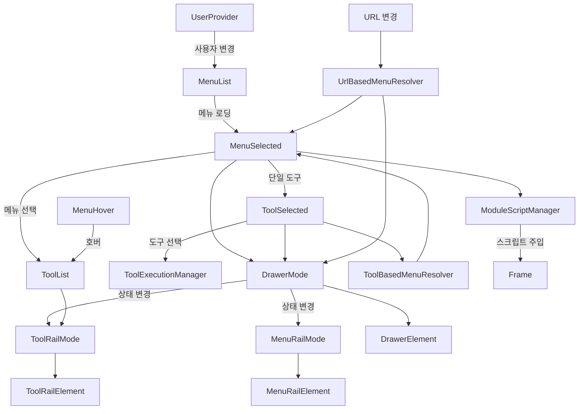
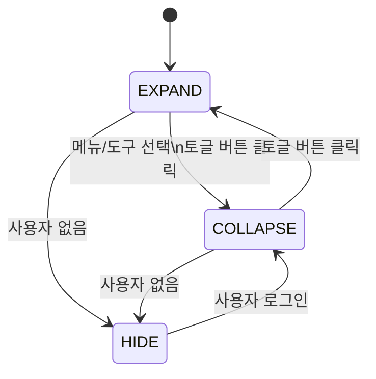
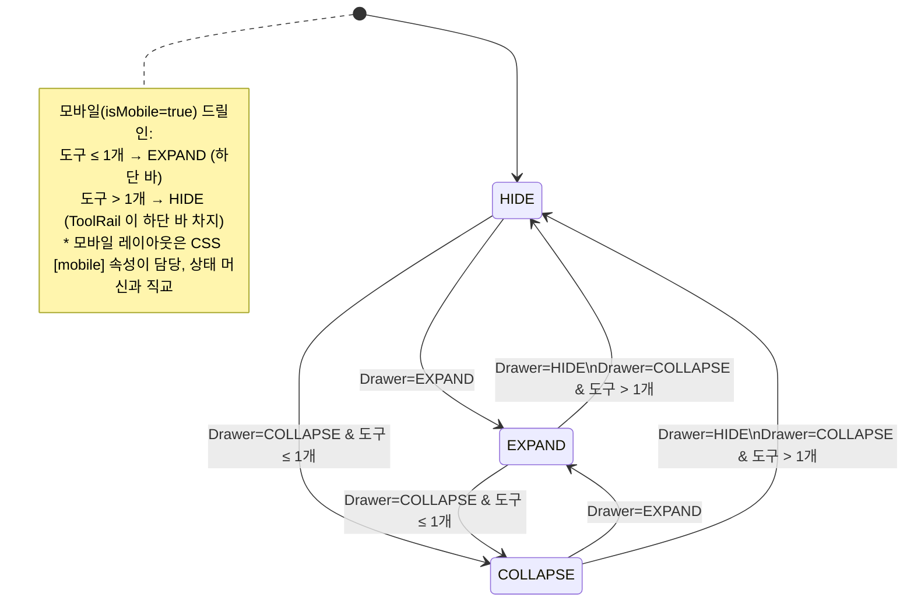
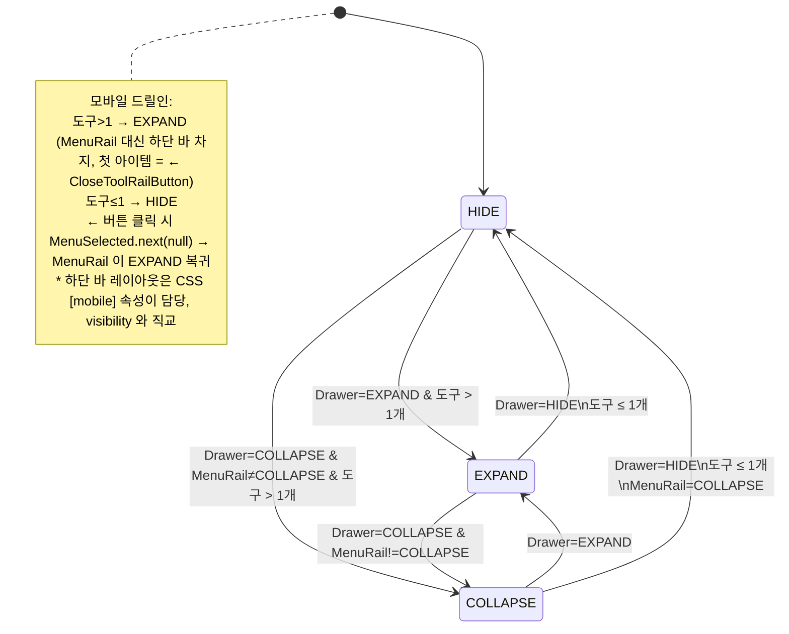
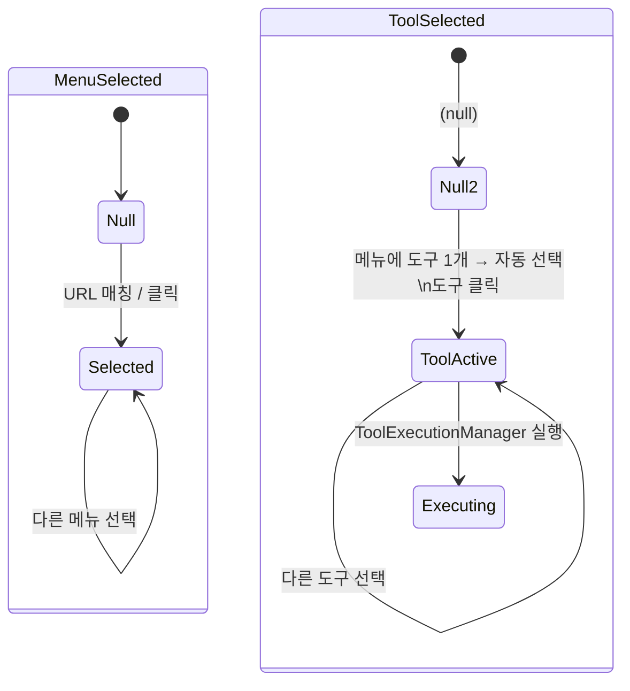

# Shell UI 모듈

GWT 기반 웹 애플리케이션 프레임. Navigation Drawer, Menu Rail, Tool Rail로 구성된
SPA(Single Page Application) 쉘을 제공한다.

## 아키텍처

```
client/
├── domain/                              # 도메인 (프레임워크 무관)
│   ├── User                            # 사용자 (id, name, workspaces)
│   ├── Workspace                       # 워크스페이스 (id, name)
│   ├── DrawerState                     # Drawer 상태 (COLLAPSE, EXPAND, HIDE)
│   ├── MenuRailState                   # Menu Rail 상태
│   └── ToolRailState                   # Tool Rail 상태
│
├── usecase/                             # 유스케이스 (상태 관리)
│   ├── UserProvider                    # 사용자 정보 구독 (ReplaySubject)
│   ├── UserRepository                  # 사용자 조회 포트 (인터페이스)
│   ├── MenuList                        # 메뉴 목록 관리 (사용자 변경 시 재로딩)
│   ├── MenuRepository                  # 메뉴 조회 포트 (인터페이스)
│   ├── MenuSelected                    # 현재 선택 메뉴 (단일 도구 시 자동 선택)
│   ├── MenuHover                       # 호버 중인 메뉴
│   ├── ToolList                        # 선택/호버 메뉴의 도구 목록
│   ├── ToolSelected                    # 현재 선택 도구
│   ├── ToolExecutionManager            # 도구 함수 실행 관리 (타이머 기반 재시도)
│   ├── DrawerMode                      # Drawer 상태 관리 (메뉴/도구 변경 시 자동 축소)
│   ├── MenuRailMode                    # Menu Rail 상태 (Drawer 상태에 반응)
│   ├── ToolRailMode                    # Tool Rail 상태 (Drawer + 도구 개수에 반응)
│   ├── HistoryManager                  # 브라우저 History API 관리
│   ├── UrlBasedMenuResolver            # URL 정규식 매칭 → 메뉴 자동 선택
│   ├── ToolBasedMenuResolver           # 도구 선택 → 부모 메뉴 역추적
│   ├── WorkspaceList                   # 사용자의 워크스페이스 목록
│   ├── SessionPollingService                  # JWT 만료 감시, 자동 갱신, 만료 경고/리다이렉트
│   └── ModuleScriptManager             # 메뉴 선택 시 모듈 스크립트 동적 주입
│
├── interfaces/                          # 인터페이스 (UI 어댑터)
│   ├── ContentElement                  # 루트 컨테이너 (div#content, flex 레이아웃)
│   ├── ShellStylesheet                 # css/shell.css 를 런타임에 document.head 에 주입 (모듈 자율 자산 로드)
│   ├── api/                            # API 클라이언트
│   │   ├── FetchApi                   # fetch API 래퍼 인터페이스
│   │   ├── MenuApi                    # MenuRepository 구현 (/menus 엔드포인트)
│   │   ├── UserApi                    # UserRepository 구현 (/user + 10분 갱신)
│   │   └── ApiModule                  # Dagger 바인딩 (Repository → Api)
│   └── drawer/                         # 드로어 + AppBar 네비게이션 UI
│       ├── ShellAppBarElement         # MD3 Top App Bar — leading/center/trailing 3 slot.
│       │                              #   leading: 예비(appBarSlot=leading 동적 메뉴 승격), center: Workspace, trailing: Theme + appBarSlot=trailing 메뉴
│       │                              #   AppBar 가 자기 slot 을 SRP 로 채움 (WorkspaceSelect/ThemeToggle 주입; 햄버거는 MenuRail 로 이관)
│       ├── MobileTabsElement          # 모바일 상단 Scrollable Tabs (md-tabs + ResponsiveOverflow 3단계 폴백)
│       │                              #   상단정렬(order asc) leading + 하단정렬(order desc) trailing 병합
│       ├── NavEntryFactory           # 도메인(Menu/Tool) → 네비 엔트리 DOM 매핑 팩토리 (얇은 매핑; 조립은 MenuTabBuilder)
│       ├── MenuTabBuilder          # md-primary-tab / md-menu-item 공통 시각 구조(아이콘/라벨/툴팁/하이라이트) 정적 조립 유틸
│       ├── OverflowMenuView     # MobileTabs 의 md-icon-button(…) + md-menu 팝업 제어 (open/close/hidden)
│       ├── DrawerElement              # 드로어 본체 (.body > .menu-rail + .tool-rail)
│       │                              #   AppBar/MobileTabs/Drawer 는 ShellInitializer 가 body 직속 조립
│       ├── NavigationRailElement      # 레일 공통 인터페이스 (expand/collapse/hide)
│       ├── NavigationRailItemElement  # 레일 아이템 추상 클래스 (.item > .collapse + .expand 구조)
│       ├── MenuRailElement            # 메뉴 레일 (데스크톱 전용 — 모바일엔 display:none)
│       │                              #   appBarSlot!=null 메뉴는 렌더에서 제외 (AppBar 로 승격)
│       ├── MenuRailItemElement        # 개별 메뉴 아이템 (@AssistedInject, HighlightEffect.observe 로 tooltip 강조)
│       ├── MenuRailItemFactory        # 메뉴 아이템 팩토리
│       ├── ToolRailElement            # 도구 레일 (.tool-rail, offset 계산, debounce)
│       ├── ToolRailItemElement        # 개별 도구 아이템 (@AssistedInject, TooltipCard hover)
│       ├── ToolRailItemFactory        # 도구 아이템 팩토리
│       ├── ThemeToggle                # NavigationRailItemElement 상속. 라이트/다크 테마 전환
│       │                              #   .collapse + md-item slot=start 두 곳에 sun/moon SVG morph
│       │                              #   headline 라벨은 i18n (theme.switch_to_dark / theme.switch_to_light)
│       │                              #   AppBar trailing 으로 승격 (ShellAppBarElement 가 주입받아 append)
│       ├── MenuToggleButton           # SVG 햄버거 토글 — MenuRail 상단 mount (MD3 정석). 모바일 rail[mobile] 에선 CSS display:none
│       ├── CloseToolRailButton        # 도구 레일 닫기 버튼
│       ├── WorkspaceSelectElement     # 워크스페이스 셀렉트 드롭다운 (AppBar center)
│       └── MenuHoverElementProvider   # 호버 메뉴 아이템 위치 추적
│
├── HostSharedModule                     # Dagger 모듈: URI 상태 (BehaviorSubject + Observable)
├── Component                            # Dagger 컴포넌트 (ApiModule + HostSharedModule)
└── Application                          # GWT EntryPoint (Shell.gwt.xml, 매니저 초기화 + DOM 구성 + 브릿지 게시)
```

## 상태 관리 흐름



## State Diagram

### DrawerMode



### MenuRailMode



### ToolRailMode



### MenuSelected / ToolSelected



> 상세 유스케이스는 [USECASE.md](USECASE.md) 참조.

## 설계 결정

| 결정 | 이유 |
|------|------|
| BehaviorSubject 기반 상태 관리 | 최신 값 보존 + 새 구독자에게 즉시 전달 |
| Drawer/MenuRail/ToolRail 3단 상태 | 반응형 UI — 메뉴·도구 개수에 따른 자동 레이아웃 조정 |
| 도구가 1개뿐인 메뉴는 자동 선택 | 불필요한 클릭 제거 |
| 도구 실행 100ms 재시도 | DOM 로딩 완료 전 실행 실패 대응 |
| URL 정규식 매칭 | 딥링크 지원 + 브라우저 뒤로가기 대응. 해시(#)가 없는 클린 URL(Clean URL) 방식을 사용하며, `pathname` 정규화(origin/port/protocol 제거) 후 매칭한다. `{workspaceId}` 예약어를 현재 컨텍스트 값으로 치환하여 매칭을 수행하므로, 워크스페이스 전환 시 동일한 메뉴(예: types)의 URL이 `/workspaces/ws-1/types`에서 `/workspaces/ws-2/types`로 동적으로 변경되어도 정확한 매칭이 보장된다. |
| 모듈 스크립트 동적 주입 | activity 모듈을 lazy 로딩하여 초기 로딩 최소화 |
| @AssistedInject 팩토리 패턴 | 메뉴/도구 아이템을 동적 생성하면서 DI 의존성 주입 유지 |
| NavigationRailElement 인터페이스 | MenuRail, ToolRail의 expand/collapse/hide 동작 통일 |
| FetchApi 인터페이스 | 테스트 시 API 호출 모킹 가능 |
| UserApi 10분 주기 갱신 | 세션 유지 + 토큰 자동 갱신 |
| ThemeToggle 이 NavigationRailItemElement 를 상속 | 일반 메뉴 아이템과 동일한 .item > (.collapse + .expand) 구조를 가져 시각/스페이싱이 자동으로 일치한다. expand 모드에선 md-item 의 headline 라벨이, collapse 모드에선 .collapse 아이콘 버튼만 노출 |
| theme/menu 위치를 CSS order 로 통제 | 일반 메뉴(0) → ThemeToggle(.rail-bottom, order:1) → bottom 메뉴(.bottom-menu, order:2) 순으로 정렬. ThemeToggle 한 곳에만 `margin-top: auto` 가 있어 free space 분배 충돌이 없고, MenuRailElement 가 동적으로 첫 bottom 메뉴를 찾아 margin 을 부여하던 로직을 제거. 모바일(.rail[mobile]) 에서는 row 방향이라 margin-top auto 가 push 효과를 잃지만 order:1 만으로 일반 메뉴와 bottom 메뉴 사이에 자연스럽게 배치되어 horizontal navbar 에도 그대로 노출된다 (모바일의 유일한 테마 전환 진입점) |
| 테마 색 트랜지션 600ms cubic-bezier | 부드럽지만 빠르게 점진 전환. shell.css 의 :root/body/.drawer/.frame/.rail 트랜지션 블록이 background-color/color/border-color/fill/stroke 를 한 번에 보간 |
| Sun/Moon SVG morph 는 :root.theme-changing 클래스 500ms 부착으로 트리거 | 토글 순간에만 클래스가 부착되어 keyframe(theme-icon-rise/set) 이 재생. 500ms 후 자동 제거되어 drawer expand/collapse 같은 다른 DOM 변화(예: md-item 의 start svg 가 display:none → visible 로 바뀌는 시점) 에서는 animation-name 매칭이 안 돼 의도치 않은 재생을 차단 |
| ThemeToggle 헤드라인이 darkMode 에 따라 i18n 키 동적 변경 | 현재 light → "Switch to Dark" (theme.switch_to_dark), 현재 dark → "Switch to Light" (theme.switch_to_light). LabelProvider 구독으로 locale 변경 시에도 자동 갱신 |
| 선택 상태는 배경 채움이 아니라 outline→filled 아이콘 스왑 | MD3 nav rail 가이드("선택 시 filled, 미선택 시 outlined")를 따름. MenuRailItemElement/ToolRailItemElement 가 `fa-light`(`.icon-outline`) 와 `fa-solid`(`.icon-filled`) 두 아이콘을 동시 렌더하고, 셀렉터 `.rail .item[selected] .icon-outline { display:none }` / `.icon-filled { display:inline-flex }` 로 가시성을 토글. `.item[selected] .expand` 의 label 색은 `--md-sys-color-primary` 로 유지되어 배경 없이도 선택 신호가 유지된다 |
| ShellStylesheet 가 css/shell.css 를 런타임에 head 주입 | shell-ui 모듈이 자기 스타일시트의 정본 소유자가 됨. app.html 이 shell.css 를 미리 link 할 필요 없고, 빌드/배포 차원에서 shell-ui 의 src/main/webapp 만이 정본을 가짐 |
| AppBar/MobileTabs 는 body 직속 (Composition Root 조립) | Drawer `backdrop-filter` 가 fixed 자손의 containing block 을 오염시켜 `top:0` 이 viewport 가 아닌 drawer 기준이 되는 문제 회피. DOM 조립 순서를 `ShellInitializer` 한 곳에 집중해 예측 가능성 확보 |
| ShellAppBar 가 자기 slot 을 SRP 로 채움 | AppBar 가 WorkspaceSelect/ThemeToggle 을 직접 주입받아 center/trailing 에 배치. leading 은 appBarSlot 승격 전용 예비 슬롯. DrawerElement 는 AppBar 내부 구조를 몰라도 됨. 햄버거는 MenuRail 상단으로 이관 (rail expand 시 우측 밀림 회귀 해결, 2026-04) |
| `Menu.appBarSlot` 으로 AppBar 승격 선언 | 세션 액션성 메뉴(login 등)를 네비게이션 축에서 뺀다. O/C — slot 이름 → HTMLElement 매핑을 Map 으로 관리해 "leading"/"center"/"trailing" 3종 모두 확장 대응 가능 |
| HighlightEffect 공통화 (observe + apply) | `.ui-highlight` 감지용 MutationObserver 를 `HighlightEffect.observe` 로 캡슐화. MenuRailItem / MobileTabs 의 md-primary-tab / ShellAppBar 의 `.shell-app-bar-action` 이 동일 추상에만 의존 (Dependency Inversion) |
| MobileTabs 의 responsive overflow 3단계 폴백 | `ResponsiveOverflow.compute` 순수 계산기가 결과를 반환하고, DOM 조정은 `OverflowMenuView` 가 전담. 탭 레이아웃 결정과 overflow UI 제어를 SRP 로 분리 |
| NavEntryFactory + MenuTabBuilder 분리 | 도메인 → 엔트리 매핑(NavEntryFactory)과 엔트리 시각 구조 조립(MenuTabBuilder)을 책임 단위로 분리. MobileTabs 는 partition/정렬/recomputeLayout 에만 집중, Factory 는 Menu/Tool 매핑만, Builder 는 호스트(md-primary-tab / md-menu-item)별 조립 정적 팩토리만 |

## 사용자 상태 모델 및 메뉴 가시성 (SessionStateKind)

메뉴/기능의 가시·활성 여부는 `Menu.allowedSessionStates` 선언에 따라 결정된다.

- **ANONYMOUS**: 비인증 상태. 로그인 유도 메뉴만 노출.
- **AUTHENTICATED**: 인증되었으나 워크스페이스 미선택. 워크스페이스 목록 및 생성 메뉴 노출.
- **IN_WORKSPACE**: 특정 워크스페이스 진입 상태. 타입/문서 관리 등 모든 도메인 메뉴 노출.

### UI 컴포넌트 가시성 제어 로직

- `shell-ui`의 `MenuRail` 및 `MobileTabs`는 현재 `SessionStateKind`를 상시 관찰한다.
- 각 `Menu` 객체의 `allowedSessionStates` 집합에 현재 상태가 포함되지 않으면:
  - **메뉴 레일**: 아이템을 렌더링하지 않거나(Hide), 설정에 따라 비활성화(Disabled) 처리한다.
  - **AppBar**: 승격된 메뉴(`appBarSlot`)의 경우 상태 불일치 시 자동으로 다른 로케일/상태의 메뉴로 교체된다 (예: Sign In ↔ Sign Out).
- 상태 전이(`Anonymous → Authenticated`) 시 `UrlBasedMenuResolver`가 트리거되어 현재 URL에 적합한 메뉴를 재평가한다.

## 테스트

Shell UI 테스트는 GWT → JavaScript 컴파일 → Playwright 브라우저 테스트 방식으로 동작한다.
`GwtTestSpec` 기반으로 실제 브라우저에서 DOM 상태를 검증한다.

```
test/
├── java/                               # GWT EntryPoint (JS로 컴파일)
│   ├── client/
│   │   ├── FrameTest.java             # 프레임 테스트 진입점
│   │   └── drawer/
│   │       ├── Application.java       # 드로어 테스트 진입점
│   │       ├── Component.java         # Dagger 컴포넌트 (DrawerMock)
│   │       └── DrawerMock.java        # 목 데이터 (메뉴 4개 + 사용자 + URI)
│   ├── DrawerTest.gwt.xml             # 드로어 GWT 모듈
│   └── FrameTest.gwt.xml             # 프레임 GWT 모듈
├── kotlin/                             # Playwright 기반 테스트
│   ├── DrawerTest.kt                  # 드로어 DOM 검증 (메뉴 렌더링, URL 네비게이션, 토글)
│   ├── FrameTest.kt                   # 프레임 렌더링 브라우저 테스트
│   └── usecase/
│       ├── DrawerModeTest.kt          # Drawer/MenuRail/ToolRail 상태 로직 검증
│       └── StateEnumTest.kt           # 상태 Enum 검증
└── webapp/                             # 테스트 HTML + GWT 컴파일 결과
    ├── drawer.html
    └── frame.html
```

### GWT 라이브러리 참조

activity 모듈의 JAR에 소스를 포함시켜 GWT 컴파일러가 참조할 수 있도록 한다:
```kotlin
// activity/build.gradle.kts
tasks.jar {
    from(sourceSets.main.get().allSource)
    duplicatesStrategy = DuplicatesStrategy.WARN
}
```

```bash
./gradlew :shell-ui:test
```

## 모바일 지원 (상단 AppBar + Tabs, 2026-04 재정의)

모바일(뷰포트 ≤ 768px)은 **상단 AppBar + 상단 Scrollable Tabs + 하단 ToolRail 드릴인 + 하단 Agent input dock** 4단 수직 스택.

### MD3 네비게이션 이분법

| 축 | 책임 | 컴포넌트 |
|----|------|----------|
| 전역 액션 | WorkspaceSelect / Theme / Sign In·Out | `ShellAppBarElement` (AppBar) |
| 네비게이션 | 모듈 전환 (MenuList) | 데스크톱 `MenuRailElement` / 모바일 `MobileTabsElement` |
| 도구 | 현재 모듈 Tool 목록 | `ToolRailElement` (하단 드릴인) |

`Menu.appBarSlot` 필드로 세션 액션성 메뉴(예: login)를 네비게이션 축에서 빼고 AppBar slot 으로 승격. 상세: `docs/contracts/menus.md#appbarslot-규약`.

### 동작

- **초기 상태**: AppBar 상시 표시(데스크톱·모바일 공통). 모바일에서 MenuRail 은 `display:none`, 대신 `.menu-tabs` 가 AppBar 바로 아래 상단 2번째 행을 차지.
- **Tabs 배치**: 상단정렬(`bottom=false`) `order` asc + 하단정렬(`bottom=true`) `order` desc 병합. 데스크톱 Y축 "아래일수록 중요" semantic 을 모바일 X축 "왼쪽일수록 중요" 로 보존.
- **3단계 반응형 폴백** (`ResponsiveOverflow`):
  1. 평면 — 전체가 viewport 에 들어감, overflow 버튼 숨김.
  2. overflow — 공간 부족 시 하단정렬을 `md-menu` 팝업으로 수렴, trailing 에 `…` 아이콘 버튼 노출.
  3. 스크롤 — 상단정렬도 넘치면 `md-tabs[scrollable]` 가로 스크롤 + sticky trailing overflow.
- **드릴인**: 도구 2개 이상 탭 선택 → `ToolRailMode=EXPAND` → 하단 바 slide-up. 드릴백은 `CloseToolRailButton`.
- **Agent input dock**: `.agent-input-container` 가 모바일에서도 `bottom:0` 고정. Fitts 원칙상 가장 빈번한 입력은 엄지 도달 최적 위치.
- **햄버거 위치**: MenuRail 상단 `#menu-toggle-button` (MD3 Navigation Rail 정석). 모바일 `.menu-rail[mobile]` 에서는 CSS `display:none` — MenuRail 전체가 하단 바/display:none 으로 전환되고 MobileTabs 가 네비 대체.
- **agent-command highlight**: `HighlightEffect.observe` 공통화로 MenuRailItem / `.menu-tab` / `.shell-app-bar-action` 모두 `.ui-highlight` 수신 시 TooltipCard 로 라벨 강조.
- **최소 뷰포트**: 360px.

### Composition Root

`ShellInitializer.initialize()` 가 body 에 명시 순서로 조립:

```
body
├── header.shell-app-bar          (fixed, left: var(--shell-drawer-width), right: 0)
├── div.menu-tabs                 (모바일 전용 Tabs, AppBar 바로 아래)
├── div.progress-container
└── div#content > nav.drawer(fixed top:0 bottom:0 width:var(--shell-drawer-width))
                  └── div.body > div.rail.menu-rail + div.rail.tool-rail
```

AppBar / MobileTabs 는 **body 직속**이어야 한다 — Drawer 의 `backdrop-filter` 가 자손 `position:fixed` 의 containing block 을 오염시키는 CSS 스펙 이슈 회피.

### 정석 MD3 Layout (2026-04 재구조)

Drawer 와 AppBar 를 **같은 상단 레이어에서 나란히** 배치한다 (Top App Bar + Navigation Rail 관용). Drawer 가 AppBar 위로 올라오지 않도록 AppBar 는 Drawer 오른쪽 영역만 차지한다.

```
:root {
    --shell-drawer-width: 56px;   /* 기본 (collapse) */
}
body:has(nav.drawer[open])    { --shell-drawer-width: 16rem; }
body:has(nav.drawer[hide]),
body:has(nav.drawer[overlay]) { --shell-drawer-width: 0; }
@media (max-width: 768px)     { :root { --shell-drawer-width: 0; } }
```

- **Drawer**: `position:fixed; top:0; left:0; bottom:0; width:var(--shell-drawer-width); z-index:1000;` + 반투명 배경(`color-mix(surface-container-high 60%, transparent)`).
- **AppBar**: `left:var(--shell-drawer-width); z-index:950;` — Drawer 오른쪽부터 시작. `[scrolled]` 속성 토글로 Surface ↔ Surface-container + elevation 2 전환.
- **Frame**: `left:0; top:var(--shell-app-bar-height);` — viewport 전역에 깔려 Drawer 반투명 너머로 비쳐 보임.
- **WorkspaceSelect**: AppBar center 에 상시 노출 (MenuRailMode 종속 숨김 로직 제거, 2026-04). `justify-content: center` 로 시각적 중앙 정렬을 보장하며, 긴 이름 가독성을 위해 `max-width: 24rem` 을, 찌그러짐 방지를 위해 `min-width: 12rem` 을 유지한다. `body` 의 `padding-top` 은 Drawer 가 fixed 라 불필요해 제거.

> 과거(2026-03 이전) 의 "단일 하단 바 드릴인" 모델은 Section 7 (docs/design.md) 에 아카이브.

## 공통 테스트 리소스

shell-ui의 테스트 웹앱 리소스(JS/CSS)는 다른 GWT UI 모듈의 테스트에서도 공통으로 사용된다.
루트 `build.gradle.kts`의 `copyTestWebResources`/`copyTestCssResources` 태스크가
`shell-ui/src/test/webapp/js`, `shell-ui/src/test/webapp/css`를 각 GWT UI 모듈의
`src/test/webapp/`에 자동 복사한다. `gwtDev`/`gwtCompile` 태스크 실행 시 자동으로 선행 실행된다.

## 브릿지 게시

shell-ui는 독립 GWT 모듈로 컴파일되며, agent-ui 등 다른 GWT 모듈과 `window` 객체를 통해 통신한다. `ShellInitializer.initialize()` 마지막 단계에서 `ProgressSharing`, `RenderSharing`, `0`, `LabelSharing` (agent-bridge 모듈)를 등록하고, `handbook-shell-ready` CustomEvent를 dispatch한다. 다른 모듈은 이 이벤트를 수신한 뒤 브릿지를 통해 shell의 Progress/URI/Label 상태에 접근하거나 `RenderSharing.next(render)` 로 Frame mount 를 위임한다.

## Frame Mount 계약

자식 UI 모듈(login-ui, workspace-ui, type-ui, document-ui, dashboard-ui) 은 자기 컨테이너를 `body` 에 직접 append 하지 **않는다**. 대신 `RenderSharing.next(render)` 로 `Render` 콜백(`HTMLElement frame -> boolean`) 을 넘기면 shell 의 `FrameUpdater` 가 Frame 엘리먼트를 만들고 `.frame` 내부에 모듈 컨텐츠를 mount 한다. `body{position:fixed; inset:0}` 때문에 body 직접 append 는 뷰포트 밖으로 밀려나는 회귀를 유발한다. 계약 상세는 [`docs/contracts/frame.md`](../docs/contracts/frame.md).

### 레이아웃 토큰 (shell.css)

| 토큰 | Desktop | Mobile | 용도 |
|------|---------|--------|------|
| `--shell-app-bar-height` | 56px | 56px | Top App Bar 점유 영역 |
| `--shell-mobile-tabs-height` | 0 | 49px (`.menu-tabs[hide]` → 0) | 모바일 상단 tabs 영역 |
| `--shell-frame-left-offset` | 3.5rem (rail collapse 고정) | 0 | 좌측 rail 영역 확보. rail EXPAND 는 본문 overlay (의도) |
| `--shell-drawer-width` | 3.5 ~ 32rem (rail 상태 조합, 동적) | 0 | AppBar/MobileTabs 좌측 시작점. Frame 은 사용 안 함 |

`.frame` 은 위 토큰 + 상하좌우 16px 여백을 적용해 패널들이 엣지·rail·AppBar 에 닿지 않도록 한다.

## 에이전트 연동

### 내부 assistant
- 역할: `AGENT_COMMAND` 수신 및 UI 반영 오케스트레이터.
- 내비게이션: `navigate` 커맨드 수신 시 해당 URL로 라우팅 및 모듈 로드.
- UI 피드백: `attention` 커맨드 수신 시 AppBar 뱃지 표시 또는 Coachmark 실행.

### Agent Command 타겟
- highlight: `.menu-item`, `.tab-item`, `.shell-app-bar-action`
- selector 패턴: `[data-menu-id="{id}"]`, `[data-tool-id="{id}"]`

## 의존성

- **activity** — Menu, Tool, ToolFunction, Render 도메인 클래스
- **agent-bridge** — 모듈 간 window 브릿지 (ProgressSharing, **RenderSharing**, 0, LabelSharing)
- **sayaya-ui** — Material Design 3 UI 컴포넌트
- **sayaya-rx** — RxJava GWT 래퍼 (BehaviorSubject, Observable)
- **Elemento** — GWT DOM 빌더
- **Dagger** — 컴파일 타임 DI
