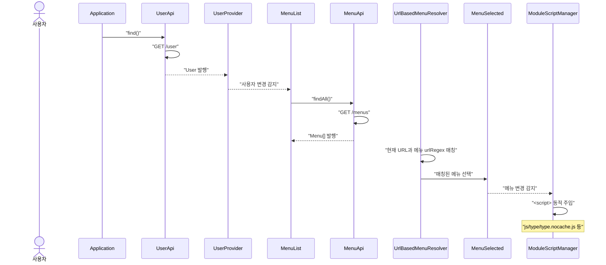
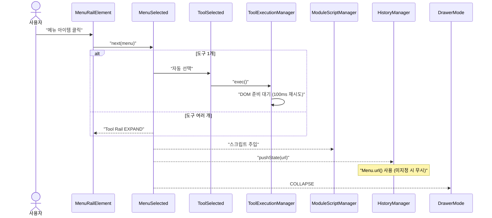
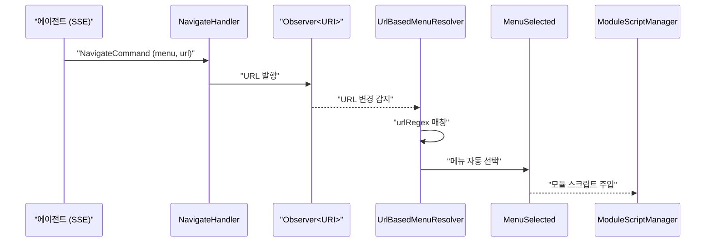
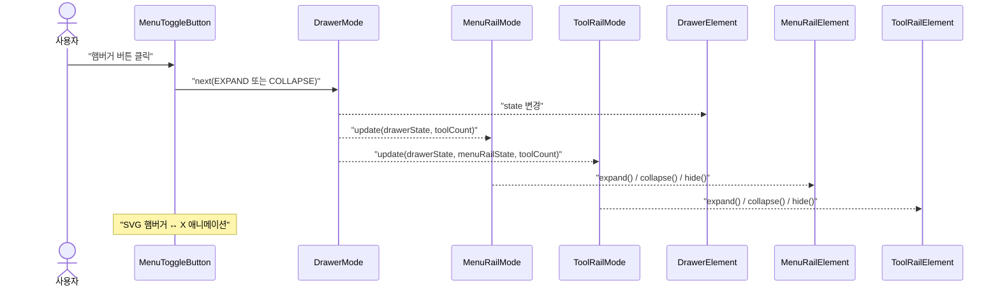
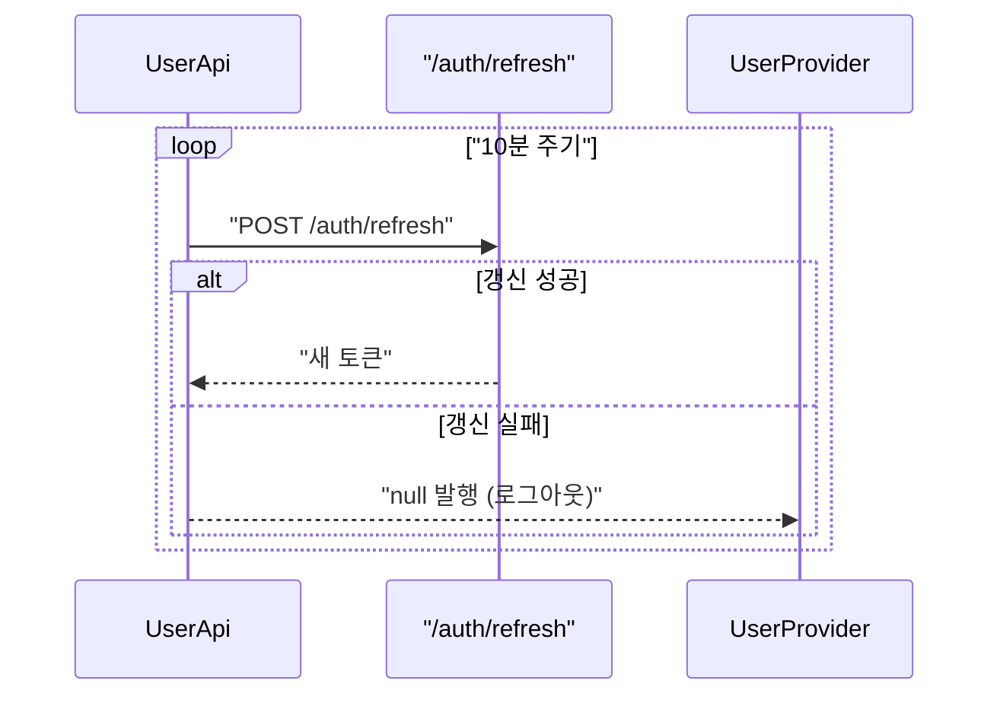
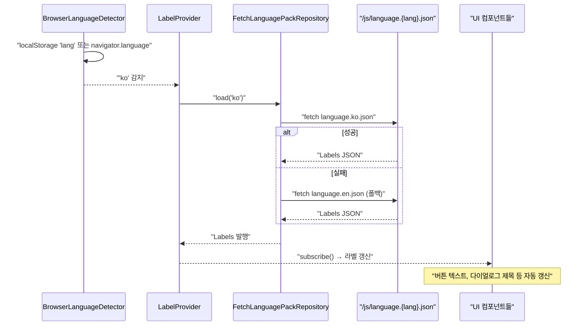
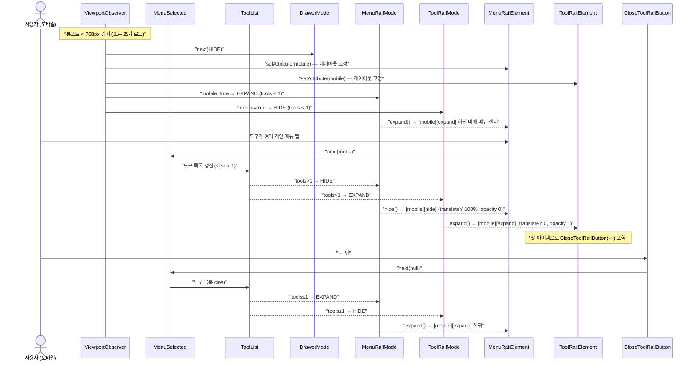
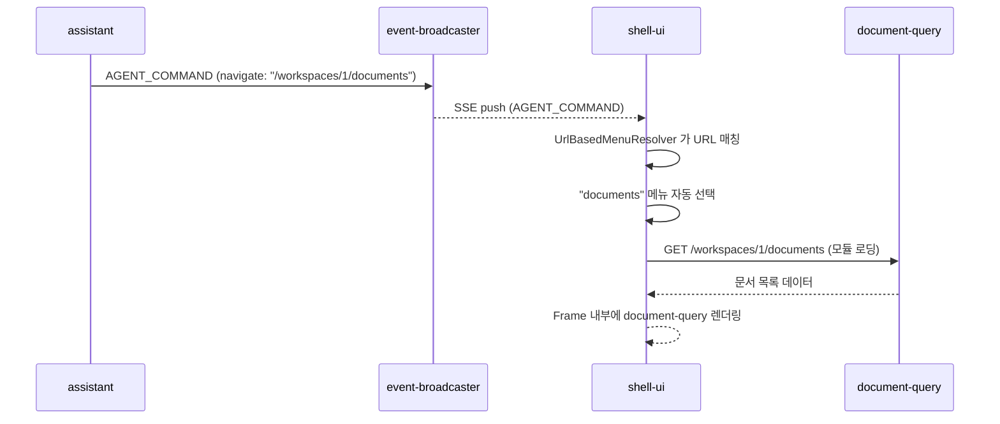
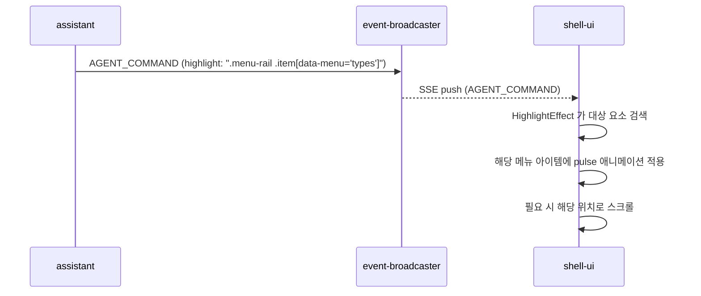

# Shell-UI 유스케이스

## 초기 로딩 → 메뉴 선택 시퀀스

## 메뉴 클릭 → 모듈 로딩 시퀀스

## 에이전트 화면 이동 시퀀스

## Drawer 토글 시퀀스

## 토큰 자동 갱신 시퀀스

## i18n (다국어) 시퀀스

## UC-S1: 사용자 인증 및 초기 로딩

| 항목 | 내용 |
|------|------|
| **액터** | 사용자 |
| **정상 흐름** | 1. 페이지 로드 시 `UserApi`가 `/user` 엔드포인트에서 사용자 정보를 가져온다. 2. `UserProvider`가 사용자를 발행하면 `SessionStateProvider`가 상태를 계산한다. 3. `WorkspaceList`가 로딩되어 세션 상태가 확정(`AUTHENTICATED` 또는 `IN_WORKSPACE`)되면, `MenuList`가 `/menus` 엔드포인트에서 메뉴 목록을 로딩한다. 4. `DrawerMode`가 COLLAPSE로 전환되고, Drawer UI가 렌더링된다. 5. `UrlBasedMenuResolver`가 현재 URL을 메뉴 정규식과 매칭하여 해당 메뉴를 자동 선택한다. |
| **대안 흐름** | 인증 실패 시(401) 사용자 정보가 null로 발행되고, DrawerMode가 HIDE로 전환된다. |

## UC-S2: 메뉴 선택 및 모듈 로딩

| 항목 | 내용 |
|------|------|
| **액터** | 사용자 |
| **선행조건** | 메뉴 목록 로딩 완료 |
| **정상 흐름** | 1. Menu Rail에서 메뉴 아이템을 클릭한다. 2. `MenuSelected`에 선택된 메뉴가 발행된다. 3. 도구가 1개뿐이면 `ToolSelected`에 자동 선택된다. 4. `ModuleScriptManager`가 메뉴의 `script` 필드에 지정된 JavaScript를 동적으로 `<script>` 태그로 주입한다. 5. `HistoryManager`가 `Menu.url()` 필드가 있는 경우 `pushState()`로 URL을 업데이트한다. 6. `DrawerMode`가 COLLAPSE로 전환된다. |
| **대안 흐름** | 도구가 여러 개이면 Tool Rail이 EXPAND되어 도구 목록을 표시한다. |
| **선택 시각 표현** | 선택된 아이템은 `[selected]` 속성이 붙고 (1) 아이콘이 `fa-light` outline → `fa-solid` filled 로 교체되며, (2) `md-item` headline 라벨 색이 `--md-sys-color-primary` 로 변한다. 배경 채움은 사용하지 않는다 (MD3 nav rail 가이드: "선택 시 filled, 미선택 시 outlined"). 아이콘 스왑은 두 weight 를 동시 렌더해 두고 CSS 로 가시성을 토글하는 방식이라 JS 재렌더가 필요 없다. 동적 도구(URL 네비게이션)의 경우 ID가 null 일 수 있으므로 `title` 값을 보조 식별자로 사용하는 하이라이트 fallback 로직을 적용한다. |

## UC-S3: 도구 선택 및 실행

| 항목 | 내용 |
|------|------|
| **액터** | 사용자 |
| **선행조건** | 메뉴 선택 완료, 도구 2개 이상 |
| **정상 흐름** | 1. Tool Rail에서 도구 아이템을 클릭한다. 2. `ToolSelected`에 선택된 도구가 발행된다. 3. `ToolExecutionManager`가 도구의 `ToolFunction.exec()`를 실행한다. 4. DOM 준비가 안 되었으면 100ms 후 재시도한다. 5. `ToolBasedMenuResolver`가 도구의 부모 메뉴를 역추적하여 `MenuSelected`를 동기화한다. |

## UC-S4: URL 기반 딥링크

| 항목 | 내용 |
|------|------|
| **액터** | 사용자 (URL 직접 입력 또는 뒤로가기) |
| **정상 흐름** | 1. 브라우저 URL이 변경된다 (직접 입력 또는 popstate 이벤트). 2. `UrlBasedMenuResolver`가 모든 메뉴의 `urlRegex` 패턴과 현재 **pathname**(정규화된 경로)을 매칭한다. 3. 매칭된 메뉴가 자동 선택된다. 4. UC-S2의 3~6단계가 실행된다 (단, 이미 해당 URL이므로 5단계 URL 업데이트는 skip됨). |

## UC-S5: Drawer 토글

| 항목 | 내용 |
|------|------|
| **액터** | 사용자 |
| **정상 흐름** | 1. 햄버거 버튼(MenuToggleButton)을 클릭한다. 2. `DrawerMode`가 EXPAND ↔ COLLAPSE를 토글한다. 3. Menu Rail이 반응: EXPAND(아이콘+텍스트) 또는 COLLAPSE(아이콘만). 4. Tool Rail이 반응: EXPAND → COLLAPSE, 또는 도구 개수/MenuRail 상태에 따라 HIDE. |
| **대안 흐름 (모바일)** | 뷰포트 < 768px일 때 `DrawerMode`가 OVERLAY 상태로 전환된다. EXPAND/COLLAPSE 대신 OVERLAY ↔ HIDE를 토글하며, 메뉴 선택 시 자동으로 HIDE된다. 왼쪽 가장자리 스와이프로도 열 수 있다. |
| **SVG 애니메이션** | 햄버거 아이콘이 EXPAND↔COLLAPSE 전환 시 부드럽게 변형된다. |

## UC-S6: 메뉴 호버 상태 기반 UX (2026-05-05 재정의)

| 항목 | 내용 |
|------|------|
| **액터** | 사용자 + AI 에이전트(`highlight` 커맨드) |
| **선행조건** | 메뉴 아이템이 렌더된 상태 |
| **분기 1 — 데스크톱 호버 (Peeking)** | 1. 메뉴 아이템에 마우스를 올린다. 2. `MenuHover` 가 호버된 메뉴를 발행한다. 3. `ToolList` 가 호버 메뉴의 도구를 `EXPAND`(아이콘+라벨) 모드로 표시한다. 4. 도구 목록은 호버한 메뉴 버튼 옆에 정밀하게 수직 정렬된다. |
| **분기 2 — 데스크톱 선택 상태 (Static)** | 1. 도구를 클릭하여 선택하거나 마우스가 드로어 영역을 벗어난다. 2. `MenuHover` 가 null 이 된다. 3. `ToolList` 가 현재 선택된 메뉴의 도구를 `COLLAPSE`(아이콘만) 모드로 표시하여 UX 를 단순화한다. 4. 아이콘에 마우스를 올리면 `TooltipCard` 가 라벨을 표시한다. |
| **분기 3 — agent-command `highlight`** | 1. assistant 가 `target` 셀렉터로 강조 요청. 2. `HighlightEffect` 가 `.ui-highlight` class 를 부여. 3. `MutationObserver` 가 감지하여 툴팁을 즉시 노출한다. |
| **이력** | 2026-05-05: Peeking 기능 전면 재구현. 호버 터널링 이슈를 해결하고, 탐색 중에는 라벨을 보여주며 선택 완료 후에는 아이콘만 남기는 'Collapse on Select' 정책 도입. |

## UC-S7: 워크스페이스 전환

| 항목 | 내용 |
|------|------|
| **액터** | 사용자, 시스템 (초기 로드) |
| **선행조건** | 워크스페이스가 1개 이상 |
| **정상 흐름** | 1. **자동 선택**: 로그인 후 첫 진입 시 `WorkspaceList`가 로딩되면 드롭다운(`WorkspaceSelectElement`)이 목록의 첫 번째 워크스페이스를 자동으로 선택하고 값을 동기화한다. 이때 `<md-outlined-select>`의 내부 섀도우 DOM 렌더링 타이틀을 고려하여 `requestAnimationFrame`을 통해 비동기적으로 값을 할당한다. 2. **수동 변경**: 사용자가 드롭다운을 클릭하여 다른 워크스페이스를 선택한다. 3. `WorkspaceSelected` 스트림에 새 워크스페이스가 발행된다. 4. 현재 선택된 메뉴가 `{workspaceId}` 예약어를 포함한 `url`을 가진 경우, 새 워크스페이스 ID로 치환된 URL로 `HistoryManager.replaceState()`를 호출하여 주소창을 갱신한다. 5. `UrlBasedMenuResolver`가 치환된 `urlRegex`를 사용하여 현재 메뉴가 여전히 유효한지 재매칭한다. 6. 컨텍스트가 전환되어 해당 워크스페이스의 데이터가 로딩된다. |
| **테스트** | ✅ 구현 완료 (DrawerTest: 첫 번째 워크스페이스 자동 선택 검증) |

## UC-S8: 토큰 자동 갱신

| 항목 | 내용 |
|------|------|
| **액터** | 시스템 (자동) |
| **정상 흐름** | 1. `UserApi`가 10분 주기로 `/auth/refresh`를 호출하여 토큰을 갱신한다. 2. 갱신 실패 시 사용자를 null로 발행하여 로그아웃 상태로 전환한다. |

## UC-S9: 에이전트에 의한 화면 이동

| 항목 | 내용 |
|------|------|
| **액터** | AI 에이전트 |
| **정상 흐름** | 1. agent-ui의 `NavigateHandler`가 `Observer<String> uri`에 URL을 발행한다. 2. `HostSharedModule`의 `BehaviorSubject<String> uri`가 변경을 전파한다. 3. `UrlBasedMenuResolver`가 URL을 메뉴에 매칭한다. 4. 메뉴가 자동 선택되고, 해당 모듈이 로딩된다. |
| **특이사항** | 에이전트의 navigate 커맨드가 Shell의 일반 URL 기반 메뉴 해석과 동일한 경로를 사용한다. |

## UC-S14: 실시간 협업 — 다른 사용자의 변경 이벤트 수신

| 항목 | 내용 |
|------|------|
| **액터** | 시스템 (자동) |
| **선행조건** | 워크스페이스 SSE(`/workspaces/{id}/messages`) 스트림 연결 상태 |
| **정상 흐름** | 1. 같은 워크스페이스의 다른 사용자가 데이터를 변경하면 DOCUMENT_CREATED, TYPE_CREATED 등의 이벤트가 Kafka를 통해 발행된다. 2. event-broadcaster가 동일한 SSE 스트림으로 브로드캐스트한다. 3. Shell-UI가 이벤트 타입에 따라 해당 모듈(메뉴, 워크스페이스 목록 등)의 데이터를 자동 갱신한다. |
| **특이사항** | 사용자 변경 이벤트와 에이전트 커맨드(AGENT_COMMAND)가 모두 같은 SSE 스트림으로 전달된다. 모든 참여자(사용자 + 에이전트)가 동일한 이벤트 채널을 공유한다. |

## UC-S10: 다국어 (i18n)

| 항목 | 내용 |
|------|------|
| **액터** | 시스템 (자동) |
| **정상 흐름** | 1. `BrowserLanguageDetector`가 localStorage 또는 navigator.language에서 언어를 감지한다. 2. `FetchLanguagePackRepository`가 `language.{lang}.json`을 fetch한다. 실패 시 `language.en.json`으로 폴백. 3. `LabelProvider`가 Labels를 발행하면 모든 구독 컴포넌트(버튼, 다이얼로그, 메뉴 아이템)의 텍스트가 자동 갱신된다. |
| **특이사항** | type-ui, workspace-ui 등 별도 GWT 모듈도 각자 LabelProvider를 구독하여 i18n 적용. |

## UC-S11: 프레임 전환

| 항목 | 내용 |
|------|------|
| **액터** | 시스템 (메뉴 선택 시 자동) |
| **선행조건** | 메뉴 선택으로 모듈 스크립트가 주입됨 |
| **정상 흐름** | 1. 로딩된 모듈이 `RenderSharing.next(render)` 로 Render 콜백(`HTMLElement frame -> boolean`)을 발행한다 — 자기 컨테이너를 body 에 직접 append 하지 않는다 (`docs/contracts/frame.md`). 2. shell 의 `ShellInitializer` 에서 `RenderSharing.register` 로 등록된 Observer 가 Render 를 `FrameUpdater` 에 전달. 3. `FrameUpdater`가 `FrameFactory`로 새 `FrameElement` 를 생성 → Render 의 `onInvoke(frame.element())` 호출 → 모듈이 frame 내부에 DOM append. 4. 이전 프레임에 fadeOut 적용 (100ms) 후 DOM에서 제거. 5. 새 프레임에 fadeIn 적용하여 `ContentElement` 에 추가. `.frame` 은 AppBar / MobileTabs / rail collapse 오프셋을 고려한 여백 내부에 배치됨. |

## UC-S12: 진행률 표시

| 항목 | 내용 |
|------|------|
| **액터** | 시스템 (API 호출 또는 에이전트 진행) |
| **정상 흐름** | 1. `MenuApi`/`UserApi`가 API 호출 시 `Observer<Progress>`에 `Progress.indeterminate()`를 발행한다. 2. `ProgressElement`가 구독하여 프로그레스 바를 표시한다. 3. 응답 수신 시 `Progress.hide()`를 발행하여 숨긴다. 4. 에이전트의 `ProgressHandler`도 동일한 `Observer<Progress>`를 사용하여 진행률 표시. |
| **특이사항** | API 로딩과 에이전트 진행률이 단일 프로그레스 바를 공유한다. |

## UC-S18: 빈 워크스페이스 오버레이 표시

| 항목 | 내용 |
|------|------|
| **액터** | 시스템 (자동) |
| **선행조건** | Shell 로딩 완료 |
| **정상 흐름** | 1. `WorkspaceList`가 비어있는 상태로 발행된다. 2. `EmptyWorkspacePresenter`가 현재 세션 상태를 확인한다. 3. 세션 상태가 `AUTHENTICATED` (로그인 완료 & 워크스페이스 없음)일 때만 "Get Started" 오버레이(`EmptyWorkspaceOverlay`)를 표시한다. 4. 사용자가 버튼을 클릭하면 온보딩(생성/참여) 화면으로 이동하며 오버레이가 사라진다. |
| **대안 흐름** | 세션 상태가 `ANONYMOUS` (미인증)인 경우, 로그인 화면이 표시되어야 하므로 빈 워크스페이스 오버레이를 표시하지 않는다. |
| **상태** | ✅ 구현 완료 (`EmptyWorkspacePresenter`) |

## 모바일 Drawer 전환 시퀀스 (드릴인 패턴)

모바일에서는 하단 바 한 줄을 컨텍스트에 따라 스왑한다: 평소에는 `MenuRail` 을 하단
네비게이션으로 보여주고, 도구가 2개 이상인 메뉴를 탭하면 같은 자리에서 `ToolRail`
(← 아이콘 포함) 로 교체된다. 돌아가기는 `CloseToolRailButton` 이 `MenuSelected` 를
초기화해 도구 목록을 비워서 다시 `MenuRail` 이 올라오게 한다.

## UC-S13: 모바일 반응형 레이아웃 (AppBar + 상단 Tabs + 하단 드릴인)

| 항목 | 내용 |
|------|------|
| **액터** | 사용자 (모바일/태블릿 디바이스) |
| **선행조건** | 뷰포트 너비 ≤ 768px |
| **레이아웃 모델** | 2026-04 재정의. 상단 AppBar + 상단 Scrollable Tabs + 하단 ToolRail(드릴인) + 하단 Agent input dock 의 4단 수직 스택. MenuRail 은 모바일에서 `display:none` 이고 네비게이션은 `MobileTabsElement` 가 대체한다. AppBar/MobileTabs 는 `body` 직속 fixed 로 배치되어 Drawer 의 backdrop-filter containing block 에 영향을 받지 않는다. |
| **DOM 구조** | `body > header.shell-app-bar + div.menu-tabs + div.progress-container + div#content(nav.drawer > .body > .menu-rail + .tool-rail) + .agent-input-container`. 조립 순서는 Composition Root(`ShellInitializer`) 가 명시. |
| **AppBar (데스크톱·모바일 공통)** | leading=예비(appBarSlot="leading" 동적 메뉴만) / center=WorkspaceSelect / trailing=ThemeToggle + appBarSlot="trailing" 메뉴(Sign In/Out). 햄버거는 MenuRail 상단으로 이관 (2026-04, rail expand 시 우측 밀림 회귀 해결). `ShellAppBarElement` 가 자기 slot 을 SRP 경계에서 채움. |
| **상단 Tabs (모바일 전용)** | `MobileTabsElement` 가 `MenuList` 구독 → `appBarSlot==null` 메뉴만 렌더. 상단정렬(`bottom=false`) 은 `order` 오름차순 leading, 하단정렬(`bottom=true`) 은 `order` 내림차순 trailing. `ResponsiveOverflow` 3단계 폴백: 평면 → hidden overflow 버튼 / 공간 부족 → 하단정렬 md-menu 팝업 수렴 / 상단정렬까지 넘침 → `md-tabs[scrollable]` 가로 스크롤 + sticky trailing overflow 버튼. |
| **하단 드릴인 (ToolRail)** | 사용자가 도구가 2개 이상인 탭을 선택하면 `ToolList` 채워져 `ToolRailMode=EXPAND` → 하단 바 자리 차지 (slide-up). `MenuRailMode=HIDE` 는 여전히 동작하나 모바일에선 MenuRail 자체가 `display:none` 이라 가시 전환 없음. 드릴백은 `CloseToolRailButton` 탭으로 `MenuSelected.next(null)` → 도구 비움 → `ToolRailMode=HIDE` 로 복귀 (MobileTabs 가 다시 유일한 상단 네비). 데스크톱 `COLLAPSE` 모드에서는 뒤로가기 버튼의 높이를 포함하여 상단 패딩(`padding-top`) 오프셋을 정밀하게 재계산하여 버튼이 잘리는 현상을 방지한다. |
| **하단 agent dock** | `agent-ui` 의 `.agent-input-container` 가 모바일에서도 `bottom:0` dock (2026-04 복귀). Fitts 원칙상 가장 빈번한 입력은 엄지 도달 최적인 하단. ToolRail 드릴인 시 `.agent-mutate-log` / `.agent-artifact-panel` 은 input dock 높이(~80px) 위로 offset. |
| **전환(리사이즈)** | `ViewportObserver` 의 matchMedia(768px) 전환 시 `.menu-rail[mobile] → display:none`, `.menu-tabs[hide]` 제거, `.menu-rail[mobile] > #menu-toggle-button { display:none }` 로 햄버거 숨김. 모든 전환은 DOM 이동 없이 속성/CSS 토글만으로 처리되어 flash 없음. |
| **특이사항** | (1) 모바일에서 햄버거는 MenuRail 상단에 DOM 으로 존재하되 CSS 로 숨김 — MenuRail 이 display:none 이고 네비가 Tabs 로 이전되어 실질 용도 없음. (2) `MenuRailState`/`ToolRailState` 는 `EXPAND/COLLAPSE/HIDE` 세 가지만, 모바일 여부는 `[mobile]` 속성으로 직교 표현. (3) `appBarSlot` 이 지정된 메뉴는 네비(Tabs/Rail) 에서 제외되고 AppBar slot 으로 승격 — semantic 분리(네비 vs 세션/전역 액션). |
| **터치 지원** | (이전 edge-swipe 로 Drawer overlay 열기는 MenuRail 모바일 비활성화로 의미 소실 — 후속 작업에서 swipe 제스처 모바일 비활성화 검토.) |

## UC-S20: 브릿지 게시 (모듈 간 통신 초기화)

| 항목 | 내용 |
|------|------|
| **액터** | 시스템 (자동) |
| **선행조건** | shell-ui 초기화 완료 (UC-S1 이후) |
| **정상 흐름** | 1. `ShellInitializer.publishBridges()`가 `ProgressSharing.register()`, `0.register()`, `LabelSharing.publish()`를 호출하여 shell의 Progress/URI/Label 상태를 window 객체에 등록한다. 2. `handbook-shell-ready` CustomEvent를 dispatch한다. 3. agent-ui 등 독립 GWT 모듈이 이 이벤트를 수신하고 브릿지를 통해 shell 상태에 접근한다. |
| **특이사항** | shell-ui와 agent-ui는 각각 독립된 GWT 컴파일 결과물(nocache.js)을 갖는다. Java 레벨 인터페이스 공유가 불가능하므로 agent-bridge 모듈이 제공하는 window 브릿지를 사용한다. |

## UC-S15: 사용자 설정 — 언어/테마 퍼시스턴스

| 항목 | 내용 |
|------|------|
| **액터** | 사용자 |
| **선행조건** | 인증 완료, Shell 로딩 완료 |
| **정상 흐름** | 1. 사용자가 설정 패널(Drawer 내 또는 별도 모달)을 연다. 2. 언어(ko/en)를 변경하면 localStorage에 저장되고 `LabelProvider`가 즉시 갱신된다. 3. **MenuRail 의 ThemeToggle 버튼** (sun/moon 아이콘) 을 클릭하면 `<html>` 의 `color-theme` 속성이 light↔dark 로 토글되고 localStorage 에 저장된다. 동시에 `<html>` 에 `theme-changing` 클래스가 500ms 동안 부착되어, 그 구간에만 sun/moon morph 애니메이션이 재생된다. 해당 버튼은 **원형 아이콘 버튼(Plain)** 디자인 표준을 따르며 `IconButtonElementBuilder`를 통해 구현된다. |
| **요구사항** | 6.8 사용자 설정 |
| **상태** | 부분 구현 (UserPreferences, ThemeToggle 구현 완료. 언어 설정 패널 UI 미완) |
| **레이아웃** | `ThemeToggle` 은 `NavigationRailItemElement` 를 상속하여 일반 메뉴와 동일한 `.item > .collapse + md-item` 구조를 갖는다. MenuRail 의 마지막 자식으로 append 되며 `.rail-bottom` 클래스(+ `margin-top: auto`, `order: 1`) 로 하단에 고정. `bottom=true` 메뉴는 `.bottom-menu` 클래스(`order: 2`) 가 붙어 ThemeToggle 의 **아래쪽** 에 배치된다 — 즉 시각 순서는 일반 메뉴(0) → ThemeToggle(1) → bottom 메뉴(2). 모바일 `[mobile]` 에서는 row 방향이라 `margin-top: auto` 가 의미 없어지지만 `order: 1` 만으로 horizontal navbar 의 일반 메뉴와 bottom 메뉴 사이에 자연스럽게 배치되어 그대로 노출된다. |
| **i18n** | Headline 텍스트는 `LabelProvider` 를 구독하여 `darkMode` 상태에 따라 `theme.switch_to_dark` / `theme.switch_to_light` 키를 동적으로 바꿔 표시한다. expand 모드에서만 보이며 collapse 모드에서는 아이콘만 노출. |
| **애니메이션** | (1) 색 전환 — 전역 CSS 트랜지션으로 background/color/fill/stroke 가 점진 변화. (2) 아이콘 morph — sun/moon path 를 SVG 안에 동시 렌더. `:root.theme-changing[color-theme='...']` 조합 셀렉터로 rise/set keyframes 를 200ms 적용, 200ms stagger 로 교체. `.theme-changing` 는 클릭 시에만 500ms 부착되므로 드로어 expand/collapse 전환에는 재생되지 않는다. |

## UC-S16: 사용자 설정 패널 UI

| 항목 | 내용 |
|------|------|
| **액터** | 사용자 |
| **선행조건** | Shell 로딩 완료 |
| **정상 흐름** | 1. Drawer 하단 또는 톱바의 설정 아이콘을 클릭한다. 2. 설정 패널이 열리고 언어 선택, 테마 토글 등의 옵션이 표시된다. 3. 변경 사항은 즉시 반영된다. |
| **요구사항** | 6.8 사용자 설정 |
| **상태** | 부분 구현 (ThemeToggle 구현 완료. 독립 설정 패널 UI 미완) |

## UC-S17: 세션 관리

| 항목 | 내용 |
|------|------|
| **액터** | 시스템 (자동) |
| **선행조건** | 사용자 인증 완료 |
| **정상 흐름** | 1. 토큰 만료 전 refresh token을 사용하여 자동 갱신한다. 2. 비활성 타임아웃 5분 전 경고 알림을 표시한다. 3. 세션 만료 시 로그인 페이지로 리다이렉트하고 알림을 표시한다. |
| **요구사항** | 6.11 세션 관리 |
| 상태 | 구현 완료 (SessionPollingService) |

## UC-S20: 브릿지 게시 (모듈 간 통신 초기화)

| 항목 | 내용 |
|------|------|
| **액터** | 시스템 (자동) |
| **선행조건** | shell-ui 초기화 완료 (UC-S1 이후) |
| **정상 흐름** | 1. `ShellInitializer`가 모든 로직 초기화를 마친다. 2. `StateSharing.publish()` 등을 호출하여 전역 `window` 객체에 공유 상태를 게시한다. |
| **상태** | ❌ 테스트 미작성 |

## UC-S21: 홈 자동 리다이렉트

| 항목 | 내용 |
|------|------|
| **액터** | 시스템 (자동) |
| **선행조건** | 로그인 완료, 루트 경로(`/`) 진입 |
| **정상 흐름** | 1. `WorkspaceList`가 로딩되어 참여 중인 워크스페이스 목록이 존재함을 확인한다. 2. 현재 URL이 `/` 인 경우, 목록의 첫 번째 워크스페이스 ID를 선택한다. 3. `UriStore`에 `/workspaces/{workspaceId}/dashboard`를 발행하여 자동 리다이렉트한다. |
| **비고** | 추후 "마지막 진입 워크스페이스" 저장 로직 도입 시 해당 워크스페이스를 우선 선택하도록 확장 예정. |
| **상태** | ✅ 구현 완료 (OnboardingTest) (`HomeRedirector`) |

---

## 트레이서빌리티 매트릭스

| UC | 시퀀스 다이어그램 | 클래스 다이어그램 섹션 | 주요 클래스 | 테스트 |
|----|---|---|---|---|
| UC-S1 (인증) | 초기 로딩 → 메뉴 선택 | 유스케이스, Frame+API | Application, UserApi, UserProvider, MenuList, MenuApi, UrlBasedMenuResolver, MenuSelected, ModuleScriptManager, WorkspaceList, DrawerMode | ✅ 구현 완료 (DrawerTest: 메뉴 초기화, Drawer DOM 존재) |
| UC-S2 (메뉴선택) | 메뉴 클릭 → 모듈 로딩 | 유스케이스, Drawer UI | MenuRailElement, MenuRailItemElement, MenuSelected, ToolSelected, ModuleScriptManager, HistoryManager, DrawerMode | ✅ 구현 완료 (DrawerTest: URL 버튼 클릭 및 선택 상태) |
| UC-S3 (도구실행) | 메뉴 클릭 → 모듈 로딩 (alt) | 유스케이스, Drawer UI | ToolRailElement, ToolRailItemElement, ToolSelected, ToolExecutionManager | ✅ 구현 완료 (Partial) (DrawerTest: Tool Rail 존재 확인) |
| UC-S4 (딥링크) | 초기 로딩과 동일 경로 | 유스케이스 | UrlBasedMenuResolver, HistoryManager, MenuSelected | ✅ 구현 완료 (DrawerTest: URL hash 변경 감지) |
| UC-S5 (Drawer토글) | Drawer 토글 | 유스케이스, Drawer UI | MenuToggleButton, DrawerMode, MenuRailMode, ToolRailMode, DrawerElement, MenuRailElement, ToolRailElement | ✅ 구현 완료 (DrawerModeTest: 상태 계산 로직) |
| UC-S6 (호버 상태 분기) | 상태 기반 hover 정책 | 유스케이스, Drawer UI, ui-components | MenuHover (EXPAND 전용), MenuSelectedElementProvider, ToolList, ToolRailElement, MenuRailMode, TooltipCard, MenuRailItemElement (MutationObserver) | ✅ 구현 완료 (DrawerTest: .ui-highlight 시 툴팁 표시) |
| UC-S7 (워크스페이스) | — (단순) | Drawer UI | WorkspaceSelectElement, WorkspaceList | ✅ 구현 완료 (DrawerTest: WorkspaceSelect 존재 확인) |
| UC-S8 (토큰갱신) | 토큰 자동 갱신 | Frame+API | UserApi(periodicRefresh, REFRESH_INTERVAL) | ✅ 구현 완료 (ApiTest: 유저 정보 로딩 확인) |
| UC-S9 (에이전트) | 에이전트 화면 이동 | 유스케이스 | UrlBasedMenuResolver, MenuSelected, ModuleScriptManager, HostSharedModule(uri) | ✅ 구현 완료 (UrlBasedMenuResolverTest (agent-ui 연계)) |
| UC-S10 (i18n) | i18n (다국어) | Frame+API | BrowserLanguageDetector, FetchLanguagePackRepository, LabelProvider | ✅ 구현 완료 (DrawerTest: 라벨 텍스트 존재 확인) |
| UC-S11 (프레임전환) | — (단순) | Frame+API | FrameUpdater, FrameFactory, FrameElement, ContentElement | ✅ 구현 완료 (FrameTest: 렌더러 전환 및 개수 유지) |
| UC-12 (온보딩) | 빈 워크스페이스 302 응답 감지 → 클라이언트 라우팅 이동 | — | WorkspaceApi, HistoryManager, ModuleScriptManager | ✅ 구현 완료 (WorkspaceRedirectTest) |
| UC-S12 (진행률) | — (단순) | Frame+API | ProgressElement, Observer\<Progress\> | ✅ 구현 완료 (ProgressTest: 바 가시성 및 값 제어) |
| UC-S13 (모바일) | 모바일 드릴인/드릴백 | Drawer UI | ViewportObserver, MobileTabsElement, MobileTabsPresenter, NavEntryFactory, MenuTabBuilder, OverflowMenuView, ResponsiveOverflow, ShellAppBarElement, MenuRailMode/ToolRailMode, CloseToolRailButton | ✅ 구현 완료 (DrawerTest: 모바일 뷰포트 속성 및 탭 렌더) |
| UC-S14 (실시간협업) | — (SSE 이벤트 수신) | Frame+API | SSE /workspaces/{id}/messages, 이벤트 타입별 UI 갱신 | ✅ 구현 완료 (UrlBasedMenuResolverTest (agent-bridge 연계)) |
| UC-S15 (언어/테마) | — | Drawer UI | UserPreferences, ThemeToggle, BrowserLanguageDetector, LabelProvider | ✅ 구현 완료 (DrawerTest: 테마 토글 및 퍼시스턴스) |
| UC-S16 (설정패널) | — | Drawer UI | ThemeToggle, UserPreferences | ❌ 테스트 미작성 (패널 UI 미완) |
| UC-S17 (세션관리) | — | Frame+API | SessionPollingService, FetchApi, ToastContainer, LabelProvider | ✅ 구현 완료 (SessionPollingService) |
| UC-S19 (성공 피드백) | — | Frame+API | ToastContainer | ❌ 미구현 (계획) |
| UC-S20 (브릿지게시) | — | 조합 (DI) | ShellInitializer, ProgressSharing, 0, LabelSharing | ❌ 테스트 미작성 |
| UC-S21 (홈 리다이렉트) | 홈 자동 리다이렉트 | 조합 (DI) | HomeRedirector, UriStore, WorkspaceList | ✅ 구현 완료 (OnboardingTest) |

---

## 에이전트 연동

shell-ui 는 프론트엔드 Shell 모듈로서 에이전트의 네비게이션 및 강조 명령을 실제 UI 동작으로 전환하는 역할을 담당합니다.

### 시나리오 1 — assistant 의 navigate 수신

### 시나리오 2 — assistant 의 highlight 수신

## 에이전트 연동 체크리스트

| # | 항목 | 값 | 비고 |
|---|------|---|------|
| 1 | 내부 assistant 연동 | `AGENT_COMMAND` 수신 (`navigate`, `highlight`, `mutate`) | assistant 가 shell 의 URL 변경·DOM selector 하이라이트를 유도 |
| 2 | 외부 AI Tool Use | N/A — 백엔드 API 없음 | shell-ui 자체는 `/openapi.json` 미발행 |
| 3 | OpenAPI 어노테이션 | N/A | 동일 사유 |
| 4 | 감사 경로 | N/A (shell 자체) | shell 이 트리거한 백엔드 호출은 각 서비스에서 감사 기록 발행 |
| 5 | Agent Command 타겟 | URL 패턴: `MenuList.urlRegex`. selector: `.menu-rail .item`, `.tool-rail .item`, `.mobile-tabs md-primary-tab`, `.app-bar` | mutate 커맨드는 frame bridge 를 통해 개별 모듈로 전파 |

**UC-S21 특기사항**: 가상 onboarding Menu 는 `MenuList` 밖에서 합성되므로 `urlRegex` 미지정 — 외부 에이전트의 navigate 커맨드로 직접 트리거 불가능. 에이전트가 온보딩을 유도하려면 워크스페이스 제거(백엔드)를 통해 `WorkspaceList` 를 empty 로 만들거나, 신규 가입 사용자 컨텍스트에서만 발화한다.
.mobile-tabs md-primary-tab`, `.app-bar` | mutate 커맨드는 frame bridge 를 통해 개별 모듈로 전파 |

**UC-S21 특기사항**: 가상 onboarding Menu 는 `MenuList` 밖에서 합성되므로 `urlRegex` 미지정 — 외부 에이전트의 navigate 커맨드로 직접 트리거 불가능. 에이전트가 온보딩을 유도하려면 워크스페이스 제거(백엔드)를 통해 `WorkspaceList` 를 empty 로 만들거나, 신규 가입 사용자 컨텍스트에서만 발화한다.
