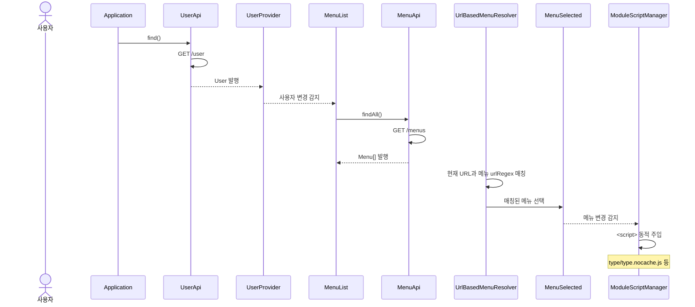
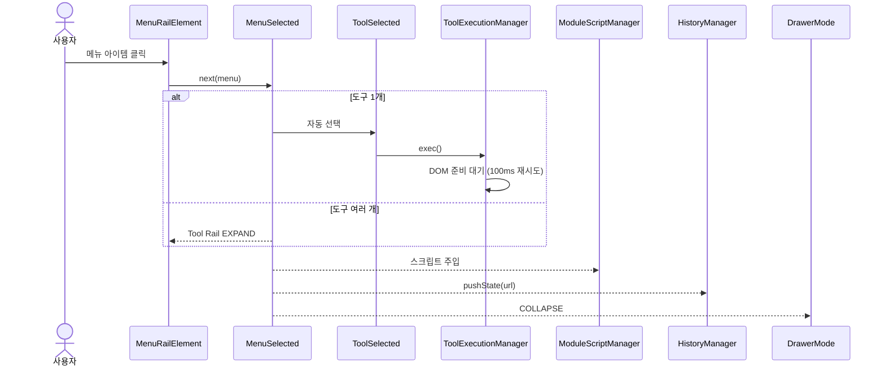
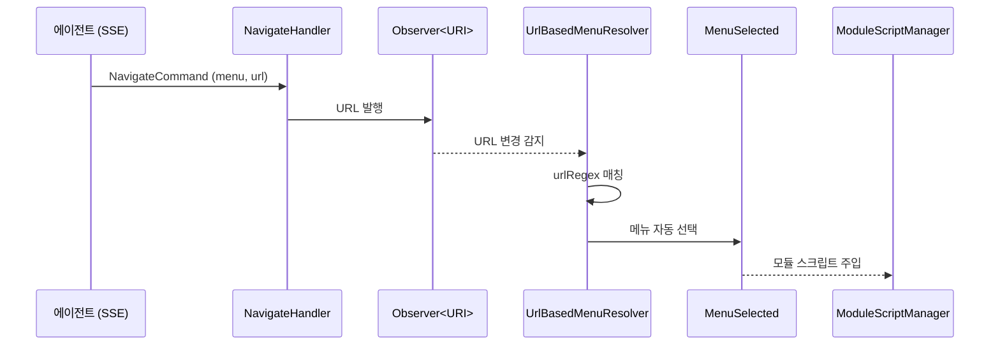
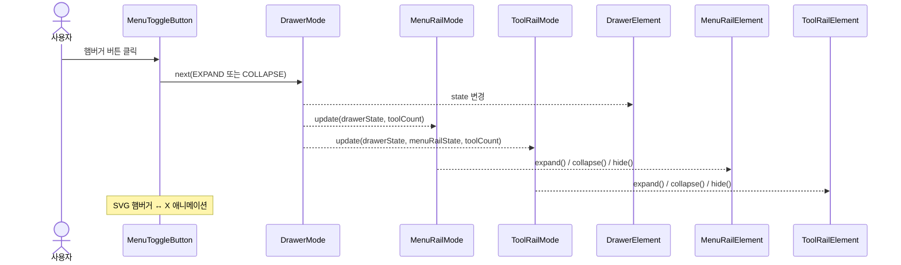
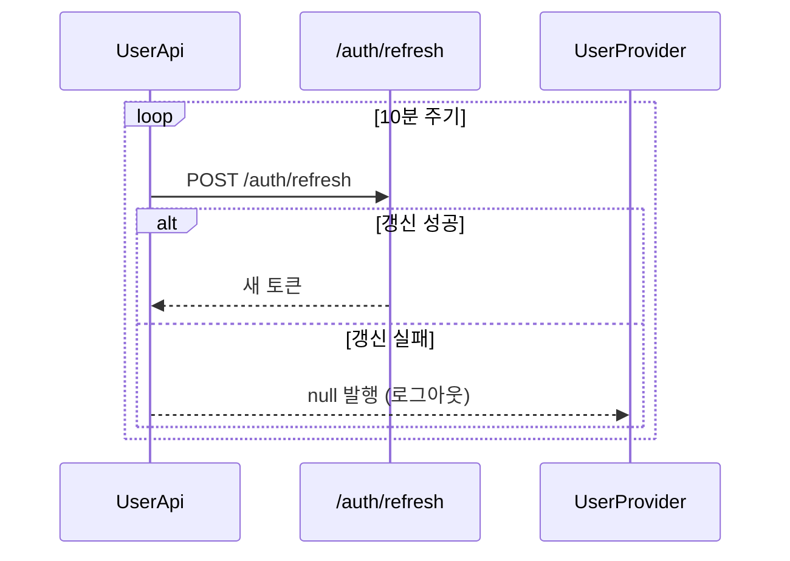
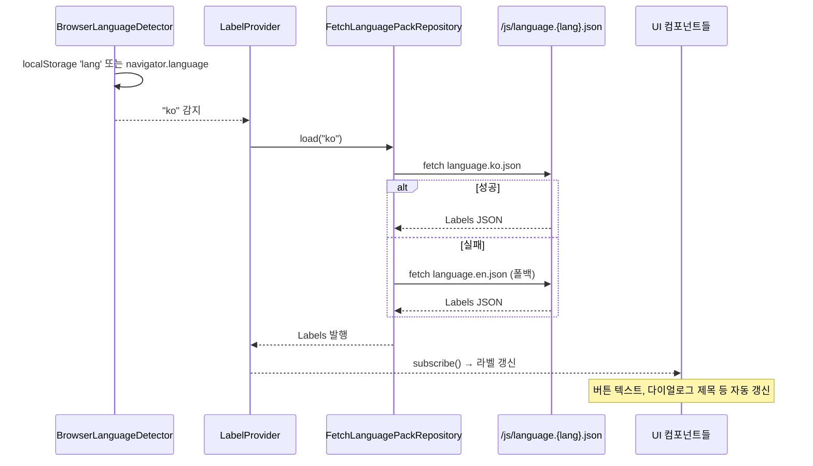
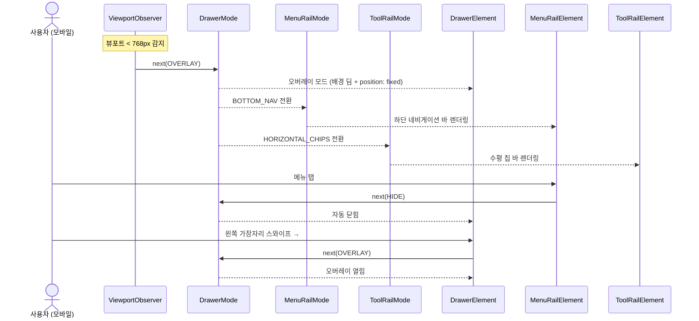

# Shell-UI 유스케이스

## 초기 로딩 → 메뉴 선택 시퀀스

## 메뉴 클릭 → 모듈 로딩 시퀀스

## 에이전트 화면 이동 시퀀스

## Drawer 토글 시퀀스

## 토큰 자동 갱신 시퀀스

## i18n (다국어) 시퀀스

## UC-S1: 사용자 인증 및 초기 로딩

| 항목 | 내용 |
|------|------|
| **액터** | 사용자 |
| **정상 흐름** | 1. 페이지 로드 시 `UserApi`가 `/user` 엔드포인트에서 사용자 정보를 가져온다. 2. `UserProvider`가 사용자를 발행하면 `MenuList`가 `/menus` 엔드포인트에서 메뉴 목록을 로딩한다. 3. `WorkspaceList`가 사용자의 워크스페이스 목록을 추출한다. 4. `DrawerMode`가 COLLAPSE로 전환되고, Drawer UI가 렌더링된다. 5. `UrlBasedMenuResolver`가 현재 URL을 메뉴 정규식과 매칭하여 해당 메뉴를 자동 선택한다. |
| **대안 흐름** | 인증 실패 시(401) 사용자 정보가 null로 발행되고, DrawerMode가 HIDE로 전환된다. |

## UC-S2: 메뉴 선택 및 모듈 로딩

| 항목 | 내용 |
|------|------|
| **액터** | 사용자 |
| **선행조건** | 메뉴 목록 로딩 완료 |
| **정상 흐름** | 1. Menu Rail에서 메뉴 아이템을 클릭한다. 2. `MenuSelected`에 선택된 메뉴가 발행된다. 3. 도구가 1개뿐이면 `ToolSelected`에 자동 선택된다. 4. `ModuleScriptManager`가 메뉴의 `script` 필드에 지정된 JavaScript를 동적으로 `<script>` 태그로 주입한다. 5. `HistoryManager`가 `pushState()`로 URL을 업데이트한다. 6. `DrawerMode`가 COLLAPSE로 전환된다. |
| **대안 흐름** | 도구가 여러 개이면 Tool Rail이 EXPAND되어 도구 목록을 표시한다. |
| **선택 시각 표현** | 선택된 아이템은 `[selected]` 속성이 붙고 (1) 아이콘이 `fa-light` outline → `fa-solid` filled 로 교체되며, (2) `md-item` headline 라벨 색이 `--md-sys-color-primary` 로 변한다. 배경 채움은 사용하지 않는다 (MD3 nav rail 가이드: "선택 시 filled, 미선택 시 outlined"). 아이콘 스왑은 두 weight 를 동시 렌더해 두고 CSS 로 가시성을 토글하는 방식이라 JS 재렌더가 필요 없다. |

## UC-S3: 도구 선택 및 실행

| 항목 | 내용 |
|------|------|
| **액터** | 사용자 |
| **선행조건** | 메뉴 선택 완료, 도구 2개 이상 |
| **정상 흐름** | 1. Tool Rail에서 도구 아이템을 클릭한다. 2. `ToolSelected`에 선택된 도구가 발행된다. 3. `ToolExecutionManager`가 도구의 `ToolFunction.exec()`를 실행한다. 4. DOM 준비가 안 되었으면 100ms 후 재시도한다. 5. `ToolBasedMenuResolver`가 도구의 부모 메뉴를 역추적하여 `MenuSelected`를 동기화한다. |

## UC-S4: URL 기반 딥링크

| 항목 | 내용 |
|------|------|
| **액터** | 사용자 (URL 직접 입력 또는 뒤로가기) |
| **정상 흐름** | 1. 브라우저 URL이 변경된다 (직접 입력 또는 popstate 이벤트). 2. `UrlBasedMenuResolver`가 모든 메뉴의 `urlRegex` 패턴과 현재 URL을 매칭한다. 3. 매칭된 메뉴가 자동 선택된다. 4. UC-S2의 3~6단계가 실행된다. |

## UC-S5: Drawer 토글

| 항목 | 내용 |
|------|------|
| **액터** | 사용자 |
| **정상 흐름** | 1. 햄버거 버튼(MenuToggleButton)을 클릭한다. 2. `DrawerMode`가 EXPAND ↔ COLLAPSE를 토글한다. 3. Menu Rail이 반응: EXPAND(아이콘+텍스트) 또는 COLLAPSE(아이콘만). 4. Tool Rail이 반응: EXPAND → COLLAPSE, 또는 도구 개수/MenuRail 상태에 따라 HIDE. |
| **대안 흐름 (모바일)** | 뷰포트 < 768px일 때 `DrawerMode`가 OVERLAY 상태로 전환된다. EXPAND/COLLAPSE 대신 OVERLAY ↔ HIDE를 토글하며, 메뉴 선택 시 자동으로 HIDE된다. 왼쪽 가장자리 스와이프로도 열 수 있다. |
| **SVG 애니메이션** | 햄버거 아이콘이 EXPAND↔COLLAPSE 전환 시 부드럽게 변형된다. |

## UC-S6: 메뉴 호버 시 도구 미리보기

| 항목 | 내용 |
|------|------|
| **액터** | 사용자 |
| **선행조건** | Drawer가 EXPAND 상태, 도구가 2개 이상인 메뉴 |
| **정상 흐름** | 1. 메뉴 아이템에 마우스를 올린다. 2. `MenuHover`가 호버된 메뉴를 발행한다. 3. `ToolList`가 호버 메뉴의 도구 목록으로 업데이트된다. 4. `MenuHoverElementProvider`가 호버된 아이템의 위치를 추적한다. 5. Tool Rail이 해당 메뉴 아이템 옆에 정렬되어 도구를 미리 표시한다. |

## UC-S7: 워크스페이스 전환

| 항목 | 내용 |
|------|------|
| **액터** | 사용자 |
| **선행조건** | 워크스페이스가 2개 이상 |
| **정상 흐름** | 1. Drawer 상단의 워크스페이스 셀렉트 드롭다운을 클릭한다. 2. 목록에서 워크스페이스를 선택한다. 3. 컨텍스트가 전환되어 해당 워크스페이스의 데이터가 로딩된다. |

## UC-S8: 토큰 자동 갱신

| 항목 | 내용 |
|------|------|
| **액터** | 시스템 (자동) |
| **정상 흐름** | 1. `UserApi`가 10분 주기로 `/auth/refresh`를 호출하여 토큰을 갱신한다. 2. 갱신 실패 시 사용자를 null로 발행하여 로그아웃 상태로 전환한다. |

## UC-S9: 에이전트에 의한 화면 이동

| 항목 | 내용 |
|------|------|
| **액터** | AI 에이전트 |
| **정상 흐름** | 1. agent-ui의 `NavigateHandler`가 `Observer<String> uri`에 URL을 발행한다. 2. `HostSharedModule`의 `BehaviorSubject<String> uri`가 변경을 전파한다. 3. `UrlBasedMenuResolver`가 URL을 메뉴에 매칭한다. 4. 메뉴가 자동 선택되고, 해당 모듈이 로딩된다. |
| **특이사항** | 에이전트의 navigate 커맨드가 Shell의 일반 URL 기반 메뉴 해석과 동일한 경로를 사용한다. |

## UC-S14: 실시간 협업 — 다른 사용자의 변경 이벤트 수신

| 항목 | 내용 |
|------|------|
| **액터** | 시스템 (자동) |
| **선행조건** | 워크스페이스 SSE(`/workspace/{id}/messages`) 스트림 연결 상태 |
| **정상 흐름** | 1. 같은 워크스페이스의 다른 사용자가 데이터를 변경하면 DOCUMENT_CREATED, TYPE_CREATED 등의 이벤트가 Kafka를 통해 발행된다. 2. event-broadcaster가 동일한 SSE 스트림으로 브로드캐스트한다. 3. Shell-UI가 이벤트 타입에 따라 해당 모듈(메뉴, 워크스페이스 목록 등)의 데이터를 자동 갱신한다. |
| **특이사항** | 사용자 변경 이벤트와 에이전트 커맨드(AGENT_COMMAND)가 모두 같은 SSE 스트림으로 전달된다. 모든 참여자(사용자 + 에이전트)가 동일한 이벤트 채널을 공유한다. |

## UC-S10: 다국어 (i18n)

| 항목 | 내용 |
|------|------|
| **액터** | 시스템 (자동) |
| **정상 흐름** | 1. `BrowserLanguageDetector`가 localStorage 또는 navigator.language에서 언어를 감지한다. 2. `FetchLanguagePackRepository`가 `language.{lang}.json`을 fetch한다. 실패 시 `language.en.json`으로 폴백. 3. `LabelProvider`가 Labels를 발행하면 모든 구독 컴포넌트(버튼, 다이얼로그, 메뉴 아이템)의 텍스트가 자동 갱신된다. |
| **특이사항** | type-ui, workspace-ui 등 별도 GWT 모듈도 각자 LabelProvider를 구독하여 i18n 적용. |

## UC-S11: 프레임 전환

| 항목 | 내용 |
|------|------|
| **액터** | 시스템 (메뉴 선택 시 자동) |
| **선행조건** | 메뉴 선택으로 모듈 스크립트가 주입됨 |
| **정상 흐름** | 1. 로딩된 모듈이 `Observer<Render>`에 렌더 콜백을 발행한다. 2. `FrameUpdater`가 `FrameFactory`로 새 `FrameElement`를 생성한다. 3. 이전 프레임에 fadeOut 적용 (100ms) 후 DOM에서 제거. 4. 새 프레임에 fadeIn 적용하여 `ContentElement`에 추가. |

## UC-S12: 진행률 표시

| 항목 | 내용 |
|------|------|
| **액터** | 시스템 (API 호출 또는 에이전트 진행) |
| **정상 흐름** | 1. `MenuApi`/`UserApi`가 API 호출 시 `Observer<Progress>`에 `Progress.indeterminate()`를 발행한다. 2. `ProgressElement`가 구독하여 프로그레스 바를 표시한다. 3. 응답 수신 시 `Progress.hide()`를 발행하여 숨긴다. 4. 에이전트의 `ProgressHandler`도 동일한 `Observer<Progress>`를 사용하여 진행률 표시. |
| **특이사항** | API 로딩과 에이전트 진행률이 단일 프로그레스 바를 공유한다. |

## 모바일 Drawer 전환 시퀀스

## UC-S13: 모바일 반응형 레이아웃

| 항목 | 내용 |
|------|------|
| **액터** | 사용자 (모바일/태블릿 디바이스) |
| **선행조건** | 뷰포트 너비 < 768px |
| **정상 흐름** | 1. `ViewportObserver`가 뷰포트 변경을 감지하여 `DrawerMode`에 `OVERLAY`를 발행한다. 2. `MenuRailMode`가 `BOTTOM_NAV`로 전환되어 하단 네비게이션 바를 렌더링한다. 3. `ToolRailMode`가 `HORIZONTAL_CHIPS`로 전환되어 수평 칩 바를 렌더링한다. 4. 메뉴 선택 시 Drawer가 자동으로 닫힌다. 5. Frame 영역이 전체 뷰포트를 차지한다. |
| **터치 지원** | 화면 왼쪽 가장자리에서 오른쪽으로 스와이프하여 Drawer를 열 수 있다. |

## UC-S15: 사용자 설정 — 언어/테마 퍼시스턴스

| 항목 | 내용 |
|------|------|
| **액터** | 사용자 |
| **선행조건** | 인증 완료, Shell 로딩 완료 |
| **정상 흐름** | 1. 사용자가 설정 패널(Drawer 내 또는 별도 모달)을 연다. 2. 언어(ko/en)를 변경하면 localStorage에 저장되고 `LabelProvider`가 즉시 갱신된다. 3. **MenuRail 의 ThemeToggle 버튼** (sun/moon 아이콘) 을 클릭하면 `<html>` 의 `color-theme` 속성이 light↔dark 로 토글되고 localStorage 에 저장된다. 동시에 `<html>` 에 `theme-changing` 클래스가 500ms 동안 부착되어, 그 구간에만 sun/moon morph 애니메이션이 재생된다. |
| **요구사항** | 6.8 사용자 설정 |
| **상태** | 부분 구현 (UserPreferences, ThemeToggle 구현 완료. 언어 설정 패널 UI 미완) |
| **레이아웃** | `ThemeToggle` 은 `NavigationRailItemElement` 를 상속하여 일반 메뉴와 동일한 `.item > .collapse + md-item` 구조를 갖는다. MenuRail 의 마지막 자식으로 append 되며 `.rail-bottom` 클래스(+ `margin-top: auto`, `order: 1`) 로 하단에 고정. `bottom=true` 메뉴는 `.bottom-menu` 클래스(`order: 2`) 가 붙어 ThemeToggle 의 **아래쪽** 에 배치된다 — 즉 시각 순서는 일반 메뉴(0) → ThemeToggle(1) → bottom 메뉴(2). 모바일 `[bottom-nav]` 에서는 `.rail-bottom` 이 `display: none` 으로 숨겨진다. |
| **i18n** | Headline 텍스트는 `LabelProvider` 를 구독하여 `darkMode` 상태에 따라 `theme.switch_to_dark` / `theme.switch_to_light` 키를 동적으로 바꿔 표시한다. expand 모드에서만 보이며 collapse 모드에서는 아이콘만 노출. |
| **애니메이션** | (1) 색 전환 — 전역 CSS 트랜지션으로 background/color/fill/stroke 가 점진 변화. (2) 아이콘 morph — sun/moon path 를 SVG 안에 동시 렌더. `:root.theme-changing[color-theme='...']` 조합 셀렉터로 rise/set keyframes 를 200ms 적용, 200ms stagger 로 교체. `.theme-changing` 는 클릭 시에만 500ms 부착되므로 드로어 expand/collapse 전환에는 재생되지 않는다. |

## UC-S16: 사용자 설정 패널 UI

| 항목 | 내용 |
|------|------|
| **액터** | 사용자 |
| **선행조건** | Shell 로딩 완료 |
| **정상 흐름** | 1. Drawer 하단 또는 톱바의 설정 아이콘을 클릭한다. 2. 설정 패널이 열리고 언어 선택, 테마 토글 등의 옵션이 표시된다. 3. 변경 사항은 즉시 반영된다. |
| **요구사항** | 6.8 사용자 설정 |
| **상태** | 부분 구현 (ThemeToggle 구현 완료. 독립 설정 패널 UI 미완) |

## UC-S17: 세션 관리

| 항목 | 내용 |
|------|------|
| **액터** | 시스템 (자동) |
| **선행조건** | 사용자 인증 완료 |
| **정상 흐름** | 1. 토큰 만료 전 refresh token을 사용하여 자동 갱신한다. 2. 비활성 타임아웃 5분 전 경고 알림을 표시한다. 3. 세션 만료 시 로그인 페이지로 리다이렉트하고 알림을 표시한다. |
| **요구사항** | 6.11 세션 관리 |
| **상태** | 구현 완료 (SessionManager) |

---

## 트레이서빌리티 매트릭스

| UC | 시퀀스 다이어그램 | 클래스 다이어그램 섹션 | 주요 클래스 | 테스트 |
|----|---|---|---|---|
| UC-S1 (인증) | 초기 로딩 → 메뉴 선택 | 유스케이스, Frame+API | Application, UserApi, UserProvider, MenuList, MenuApi, UrlBasedMenuResolver, MenuSelected, ModuleScriptManager, WorkspaceList, DrawerMode | DrawerTest: 메뉴 초기화, Drawer DOM 존재, 메뉴 토글 버튼, 메뉴 레일 아이템 수 = 메뉴 수, 아이콘 수 = 아이템 수 |
| UC-S2 (메뉴선택) | 메뉴 클릭 → 모듈 로딩 | 유스케이스, Drawer UI | MenuRailElement, MenuRailItemElement, MenuSelected, ToolSelected, ModuleScriptManager, HistoryManager, DrawerMode | DrawerTest: URL 버튼 클릭 → selected 아이템 정확히 1개, 다른 URL 클릭 → 이전 선택 해제 + 새 선택, 선택 아이템에서 `.icon-outline` 숨김·`.icon-filled` 표시, 미선택 아이템은 그 반대 |
| UC-S3 (도구실행) | 메뉴 클릭 → 모듈 로딩 (alt) | 유스케이스, Drawer UI | ToolRailElement, ToolRailItemElement, ToolSelected, ToolExecutionManager | DrawerTest: 메뉴1 도구 ≤1, 메뉴2 도구 >1, 같은 메뉴 다른 Tool URL → 선택 아이템 유지 |
| UC-S4 (딥링크) | 초기 로딩과 동일 경로 | 유스케이스 | UrlBasedMenuResolver, HistoryManager, MenuSelected | DrawerTest: URL hash 변경 → Drawer/레일 아이템 수 유지 |
| UC-S5 (Drawer토글) | Drawer 토글 | 유스케이스, Drawer UI | MenuToggleButton, DrawerMode, MenuRailMode, ToolRailMode, DrawerElement, MenuRailElement, ToolRailElement | DrawerModeTest: MenuRailState/ToolRailState 상태 전이 검증 |
| UC-S6 (호버) | — (단순) | 유스케이스, Drawer UI | MenuHover, MenuHoverElementProvider, ToolList, ToolRailElement | DrawerTest: Tool Rail 영역(.tool-rail) 존재 확인 |
| UC-S7 (워크스페이스) | — (단순) | Drawer UI | WorkspaceSelectElement, WorkspaceList | DrawerTest: 워크스페이스 선택 요소(.workspace-select) 존재 확인 |
| UC-S8 (토큰갱신) | 토큰 자동 갱신 | Frame+API | UserApi(periodicRefresh, REFRESH_INTERVAL) | ApiTest: 사용자 정보 로드, 사용자 ID/이름 표시, 주기적 갱신 설정 확인 |
| UC-S9 (에이전트) | 에이전트 화면 이동 | 유스케이스 | UrlBasedMenuResolver, MenuSelected, ModuleScriptManager, HostSharedModule(uri) | UrlBasedMenuResolverTest: 에이전트 navigate 커맨드 URL 패턴 처리 검증 |
| UC-S10 (i18n) | i18n (다국어) | Frame+API | BrowserLanguageDetector, FetchLanguagePackRepository, LabelProvider | DrawerTest: 메뉴 아이템에 텍스트 라벨 존재 확인 |
| UC-S11 (프레임전환) | — (단순) | Frame+API | FrameUpdater, FrameFactory, FrameElement, ContentElement | FrameTest: 컨테이너 존재, 초기 프레임 0개, 렌더러1 → 프레임 1개 + 텍스트 "Hello, World!!", 렌더러2 → 교체 + "2nd Renderer rendered", 재전환 → 프레임 1개 유지 |
| UC-S12 (진행률) | — (단순) | Frame+API | ProgressElement, Observer\<Progress\> | ProgressTest: 컨테이너/라벨 존재, 초기 opacity=0, indeterminate → opacity=1 + 라벨 숨김, 30% → "처리 중" + "3/10", 70% → "거의 완료" + "7/10", 100% → "완료" + "10/10", hide → opacity=0, 재표시 검증 |
| UC-S13 (모바일) | 모바일 Drawer 전환 | Drawer UI | ViewportObserver, DrawerMode(OVERLAY), MenuRailMode(BOTTOM_NAV), ToolRailMode(HORIZONTAL_CHIPS), DrawerElement | DrawerModeTest: OVERLAY→BOTTOM_NAV, OVERLAY→HORIZONTAL_CHIPS 상태 전이 검증 |
| UC-S14 (실시간협업) | — (SSE 이벤트 수신) | Frame+API | SSE /workspace/{id}/messages, 이벤트 타입별 UI 갱신 | UrlBasedMenuResolverTest: SSE 이벤트 기반 메뉴 갱신 검증 |
| UC-S15 (언어/테마) | — | Drawer UI | UserPreferences (activity), ThemeToggle (NavigationRailItemElement 상속, `.rail-bottom` 하단 고정, i18n headline, theme-changing 500ms 애니메이션 트리거), BrowserLanguageDetector, LabelProvider | DrawerTest: `.rail .rail-bottom.item` 존재, `.collapse` SVG 와 `md-item` start slot SVG 동시 렌더, 초기 color-theme light/dark, 클릭 시 토글 + theme-changing 클래스 일시 부착, expand 시 `.collapse` 숨김 / `md-item` 표시, bottom-menu 가 rail-bottom 아래 순서 |
| UC-S16 (설정패널) | — | Drawer UI | ThemeToggle (DrawerElement 내 통합), UserPreferences | ❌ 테스트 미작성 (ThemeToggle 구현 완료, 설정 패널 UI 미완) |
| UC-S17 (세션관리) | — | Frame+API | SessionManager, FetchApi, ToastContainer, LabelProvider | ❌ 테스트 미작성 (SessionManager 구현 완료) |
| UC-S18 (빈 상태 UI) | — | Frame+API | EmptyStateElement, ContentElement | ❌ 미구현 (계획) |
| UC-S19 (성공 피드백) | — | Frame+API | ToastContainer | ❌ 미구현 (계획) |
