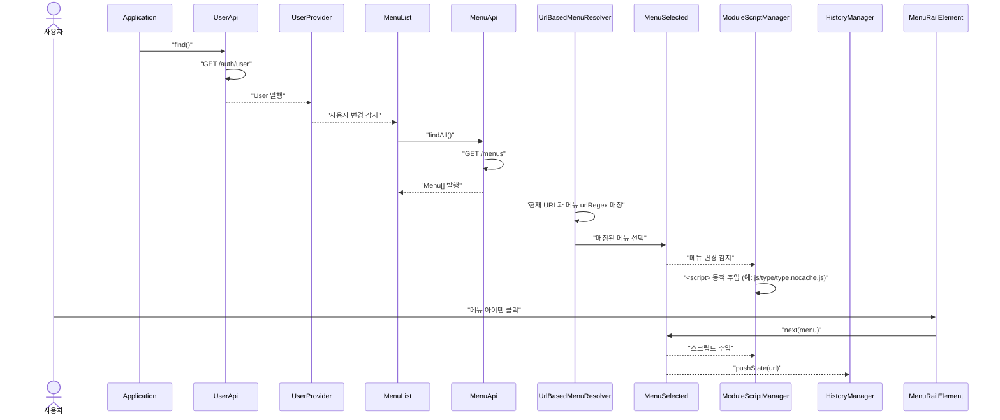
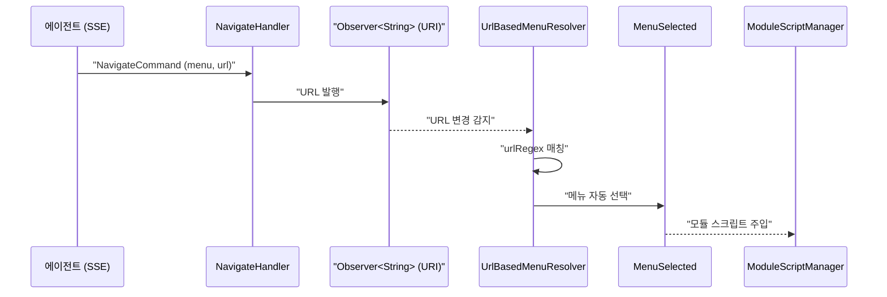
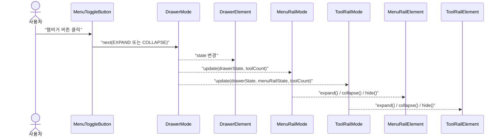
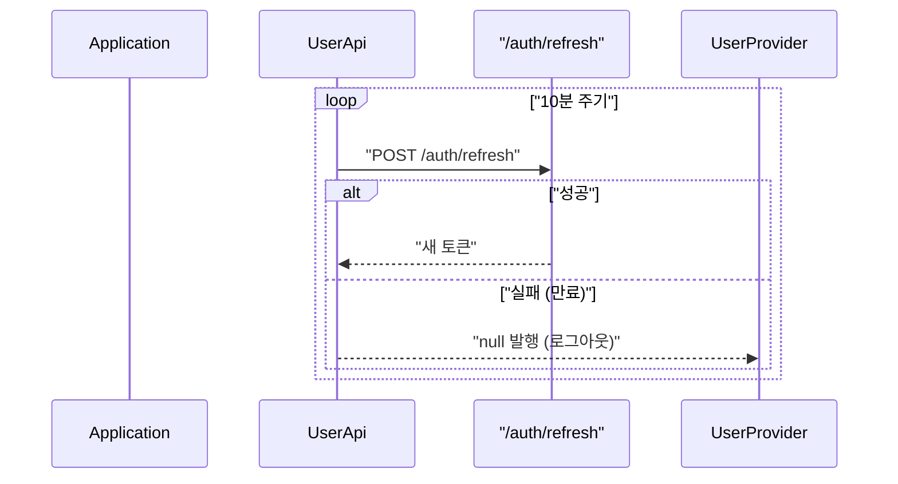
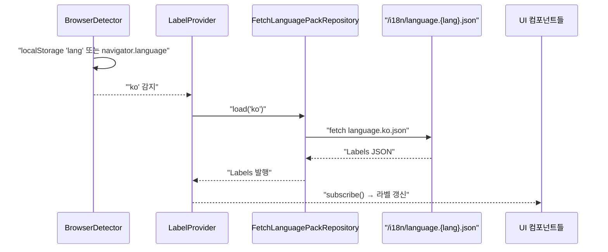
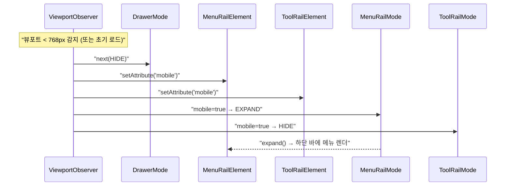

# Shell-UI 유스케이스

## 초기 로딩 → 메뉴 선택 시퀀스

## 에이전트 화면 네비게이션 시퀀스

## 햄버거 토글 (데스크톱) 시퀀스

## 세션 유지 (Token Refresh) 시퀀스

## 다국어 라벨 로딩 시퀀스

## 모바일 반응형 전환 시퀀스

---

## UC-S1: 홈 화면 진입 (워크스페이스 자동 선택)

| 항목 | 내용 |
|------|------|
| **액터** | 사용자 |
| **선행조건** | 로그인 완료 |
| **정상 흐름** | 1. 사용자가 앱에 접속한다. 2. `UserApi.find()`로 사용자 정보를 조회한다. 3. `WorkspaceRepository.list()`로 참여 중인 워크스페이스 목록을 가져온다. 4. 마지막으로 접속했던 워크스페이스 ID를 `SessionContext`에 설정한다. 5. 해당 워크스페이스의 메뉴를 로딩한다. |

## UC-S2: 메뉴 선택

| 항목 | 내용 |
|------|------|
| **액터** | 사용자 |
| **정상 흐름** | 1. Menu Rail에서 메뉴 아이템을 클릭한다. 2. `MenuSelected`에 선택된 메뉴가 발행된다. 3. 도구가 1개뿐이면 `ToolSelected`에 자동 선택된다. 4. `ModuleScriptManager`가 메뉴의 `script` 필드에 지정된 JavaScript를 동적으로 `<script>` 태그로 주입한다. 5. `HistoryManager`가 `pushState()`로 URL을 업데이트한다. 6. `DrawerMode`가 COLLAPSE로 전환된다. |

## UC-S4: 딥링크 (URL 기반 라우팅)

| 항목 | 내용 |
|------|------|
| **액터** | 사용자 |
| **정상 흐름** | 1. 브라우저 URL이 변경된다 (직접 입력 또는 popstate 이벤트). 2. `UrlBasedMenuResolver`가 모든 메뉴의 `urlRegex` 패턴과 현재 **pathname**(정규화된 경로)을 매칭한다. 3. 매칭된 메뉴가 자동 선택된다. 4. UC-S2의 3~6단계가 실행된다. |

## UC-S14: 실시간 협업 (SSE)

| 항목 | 내용 |
|------|------|
| **액터** | 사용자, AI 에이전트 |
| **선행조건** | 워크스페이스 SSE(`/workspaces/{id}/messages`) 스트림 연결 상태 |
| **정상 흐름** | 1. 다른 사용자가 메뉴 구성을 변경하거나 새로운 알림을 발생시킨다. 2. Kafka 이벤트를 통해 정보가 전파된다. 3. `event-broadcaster`가 SSE 스트림으로 이벤트를 푸시한다. 4. `WorkspaceEventListener`가 이벤트를 수신하여 `MenuList` 등을 실시간으로 갱신한다. |

## UC-S19: 모듈 렌더링 및 마운트 (Frame Mount)

| 항목 | 내용 |
|------|------|
| **액터** | 개별 UI 모듈 (시스템) |
| **정상 흐름** | 1. 로딩된 모듈이 `WindowRenderBridge.next(render)` 로 Render 콜백(`HTMLElement frame -> boolean`)을 발행한다 — 자기 컨테이너를 body 에 직접 append 하지 않는다 (`docs/contracts/frame.md`). 2. shell 의 `ShellInitializer` 에서 `WindowRenderBridge.register` 로 등록된 Observer 가 Render 를 `FrameUpdater` 에 전달. 3. `FrameUpdater`가 `FrameFactory`로 새 `FrameElement` 를 생성 → Render 의 `onInvoke(frame.element())` 호출 → 모듈이 frame 내부에 DOM append. 4. 이전 프레임에 fadeOut 적용 (100ms) 후 DOM에서 제거. 5. 새 프레임에 fadeIn 적용하여 `ContentElement` 에 추가. `.frame` 은 AppBar / MobileTabs / rail collapse 오프셋을 고려한 여백 내부에 배치됨. |

## UC-S20: 브릿지 게시 (Bridge Publishing)

| 항목 | 내용 |
|------|------|
| **액터** | Shell UI (시스템) |
| **정상 흐름** | 1. `ShellInitializer.publishBridges()`가 `WindowProgressBridge.register()`, `WindowUriBridge.register()`, `WindowLabelBridge.publish()`를 호출하여 shell의 Progress/URI/Label 상태를 window 객체에 등록한다. 2. `handbook-shell-ready` CustomEvent를 dispatch한다. 3. agent-ui 등 독립 GWT 모듈이 이 이벤트를 수신하고 브릿지를 통해 shell 상태에 접근한다. |

## UC-S21: 빈 워크스페이스 자동 온보딩 (UC-12)

| 항목 | 내용 |
|------|------|
| **액터** | Shell UI (시스템) |
| **선행조건** | 참여 중인 워크스페이스 목록이 비어 있음 |
| **정상 흐름** | 1. `WorkspaceOnboardingBootstrapper`가 빈 `WorkspaceList`를 감지한다. 2. 가상 온보딩 `Menu`를 `MenuSelected`에 1회 push한다. 3. `ModuleScriptManager`가 `onboarding-ui` 모듈을 로드한다. 4. 사용자가 워크스페이스를 생성하거나 조인할 때까지 온보딩 화면이 유지된다. |

---

## 트레이서빌리티 매트릭스

| UC | 시퀀스 다이어그램 | 주요 클래스 | 테스트 |
|----|---|---|---|
| UC-S1 (진입) | 초기 로딩 | UserProvider, WorkspaceRepository, SessionContext | — |
| UC-S2 (메뉴) | 초기 로딩 | MenuList, MenuSelected, ModuleScriptManager, HistoryManager | DrawerTest: 메뉴 클릭 시 URL 변경 및 모듈 로딩 확인 |
| UC-S4 (라우팅) | — | UrlBasedMenuResolver, HistoryManager | DrawerTest: URL 변경 시 메뉴 자동 선택 검증 |
| UC-S10 (다국어) | 다국어 라벨 로딩 | LabelProvider, FetchLanguagePackRepository, BrowserDetector | — |
| UC-S14 (협업) | — | WorkspaceEventListener, event-broadcaster | UrlBasedMenuResolverTest: SSE 이벤트 기반 메뉴 갱신 검증 |
| UC-S18 (모바일) | 모바일 전환 | ViewportObserver, MobileTabsPresenter, DrawerMode | — |
| UC-S19 (마운트) | — | WindowRenderBridge, FrameUpdater, FrameFactory | FrameTest: Render 발행 시 프레임 생성 및 컨텐츠 삽입 검증 |
| UC-S20 (브릿지) | — | ShellInitializer, WindowProgressBridge, WindowUriBridge, WindowLabelBridge | ❌ 테스트 미작성 (구현 완료) |
| UC-S21 (온보딩) | — | WorkspaceOnboardingBootstrapper, WorkspaceList, onboarding-ui | WorkspaceOnboardingTest: 빈 워크스페이스 감지 시 온보딩 로드 검증 |
