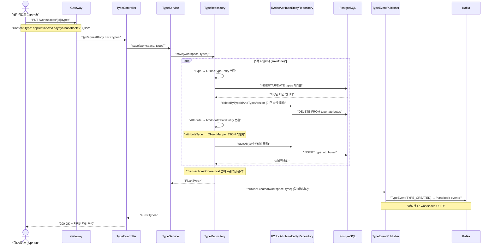
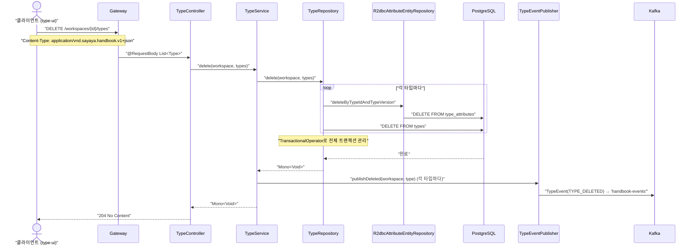
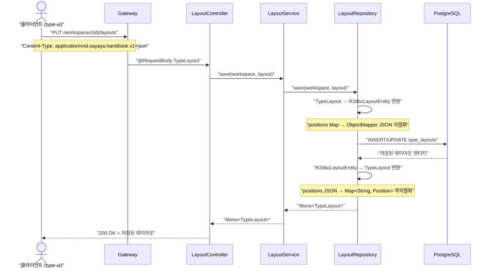
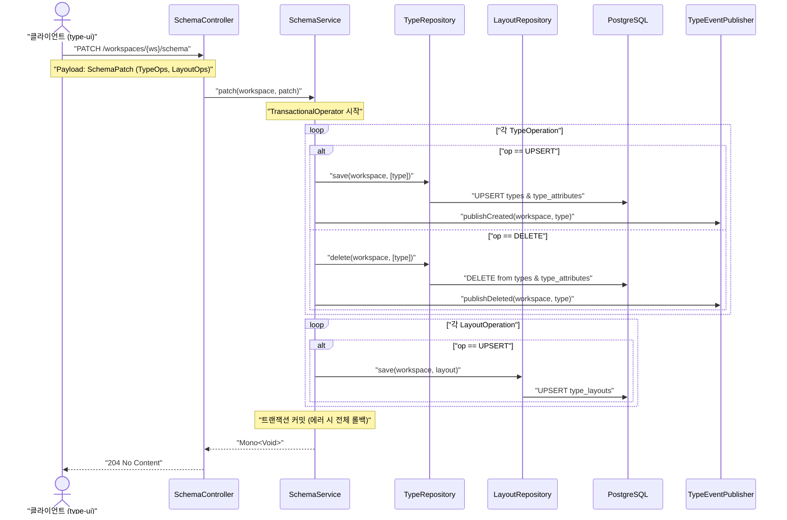
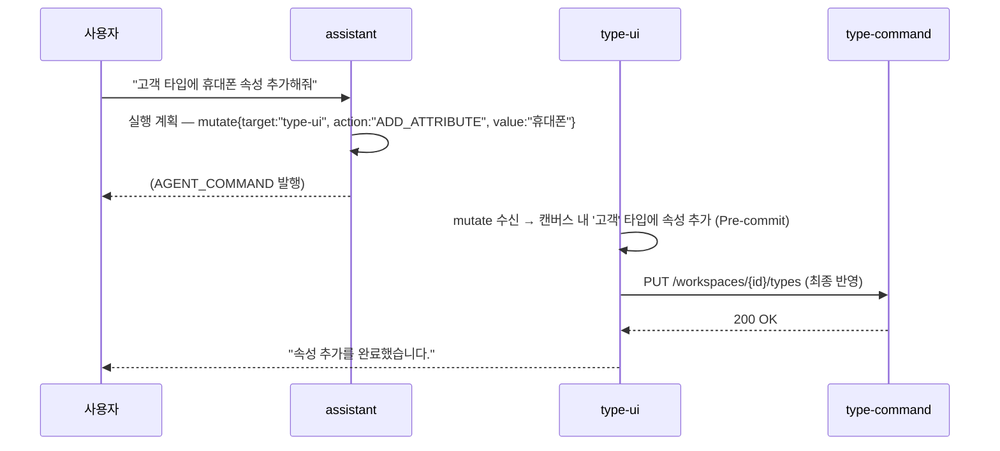

# Persist-Type 유스케이스

## 타입 저장 시퀀스

## 타입 삭제 시퀀스

## 레이아웃 저장 시퀀스

## 스키마 일괄 패치 시퀀스 (Atomic Patch)

---

## UC-PT1: 타입 생성 및 업데이트

| 항목 | 내용 |
|------|------|
| **액터** | 사용자 (type-ui) |
| **정상 흐름** | 1. 클라이언트가 `PUT /workspaces/{id}/types`로 타입 목록을 전송한다. 2. `TypeService`가 트랜잭션 내에서 타입을 저장한다. 3. 기존 속성을 삭제하고 새 속성을 `type_attributes` 테이블에 저장한다. 4. 저장 완료 후 `TYPE_CREATED` 이벤트를 Kafka에 발행한다. |
| **결과** | 타입 정보가 영구 저장되고 협업자들에게 실시간 알림이 전송된다. |

## UC-PT2: 타입 삭제

| 항목 | 내용 |
|------|------|
| **액터** | 사용자 (type-ui) |
| **정상 흐름** | 1. 클라이언트가 `DELETE /workspaces/{id}/types`로 삭제할 타입 목록을 전송한다. 2. `TypeService`가 관련 속성과 타입을 삭제한다. 3. 삭제 완료 후 `TYPE_DELETED` 이벤트를 Kafka에 발행한다. |
| **결과** | 타입 정보가 삭제되고 관련 데이터 정합성이 유지된다. |

## UC-PT3: 레이아웃 저장

| 항목 | 내용 |
|------|------|
| **액터** | 사용자 (type-ui) |
| **정상 흐름** | 1. 클라이언트가 `PUT /workspaces/{id}/layouts`로 레이아웃 정보를 전송한다. 2. `LayoutService`가 `type_layouts` 테이블에 위치 정보를 JSON으로 저장한다. 3. 저장된 레이아웃 정보를 반환한다. |

## UC-PT5: 스키마 일괄 패치 (Atomic Patch)

| 항목 | 내용 |
|------|------|
| **액터** | 사용자 (type-ui) |
| **정상 흐름** | 1. 클라이언트가 `PATCH /workspaces/{ws}/schema`로 타입 및 레이아웃 변경 내역을 전송한다. 2. `SchemaService`가 **단일 DB 트랜잭션**을 시작한다. 3. 포함된 모든 타입 조작(생성/수정/삭제)을 수행하고 Kafka 이벤트를 발행한다. 4. 포함된 모든 레이아웃 조작(UPSERT)을 수행한다. 5. 모든 작업 성공 시 트랜잭션을 커밋한다. |
| **결과** | 스키마 진화(버전 생성)와 레이아웃 변경이 원자적으로 저장되어 데이터 정합성이 보장된다. |

---

## 트레이서빌리티 매트릭스

| UC | 제목 | 구현체 | 테스트 | 상태 |
|----|------|--------|--------|------|
| UC-PT1 | 타입 저장 | `TypeController.save()` | `TypeControllerTest`, `TypeServiceTest` | 구현 |
| UC-PT2 | 타입 삭제 | `TypeController.delete()` | `TypeControllerTest`, `TypeServiceTest` | 구현 |
| UC-PT3 | 레이아웃 저장 | `LayoutController.save()` | `LayoutControllerTest`, `LayoutServiceTest` | 구현 |
| UC-PT4 | 이벤트 발행 | `KafkaTypeEventPublisher` | `KafkaTypeEventPublisherTest` | 구현 |
| UC-PT5 | 스키마 일괄 패치 | `SchemaController.patch()` | `SchemaServiceTest` | 구현 완료 |
| UC-82 | 에이전트 mutate | `TypeController` (PUT/DELETE) | `CollaborationTest` (type-ui) | 구현 |

---

## 에이전트 연동 시나리오

### 시나리오 1 — 내부 assistant 의 mutate

사용자가 assistant 에게 **"고객 타입에 '휴대폰' 속성 추가해줘"** 요청 → assistant 가 `mutate` 커맨드 발행.

## 에이전트 연동 체크리스트

| # | 항목 | 값 | 비고 |
|---|------|---|------|
| 1 | 내부 assistant 연동 | `AGENT_COMMAND` mutate 타겟 | 타입 구조 변경 및 레이아웃 조정 |
| 2 | 외부 AI Tool Use | `save_types`, `delete_types`, `patch_schema` | OpenAPI operationId |
| 3 | OpenAPI 어노테이션 | `@Operation` 적용 완료 | `TypeController`, `LayoutController`, `SchemaController` |
| 4 | 감사 경로 | `AuditEntry` 발행 | 데이터 변경 추적 |
| 5 | Agent Command 타겟 | selector: `[data-type-key]`, `.type-editor` | `type-ui` 요소 강조 및 수정 |
