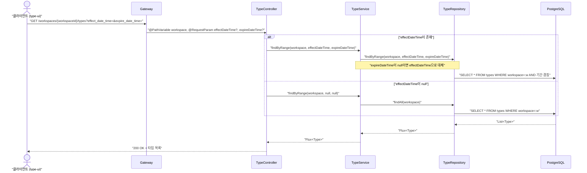
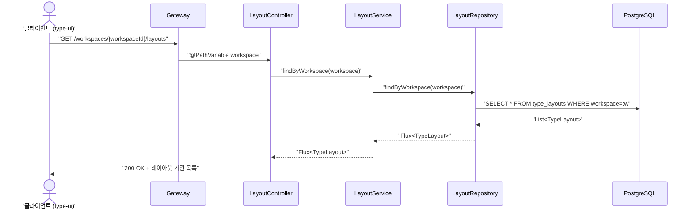
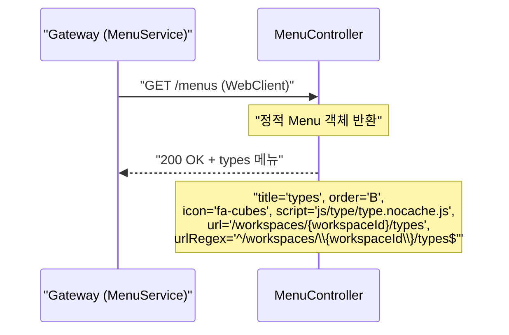
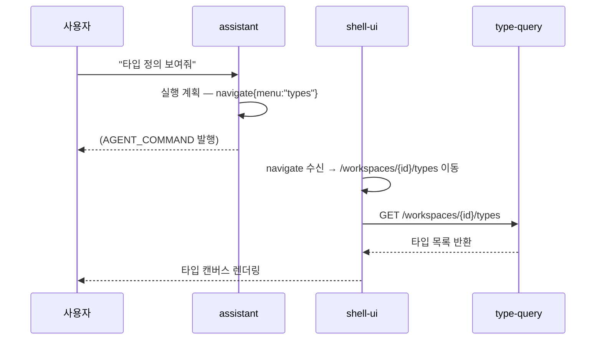

# Search-Type 유스케이스

## 타입 목록 조회 시퀀스

## 레이아웃 기간 목록 조회 시퀀스

## 메뉴 제공 시퀀스

---

## UC-ST1: 타입 목록 조회

| 항목 | 내용 |
|------|------|
| **액터** | 사용자 (type-ui) |
| **정상 흐름** | 1. 클라이언트가 `GET /workspaces/{id}/types`로 타입 목록을 요청한다. 2. `TypeService`가 워크스페이스 내 모든 타입을 조회하여 반환한다. 3. 기간 파라미터가 있으면 해당 시점에 유효한 타입을 필터링한다. |
| **결과** | 현재 워크스페이스에서 정의된 모든 타입 정보(속성 포함)를 확인할 수 있다. |

## UC-ST2: 레이아웃 조회

| 항목 | 내용 |
|------|------|
| **액터** | 사용자 (type-ui) |
| **정상 흐름** | 1. 클라이언트가 `GET /workspaces/{id}/layouts`를 호출한다. 2. `LayoutService`가 저장된 레이아웃 목록(기간별 위치 정보)을 반환한다. |

## UC-ST3: 메뉴 제공

| 항목 | 내용 |
|------|------|
| **액터** | Gateway (MenuService) |
| **정상 흐름** | 1. Gateway가 `/menus`를 호출한다. 2. `MenuController`가 'types' 메뉴 정보(icon, script, url 패턴)를 반환한다. |

---

## 트레이서빌리티 매트릭스

| UC | 제목 | 구현체 | 테스트 | 상태 |
|----|------|--------|--------|------|
| UC-ST1 | 타입 목록 조회 | `TypeController.list()` | `TypeControllerTest`, `TypeServiceTest` | 구현 |
| UC-ST2 | 레이아웃 조회 | `LayoutController.list()` | `LayoutControllerTest`, `LayoutServiceTest` | 구현 |
| UC-ST3 | 메뉴 제공 | `MenuController.menus()` | `MenuControllerTest` | 구현 |
| UC-ST4 | 버전 히스토리 조회 | `TypeController.versions()` | `TypeControllerDiffTest` | 구현 |
| UC-81 | 에이전트 navigate | `MenuController` | `MenuControllerTest` | 구현 |

---

## 에이전트 연동 시나리오

### 시나리오 1 — 내부 assistant 의 navigate

사용자가 assistant 에게 **"타입 정의 보여줘"** 요청 → assistant 가 `navigate` 발행.

## 에이전트 연동 체크리스트

| # | 항목 | 값 | 비고 |
|---|------|---|------|
| 1 | 내부 assistant 연동 | `AGENT_COMMAND` navigate 타겟 | 타입 캔버스 진입 |
| 2 | 외부 AI Tool Use | `list_types`, `get_type_history` | OpenAPI operationId |
| 3 | OpenAPI 어노테이션 | `@Operation` 적용 완료 | `TypeController`, `LayoutController` |
| 4 | 감사 경로 | `AuditEntry` 발행 | 조회 이력 추적 |
| 5 | Agent Command 타겟 | URL 패턴: `^/workspaces/\{workspaceId\}/types$` | `shell-ui` 메뉴 정규식과 동기화 |
