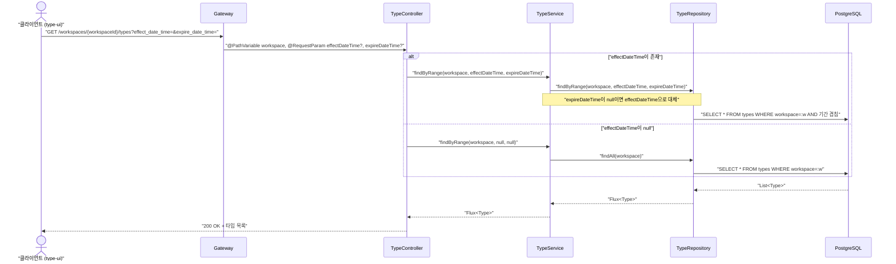
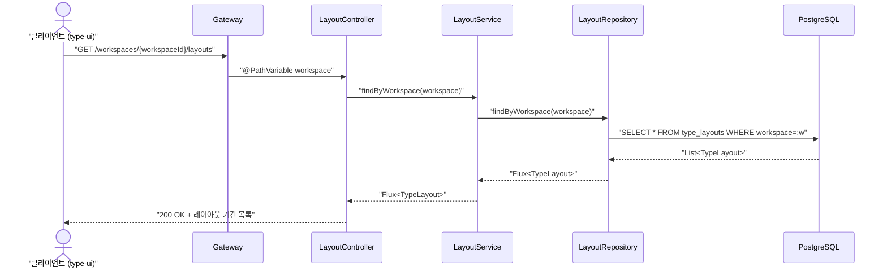
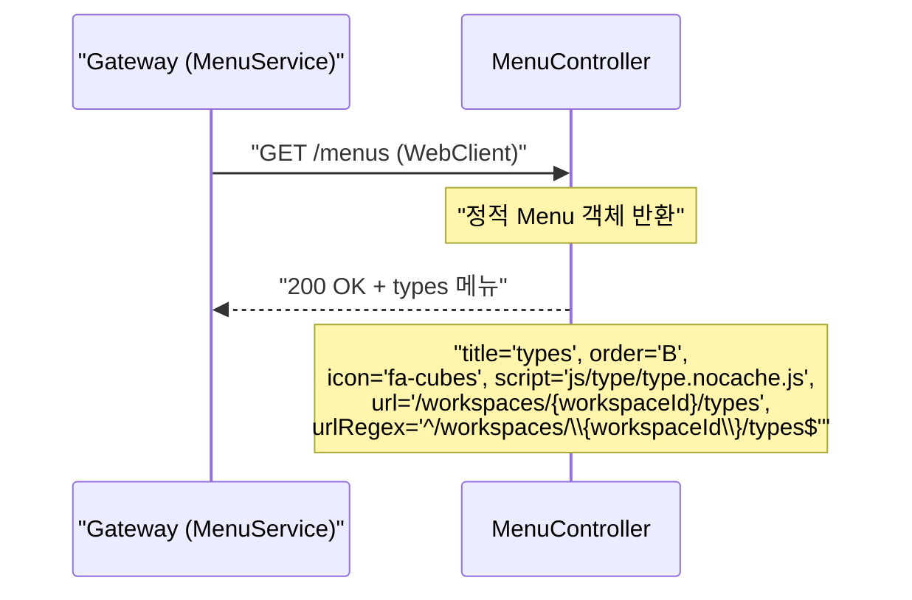

# Search-Type 유스케이스

## 타입 목록 조회 시퀀스

## 레이아웃 기간 목록 조회 시퀀스

## 메뉴 제공 시퀀스

---

...
| UC-ST3 (메뉴 제공) | 3.11 (Shell - Menu Rail) | 메뉴 제공 | MenuController | - |
| UC-ST4 (버전 히스토리 조회) | 6.12 | — | TypeController.versions(), TypeSearchService.findVersions() | ❌ 테스트 미작성 (구현 완료) |
