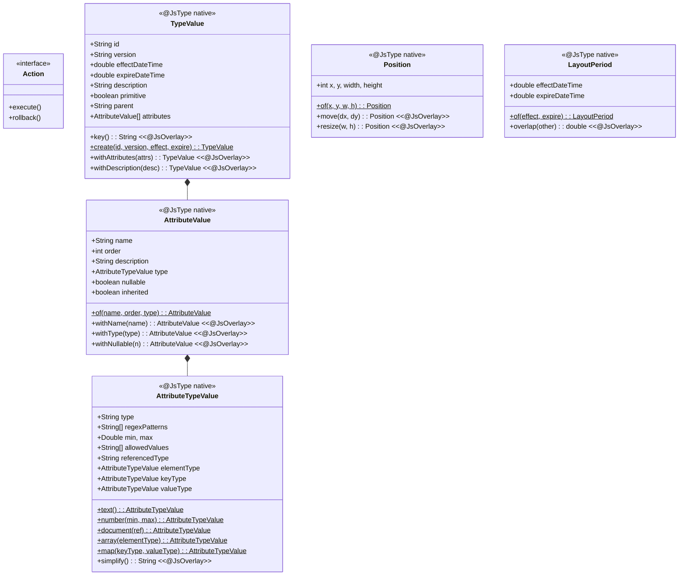
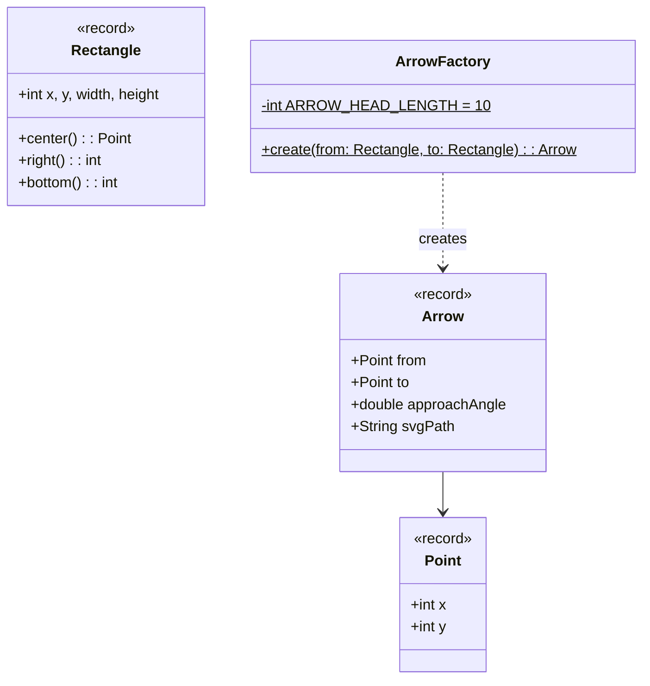
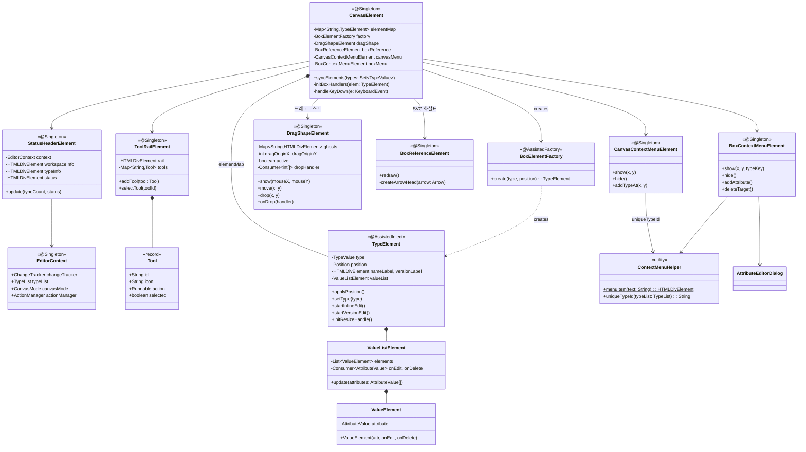
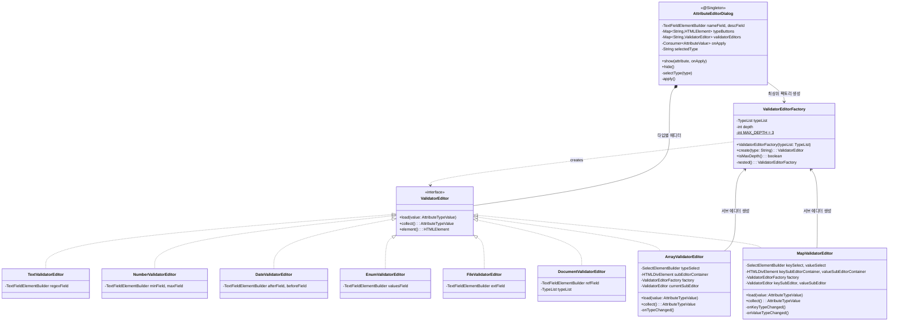
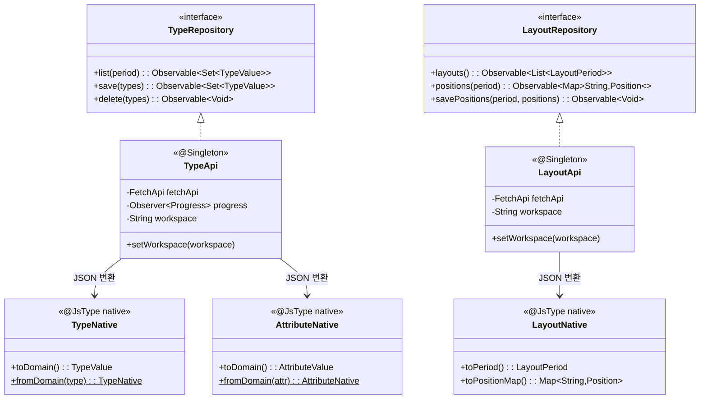
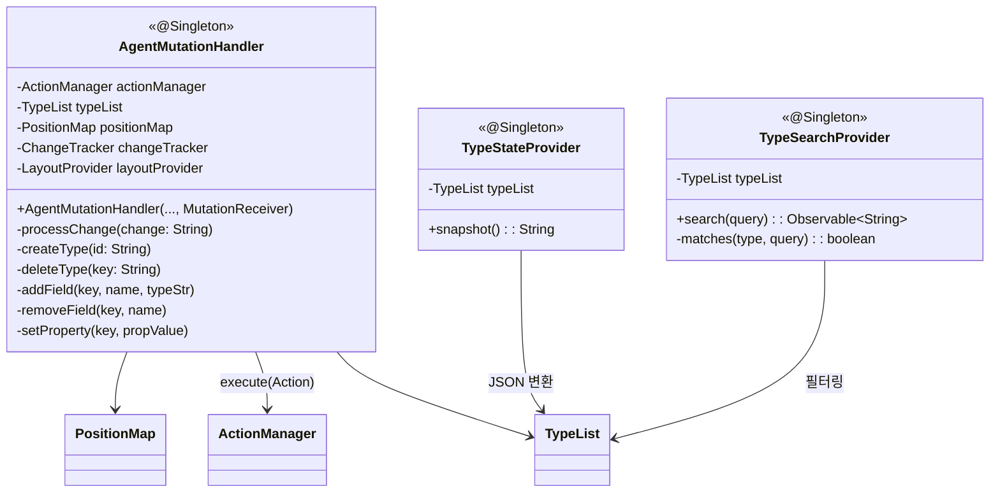

# Type-UI 클래스 다이어그램

## 도메인



## 상태 관리 (Usecase)

```mermaid
classDiagram
    class TypeList {
        <<@Singleton>>
        -BehaviorSubject~Set~TypeValue~~ subject
        +getValue(): Set~TypeValue~
        +replace(types: Set~TypeValue~)
        +add(type: TypeValue)
        +remove(type: TypeValue)
        +update(before, after: TypeValue)
    }
    class PositionMap {
        <<@Singleton>>
        -BehaviorSubject~Map~String,Position~~ subject
        +getValue(): Map~String,Position~
        +get(typeKey): Position
        +put(typeKey, position)
        +move(typeKey, dx, dy)
        +replace(map)
    }
    class LayoutList {
        <<@Singleton>>
        -BehaviorSubject~List~LayoutPeriod~~ subject
        +getValue(): List~LayoutPeriod~
        +next(periods)
    }
    class LayoutProvider {
        <<@Singleton>>
        -BehaviorSubject~LayoutPeriod~ subject
        +getValue(): LayoutPeriod
        +next(period)
        +selectBestMatch(periods)
    }
    class ChangeTracker {
        <<@Singleton>>
        -Map~String,ChangeState~ states
        +getState(typeKey): ChangeState
        +markChanged(typeKey)
        +markDeleted(typeKey)
        +unmark(typeKey)
        +reset()
        +hasChanges(): boolean
        +getChangedKeys(): Set~String~
        +getDeletedKeys(): Set~String~
    }
    class CanvasMode {
        <<@Singleton>>
        -BehaviorSubject~Mode~ subject
        +setMode(mode)
        +isEditable(): boolean
        +isLayoutMode(): boolean
        +isTypeMode(): boolean
    }
    class GridSnap {
        <<@Singleton>>
        -boolean enabled
        +GRID_SIZE: int = 20$
        +snap(value): int
        +snapDelta(currentPos, delta): int
    }
    class ActionManager {
        <<@Singleton>>
        -LinkedList~Action~ undoStack
        -LinkedList~Action~ redoStack
        -BehaviorSubject~Boolean~ canUndo
        -BehaviorSubject~Boolean~ canRedo
        +execute(action: Action)
        +undo()
        +redo()
        +clear()
    }
    class SelectedBoxElement {
        <<@Singleton>>
        -BehaviorSubject~Set~String~~ subject
        +select(typeKey)
        +toggle(typeKey)
        +clear()
        +isSelected(typeKey): boolean
    }
    class PeriodRecalculationService {
        <<@Singleton>>
        +PeriodRecalculationService(TypeList, LayoutList, LayoutProvider)
    }

    PeriodRecalculationService --> TypeList : 구독
    PeriodRecalculationService --> LayoutList : 갱신
    PeriodRecalculationService --> LayoutProvider : best match 선택

    class ChangeState {
        <<enum>>
        NOT_CHANGED
        CHANGED
        DELETED
    }
    ChangeTracker --> ChangeState
    CanvasStateContext --> CanvasState
    CanvasState <|.. ViewState
    CanvasState <|.. LayoutState
    CanvasState <|.. TypeState
```



## Action 계층

```mermaid
classDiagram
    class Action {
        <<interface>>
        +execute()
        +rollback()
    }
    class CreateBoxAction {
        -TypeList typeList
        -PositionMap positionMap
        -ChangeTracker tracker
        -TypeValue type
        -Position position
    }
    class DeleteBoxAction {
        -TypeList typeList
        -ChangeTracker tracker
        -TypeValue type
        -ChangeState previousState
    }
    class EditBoxAction {
        -TypeList typeList
        -ChangeTracker tracker
        -TypeValue before
        -TypeValue after
    }
    class MoveBoxAction {
        -PositionMap positionMap
        -Set~String~ typeKeys
        -int dx, dy
    }
    class ResizeBoxAction {
        -PositionMap positionMap
        -String typeKey
        -Position before, after
    }
    class PushOutOverlapAction {
        -PositionMap positionMap
        -String sourceKey
        -int padding
        -Map~String,Position~ originalPositions
        +calculate(): Map~String,Position~
    }
    class ComplexAction {
        -List~Action~ actions
        +execute() 순서대로
        +rollback() 역순
    }
    class ChangeLayoutAction {
        -LayoutProvider provider
        -LayoutPeriod before, after
    }
    class LoadAction {
        -TypeRepository, LayoutRepository
        -TypeList, PositionMap, ChangeTracker
        -ActionManager, LayoutProvider, LayoutList
    }
    class SaveAction {
        -TypeRepository, LayoutRepository
        -TypeList, PositionMap, ChangeTracker
        -ActionManager, LayoutProvider
    }

    Action <|.. CreateBoxAction
    Action <|.. DeleteBoxAction
    Action <|.. EditBoxAction
    Action <|.. MoveBoxAction
    Action <|.. ResizeBoxAction
    Action <|.. PushOutOverlapAction
    Action <|.. ComplexAction
    Action <|.. ChangeLayoutAction
    Action <|.. LoadAction
    Action <|.. SaveAction
    ComplexAction *-- Action : actions[]
    ActionManager --> Action : execute/undo/redo
```



## 화살표 (Arrow)



## 캔버스 + UI 컴포넌트



## 속성 편집 다이얼로그



## API 어댑터



## 에이전트 연동


rovider --> TypeList : 필터링
```
ean
    }

    AgentMutationHandler --> ActionManager : execute(Action)
    AgentMutationHandler --> TypeList
    AgentMutationHandler --> PositionMap
    TypeStateProvider --> TypeList : JSON 변환
    TypeSearchProvider --> TypeList : 필터링
```
