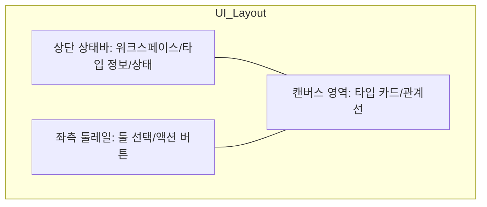
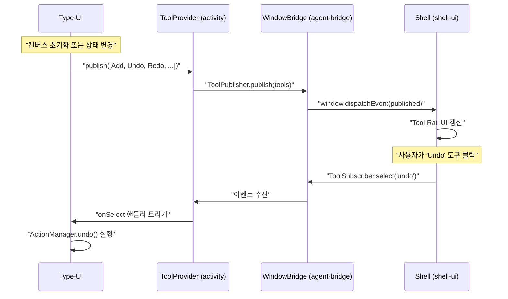
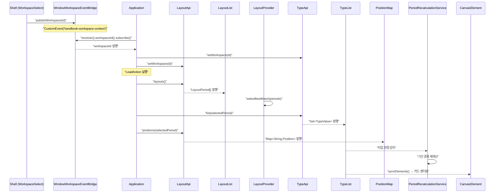
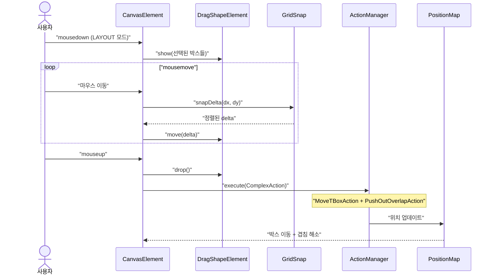
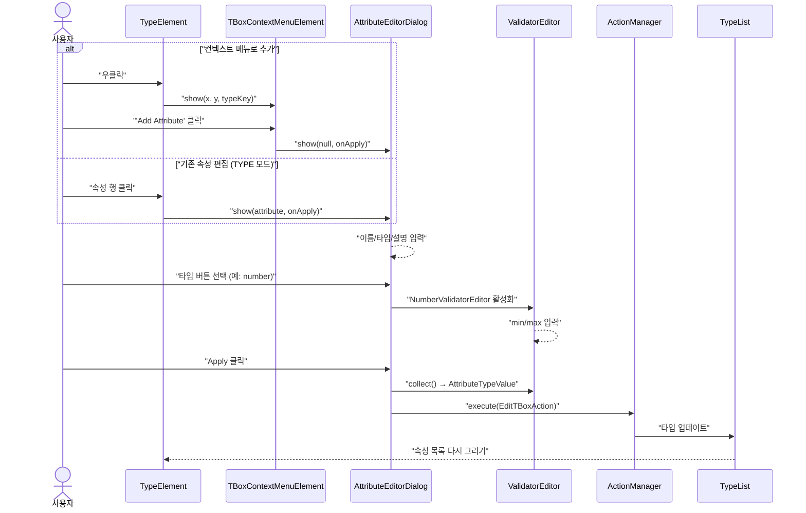
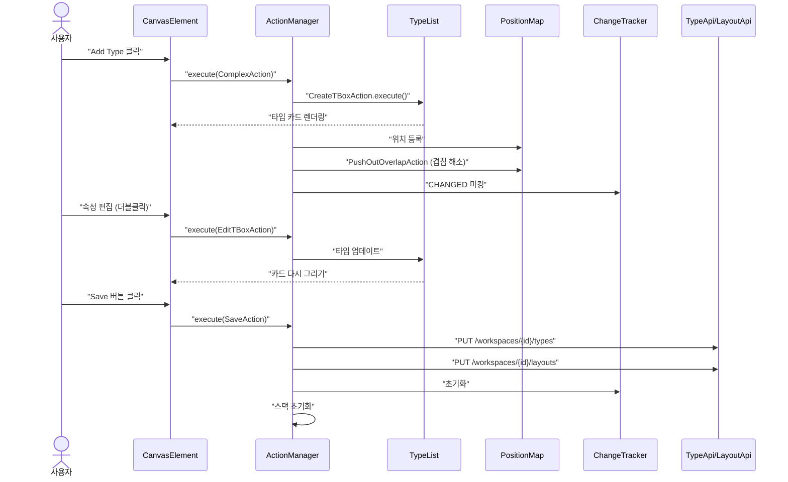
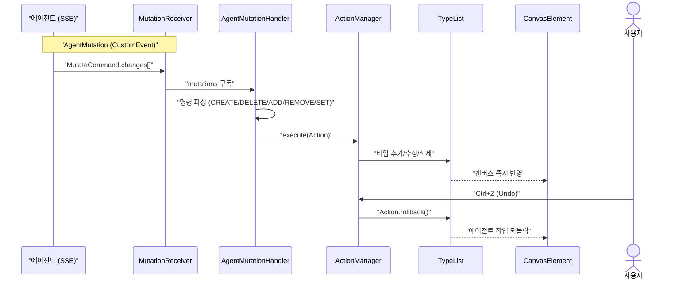

# Type-UI 유스케이스

## 툴바 분리 레이아웃

기존 상단 컨트롤러가 '상단 상태바'와 '좌측 툴레일'로 분리되어 캔버스 작업 영역을 최대화합니다.

## 동적 도구 연동 시퀀스 (Dynamic Tool Integration)

캔버스의 상태(모드, 선택 여부 등)에 따라 적절한 도구들을 쉘의 툴레일에 동적으로 노출하고 이벤트를 처리합니다.

## 타입 조회 (초기 로딩 및 전환) 시퀀스

## 드래그 & 드롭 시퀀스

## 속성 편집 시퀀스

## 타입 생성 → 저장 시퀀스

## 에이전트 타입 조작 시퀀스

에이전트는 브릿지를 통해 캔버스 상태를 변경하는 액션을 직접 주입한다.

## UC-T11: 에이전트에 의한 타입 조작

| 항목 | 내용 |
|------|------|
| **액터** | AI 에이전트 |
| **선행조건** | type-ui 모듈 로딩 완료, MutationReceiver 브릿지 연결 |
| **정상 흐름** | 1. 에이전트가 `TypeStateProvider.snapshot()`으로 현재 캔버스 상태를 JSON으로 조회한다. 2. LLM이 MutateCommand의 changes 배열을 생성한다. 3. `MutationReceiver`를 통해 `AgentMutationHandler`에 전달된다. 4. 핸들러가 changes 문자열을 파싱하여 `CreateTBoxAction`, `EditTBoxAction`, `DeleteTBoxAction` 등으로 변환한다. 5. `ActionManager`에서 실행되어 캔버스에 즉시 반영된다. |
| **지원 명령** | CREATE type, DELETE type, ADD field, REMOVE field, SET type |
| **브릿지** | `agent-bridge` 모듈의 `AgentMutation`가 CustomEvent로 연결. |

## UC-T21: 에이전트 작업의 Undo/Redo

| 항목 | 내용 |
|------|------|
| **액터** | 사용자, AI 에이전트 |
| **선행조건** | 에이전트가 타입 생성 명령(CREATE)을 실행한 직후 |
| **정상 흐름** | 1. 에이전트가 `AgentMutation`를 통해 CREATE 명령으로 새 타입을 생성한다. 2. `AgentMutationHandler`가 `CreateTBoxAction`을 `ActionManager`에서 실행하여 캔버스에 박스가 추가된다. 3. 사용자가 즉시 Ctrl+Z를 누른다. 4. `ActionManager.undo()`가 실행되어 생성이 되돌려 지고, 박스 수가 원래대로 복원된다. |
| **결과** | 에이전트가 생성한 타입도 사용자의 Undo 스택에 포함되어 즉시 되돌릴 수 있다. |

## 트레이서빌리티 매트릭스

| UC | 시퀀스 다이어그램 | 주요 클래스 | 테스트 |
|----|---|---|---|
| UC-T2 (타입생성) | 타입 생성 → 저장 | CreateTBoxAction, ContextMenuHelper, TypeList, PositionMap, ChangeTracker | CanvasTest: 타입 카드 생성 및 캔버스 렌더링 확인 |
| UC-T9 (Undo) | 에이전트 타입 조작 | ActionManager, UndoButton, RedoButton | CanvasTest: Undo/Redo 기능 검증 |
| UC-T11 (에이전트) | 에이전트 타입 조작 | AgentMutationHandler, TypeStateProvider, MutationReceiver, ActionManager, AgentMutation | CollaborationTest: 에이전트 조작 검증 |
| UC-T24 (이력조회) | — | VersionHistoryPanel, type-query versions API | ✅ 구현 완료 (VersionHistoryPanel) |
