# Type-UI 유스케이스

## 툴바 분리 레이아웃

기존 상단 컨트롤러가 '상단 상태바'와 '좌측 툴레일'로 분리되어 캔버스 작업 영역을 최대화합니다.

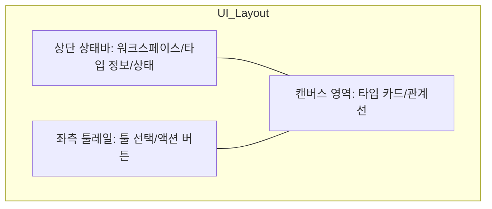

## 동적 도구 연동 시퀀스 (Dynamic Tool Integration)

캔버스의 상태(모드, 선택 여부 등)에 따라 적절한 도구들을 쉘의 툴레일에 동적으로 노출하고 이벤트를 처리합니다.

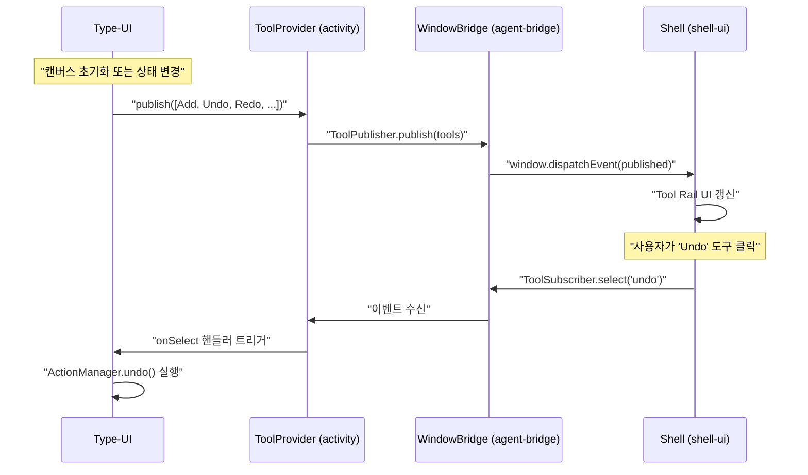

## 타입 생성 → 저장 시퀀스

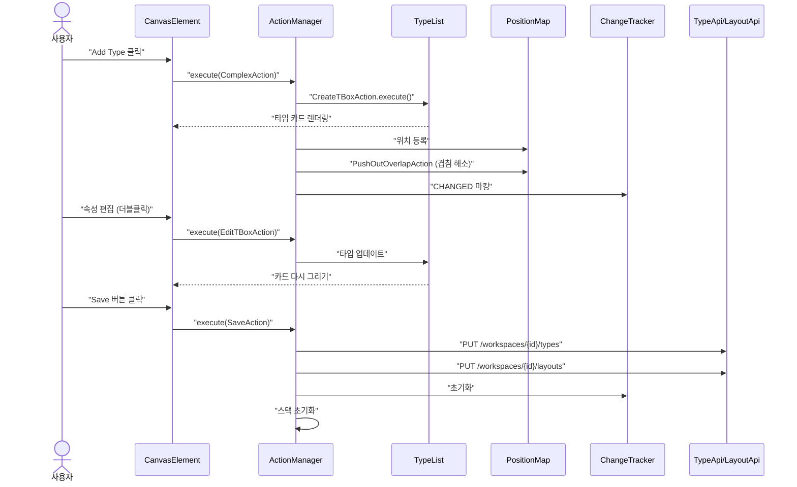

## 에이전트 타입 조작 시퀀스

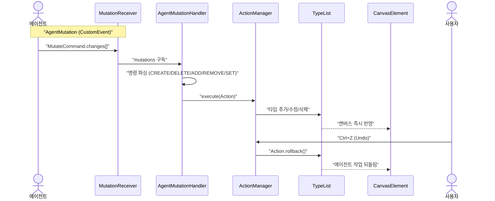

## 드래그 & 드롭 시퀀스

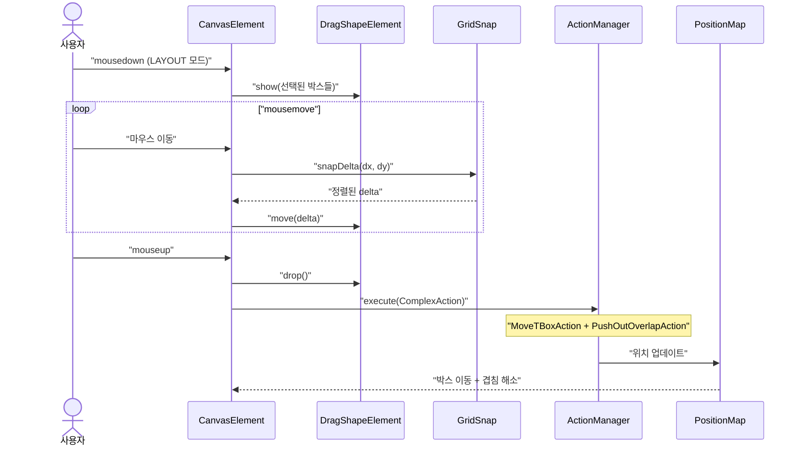

## 타입 조회 (초기 로딩 및 전환) 시퀀스

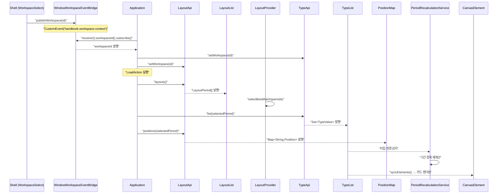

## 속성 편집 시퀀스

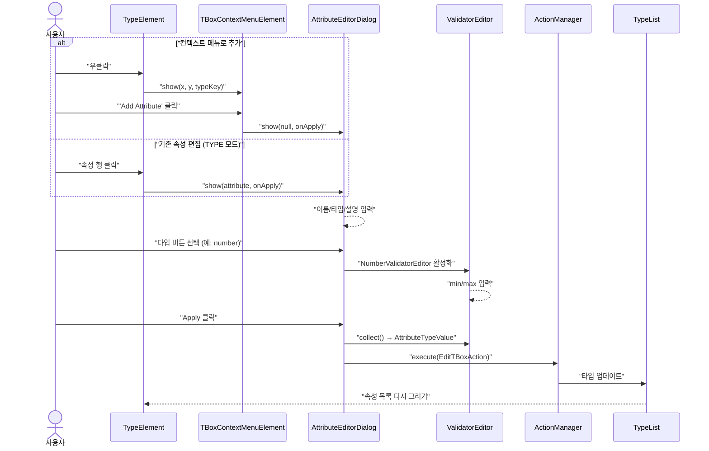

## 재귀 서브 에디터 시퀀스 (Array/Map)

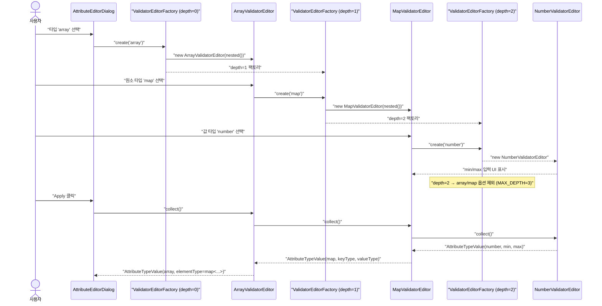

## 리사이즈 시퀀스

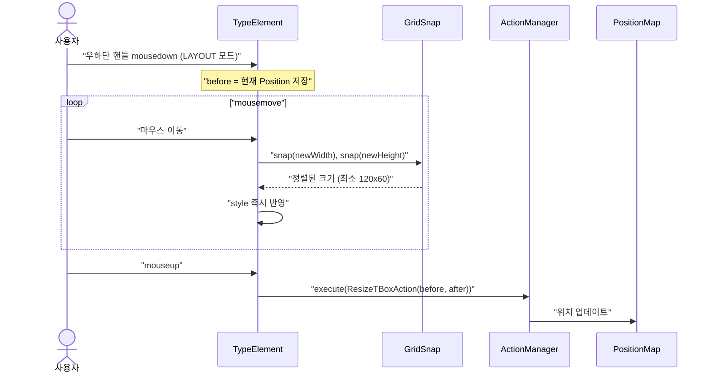

## UC-T1: 타입 조회

| 항목 | 내용 |
|------|------|
| **액터** | 사용자 |
| **선행조건** | 워크스페이스 선택 완료, Shell이 type-ui 모듈을 로딩 |
| **정상 흐름** | 1. Shell이 `type/type.nocache.js`를 동적 로딩한다. 2. `LoadAction`이 실행되어 백엔드에서 레이아웃 기간 목록을 가져온다. 3. `LayoutProvider`가 현재 시점과 가장 겹치는 기간을 자동 선택한다. 4. **빈 워크스페이스 대응**: 레이아웃 목록이 비어있을 경우, 기본 기간(0 ~ Double.MAX_VALUE)을 생성하여 `LayoutProvider`에 주입한다. 5. 선택된 기간의 타입과 위치를 로드하여 캔버스에 카드로 렌더링한다. 6. `PeriodRecalculationService`가 타입의 effectDateTime/expireDateTime으로 기간 목록을 자동 재계산한다. 7. Document 참조 속성이 있으면 `TBoxReferenceElement`가 `ArrowFactory`로 SVG 화살표를 자동으로 그린다. |
| **결과** | 캔버스에 타입 카드와 참조 화살표가 표시된다. |

## UC-T2: 타입 생성

| 항목 | 내용 |
|------|------|
| **액터** | 사용자 |
| **선행조건** | 캔버스 로딩 완료, LAYOUT 또는 TYPE 모드 |
| **정상 흐름** | 1. 툴레일의 "Add Type" 버튼 클릭 또는 캔버스 빈 영역 우클릭 → "Add Type" 선택. 2. `ContextMenuHelper.uniqueTypeId()`가 중복 없는 ID를 생성한다. 3. `CreateTBoxAction`이 `TypeList`에 타입을 추가하고 `PositionMap`에 기본 위치를 등록한다. 4. `PushOutOverlapAction`이 겹치는 박스를 자동으로 밀어낸다. 5. `ChangeTracker`에 CHANGED로 마킹된다. 6. 캔버스에 새 타입 카드가 나타난다. |
| **대안 흐름** | 에이전트가 `CREATE type:<id>` 명령으로 동일한 흐름을 실행한다. |

## UC-T3: 타입 삭제

| 항목 | 내용 |
|------|------|
| **액터** | 사용자 |
| **선행조건** | 타입이 1개 이상 선택됨 |
| **정상 흐름** | 1. Delete/Backspace 키 또는 툴레일 "Remove Type" 버튼 클릭 또는 타입 우클릭 → "Delete". 2. `DeleteTBoxAction`이 `TypeList`에서 제거하고 `ChangeTracker`에 DELETED로 마킹한다. 3. 관련 SVG 화살표가 자동으로 사라진다. |
| **대안 흐름** | 에이전트가 `DELETE type:<key>` 명령으로 실행. |

## UC-T4: 타입 이동 (드래그 & 드롭)

| 항목 | 내용 |
|------|------|
| **액터** | 사용자 |
| **선행조건** | LAYOUT 모드, 타입 1개 이상 선택 |
| **정상 흐름** | 1. 선택된 타입 박스에서 mousedown → `DragShapeElement`가 고스트를 생성한다. 2. mousemove → 고스트가 마우스 델타만큼 이동한다. (스냅 활성 시 20px 격자 정렬) 3. mouseup → 고스트를 숨기고 `ComplexAction(MoveTBoxAction + PushOutOverlapAction)`을 실행한다. 4. 실제 박스가 최종 위치로 이동하고, 겹치는 박스가 BFS로 밀려난다. |
| **대안 흐름** | 화살표 키로 5px(또는 스냅 시 20px) 이동. Shift+화살표로 20px 이동. |
| **대안 흐름 (모바일)** | `TouchEventAdapter`가 터치 이벤트를 마우스 이벤트와 동일하게 변환하여 터치 드래그를 지원한다. |

## UC-T5: 타입 리사이즈

| 항목 | 내용 |
|------|------|
| **액터** | 사용자 |
| **선행조건** | LAYOUT 모드 |
| **정상 흐름** | 1. 타입 박스 우하단 리사이즈 핸들에서 mousedown. 2. mousemove → 박스 크기가 실시간으로 변경된다. (최소 120x60, 스냅 시 20px 단위) 3. mouseup → `ResizeTBoxAction`이 실행된다. |

## UC-T6: 타입 이름/버전 편집

| 항목 | 내용 |
|------|------|
| **액터** | 사용자 |
| **선행조건** | TYPE 모드 |
| **정상 흐름** | 1. 타입 헤더의 이름 또는 버전 배지를 더블클릭한다. 2. 텍스트가 input 요소로 전환된다. 3. 입력 후 Enter → `EditTBoxAction`이 실행되고 값이 반영된다. 4. Esc → 편집이 취소된다. |

## UC-T7: 속성 추가/편집

| 항목 | 내용 |
|------|------|
| **액터** | 사용자 |
| **선행조건** | TYPE 모드 또는 컨텍스트 메뉴 사용 |
| **정상 흐름 (추가)** | 1. 타입 박스 우클릭 → "Add Attribute" 선택. 2. `AttributeEditorDialog`가 열린다. 이름, 타입(9종), 검증기, nullable, 설명을 입력한다. 3. **array 타입 선택 시** `ArrayValidatorEditor`가 활성화된다. `ValidatorEditorFactory`가 원소 타입용 서브 에디터를 재귀적으로 생성한다. 모든 서브 타입(number→min/max, date→after/before, enum→allowedValues 등)에 대해 각각의 ValidatorEditor가 인라인 표시된다. 중첩 예: `Array<Map<Text, Number(0~100)>>`. 4. **map 타입 선택 시** `MapValidatorEditor`가 활성화된다. 키 타입과 값 타입을 각각 MD3 Select 드롭다운(`SelectElementBuilder.select().outlined()`)으로 선택하며, 선택된 타입의 서브 에디터가 해당 드롭다운 아래에 재귀적으로 나타난다. 5. `ValidatorEditorFactory`가 최대 깊이 3단계를 제한하여 무한 재귀를 방지한다. 깊이 초과 시 array/map 옵션이 드롭다운에서 제외된다. 6. **서브 에디터 시각적 계층**: 각 깊이별로 좌측 보더 색상과 배경이 차별화된다 — 1단계: outline-variant 보더 + surface-container 배경, 2단계: primary 보더 + primary-container 배경, 3단계: tertiary 보더 + tertiary-container 배경. 7. Apply → `EditTBoxAction`으로 타입에 속성이 추가된다. |
| **정상 흐름 (편집)** | 1. TYPE 모드에서 속성 행을 클릭한다. 2. 기존 값이 채워진 `AttributeEditorDialog`가 열린다. array/map 속성의 경우 기존 elementType/keyType/valueType이 드롭다운에 복원되고 서브 에디터 체인이 재귀적으로 로드된다. 3. 수정 후 Apply. |
| **정상 흐름 (삭제)** | 속성 행에 마우스 올리면 × 버튼 표시 → 클릭 시 `EditTBoxAction`으로 삭제. |
| **대안 흐름** | 에이전트가 `ADD field:...` / `REMOVE field:...` 명령으로 실행. |
| **대안 흐름 (모바일)** | 우클릭 대신 터치 롱프레스(500ms)로 컨텍스트 메뉴를 열 수 있다. `AttributeEditorDialog`는 전체 화면 bottom sheet로 전환된다. |

## UC-T8: 레이아웃 기간 이동

| 항목 | 내용 |
|------|------|
| **액터** | 사용자 |
| **선행조건** | 레이아웃 기간이 2개 이상 존재 |
| **정상 흐름** | 1. 상태바의 기간 탐색 버튼을 클릭한다. 2. `ChangeLayoutAction`이 실행되어 `LayoutProvider`가 이전/다음 기간으로 전환된다. 3. 해당 기간의 타입과 위치가 다시 로드된다. 4. 경계에 도달하면 버튼이 자동으로 disabled. |

## UC-T9: Undo/Redo

| 항목 | 내용 |
|------|------|
| **액터** | 사용자 |
| **선행조건** | 실행된 액션이 존재 (undo 기준) |
| **정상 흐름** | 1. Ctrl+Z 또는 툴레일 Undo 버튼 → `ActionManager.undo()`. 최근 액션의 `rollback()` 실행. 2. Ctrl+Shift+Z 또는 툴레일 Redo 버튼 → `ActionManager.redo()`. 되돌린 액션의 `execute()` 재실행. 3. 스택은 최대 100개. 새 액션 실행 시 redo 스택 초기화. 4. Undo로 원본 상태가 복원되면 `ChangeTracker`에서 해당 타입의 더티 플래그가 자동 해제된다. 5. Save 성공 시 Undo/Redo 스택이 초기화된다. |
| **특이사항** | 에이전트가 실행한 액션도 동일한 Undo 스택에 쌓이므로 사용자가 Ctrl+Z로 되돌릴 수 있다. |

## UC-T10: 저장/다시 로드 (패치 기반 원자적)

| 항목 | 내용 |
|------|------|
| **액터** | 사용자, AI 에이전트 |
| **선행조건** | `ChangeTracker.hasChanges() == true` (상태바 저장 버튼 활성화 상태) |
| **정상 흐름 (저장)** | 1. 상태바 Save 버튼 클릭 → `SaveAction` 실행. 2. **신규 타입**: `PUT /types` (전체 데이터, 새 버전 생성). 3. **변경 타입**: `PATCH /types` (ChangeTracker가 추적한 변경 속성 + rev만 전송). 서버에서 개별 속성 upsert. 4. **삭제 타입**: `DELETE /types`. 5. 위치 데이터를 `PUT /layouts`로 저장. 6. 전체 성공 시: `ChangeTracker` 초기화, Undo/Redo 스택 초기화, 모든 더티 상태 해제. 7. 부분 실패 시: 실패 항목만 더티 유지, 토스트. |
| **정상 흐름 (다시 로드)** | 상태바 Reload 버튼 → `LoadAction` 실행. 서버에서 최신 데이터 로드. 미저장 변경 사항 소실. |
| **상태바 UX** | 더티 없으면 비활성화, 변경 건수 뱃지 표시, 저장 중 스피너 표시. |
| **충돌 흐름** | 서로 다른 속성 수정 시: 비충돌 병합. 같은 속성 수정 시: 409 Conflict → `.conflict` 표시 + 사용자 선택. |

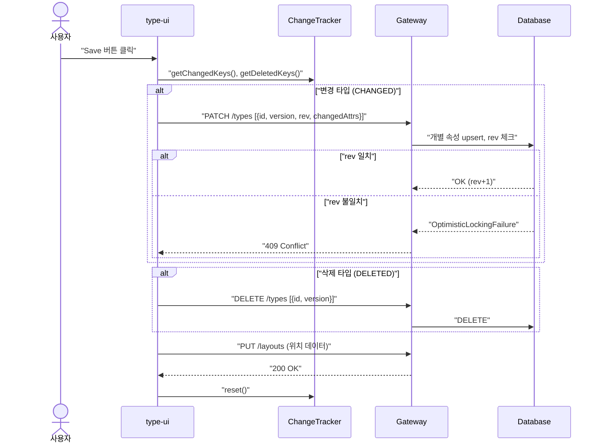

## UC-T11: 에이전트에 의한 타입 조작

| 항목 | 내용 |
|------|------|
| **액터** | AI 에이전트 |
| **선행조건** | type-ui 모듈 로딩 완료, MutationReceiver 브릿지 연결 |
| **정상 흐름** | 1. 에이전트가 `TypeStateProvider.snapshot()`으로 현재 캔버스 상태를 JSON으로 조회한다. 2. LLM이 MutateCommand의 changes 배열을 생성한다. 3. `MutationReceiver`를 통해 `AgentMutationHandler`에 전달된다. 4. 핸들러가 changes 문자열을 파싱하여 `CreateTBoxAction`, `EditTBoxAction`, `DeleteTBoxAction` 등으로 변환한다. 5. `ActionManager`에서 실행되어 캔버스에 즉시 반영된다. |
| **지원 명령** | CREATE type, DELETE type, ADD field, REMOVE field, SET type |
| **브릿지** | `agent-bridge` 모듈의 `AgentMutation`가 CustomEvent로 연결. |

## UC-T12: 에이전트에 의한 타입 검색

| 항목 | 내용 |
|------|------|
| **액터** | AI 에이전트 |
| **선행조건** | type-ui 모듈 로딩 완료 |
| **정상 흐름** | 1. 에이전트가 `TypeSearchProvider.search(query)`를 호출한다. 2. 쿼리가 비어있으면 전체 타입 목록을, 아니면 id/description/속성명으로 필터링한 결과를 JSON으로 반환한다. |
| **브릿지** | `agent-bridge` 모듈의 `AgentSearch`가 window 속성으로 연결. |

## 모바일 터치 조작 시퀀스

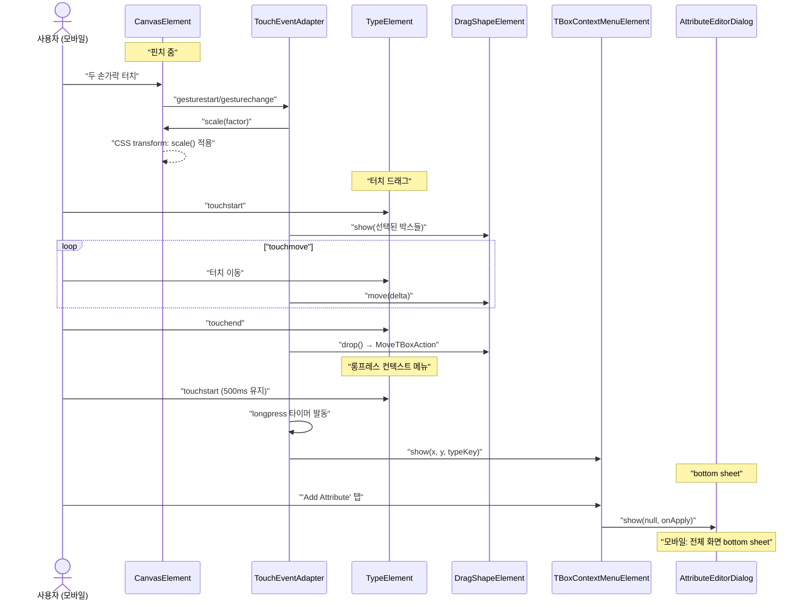

## UC-T13: 모바일 반응형 레이아웃

| 항목 | 내용 |
|------|------|
| **액터** | 사용자 (모바일/태블릿 디바이스) |
| **선행조건** | 뷰포트 너비 < 768px |
| **정상 흐름** | 1. `TouchEventAdapter`가 터치 이벤트를 마우스 이벤트와 동일하게 변환한다. 2. 캔버스에 핀치 줌(두 손가락 확대/축소)과 터치 드래그가 활성화된다. 3. 타입 박스에 터치 롱프레스(500ms)로 컨텍스트 메뉴를 열 수 있다. 4. 상단 상태바와 좌측 툴레일이 모바일 대응 레이아웃으로 최적화된다 (툴레일 접기/펼치기 가능). 5. 속성 편집 다이얼로그가 전체 화면 bottom sheet로 전환된다. |

## UC-T14: RBAC 권한 검증 (계획)

| 항목 | 내용 |
|------|------|
| **액터** | 사용자 |
| **선행조건** | 워크스페이스 선택 완료, type-ui 모듈 로딩 완료 |
| **정상 흐름** | 1. 타입 편집 화면 진입 시 Shell로부터 현재 사용자의 권한 정보를 수신한다. 2. `workspace:type:edit` 권한이 있는 경우 일반 편집 모드로 진입한다. 3. `workspace:type:edit` 권한이 없는 경우 읽기 전용 모드로 전환한다. 4. 읽기 전용 모드에서는 타입 생성/수정/삭제 버튼이 비활성화되고, 드래그/리사이즈/속성 편집이 차단된다. 5. 에이전트 명령(MutateCommand)도 권한이 없으면 무시된다. |
| **대안 흐름** | 권한 정보를 가져올 수 없는 경우 읽기 전용 모드로 기본 전환한다. |
| **요구사항** | 3.3 RBAC (역할 기반 접근 제어) — `{workspace}:type:{type}:edit` |

## UC-T15: 실시간 협업

| 항목 | 내용 |
|------|------|
| **액터** | 다른 사용자 (이벤트 발행자) |
| **선행조건** | type-ui 모듈 로딩 완료, `TypeEventHandler`가 초기화되어 `WorkspaceEventReceiver`를 구독 중 |
| **정상 흐름** | 1. 다른 사용자가 타입을 생성/삭제하면 서버가 Kafka를 통해 TYPE_CREATED 또는 TYPE_DELETED 이벤트를 발행한다. 2. shell-ui의 SSE 연결이 이벤트를 수신하고 `WindowWorkspaceEventBridge.publish()`로 CustomEvent를 디스패치한다. 3. `TypeEventHandler`가 `WorkspaceEventReceiver.events()`를 통해 이벤트를 수신한다. 4. 로컬 더티 상태가 있으면 비충돌 타입만 갱신하고 더티 유지. 충돌하는 타입에는 충돌 카드 표시. 5. 더티 상태가 없으면 `TypeRepository.list()`를 재호출하여 최신 타입 목록을 가져온다. 6. 토스트 알림: "다른 사용자가 타입을 변경했습니다" |
| **요구사항** | 3.1 실시간 협업 |

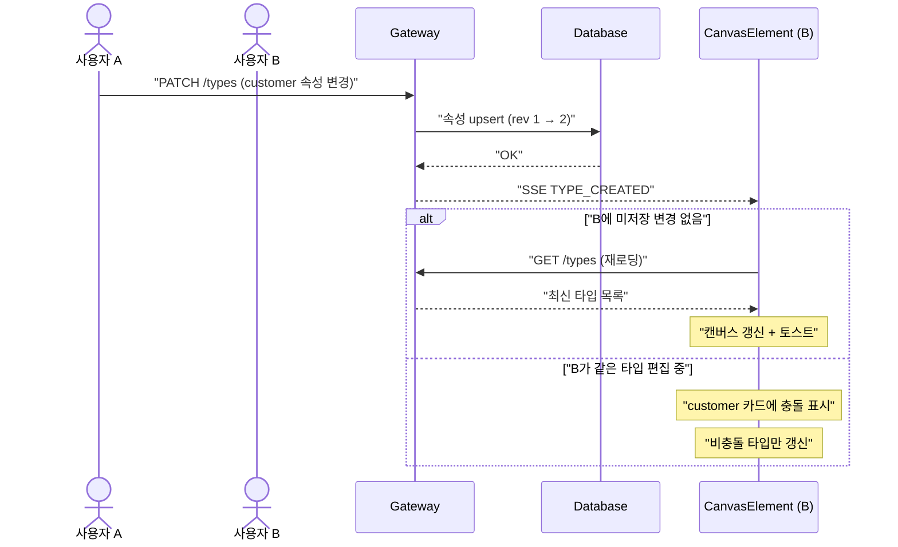

## UC-T16: 동시 편집 충돌 방지

| 항목 | 내용 |
|------|------|
| **액터** | 사용자 |
| **선행조건** | 같은 타입을 여러 사용자가 동시에 편집 중 (프레즌스로 인지 가능) |
| **정상 흐름 (비충돌)** | 1. A와 B가 같은 타입의 **서로 다른 속성**을 수정한다. 2. A가 PATCH로 속성 X를 저장 → rev 1→2. 3. B가 PATCH로 속성 Y를 저장 (rev=2) → 서버가 속성 Y만 upsert → rev 2→3. 4. **A의 속성 X 변경은 유지됨.** 충돌 없이 병합. |
| **충돌 흐름** | 1. A와 B가 같은 타입의 **같은 속성**을 수정한다. 2. A가 먼저 Save → rev 1→2. 3. B가 Save (rev=1) → 서버가 rev 불일치 감지 → 409 Conflict. 4. B의 타입 카드에 `.conflict` 표시 + 사용자 선택. |
| **요구사항** | 3.1 실시간 협업 — 패치 기반 병합 + 낙관적 잠금 |

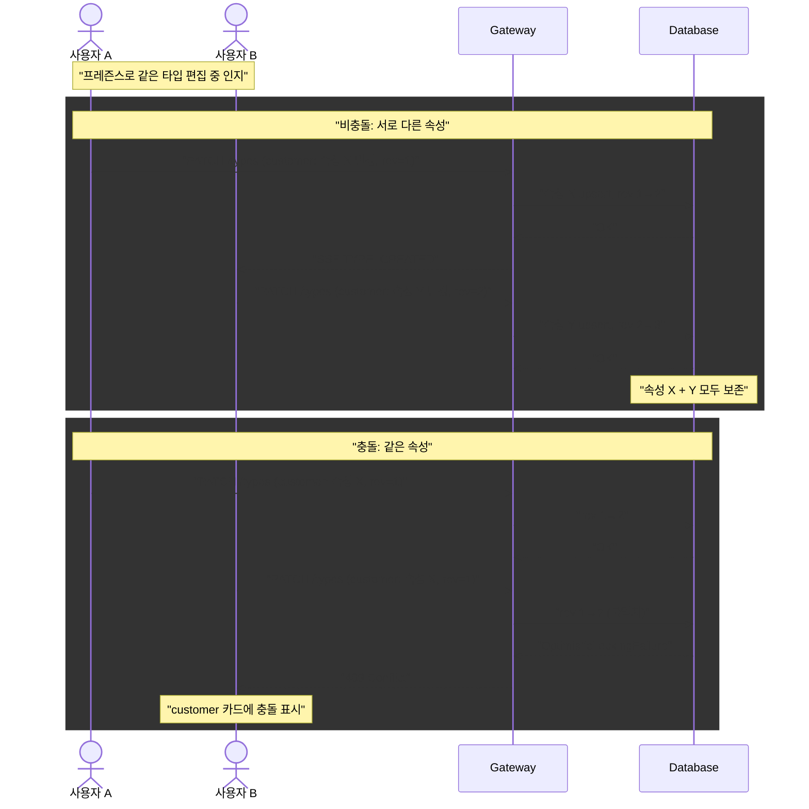

## UC-T17: 프레즌스 (다른 사용자 편집 표시)

| 항목 | 내용 |
|------|------|
| **액터** | 사용자 |
| **선행조건** | 같은 워크스페이스에 2명 이상 동시 접속 |
| **정상 흐름** | 1. 사용자 A가 타입 박스를 선택하면 200ms 디바운스 후 `POST /workspaces/{id}/presence`로 `{user, typeKey}`를 전송한다. 2. SSE PRESENCE 이벤트가 다른 사용자에게 전달된다. 3. 해당 타입 박스에 사용자별 고유 색상 보더(2px)와 이름 라벨이 표시된다 (3초 후 fade-out). 4. 포커스 해제 시 `{user, typeKey: null}`로 프레즌스가 해제된다. 5. 30초 갱신 없으면 자동 해제 (연결 끊김 대비). |
| **요구사항** | 3.1 실시간 협업 — 프레즌스 |

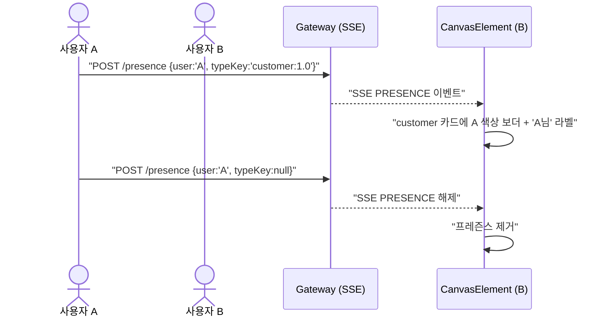

## UC-T18: 참조 화살표 호버 하이라이트

| 항목 | 내용 |
|------|------|
| **액터** | 사용자 |
| **선행조건** | document 참조 속성이 있는 타입이 캔버스에 표시되어 있고, SVG 화살표가 렌더링됨 |
| **정상 흐름** | 1. 사용자가 참조 화살표(SVG path)에 마우스를 올린다. 2. 화살표 선이 tertiary 색상으로 변경되고 두께가 3px로 증가한다 (`box-ref-hover` 클래스). 3. 참조 대상(target) 타입 박스에 tertiary 보더와 강조 그림자가 적용된다 (`ref-highlight-target` 클래스). 4. 참조 원본(source) 속성 행에 tertiary 배경과 좌측 보더가 적용된다 (`ref-highlight-source` 클래스). 5. 마우스가 화살표를 벗어나면 모든 하이라이트가 즉시 해제된다. |
| **결과** | 복잡한 참조 관계에서 특정 화살표의 출발지/도착지를 시각적으로 즉시 파악할 수 있다. |

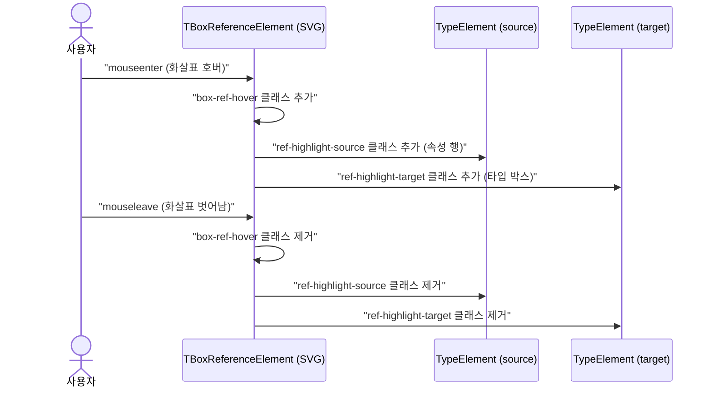

## UC-T19: 에이전트 + 사용자 동시 편집 — 선택 상태 유지

| 항목 | 내용 |
|------|------|
| **액터** | 사용자, AI 에이전트 |
| **선행조건** | 사용자가 타입 박스를 선택한 상태, 에이전트가 다른 타입을 수정 |
| **정상 흐름** | 1. 사용자가 캔버스에서 타입 박스를 클릭하여 선택한다. 2. 에이전트가 `AgentMutation`를 통해 다른 타입의 속성을 SET 명령으로 수정한다. 3. `AgentMutationHandler`가 Action을 실행하여 캔버스를 갱신한다. 4. 사용자가 선택한 박스의 `selected` 속성은 변경되지 않고 유지된다. |
| **결과** | 에이전트의 동시 수정이 사용자의 현재 선택 상태에 영향을 주지 않는다. |

## UC-T20: 다중 사용자 PRESENCE 동시 수신

| 항목 | 내용 |
|------|------|
| **액터** | 다른 사용자 (복수) |
| **선행조건** | 같은 워크스페이스에 3명 이상 동시 접속, type-ui 모듈 로딩 완료 |
| **정상 흐름** | 1. 여러 사용자가 동시에 각각 다른 타입을 편집한다. 2. SSE를 통해 PRESENCE 이벤트가 연속으로 수신된다. 3. `PresenceRenderer`가 각 사용자별 프레즌스를 캔버스에 표시한다. 4. 캔버스가 정상적으로 유지된다 (깨짐 없음). |
| **결과** | 다수 사용자의 프레즌스가 동시에 표시되어도 캔버스가 안정적으로 동작한다. |

## UC-T21: 에이전트 타입 생성 직후 사용자 Undo

| 항목 | 내용 |
|------|------|
| **액터** | 사용자, AI 에이전트 |
| **선행조건** | 에이전트가 타입 생성 명령(CREATE)을 실행한 직후 |
| **정상 흐름** | 1. 에이전트가 `AgentMutation`를 통해 CREATE 명령으로 새 타입을 생성한다. 2. `AgentMutationHandler`가 `CreateTBoxAction`을 `ActionManager`에서 실행하여 캔버스에 박스가 추가된다. 3. 사용자가 즉시 Ctrl+Z를 누른다. 4. `ActionManager.undo()`가 실행되어 생성이 되돌려지고, 박스 수가 원래대로 복원된다. |
| **결과** | 에이전트가 생성한 타입도 사용자의 Undo 스택에 포함되어 즉시 되돌릴 수 있다. |

## UC-T22: TYPE_CREATED 이벤트 연속 수신 (이벤트 폭주)

| 항목 | 내용 |
|------|------|
| **액터** | 다른 사용자 (이벤트 발행자) |
| **선행조건** | type-ui 모듈 로딩 완료, `TypeEventHandler`가 `WorkspaceEventReceiver`를 구독 중 |
| **정상 흐름** | 1. 다른 사용자가 빠르게 연속으로 여러 타입을 생성한다 (3건 이상). 2. SSE를 통해 TYPE_CREATED 이벤트가 연속으로 수신된다. 3. `TypeEventHandler`가 각 이벤트마다 `TypeRepository.search()`를 재호출한다. 4. 연속 갱신에도 캔버스와 컨트롤러가 정상적으로 유지된다. |
| **결과** | 이벤트 폭주 상황에서도 UI가 깨지거나 오류가 발생하지 않는다. |

## UC-T23: 벌크 삭제 (타입 다중 선택 일괄 삭제)

| 항목 | 내용 |
|------|------|
| **액터** | 사용자 |
| **선행조건** | 캔버스에 타입이 2개 이상 존재 |
| **정상 흐름** | 1. Shift+클릭 또는 드래그 선택으로 타입을 다중 선택한다. 2. 일괄 삭제를 실행한다. 3. 확인 다이얼로그 후 선택된 타입이 일괄 삭제되고 ChangeTracker에 반영된다. |
| **요구사항** | 6.10 벌크 작업 |
| **상태** | 구현 완료 (BulkDeleteButton, Ctrl+A 전체 선택) |

## UC-T24: 타입 버전 히스토리 UI

| 항목 | 내용 |
|------|------|
| **액터** | 사용자 |
| **선행조건** | 타입 선택 완료, 해당 타입에 2개 이상의 버전이 존재 |
| **정상 흐름** | 1. 타입의 버전 히스토리를 열면 전체 버전 목록이 타임라인 또는 리스트 뷰로 표시된다. 2. 두 버전을 선택하여 diff 비교를 수행한다 (기존 diff API 활용). 3. 속성 추가/삭제/변경 사항이 시각적으로 표시된다. |
| **요구사항** | 6.12 타입 버전 히스토리 UI |
| **상태** | 구현 완료 (VersionHistoryPanel, type-query versions API) |

## UC-T25: 워크스페이스 전환 (동적 데이터 재로딩)

| 항목 | 내용 |
|------|------|
| **액터** | 사용자 |
| **선행조건** | type-ui 모듈 로딩 완료 |
| **정상 흐름** | 1. 사용자가 쉘 드롭다운에서 다른 워크스페이스를 선택한다. 2. 쉘이 `WindowWorkspaceEventBridge`를 통해 새로운 워크스페이스 ID를 발행한다. 3. `type-ui`의 `Application`이 이를 감지하여 `TypeApi`와 `LayoutApi`의 워크스페이스 컨텍스트를 업데이트한다. 4. `LoadAction`이 즉시 재실행되어 새로운 워크스페이스의 데이터를 서버에서 다시 로드한다. 5. 캔버스가 새로운 데이터로 즉시 갱신된다. |
| **결과** | 페이지 새로고침 없이 다른 워크스페이스의 타입 캔버스를 즉시 조회할 수 있다. |

---

## 트레이서빌리티 매트릭스

| UC | 시퀀스 다이어그램 | 클래스 다이어그램 섹션 | 주요 클래스 | 테스트 |
|----|---|---|---|---|
| UC-T1 (조회) | 타입 조회 (초기 로딩 및 전환) | 상태 관리, API 어댑터, 캔버스 | LoadAction, LayoutApi, TypeApi, WindowWorkspaceEventBridge | ✅ 구현 완료 (CanvasTest: 타입 및 속성 렌더링) |
| UC-T2 (생성) | 타입 생성 → 저장 | Action 계층, 캔버스, 컨트롤러 | CreateTBoxAction, PushOutOverlapAction, ComplexAction, AddTypeButton, CanvasContextMenuElement, ContextMenuHelper, ChangeTracker | ✅ 구현 완료 (CanvasTest: Add Type 버튼 클릭 검증) |
| UC-T3 (삭제) | — | Action 계층, 컨트롤러 | DeleteTBoxAction, RemoveTypeButton, ChangeTracker | ✅ 구현 완료 (CanvasTest: Delete 키 입력 검증) |
| UC-T4 (이동) | 드래그 & 드롭 | Action 계층, 캔버스, 상태 관리 | DragShapeElement, MoveTBoxAction, PushOutOverlapAction, ComplexAction, GridSnap, PositionMap, SelectedTBoxElement | ✅ 구현 완료 (CanvasTest: 선택 및 드래그(Mock)) |
| UC-T5 (리사이즈) | 리사이즈 | Action 계층, 캔버스, 상태 관리 | ResizeTBoxAction, TypeElement, GridSnap, PositionMap | ✅ 구현 완료 (CanvasTest: 리사이즈 핸들 존재 확인) |
| UC-T6 (이름편집) | — | Action 계층, 캔버스, 상태 관리 | TypeElement, EditTBoxAction, CanvasMode | ✅ 구현 완료 (CanvasTest: 타입 이름 편집 확인) |
| UC-T7 (속성) | 속성 편집 | Action 계층, 속성 편집 다이얼로그, 캔버스 | AttributeEditorDialog, ValidatorEditorFactory, ValidatorEditor, ArrayValidatorEditor, MapValidatorEditor, EditTBoxAction | ✅ 구현 완료 (CanvasTest: 속성 표시 검증) |
| UC-T8 (기간이동) | — | Action 계층, 컨트롤러, 상태 관리 | ChangeLayoutAction, BeforeButton, AfterButton, LayoutProvider, LayoutList | ✅ 구현 완료 (CanvasTest: Before/After 버튼 확인) |
| UC-T9 (Undo) | 에이전트 타입 조작 | Action 계층, 컨트롤러 | ActionManager, UndoButton, RedoButton | ✅ 구현 완료 (CanvasTest: Undo/Redo 기능 검증) |
| UC-T10 (저장) | 타입 생성 → 저장 | Action 계층, API 어댑터, 컨트롤러 | SaveAction, LoadAction, SaveButton, ReloadButton, ChangeTracker | ✅ 구현 완료 (CanvasTest: Save/Reload 버튼 확인) |
| UC-T11 (에이전트) | 에이전트 타입 조작 | 에이전트 연동, Action 계층 | AgentMutationHandler, TypeStateProvider, MutationReceiver, ActionManager, AgentMutation | ✅ 구현 완료 (CollaborationTest: 에이전트 조작 검증) |
| UC-T12 (검색) | — | 에이전트 연동 | TypeSearchProvider, AgentSearch | ✅ 구현 완료 (CollaborationTest: 검색 기능 연동 확인) |
| UC-T13 (모바일) | 모바일 터치 조작 | 캔버스, 컨트롤러 | TouchEventAdapter, PinchZoomHandler, CanvasElement, TypeElement, DragShapeElement, AttributeEditorDialog | ✅ 구현 완료 (CanvasTest: 컨트롤러 툴바 flex-wrap) |
| UC-T14 (RBAC) | — | — | RbacGuard, CanvasMode | ❌ 미구현 (RbacGuard 유틸리티 구현 완료) |
| UC-T15 (실시간협업) | 실시간 협업 | 에이전트 연동, 상태 관리 | TypeEventHandler, WorkspaceEventReceiver, TypeRepository, TypeList | ✅ 구현 완료 (CollaborationTest) |
| UC-T16 (충돌방지) | 충돌 방지 | 상태 관리 | @docs\contracts\versioning.md 낙관적 잠금, ChangeTracker | ✅ 구현 완료 (CollaborationTest) |
| UC-T17 (프레즌스) | 프레즌스 | 상태 관리, 캔버스 | PresenceHandler, PresenceRenderer, WorkspaceEventReceiver | ✅ 구현 완료 (CollaborationTest) |
| UC-T18 (화살표호버) | 참조 화살표 호버 | 캔버스 | TBoxReferenceElement, ArrowFactory, TypeElement | ✅ 구현 완료 (CollaborationTest) |
| UC-T19 (동시편집) | — | 에이전트 연동, 캔버스 | AgentMutationHandler, ActionManager, SelectedTBoxElement | ✅ 구현 완료 (CollaborationTest) |
| UC-T20 (다중프레즌스) | — | 상태 관리, 캔버스 | PresenceHandler, PresenceRenderer, WorkspaceEventReceiver | ✅ 구현 완료 (CollaborationTest) |
| UC-T21 (에이전트Undo) | — | 에이전트 연동, Action 계층 | AgentMutationHandler, ActionManager | ✅ 구현 완료 (CollaborationTest) |
| UC-T22 (이벤트폭주) | — | 에이전트 연동, 상태 관리 | TypeEventHandler, WorkspaceEventReceiver | ✅ 구현 완료 (CollaborationTest) |
| UC-T23 (벌크삭제) | — | Action 계층, 캔버스 | BulkDeleteButton, SelectedTBoxElement, DeleteTBoxAction | ✅ 구현 완료 (TypeBulkActionTest) |
| UC-T24 (버전히스토리) | — | 캔버스, API 어댑터 | VersionHistoryPanel, TypeRepository.versions() | ❌ 테스트 미작성 (기능 구현 완료) |
| UC-T25 (워크스페이스 전환) | 타입 조회 (초기 로딩 및 전환) | API 어댑터, 에이전트 연동 | WindowWorkspaceEventBridge, Application, LoadAction | ✅ 구현 완료 (CollaborationTest: 워크스페이스 전환 확인) |
| UC-T26 (빈 상태 UI) | — | — | SpreadsheetElement | ✅ 구현 완료 |
| UC-T27 (삭제 확인) | — | — | ConfirmDialog | ✅ 구현 완료 |
| UC-T28 (성공 피드백) | — | — | SaveButton, SubmitButton | ✅ 구현 완료 |
