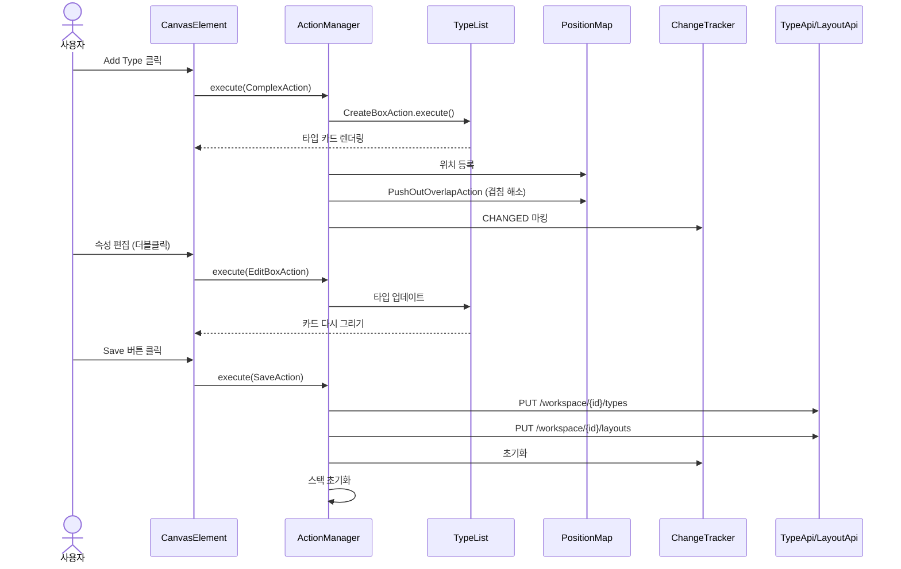
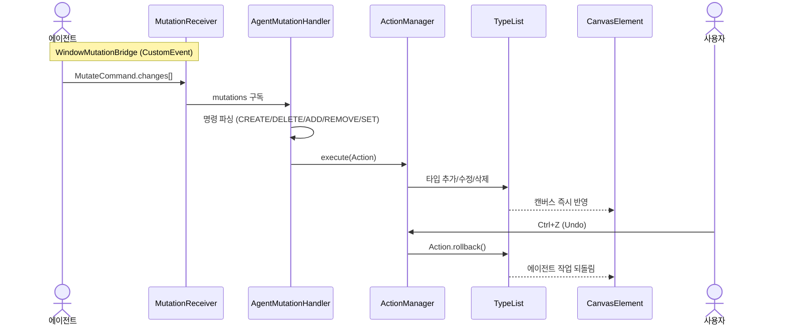
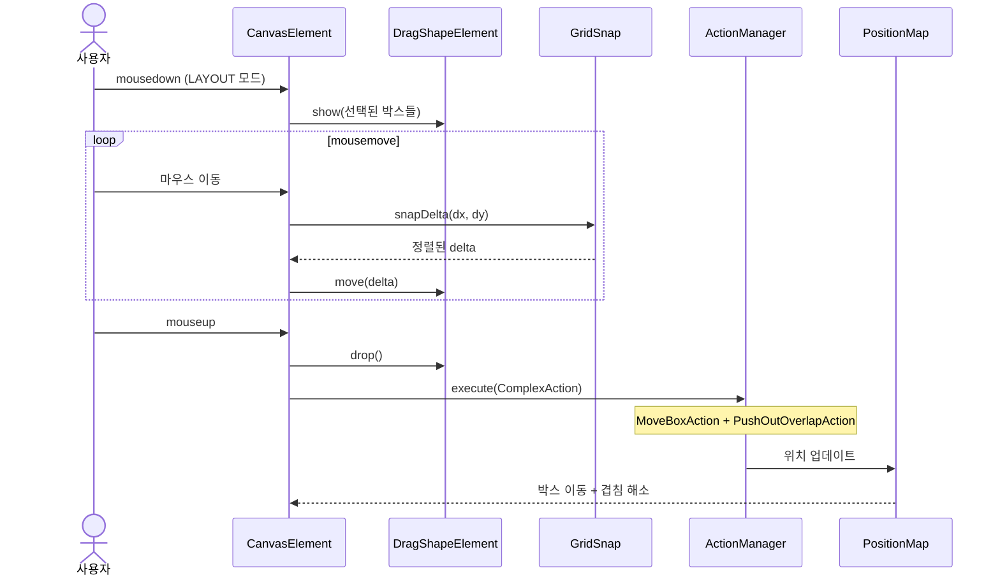
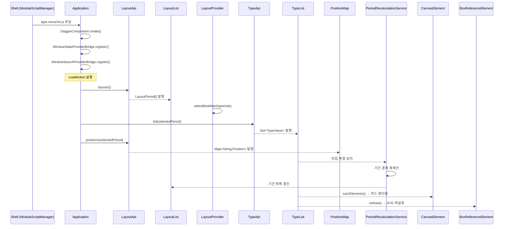

# Type-UI 유스케이스

## 타입 생성 → 저장 시퀀스



## 에이전트 타입 조작 시퀀스



## 드래그 & 드롭 시퀀스



## 타입 조회 (초기 로딩) 시퀀스



## 속성 편집 시퀀스

```mermaid
sequenceDiagram
    actor User as 사용자
    participant Box as TypeElement
    participant Menu as BoxContextMenuElement
    participant Dialog as AttributeEditorDialog
    participant VE as ValidatorEditor
    participant AM as ActionManager
    participant TL as TypeList

    alt 컨텍스트 메뉴로 추가
        User->>Box: 우클릭
        Box->>Menu: show(x, y, typeKey)
        User->>Menu: "Add Attribute" 클릭
        Menu->>Dialog: show(null, onApply)
    else 기존 속성 편집 (TYPE 모드)
        User->>Box: 속성 행 클릭
        Box->>Dialog: show(attribute, onApply)
    end

    Dialog-->>Dialog: 이름/타입/설명 입력
    User->>Dialog: 타입 버튼 선택 (예: number)
    Dialog->>VE: NumberValidatorEditor 활성화
    VE-->>VE: min/max 입력
    User->>Dialog: Apply 클릭
    Dialog->>VE: collect() → AttributeTypeValue
    Dialog->>AM: execute(EditBoxAction)
    AM->>TL: 타입 업데이트
    TL-->>Box: 속성 목록 다시 그리기
```

## 리사이즈 시퀀스

```mermaid
sequenceDiagram
    actor User as 사용자
    participant Box as TypeElement
    participant Snap as GridSnap
    participant AM as ActionManager
    participant PM as PositionMap

    User->>Box: 우하단 핸들 mousedown (LAYOUT 모드)
    Note over Box: before = 현재 Position 저장
    loop mousemove
        User->>Box: 마우스 이동
        Box->>Snap: snap(newWidth), snap(newHeight)
        Snap-->>Box: 정렬된 크기 (최소 120x60)
        Box->>Box: style 즉시 반영
    end
    User->>Box: mouseup
    Box->>AM: execute(ResizeBoxAction(before, after))
    AM->>PM: 위치 업데이트
```

## UC-T1: 타입 조회

| 항목 | 내용 |
|------|------|
| **액터** | 사용자 |
| **선행조건** | 워크스페이스 선택 완료, Shell이 type-ui 모듈을 로딩 |
| **정상 흐름** | 1. Shell이 `type/type.nocache.js`를 동적 로딩한다.<br>2. `LoadAction`이 실행되어 백엔드에서 레이아웃 기간 목록을 가져온다.<br>3. `LayoutProvider`가 현재 시점과 가장 겹치는 기간을 자동 선택한다.<br>4. 선택된 기간의 타입과 위치를 로드하여 캔버스에 카드로 렌더링한다.<br>5. `PeriodRecalculationService`가 타입의 effectDateTime/expireDateTime으로 기간 목록을 자동 재계산한다.<br>6. Document 참조 속성이 있으면 `BoxReferenceElement`가 `ArrowFactory`로 SVG 화살표를 자동으로 그린다. |
| **결과** | 캔버스에 타입 카드와 참조 화살표가 표시된다. |

## UC-T2: 타입 생성

| 항목 | 내용 |
|------|------|
| **액터** | 사용자 |
| **선행조건** | 캔버스 로딩 완료, LAYOUT 또는 TYPE 모드 |
| **정상 흐름** | 1. 툴바의 "Add Type" 버튼 클릭 또는 캔버스 빈 영역 우클릭 → "Add Type" 선택.<br>2. `ContextMenuHelper.uniqueTypeId()`가 중복 없는 ID를 생성한다.<br>3. `CreateBoxAction`이 `TypeList`에 타입을 추가하고 `PositionMap`에 기본 위치를 등록한다.<br>4. `PushOutOverlapAction`이 겹치는 박스를 자동으로 밀어낸다.<br>5. `ChangeTracker`에 CHANGED로 마킹된다.<br>6. 캔버스에 새 타입 카드가 나타난다. |
| **대안 흐름** | 에이전트가 `CREATE type:<id>` 명령으로 동일한 흐름을 실행한다. |

## UC-T3: 타입 삭제

| 항목 | 내용 |
|------|------|
| **액터** | 사용자 |
| **선행조건** | 타입이 1개 이상 선택됨 |
| **정상 흐름** | 1. Delete/Backspace 키 또는 "Remove Type" 버튼 클릭 또는 타입 우클릭 → "Delete".<br>2. `DeleteBoxAction`이 `TypeList`에서 제거하고 `ChangeTracker`에 DELETED로 마킹한다.<br>3. 관련 SVG 화살표가 자동으로 사라진다. |
| **대안 흐름** | 에이전트가 `DELETE type:<key>` 명령으로 실행. |

## UC-T4: 타입 이동 (드래그 & 드롭)

| 항목 | 내용 |
|------|------|
| **액터** | 사용자 |
| **선행조건** | LAYOUT 모드, 타입 1개 이상 선택 |
| **정상 흐름** | 1. 선택된 타입 박스에서 mousedown → `DragShapeElement`가 고스트를 생성한다.<br>2. mousemove → 고스트가 마우스 델타만큼 이동한다. (스냅 활성 시 20px 격자 정렬)<br>3. mouseup → 고스트를 숨기고 `ComplexAction(MoveBoxAction + PushOutOverlapAction)`을 실행한다.<br>4. 실제 박스가 최종 위치로 이동하고, 겹치는 박스가 BFS로 밀려난다. |
| **대안 흐름** | 화살표 키로 5px(또는 스냅 시 20px) 이동. Shift+화살표로 20px 이동. |
| **대안 흐름 (모바일)** | `TouchEventAdapter`가 touchstart/touchmove/touchend를 mousedown/mousemove/mouseup과 동일하게 변환하여 터치 드래그를 지원한다. |

## UC-T5: 타입 리사이즈

| 항목 | 내용 |
|------|------|
| **액터** | 사용자 |
| **선행조건** | LAYOUT 모드 |
| **정상 흐름** | 1. 타입 박스 우하단 리사이즈 핸들에서 mousedown.<br>2. mousemove → 박스 크기가 실시간으로 변경된다. (최소 120x60, 스냅 시 20px 단위)<br>3. mouseup → `ResizeBoxAction`이 실행된다. |

## UC-T6: 타입 이름/버전 편집

| 항목 | 내용 |
|------|------|
| **액터** | 사용자 |
| **선행조건** | TYPE 모드 |
| **정상 흐름** | 1. 타입 헤더의 이름 또는 버전 배지를 더블클릭한다.<br>2. 텍스트가 input 요소로 전환된다.<br>3. 입력 후 Enter → `EditBoxAction`이 실행되고 값이 반영된다.<br>4. Esc → 편집이 취소된다. |

## UC-T7: 속성 추가/편집

| 항목 | 내용 |
|------|------|
| **액터** | 사용자 |
| **선행조건** | TYPE 모드 또는 컨텍스트 메뉴 사용 |
| **정상 흐름 (추가)** | 1. 타입 박스 우클릭 → "Add Attribute" 선택.<br>2. `AttributeEditorDialog`가 열린다. 이름, 타입(9종), 검증기, nullable, 설명을 입력한다.<br>3. Apply → `EditBoxAction`으로 타입에 속성이 추가된다. |
| **정상 흐름 (편집)** | 1. TYPE 모드에서 속성 행을 클릭한다.<br>2. 기존 값이 채워진 `AttributeEditorDialog`가 열린다.<br>3. 수정 후 Apply. |
| **정상 흐름 (삭제)** | 속성 행에 마우스 올리면 × 버튼 표시 → 클릭 시 `EditBoxAction`으로 삭제. |
| **대안 흐름** | 에이전트가 `ADD field:...` / `REMOVE field:...` 명령으로 실행. |
| **대안 흐름 (모바일)** | 우클릭 대신 터치 롱프레스(500ms)로 컨텍스트 메뉴를 열 수 있다. `AttributeEditorDialog`는 전체 화면 bottom sheet로 전환된다. |

## UC-T8: 레이아웃 기간 이동

| 항목 | 내용 |
|------|------|
| **액터** | 사용자 |
| **선행조건** | 레이아웃 기간이 2개 이상 존재 |
| **정상 흐름** | 1. 툴바의 Before/After 버튼을 클릭한다.<br>2. `ChangeLayoutAction`이 실행되어 `LayoutProvider`가 이전/다음 기간으로 전환된다.<br>3. 해당 기간의 타입과 위치가 다시 로드된다.<br>4. 경계에 도달하면 버튼이 자동으로 disabled. |

## UC-T9: Undo/Redo

| 항목 | 내용 |
|------|------|
| **액터** | 사용자 |
| **선행조건** | 실행된 액션이 존재 (undo 기준) |
| **정상 흐름** | 1. Ctrl+Z 또는 Undo 버튼 → `ActionManager.undo()`. 최근 액션의 `rollback()` 실행.<br>2. Ctrl+Shift+Z 또는 Redo 버튼 → `ActionManager.redo()`. 되돌린 액션의 `execute()` 재실행.<br>3. 스택은 최대 100개. 새 액션 실행 시 redo 스택 초기화. |
| **특이사항** | 에이전트가 실행한 액션도 동일하게 Undo/Redo 가능. |

## UC-T10: 저장/다시 로드

| 항목 | 내용 |
|------|------|
| **액터** | 사용자 |
| **선행조건** | 변경된 타입이 존재 (저장 기준) |
| **정상 흐름 (저장)** | 1. Save 버튼 클릭 → `SaveAction` 실행.<br>2. `ChangeTracker`에서 CHANGED 타입은 `PUT /workspace/{id}/types`로, DELETED 타입은 `DELETE`로 전송.<br>3. 위치 데이터를 `PUT /workspace/{id}/layouts`로 저장.<br>4. `ChangeTracker` 초기화, Undo/Redo 스택 초기화. |
| **정상 흐름 (다시 로드)** | Reload 버튼 → `LoadAction` 실행. 서버에서 최신 데이터 로드. 미저장 변경 사항 소실. |

## UC-T11: 에이전트에 의한 타입 조작

| 항목 | 내용 |
|------|------|
| **액터** | AI 에이전트 |
| **선행조건** | type-ui 모듈 로딩 완료, MutationReceiver 브릿지 연결 |
| **정상 흐름** | 1. 에이전트가 `TypeStateProvider.snapshot()`으로 현재 캔버스 상태를 JSON으로 조회한다.<br>2. LLM이 MutateCommand의 changes 배열을 생성한다.<br>3. `MutationReceiver`를 통해 `AgentMutationHandler`에 전달된다.<br>4. 핸들러가 changes 문자열을 파싱하여 `CreateBoxAction`, `EditBoxAction`, `DeleteBoxAction` 등으로 변환한다.<br>5. `ActionManager`에서 실행되어 캔버스에 즉시 반영된다. |
| **지원 명령** | CREATE type, DELETE type, ADD field, REMOVE field, SET type |
| **브릿지** | `agent-bridge` 모듈의 `WindowMutationBridge`가 CustomEvent로 연결. |

## UC-T12: 에이전트에 의한 타입 검색

| 항목 | 내용 |
|------|------|
| **액터** | AI 에이전트 |
| **선행조건** | type-ui 모듈 로딩 완료 |
| **정상 흐름** | 1. 에이전트가 `TypeSearchProvider.search(query)`를 호출한다.<br>2. 쿼리가 비어있으면 전체 타입 목록을, 아니면 id/description/속성명으로 필터링한 결과를 JSON으로 반환한다. |
| **브릿지** | `agent-bridge` 모듈의 `WindowSearchProviderBridge`가 window 속성으로 연결. |

## 모바일 터치 조작 시퀀스

```mermaid
sequenceDiagram
    actor User as 사용자 (모바일)
    participant Canvas as CanvasElement
    participant TE as TouchEventAdapter
    participant Box as TypeElement
    participant Drag as DragShapeElement
    participant Menu as BoxContextMenuElement
    participant Dialog as AttributeEditorDialog

    Note over Canvas: 핀치 줌
    User->>Canvas: 두 손가락 터치
    Canvas->>TE: gesturestart/gesturechange
    TE->>Canvas: scale(factor)
    Canvas-->>Canvas: CSS transform: scale() 적용

    Note over Box: 터치 드래그
    User->>Box: touchstart
    TE->>Drag: show(선택된 박스들)
    loop touchmove
        User->>Box: 터치 이동
        TE->>Drag: move(delta)
    end
    User->>Box: touchend
    TE->>Drag: drop() → MoveBoxAction

    Note over Box: 롱프레스 컨텍스트 메뉴
    User->>Box: touchstart (500ms 유지)
    TE->>TE: longpress 타이머 발동
    TE->>Menu: show(x, y, typeKey)

    Note over Dialog: bottom sheet
    User->>Menu: "Add Attribute" 탭
    Menu->>Dialog: show(null, onApply)
    Note over Dialog: 모바일: 전체 화면 bottom sheet
```

## UC-T13: 모바일 반응형 레이아웃

| 항목 | 내용 |
|------|------|
| **액터** | 사용자 (모바일/태블릿 디바이스) |
| **선행조건** | 뷰포트 너비 < 768px |
| **정상 흐름** | 1. `TouchEventAdapter`가 터치 이벤트를 마우스 이벤트와 동일하게 변환한다.<br>2. 캔버스에 핀치 줌(두 손가락 확대/축소)과 터치 드래그가 활성화된다.<br>3. 타입 박스에 터치 롱프레스(500ms)로 컨텍스트 메뉴를 열 수 있다.<br>4. 컨트롤러 툴바가 flex-wrap으로 줄바꿈되며, 핵심 버튼만 1행에 표시된다.<br>5. 속성 편집 다이얼로그가 전체 화면 bottom sheet로 전환된다. |

---

## 트레이서빌리티 매트릭스

| UC | 시퀀스 다이어그램 | 클래스 다이어그램 섹션 | 주요 클래스 | 테스트 |
|----|---|---|---|---|
| UC-T1 (조회) | 타입 조회 (초기 로딩) | 상태 관리, API 어댑터, 캔버스 | LoadAction, LayoutApi, TypeApi, LayoutProvider, LayoutList, TypeList, PositionMap, PeriodRecalculationService, BoxReferenceElement, ArrowFactory | CanvasTest: 캔버스 렌더링, 타입 박스 표시, 타입 이름/속성 검증 |
| UC-T2 (생성) | 타입 생성 → 저장 | Action 계층, 캔버스, 컨트롤러 | CreateBoxAction, PushOutOverlapAction, ComplexAction, AddTypeButton, CanvasContextMenuElement, ContextMenuHelper, ChangeTracker | CanvasTest: Add Type 클릭 → 박스 1개 추가 검증 |
| UC-T3 (삭제) | — (단순) | Action 계층, 컨트롤러 | DeleteBoxAction, RemoveTypeButton, ChangeTracker | CanvasTest: 선택 후 Delete 키 → 박스 삭제 검증 |
| UC-T4 (이동) | 드래그 & 드롭 | Action 계층, 캔버스, 상태 관리 | DragShapeElement, MoveBoxAction, PushOutOverlapAction, ComplexAction, GridSnap, PositionMap, SelectedBoxElement | CanvasTest: 클릭 → selected 속성 활성화 검증 |
| UC-T5 (리사이즈) | 리사이즈 | Action 계층, 캔버스, 상태 관리 | ResizeBoxAction, TypeElement, GridSnap, PositionMap | ❌ 미구현 |
| UC-T6 (이름편집) | — (단순) | Action 계층, 캔버스, 상태 관리 | TypeElement(startInlineEdit, startVersionEdit), EditBoxAction, CanvasMode | ❌ 미구현 |
| UC-T7 (속성) | 속성 편집 | Action 계층, 속성 편집 다이얼로그, 캔버스 | AttributeEditorDialog, ValidatorEditor(6종), EditBoxAction, BoxContextMenuElement, ValueElement | CanvasTest: 속성 표시 검증 + 우클릭 컨텍스트 메뉴 표시 |
| UC-T8 (기간이동) | — (단순) | Action 계층, 컨트롤러, 상태 관리 | ChangeLayoutAction, BeforeButton, AfterButton, LayoutProvider, LayoutList | CanvasTest: Before/After 버튼 존재 확인 |
| UC-T9 (Undo) | 에이전트 타입 조작 (후반) | Action 계층, 컨트롤러 | ActionManager, UndoButton, RedoButton | CanvasTest: Ctrl+Z 삭제 되돌림, Ctrl+Shift+Z Redo 검증 |
| UC-T10 (저장) | 타입 생성 → 저장 (후반) | Action 계층, API 어댑터, 컨트롤러 | SaveAction, LoadAction, SaveButton, ReloadButton, TypeRepository, LayoutRepository, ChangeTracker | CanvasTest: Save/Reload 버튼 존재 확인 |
| UC-T11 (에이전트) | 에이전트 타입 조작 | 에이전트 연동, Action 계층 | AgentMutationHandler, TypeStateProvider, MutationReceiver, ActionManager, WindowMutationBridge | ❌ 미구현 |
| UC-T12 (검색) | — (단순) | 에이전트 연동 | TypeSearchProvider, WindowSearchProviderBridge | ❌ 미구현 |
| UC-T13 (모바일) | 모바일 터치 조작 | 캔버스, 컨트롤러 | TouchEventAdapter, CanvasElement(pinch zoom), TypeElement(longpress), DragShapeElement(touch), AttributeEditorDialog(bottom sheet) | ❌ 미구현 |
